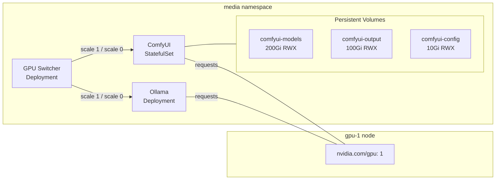



This is the operational companion to [Media Generation](), which covers the GPU time-slicing architecture, custom Docker images, and storage layout. Here you'll find the commands to run, check, and fix the stack day-to-day.

Before any commands, source the environment:

```bash
source .env
```

## What Healthy Looks Like

- The GPU-switcher control pod is `Running`.
- The ComfyUI StatefulSet is `Running` with one or more replicas.
- The active GPU profile matches the intended workload (e.g., `video` for video generation).
- ComfyUI web UI is accessible on its internal ClusterIP service.



## Verify

### Check Stack Status

```bash
# Check GPU-switcher pod (controls GPU profiles)
kubectl get pods -n media -l app.kubernetes.io/name=gpu-switcher

# Check ComfyUI pods
kubectl get pods -n media -l app.kubernetes.io/name=comfyui

# Check persistent volumes
kubectl get pvc -n media

# Check GPU profile
kubectl logs -n media -l app.kubernetes.io/name=gpu-switcher --tail=10
```

```console
$ kubectl get pods -n media
NAME                            READY   STATUS    RESTARTS   AGE
comfyui-0                       1/1     Running   0          12d
gpu-switcher-544b8c9f96-4x9j2   1/1     Running   0          12d

$ kubectl get pvc -n media
NAME               STATUS   VOLUME                                     CAPACITY   ACCESS MODES   STORAGECLASS   AGE
comfyui-config     Bound    pvc-xxx                                    10Gi       RWX            rook-cephfs    12d
comfyui-models     Bound    pvc-yyy                                    200Gi      RWX            rook-cephfs    12d
comfyui-output     Bound    pvc-zzz                                    100Gi      RWX            rook-cephfs    10d
```

### Access ComfyUI Web UI

```bash
# Port-forward to the ComfyUI service
kubectl port-forward -n media service/comfyui 18188:18188
```

Then open `http://localhost:18188` in a browser.

## Steps

### Switch GPU Profile

```bash
# Check available profiles
kubectl exec -n media deploy/gpu-switcher -- ls /profiles/

# Switch to video profile
kubectl exec -n media deploy/gpu-switcher -- ./switch.sh video

# Verify
kubectl logs -n media deploy/gpu-switcher --tail=10
```

### Upload a Model

```bash
# Copy a model file to the ComfyUI models directory
kubectl cp ./checkpoint.safetensors -n media comfyui-0:/app/models/checkpoints/

# Verify
kubectl exec -n media comfyui-0 -- ls -la /app/models/checkpoints/checkpoint.safetensors
```

### Download Output Files

```bash
# List output files
kubectl exec -n media comfyui-0 -- ls -la /app/output/

# Copy output to local machine
kubectl cp -n media comfyui-0:/app/output/generated-image.png ./generated-image.png

# Or tar multiple outputs
kubectl exec -n media comfyui-0 -- tar czf /tmp/outputs.tar.gz -C /app/output/ .
kubectl cp -n media comfyui-0:/tmp/outputs.tar.gz ./outputs.tar.gz
```

### Restart ComfyUI

```bash
kubectl rollout restart -n media statefulset/comfyui
kubectl rollout status -n media statefulset/comfyui
```

## Recover

### ComfyUI Pod Stuck in CrashLoopBackOff

The most common cause is a Python dependency conflict — typically `torchaudio` version mismatch or a custom node failing to load.

```bash
# Check the logs
kubectl logs -n media comfyui-0 --tail=50

# Check for the specific error
kubectl logs -n media comfyui-0 --tail=20 | grep -i error
```

Known fixes:

**`torchaudio` mismatch** — The PIP-installed `torchaudio` may conflict with the PyTorch wheel bundled in the image. Pin it to match:

```bash
kubectl exec -n media comfyui-0 -- pip install torchaudio==torch
```

**Custom node permission error** — Some custom nodes write to site-packages at import time. The fix was version-gating the PVC seed: the `stoa3`→`stoa4` upgrade introduced a PVC for custom nodes that needed the right `fsGroup`:

```yaml
# In the ComfyUI StatefulSet
securityContext:
  fsGroup: 1000
```

If the pod won't start at all, you can't exec in. Instead, edit the StatefulSet directly:

```bash
kubectl edit statefulset -n media comfyui
```

Under `spec.template.spec.securityContext`, ensure `fsGroup: 1000` is set.

### ComfyUI Pod Crashes on Large Model Load

```bash
# Check GPU memory
kubectl exec -n media comfyui-0 -- nvidia-smi

# Check if the GPU profile is correct for the model
kubectl logs -n media deploy/gpu-switcher --tail=10
```

The GPU switcher must be on the right profile — video models need the `video` profile, image models the `image` profile. If the profile is wrong, large models OOM immediately.

### Pod Pending (No Available GPU)

```bash
kubectl describe pod -n media comfyui-0 | grep -A 10 Events
```

If the pod is `Pending` with `0/1 nodes are available: 1 Insufficient nvidia.com/gpu`, there are no GPU nodes available or the GPUs are fully allocated.

### GPU Switcher Issues

The GPU switcher is a lightweight Go binary. Common issues:

```bash
# Check logs
kubectl logs -n media deploy/gpu-switcher

# If the image fails due to platform mismatch
# (cross-compiled for wrong arch)
# The fix was using explicit ARG target platform:
kubectl logs -n media deploy/gpu-switcher | grep "platform\|architecture"
```

If the GPU switcher pod doesn't start, check it was built with `--platform=linux/amd64` — the node runs amd64 even if the build machine is arm64.

### Output PVC Not Mounted

If ComfyUI starts but outputs aren't persistent:

```bash
# Check PVC is bound
kubectl get pvc -n media comfyui-output

# Check it's mounted in the pod
kubectl exec -n media comfyui-0 -- mount | grep output
```

The `comfyui-output` PVC and `comfyui-config` PVC were added separately from the `comfyui-models` PVC in [PR #566](https://github.com/derio-net/frank/pull/566). If outputs disappear after a pod restart, the PVC is either missing from the StatefulSet template or not bound.

## Missteps

| What we assumed | Why it was wrong | What it cost |
|---|---|---|
| `pip install torchaudio` would get the right version | The PIP index distributes a different build than the CUDA 12.8 wheel baked into the image. Installing without pinning broke audio-capable custom nodes (Wan, FishSpeech). | Two iterations to discover `torchaudio==torch` as the pin. |
| Custom node PVC could be seeded at any time | The `stoa3→stoa5` PV hardening broke existing custom-node PVCs that didn't have the right version gate. | Three separate fixes across stoa3, stoa4, stoa5 (#549, #562). |
| Cross-compiling a Go binary "just works" | The first `gpu-switcher` build used emulated amd64 (QEMU), which produced corrupted binaries. The second attempt passed the wrong platform string. The binary had to be rebuilt three times. | Three rebuild cycles and a force-push. |
| ComfyUI output directory is always persistent | The original ComfyUI manifest had no output PVC. After a pod restart, all generated media was gone. | Lost output files, then added the PVC in a follow-up PR. |

## Quick Reference

| Command | What It Does |
|---------|-------------|
| `kubectl get pods -n media` | Check media stack pods |
| `kubectl get pvc -n media` | Check PVCs (models, output, config) |
| `kubectl port-forward -n media svc/comfyui 18188:18188` | Access ComfyUI web UI |
| `kubectl exec -n media deploy/gpu-switcher -- ./switch.sh <profile>` | Switch GPU profile |
| `kubectl cp <file> -n media comfyui-0:<path>` | Upload/download files |
| `kubectl rollout restart -n media sts/comfyui` | Restart ComfyUI |
| `kubectl logs -n media comfyui-0 \| grep -i error` | Check ComfyUI startup errors |
| `kubectl exec -n media comfyui-0 -- nvidia-smi` | Check GPU memory usage |

## References

- [Building Post — Media Generation]()
- [ComfyUI Documentation](https://docs.comfy.org)
- [kubectl cp Reference](https://kubernetes.io/docs/reference/kubectl/generated/kubectl_cp/)
