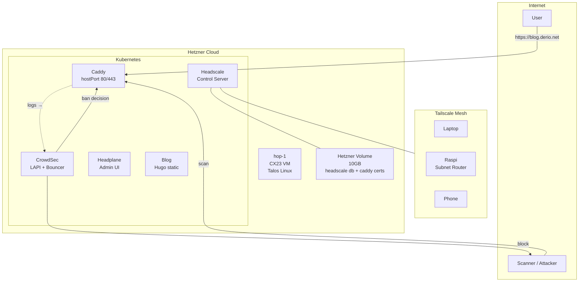



This is the operational companion to [Hopping Through the Portal](). That post covers the ten deviations from standard Talos. This one covers what you type to keep Hop running.

Hop is a single-node Talos cluster on a CX23 Hetzner VM. Everything about it differs from Frank.

| Concern | Frank | Hop |
|---------|-------|-----|
| Talos management | Omni (UI + API) | `talosctl` directly |
| CNI | Cilium (eBPF, L2 LB) | Flannel (default) |
| Storage | Longhorn (distributed) | Static PVs on Hetzner Volume |
| Nodes | 7 (HA control plane) | 1 (control-plane + worker) |
| Ingress | Traefik | Caddy hostPort (80/443) |
| Ingress auth | Authentik SSO | CrowdSec bouncer + tailscale ACL |
| Remote access | LAN only | Tailscale mesh + public endpoints |

**Hop has no redundancy.** A node reboot means all services are down. A botched Talos upgrade means rebuilding from Packer snapshot. Treat Hop as a pet.



Before any commands, source the Hop environment:

```bash
source .env_hop

# Verify you're targeting the right cluster
kubectl get nodes
# Expected: hop-1   Ready   control-plane   ...
```

Never run `source .env` in a Hop terminal — it overwrites `KUBECONFIG` with Frank's config. If unsure: `kubectl config current-context` should show `admin@hop`.

## What Healthy Looks Like

- `talosctl health` passes on the public IP.
- All system pods are `Running` or `Completed` — no `Pending` or `CrashLoopBackOff`.
- Caddy responds on both public and mesh entrypoints.
- Headscale shows all registered nodes as `online`.
- CrowdSec ban pipeline is active (no "0 bans" forever).
- The Hetzner Volume is `attached to hop-1`.

## Verify

```bash
# Cluster
talosctl -n $HOP_IP health
kubectl get nodes -o wide
kubectl get pods -A | grep -v Running | grep -v Completed

# Caddy
curl -sI https://blog.derio.net/frank/ | head -3
kubectl -n caddy-system logs deploy/caddy --tail=5 | grep "tls\|cert"

# Headscale
kubectl -n headscale-system exec deploy/headscale -- headscale nodes list
kubectl -n headscale-system exec deploy/headscale -- headscale routes list

# CrowdSec
kubectl -n crowdsec-system exec deploy/crowdsec-lapi -- cscli metrics | head -15

# Storage
hcloud volume list
kubectl get pv | grep -v Bound
```

## Steps

### Add a Node to the Mesh

```bash
# 1. Create a pre-auth key (on workstation with .env_hop sourced)
kubectl -n headscale-system exec deploy/headscale -- \
  headscale preauthkeys create --user default --reusable --expiration 24h

# 2. On the new device:
sudo tailscale up \
  --login-server https://headscale.hop.derio.net \
  --accept-routes \
  --authkey <KEY>

# 3. Verify
kubectl -n headscale-system exec deploy/headscale -- headscale nodes list | grep online
```

### Reload Caddy Config

```bash
kubectl -n caddy-system rollout restart deploy/caddy
```

Caddy uses `Recreate` strategy (binds host port 80/443 — rolling update would deadlock). Expect ~5s downtime.

### Upgrade Talos

Service-impacting — all pods stop during reboot.

```bash
# Check current version
talosctl -n $HOP_IP version

# Stage
talosctl -n $HOP_IP upgrade --image ghcr.io/siderolabs/installer:<VERSION> --stage

# Reboot
talosctl -n $HOP_IP reboot

# Wait for recovery
talosctl -n $HOP_IP health
kubectl get pods -A
```

Expected downtime: 3–5 minutes.

### Backup Headscale DB

```bash
kubectl -n headscale-system exec deploy/headscale -- \
  sqlite3 /var/lib/headscale/db.sqlite \
  ".backup /var/lib/headscale/backups/manual-$(date +%F).db"
```

An automated CronJob runs daily at 3 AM UTC. Retention is 7 days on the Hetzner Volume.

## Recover

### Caddy TLS Expired

```bash
# Check token is valid (shows last 4 chars)
kubectl -n caddy-system get secret caddy-cloudflare -o jsonpath='{.data.api-token}' | base64 -d | tail -c 4

# Recreate if empty, then restart pod
kubectl -n caddy-system delete secret caddy-cloudflare
kubectl -n caddy-system create secret generic caddy-cloudflare \
  --from-literal=api-token=<TOKEN>
kubectl -n caddy-system rollout restart deploy/caddy
```

**Gotcha:** Env vars from `secretKeyRef` are injected at pod creation. A pod keeps running with a valid token long after the secret is deleted. You find out on the next restart.

### CrowdSec Stops Banning

```bash
# Check LAPI health
kubectl -n crowdsec-system logs deploy/crowdsec-lapi --tail=20

# Check bouncer is connected
kubectl -n crowdsec-system exec deploy/crowdsec-lapi -- cscli bouncers list

# Check metric collection
kubectl -n crowdsec-system exec deploy/crowdsec-lapi -- cscli metrics
```

The ban pipeline can fail silently. A CrowdSec canary exists that pages when no new bans appear over a threshold — but the canary itself depends on the pipeline being wired correctly. Known failure modes:

- **Caddy logs not ingested** — CrowdSec needs `container_runtime=containerd` in its Caddy parser config to parse Caddy's JSON logs correctly ([#584](https://github.com/derio-net/frank/pull/584)).
- **LAPI data not persisted** — If the LAPI pod restarts without a PVC, it forgets all decisions. The fix was adding a PVC for `/var/lib/crowdsec/data` ([#583](https://github.com/derio-net/frank/pull/583)).
- **Bouncer can't reach LAPI** — The Caddy CrowdSec bouncer was initially pointed at the wrong service name. Fixed in [#574](https://github.com/derio-net/frank/pull/574).
- **Log rotation kills ingestion** — Caddy's log rotation closes the file descriptor. CrowdSec needs `poll_without_inotify: true` to detect the new log file ([#594](https://github.com/derio-net/frank/pull/594)).

### Mesh Client Can't Route

```bash
# From the client
tailscale status
tailscale ip -4          # Should show 100.64.0.x
dig litellm.frank.derio.net  # Should resolve via split DNS
```

Common fixes:
- `--accept-routes` missing: run `sudo tailscale set --accept-routes`
- `net.ipv4.ip_forward=1` missing for exit node: add it and restart tailscale
- Split DNS not working: check Headscale ConfigMap `dns.nameservers.split` section

### Headscale Pod Won't Start

```bash
kubectl -n headscale-system logs deploy/headscale --tail=30
```

Known causes:
- SQLite DB corruption from unclean shutdown — restore from backup.
- Falco alert killing the backup CronJob pod (bake sqlite binary into the image to avoid the exec probe) — fixed in [#385](https://github.com/derio-net/frank/pull/385).

### Complete Cluster Rebuild

```bash
# 1. Create new server from Talos snapshot
hcloud server create --name hop-1 --type cx23 --location fsn1 \
  --image <SNAPSHOT_ID> --volume hop-data

# 2. Apply Talos config
talosctl apply-config --insecure -n <NEW_IP> --file controlplane.yaml
talosctl bootstrap -n <NEW_IP>

# 3. Wait, bootstrap ArgoCD, re-create secrets
talosctl -n <NEW_IP> health
helm install argocd argo/argo-cd -n argocd --create-namespace \
  -f clusters/hop/apps/argocd/values.yaml
kubectl apply -f <(helm template root clusters/hop/apps/root/)

# 4. Manually re-create cloudflare and tailscale secrets
```

The Hetzner Volume survives server deletion. Reattach to the new server and Headscale clients reconnect automatically.

## Missteps

| What we assumed | Why it was wrong | What it cost |
|---|---|---|
| CrowdSec would parse Caddy logs out of the box | The default Caddy log parser expects a different container runtime. Without `container_runtime=containerd` in the parser config, CrowdSec silently ingested zero events. | One debug session to find the missing config field. |
| CrowdSec LAPI state survives pod restarts | The LAPI pod had no PVC. A restart wiped all decisions, and the bouncer had to re-learn. | Added a PVC and re-tested the ban pipeline. |
| Caddy log rotation is transparent to CrowdSec | Log rotation closes the file descriptor. Without `poll_without_inotify`, CrowdSec never sees the new log file and stops ingesting events. | Added the config flag and bounced both pods. |
| `hcloud volume` data persists automatically on server rebuild | It does — but you must specify `--volume hop-data` on `hcloud server create`. Forgetting it starts a fresh server without the volume attached. | The checklist now includes this flag. |
| A pod with `secretKeyRef` picks up secret changes on rotation | Env vars are injected at pod creation. Rotating the secret has no effect until the next restart. | Discovered during a Cloudflare token rotation — Caddy kept serving with the old token until the next deploy. |

## Quick Reference

| Command | What It Does |
|---------|-------------|
| `talosctl -n $HOP_IP health` | Full cluster health check |
| `talosctl -n $HOP_IP upgrade --image=... --stage` | Stage Talos upgrade |
| `headscale nodes list` (via kubectl exec) | List mesh devices |
| `headscale preauthkeys create` (via kubectl exec) | Generate registration key |
| `kubectl -n caddy-system rollout restart deploy/caddy` | Reload Caddy config |
| `kubectl -n crowdsec-system exec deploy/crowdsec-lapi -- cscli metrics` | CrowdSec metrics |
| `hcloud volume list` | Check Hetzner Volume status |
| `kubectl -n headscale-system exec deploy/headscale -- ls /var/lib/headscale/backups/` | List DB backups |

## References

- [Building Post — Hopping Through the Portal]()
- [Headscale CLI Reference](https://github.com/juanfont/headscale/blob/main/docs/)
- [Talos Linux Operations](https://www.talos.dev/v1.9/talos-guides/)
- [Caddy Documentation](https://caddyserver.com/docs/)
