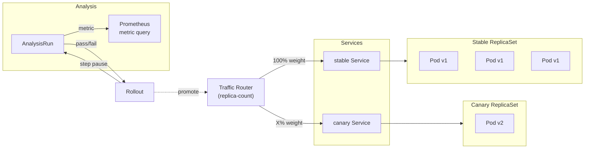



This is the operational companion to [Progressive Delivery with Argo Rollouts](). That post covers the architecture. This one covers promoting rollouts, reading analysis results, and recovering from stuck or degraded states.

> **2026-05-04 update** — The LiteLLM canary went through two rewrites in one day. First was a replica-count canary with `AnalysisRun` between pauses. Second is **pause-only** (no `AnalysisRun`) — because the `AnalysisTemplate` referenced `litellm_request_total`, a Prometheus metric the OSS LiteLLM image doesn't emit (it's Enterprise-only). The full postmortem (five latent bugs) is in the [building post]().



## What Healthy Looks Like

- The `argo-rollouts` controller pod is `Running` in the `argo-rollouts` namespace.
- LiteLLM Rollout shows `Status: Healthy` with all pods `Ready` under one ReplicaSet (at-rest rollouts have no current step).
- Sympozium Rollout shows `Status: Healthy` with the active service serving.
- No `Degraded` or `Paused` rollouts exist (unless you're mid-rollout).

## Verify

```bash
# Controller
kubectl get pods -n argo-rollouts
kubectl logs -n argo-rollouts deploy/argo-rollouts --tail=20 | grep -i error

# Rollout status
kubectl argo rollouts list rollouts -n litellm
kubectl argo rollouts list rollouts -n sympozium

# Detailed view
kubectl argo rollouts get rollout litellm -n litellm
```

## Steps

### Promote a Canary Step

```bash
# Check current step
kubectl argo rollouts get rollout litellm -n litellm

# Promote to next step
kubectl argo rollouts promote litellm -n litellm
```

### Abort a Canary

```bash
kubectl argo rollouts abort litellm -n litellm

# Verify rollback
kubectl argo rollouts get rollout litellm -n litellm
```

### Switch Blue-Green (Sympozium)

```bash
# Trigger a new ReplicaSet by updating the image
kubectl argo rollouts set image sympozium -n sympozium \
  sympozium=ghcr.io/derio-net/sympozium:<NEW_TAG>

# Promote to switch active service
kubectl argo rollouts promote sympozium -n sympozium
```

### View Analysis Run Results

```bash
kubectl get analysisrun -n litellm
kubectl describe analysisrun -n litellm <name>
```

## Recover

### Rollout Stuck at a Step

```bash
kubectl argo rollouts get rollout litellm -n litellm
# Check if the step is paused waiting for promotion
# Step Pause shows "NextStepAfter: ..." or "Promote to proceed"
```

Promote manually: `kubectl argo rollouts promote litellm -n litellm`.

If the rollout is stuck with no progress and no error:
- Check the controller logs for the Rollout: `kubectl logs -n argo-rollouts deploy/argo-rollouts | grep litellm`
- Check if the canary ReplicaSet can't schedule pods (resource quota, affinity, image pull)
- Check if the `workloadRef.scaleDown` policy is set to `onsuccess` — otherwise the canary ReplicaSet isn't scaled down after promotion

### Metric Analysis Fails

```bash
# Check the AnalysisRun
kubectl describe analysisrun -n litellm <name>

# Check controller logs for metric query failures
kubectl logs -n argo-rollouts deploy/argo-rollouts | grep -i "metric\|analysis\|query"
```

Known causes:
- **The metric doesn't exist.** LiteLLM's Prometheus integration is Enterprise-only. The OSS image doesn't export `litellm_request_total`. The canary was converted to pause-only (no `AnalysisRun`).
- **The Prometheus provider can't reach VictoriaMetrics.** Check network policies and service DNS.
- **4xx responses not counted as failure.** The `AnalysisTemplate` must count 4xx as failure, not just 5xx — a missing `successCondition` can silently pass a bad canary ([#216](https://github.com/derio-net/frank/pull/216)).

### Canary Won't Start

```bash
kubectl describe rs -n litellm -l rollouts-pod-template-hash=<HASH>
```

Check image pull errors, resource limits, and affinity rules. LiteLLM requires `amd64` affinity — if the node selector is wrong, the canary pod stays `Pending`.

### Rollout Controller Crashing

```bash
kubectl logs -n argo-rollouts deploy/argo-rollouts --tail=50
```

Check the Cilium traffic router plugin if the logs show `failed to get traffic router plugin`. The initial canary tried using Cilium's traffic router plugin, which didn't work on this cluster — the fix was switching to `replica-count` weighting and dropping the Cilium plugin ([#213](https://github.com/derio-net/frank/pull/213)).

### ArgoCD Drift on Rollout Replicas

ArgoCD may try to reset `spec.replicas` on the Rollout back to the Git value. Add `ignoreDifferences` to the Application CR for `spec.replicas` on Rollout resources — same pattern as the GPU switcher.

## Missteps

| What we assumed | Why it was wrong | What it cost |
|---|---|---|
| Cilium traffic router plugin would work for canary routing | The Cilium plugin requires specific CiliumNetworkPolicy configuration that wasn't set up. The Rollout controller logged `failed to get traffic router plugin` until the strategy was changed. | Switched to `replica-count` weighting, dropped the Cilium plugin. |
| OSS LiteLLM exports the same Prometheus metrics as Enterprise | `litellm_request_total` is an Enterprise-only metric. The `AnalysisTemplate` referenced it, so analysis runs silently produced no data. | Converted the canary to pause-only (no metrics), wrote a spec for future metric-gated promotion. |
| An `AnalysisTemplate` with only a 5xx failure condition is sufficient | Without counting 4xx as failure, a broken canary serving error pages would pass analysis. | Fixed `successCondition` to count both 4xx and 5xx. |
| `workloadRef.scaleDown: onsuccess` isn't critical | The default behavior keeps the old canary ReplicaSet running after promotion, wasting resources. | Added `scaleDown` policy and re-deployed. |
| A synthetic canary trigger (scaling to 0 then 1) is a clean rehearsal | The canary ReplicaSet would create but immediately scale to 0 on the first trigger, confusing the Rollout state. | Reverted the synthetic trigger and promoted manually for rehearsal. |

## Quick Reference

| Command | What It Does |
|---------|-------------|
| `kubectl argo rollouts list rollouts -n <ns>` | List rollouts |
| `kubectl argo rollouts get rollout <name> -n <ns>` | Detailed rollout status |
| `kubectl argo rollouts promote <name> -n <ns>` | Promote to next step |
| `kubectl argo rollouts abort <name> -n <ns>` | Abort and rollback |
| `kubectl argo rollouts set image <name> -n <ns> <container>=<image>` | Trigger a new rollout |
| `kubectl get analysisrun -n <ns>` | List analysis runs |
| `kubectl describe analysisrun -n <ns> <name>` | Analysis run details |

## References

- [Building Post — Progressive Delivery]()
- [Argo Rollouts Documentation](https://argoproj.github.io/rollouts/)
- [Argo Rollouts kubectl Plugin](https://argoproj.github.io/rollouts/features/kubectl-plugin/)
