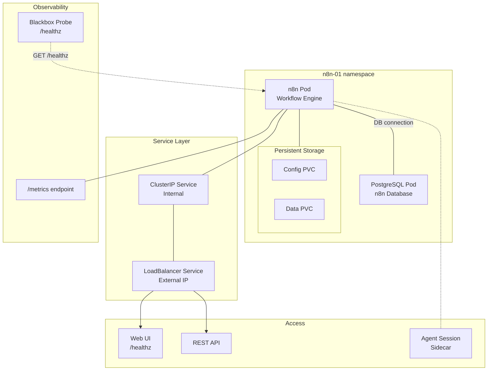



This is the operational companion to [Workflow Automation with n8n](). That post covers the architecture and deployment. This one covers day-to-day operations for n8n instances.



## What Healthy Looks Like

- The n8n pod is `1/1 Running` on gpu-1.
- The PostgreSQL pod is `1/1 Running` in the same namespace.
- The LoadBalancer Service shows an assigned external IP.
- `GET /healthz` returns 200.
- Metrics flow at `GET /metrics`.

## Verify

```bash
# Both pods
kubectl -n n8n-01 get pods

# Health endpoint (from inside the cluster)
kubectl -n n8n-01 exec deploy/n8n -- wget -qO- localhost:5678/healthz

# Metrics
kubectl -n n8n-01 exec deploy/n8n -- wget -qO- localhost:5678/metrics | head -10

# Database
kubectl -n n8n-01 exec deploy/n8n-postgresql -- psql -U n8n -c "SELECT 1;"
```

```console
$ kubectl -n n8n-01 get pods
NAME                                READY   STATUS    RESTARTS   AGE
n8n-7c9f5b6d8f-abc12               1/1     Running   0          14d
n8n-postgresql-0                    1/1     Running   0          14d

$ kubectl -n n8n-01 exec deploy/n8n -- wget -qO- localhost:5678/healthz
{"status":"ok"}
```

## Steps

### Restart n8n

```bash
kubectl -n n8n-01 rollout restart deployment/n8n
kubectl -n n8n-01 rollout status deployment/n8n

# Wait for health check
until kubectl -n n8n-01 exec deploy/n8n -- wget -qO- localhost:5678/healthz; do
  sleep 2
done
```

### Add a New Instance

1. Copy `apps/n8n/` to `apps/n8n-02/`.
2. Update values (namespace, PG credentials, external URL).
3. Add the ArgoCD Application CR in `apps/root/templates/n8n-02.yaml`.
4. Commit — ArgoCD picks it up.

### Upgrade n8n Version

```bash
# Update the image tag in apps/n8n/values.yaml
kubectl -n n8n-01 rollout restart deployment/n8n

# Check migrations ran
kubectl -n n8n-01 logs deploy/n8n --tail=30 | grep -i migration
```

## Recover

### n8n Pod Won't Start

```bash
kubectl -n n8n-01 logs deploy/n8n --tail=50 | grep -i error
```

Common causes:
- **Database connection refused** — PostgreSQL isn't running yet. The n8n pod will crash-loop until the database is ready. Check `kubectl -n n8n-01 get pods n8n-postgresql-0`.
- **Migration failure** — Schema migration failed on upgrade. Check the full migration log: `kubectl -n n8n-01 logs deploy/n8n --tail=100 | grep -A 20 migration`.
- **PVC not mounting** — Check events: `kubectl -n n8n-01 describe pod -l app.kubernetes.io/name=n8n`.

### PostgreSQL Won't Start

```bash
kubectl -n n8n-01 logs n8n-postgresql-0 --tail=30
kubectl -n n8n-01 describe pod n8n-postgresql-0 | grep -A 10 Events
```

Common causes:
- Storage class missing or PVC stuck `Pending`.
- Data corruption on unclean shutdown. Check the PG pod logs for `FATAL: data directory ... has wrong ownership` or `FATAL: lock file "postmaster.pid" already exists`.

If the lock file is stale:

```bash
kubectl -n n8n-01 exec n8n-postgresql-0 -- rm /var/lib/postgresql/data/postmaster.pid
kubectl -n n8n-01 delete pod n8n-postgresql-0
```

### Agent Session Sidecar Issues

If the n8n instance has the agent-session sidecar and workflows that use Claude Code fail:

```bash
# Check sidecar status
kubectl -n n8n-01 get pods -l app.kubernetes.io/name=n8n -o jsonpath='{.items[0].status.containerStatuses}'

# Check if the workspace needs pre-trusting
kubectl -n n8n-01 exec deploy/n8n -c n8n -- \
  sh -c "ls ~/.claude/settings.json 2>/dev/null || echo 'no settings.json — may hit trust gate'"
```

The agent sidecar may need the workspace pre-trusted to skip the Claude Code trust gate. The fix was injecting a pre-seeded `settings.json` that whitelists the workspace ([#542](https://github.com/derio-net/frank/pull/542)).

### n8n Web UI Slow or Unresponsive

```bash
# Check resource usage
kubectl -n n8n-01 top pods

# Check PG connection count
kubectl -n n8n-01 exec n8n-postgresql-0 -- psql -U n8n -c "SELECT count(*) FROM pg_stat_activity;"

# Check n8n internal metrics
kubectl -n n8n-01 exec deploy/n8n -- wget -qO- localhost:5678/metrics | grep -i "request_duration\|error_total"
```

## Missteps

| What we assumed | Why it was wrong | What it cost |
|---|---|---|
| n8n's workspace trust gate respects a pre-existing `settings.json` | It does — but only if the file exists before n8n starts. If the image doesn't ship it, every agent session hits the interactive trust prompt and hangs. | Added the pre-seeded file to the image build. |
| An agent session sidecar can submit commands with simple stdin piping | n8n's terminal expects bracketed-paste mode. Plain `echo "command" \|` input arrives as literal characters. | Switched to a driver that wraps the payload in bracketed-paste escape sequences. |
| PostgreSQL PVC data survives all pod restarts | It does for normal restarts, but a forced delete of the StatefulSet pod without terminating PG gracefully can leave a stale `postmaster.pid` lock file. | Added recovery steps to the runbook. |
| More n8n instances can share the same PG cluster | Each n8n instance needs its own database and user. Sharing a single PG across instances causes namespace collisions on migration. | Template now includes a dedicated PG per instance. |

## Quick Reference

| Command | What It Does |
|---------|-------------|
| `kubectl -n n8n-01 get pods` | Check n8n + PG status |
| `kubectl -n n8n-01 exec deploy/n8n -- wget -qO- localhost:5678/healthz` | Health check |
| `kubectl -n n8n-01 logs deploy/n8n \| grep -i migration` | Check upgrade migration |
| `kubectl -n n8n-01 rollout restart deployment/n8n` | Restart n8n |
| `kubectl -n n8n-01 top pods` | Resource usage |
| `kubectl -n n8n-01 exec n8n-postgresql-0 -- psql -U n8n -c "SELECT 1;"` | DB connectivity |

## References

- [Building Post — Workflow Automation]()
- [n8n Documentation](https://docs.n8n.io/)
- [n8n Health Check Endpoint](https://docs.n8n.io/hosting/healthchecks/)
