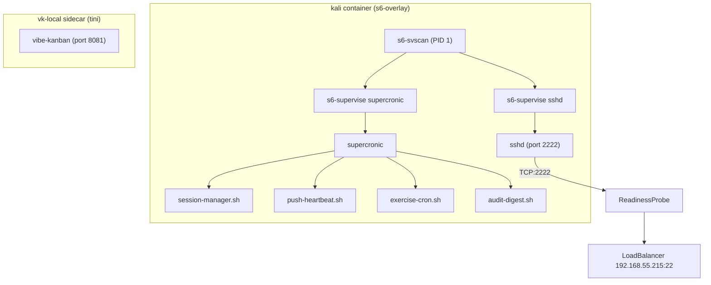
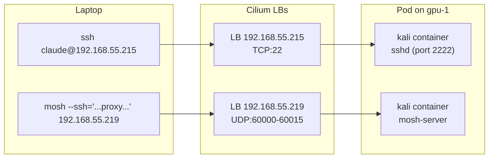



This is the operational companion to [Secure Agent Pod](). That post explains the architecture and security model. This one is what you type when you can't SSH in, a cron job went quiet, VibeKanban is unreachable, or the pod OOM-killed the sidecar mid-session.

Before any commands below, source the environment:

```bash
source .env          # sets KUBECONFIG, TALOSCONFIG
source .env_devops   # sets OMNICONFIG + service accounts
```

## Process Supervision Model



Each supervised service runs in signal isolation — a crash in `supercronic` can't take down `sshd`. s6 respawns failed services within ~1s; 5 deaths in 60s triggers a crashloop bail that stops respawning without killing the pod.

## What Healthy Looks Like

A healthy secure-agent-pod has:
- One pod (`2/2 Ready`) running on gpu-1 — `kali` + `vk-local` sidecar
- PID 1 in `kali` is `/init` (s6-overlay), supervising `sshd` and `supercronic`
- SSH accessible at `192.168.55.215:22`
- mosh accessible on UDP `192.168.55.219:60000-60015`
- VibeKanban UI at `192.168.55.218:8081`
- All running as UID 1000 (`claude`), no root

## Verify

### Pod Health

```bash
# Pod status
kubectl -n secure-agent-pod get pods -o wide

# Detailed events and conditions
kubectl -n secure-agent-pod describe pod -l app=secure-agent-pod

# Container identity
kubectl exec -n secure-agent-pod deploy/secure-agent-pod -c kali -- id
# Expected: uid=1000(claude) gid=1000(claude) groups=1000(claude)
```

### Process Health

The `kali` container runs s6-overlay as PID 1, supervising `sshd` and `supercronic`. VibeKanban runs in the `vk-local` sidecar.

```bash
# Service status (the supervised long-runners)
kubectl exec -n secure-agent-pod deploy/secure-agent-pod -c kali -- s6-svstat /run/service/sshd /run/service/supercronic
# Expected: both `up` with high uptime

# Full process tree
kubectl exec -n secure-agent-pod deploy/secure-agent-pod -c kali -- ps -ef
```

If a service dies, s6 respawns it within ~1s. Five deaths within 60s trip the crashloop bail — the service stays down without taking the pod with it. The K8s readinessProbe (TCP on port 2222) catches the sshd-down case; supercronic-down has no probe, so check `s6-svstat` if cron jobs go quiet.

```bash
# vk-local sidecar
kubectl exec -n secure-agent-pod deploy/secure-agent-pod -c vk-local -- ps -ef
```

### Services and Networking



Two distinct Cilium L2 LoadBalancers — we deliberately chose separate IPs over a sharing-key annotation for operational clarity. SSH hits TCP 192.168.55.215:22; mosh UDP hits 192.168.55.219:60000-60015.

```bash
# Verify LoadBalancer IPs
kubectl -n secure-agent-pod get svc

# SSH connectivity
ssh -o ConnectTimeout=5 claude@192.168.55.215 echo "SSH works"

# VibeKanban health
curl -s -o /dev/null -w "%{http_code}" http://192.168.55.218:8081
# Expected: 200
```

### GitHub Token Health

The agent authenticates to GitHub with a rotating App installation token, not a PAT:

```bash
# Is ESO minting? (want READY=True)
kubectl -n secure-agent-pod get externalsecret agent-github-token

# In-pod: token present + git/gh auth
kubectl exec -n secure-agent-pod deploy/secure-agent-pod -c kali -- bash -lc '
  wc -c < /var/run/github/token
  git ls-remote https://github.com/derio-net/willikins HEAD >/dev/null && echo git-OK
  gh api graphql -f query="{repository(owner:\"derio-net\",name:\"willikins\"){name}}" >/dev/null && echo gh-OK'
```

> `gh auth status` calling the token "invalid" is expected — App installation tokens have no user identity, but repo/issue/PR/GraphQL ops work.

## Steps

### SSH Access

```bash
# Standard SSH
ssh claude@192.168.55.215

# With specific key
ssh -i ~/.ssh/id_rsa claude@192.168.55.215
```

The Service maps external port 22 → internal port 2222 (non-root sshd).

### Updating Authorized Keys

SSH authorized keys come from a Kubernetes Secret:

```bash
# View current keys
kubectl get secret agent-ssh-keys -n secure-agent-pod -o jsonpath='{.data.authorized_keys}' | base64 -d

# Replace with a new key
kubectl create secret generic agent-ssh-keys \
  --namespace=secure-agent-pod \
  --from-file=authorized_keys=~/.ssh/id_rsa.pub \
  --dry-run=client -o yaml | kubectl apply -f -

# Restart pod to pick up the new key
kubectl rollout restart deployment/secure-agent-pod -n secure-agent-pod
```

### Persistent Shells with mosh + tmux

mosh keeps the connection alive across IP changes and laptop suspend; tmux keeps the server-side shells alive across mosh restarts. Together they make sessions that survive closing the lid.

**Layout survives pod restarts** via `tmux-resurrect` and `tmux-continuum` (5-minute auto-save). After a mosh re-spawn (`Cmd+Shift+2` in WezTerm), the new tmux server attaches to your saved layout — pane structure and cwds restored from the last save.

The canonical mosh invocation:

```bash
export MOSH_SSH_PROXY='nc 192.168.55.215 22'
SHELL=/bin/sh mosh --experimental-remote-ip=local \
  --ssh='ssh -l claude -i ~/.ssh/your_private_key \
         -o ControlMaster=no -o ControlPath=none -o ControlPersist=no \
         -o ProxyCommand=$MOSH_SSH_PROXY' \
  --server='LC_ALL=C.UTF-8 mosh-server new -p 60000:60015' \
  192.168.55.219 -- \
  tmux new-session -A -s claude-frank-secure-pod
```

The SSH and UDP services are on separate IPs by design (two distinct Cilium L2 LoadBalancers) — we chose explicit two-IP model over sharing-key annotations. The 16-port UDP range matches `mosh-server new -p 60000:60015` on the server side; sessions garbage-collect after 1h of silence.

### Managing Secrets

**Tier 1 (Infisical / ESO):** Add the secret to Infisical, create/update the ExternalSecret manifest, commit — ArgoCD syncs. Restart the pod to pick up new env vars.

**Tier 2 (manual):**
```bash
# View current tier-2 secrets
kubectl get secret agent-secrets-tier2 -n secure-agent-pod -o jsonpath='{.data}' | python3 -c "import json,sys,base64; d=json.load(sys.stdin); [print(f'{k}: {base64.b64decode(v).decode()[:20]}...') for k,v in d.items()]"

# Update a secret value
kubectl patch secret agent-secrets-tier2 -n secure-agent-pod \
  --type merge -p '{"stringData":{"TELEGRAM_BOT_TOKEN":"new-token-here"}}'

# Restart to pick up changes
kubectl rollout restart deployment/secure-agent-pod -n secure-agent-pod
```

**Config files (talosconfig, kubeconfig, omniconfig)** are mounted at `/home/claude/.kube/configs/`:
```bash
kubectl exec -n secure-agent-pod deploy/secure-agent-pod -c kali -- ls -la /home/claude/.kube/configs/
```

### Cron Jobs

Cron is managed by supercronic reading `/home/claude/.crontab`. Scripts live at `/opt/scripts/` — baked into the image, immutable.

```bash
# View current crontab
kubectl exec -n secure-agent-pod deploy/secure-agent-pod -c kali -- cat /home/claude/.crontab

# View available scripts
kubectl exec -n secure-agent-pod deploy/secure-agent-pod -c kali -- ls /opt/scripts/
# audit-digest.sh, exercise-cron.sh, notify-telegram.sh, push-heartbeat.sh, session-manager.sh, guardrails-hook.py

# Edit crontab (supercronic picks up changes automatically)
kubectl exec -n secure-agent-pod deploy/secure-agent-pod -c kali -it -- vi /home/claude/.crontab
```

Current schedule: session-manager every 5m, self-update daily 04:00, Claude Code update weekly Sun 04:30, exercise reminders 5x daily Fri-Mon, audit digest daily 21:00 UTC.

## Recover

### Can't SSH In

1. **Check pod is running:** `kubectl get pods -n secure-agent-pod`
2. **Check sshd process:** `kubectl exec ... -- ps aux | grep sshd`
3. **Check service IP:** `kubectl get svc -n secure-agent-pod` — verify `192.168.55.215` is assigned
4. **Check authorized_keys:** `kubectl exec ... -- cat /home/claude/.ssh/authorized_keys`
5. **Check sshd logs:** `kubectl logs ... | grep sshd`

### CrashLoopBackOff

```bash
kubectl logs -n secure-agent-pod deploy/secure-agent-pod -c kali --previous
```

Common causes:
- **"Download failed"** — VibeKanban can't reach `npm-cdn.vibekanban.com` (Cilium blocking or DNS issue; commit `34c97d1d` fixed the egress policy)
- **"No such file or directory: /entrypoint.sh"** — image didn't include the entrypoint (rebuild needed)
- **sshd fails** — check host key permissions (`chmod 600` on private keys, `chmod 700` on `.ssh-host-keys/`)

### Pod Stuck in CreateContainerConfigError

A referenced Secret doesn't exist:

```bash
kubectl describe pod -l app=secure-agent-pod -n secure-agent-pod | grep -A5 "Warning"
```

`agent-secrets-tier1` and `agent-secrets-tier2` are `optional: true`. But `agent-ssh-keys` is required — create it if missing:

```bash
kubectl create secret generic agent-ssh-keys \
  --namespace=secure-agent-pod \
  --from-file=authorized_keys=~/.ssh/id_rsa.pub
```

### vk-local OOMKill

The `vk-local` sidecar ran at 8Gi memory limit, was dialed back to 4Gi during a quiet soak (commit `390f64af`), then OOM-killed under real workload (commit `b6965077`). The error is `exit 137`. To check:

```bash
kubectl describe pod -n secure-agent-pod -l app=secure-agent-pod | grep -A5 "OOMKilled\|Exit Code: 137"
```

If the sidecar is consistently OOMing, check whether the limit was dialed back:

```bash
kubectl get deployment -n secure-agent-pod secure-agent-pod -o yaml | grep -A2 'memory'
```

The fix is restoring the pre-soak limit in `apps/secure-agent-pod/manifests/deployment.yaml`.

### Host Key Changed Warning

If SSH reports "WARNING: REMOTE HOST IDENTIFICATION HAS CHANGED", the PVC was recreated:

```bash
ssh-keygen -R 192.168.55.215
ssh claude@192.168.55.215
```

## Missteps

| What we assumed | Why it was wrong | What it cost |
|---|---|---|
| The vk-local sidecar would fit in 4Gi even under real workload | The 4Gi limit was sized on quiet soak metrics (p99 RSS 2.95GiB, queue depth max 3). Real workload had 8 active workspaces hitting executor cap=4, consuming the headroom. | OOMKill mid-session (commit `b6965077`). Restored to 8Gi. |
| `secretRef.namespace` in an ESO `GithubAccessToken` generator controls where the key Secret lives | ESO v2.1.0 resolves the generator's secret reference in the consuming ExternalSecret's namespace, ignoring the `namespace` field entirely. | The generator silently failed for `secure-agent-pod` until we moved the private key Secret to that namespace (commit `eb5fa217`). |
| A single `bash -c '... & ... & wait -n'` entrypoint is sufficient for process supervision | A SIGHUP to the in-pod Claude session manager propagated to the whole pgroup, killed supercronic, and through `wait -n` exited the container — taking SSH, mosh, and tmux with it. | Migrated to s6-overlay for signal-isolated per-service supervision (the 23:27 SIGHUP incident on 2026-04-26). |

## Quick Reference

| Command | What It Does |
|---------|-------------|
| `kubectl -n secure-agent-pod get pods` | Pod status |
| `kubectl exec -n ... -c kali -- s6-svstat /run/service/sshd` | SSH service health |
| `kubectl exec -n ... -c kali -- ollama ps` | Show model in GPU memory |
| `kubectl exec -n ... -c kali -- nvidia-smi` | GPU memory usage |
| `ssh claude@192.168.55.215` | SSH into the pod |
| `kubectl -n secure-agent-pod get svc` | List LoadBalancer IPs |
| `kubectl exec -n ... -c vk-local -- logs` | VibeKanban logs |
| `sops --decrypt secrets/secure-agent-pod/agent-configs.yaml \| kubectl apply -f -` | Rotate kube/talos/omni configs |

## References

- [Building Post 21: Secure Agent Pod]()
- [VibeKanban](https://github.com/BloopAI/vibe-kanban)
- [s6-overlay v3](https://github.com/just-containers/s6-overlay)
- [supercronic](https://github.com/aptible/supercronic)
