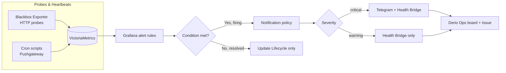



This is the operational companion to [Health Monitoring](). That post covers the architecture behind feature probes, heartbeats, and alerting. This one covers what you type when a probe shows down, a heartbeat went stale, or an alert fired but nobody got the Telegram notification — including the delivery failures we discovered the hard way.

Before any commands below, source the environment:

```bash
source .env          # sets KUBECONFIG, TALOSCONFIG
source .env_devops   # sets OMNICONFIG + service accounts
```

## Data Flow



Feature probes and cron heartbeats feed into VictoriaMetrics. Grafana alert rules evaluate conditions; when a threshold is breached, the notification policy routes by severity — critical alerts go to Telegram + Health Bridge, warnings to the Health Bridge alone. The bridge updates the Derio Ops board's Lifecycle field and opens/closes bug issues.

## What Healthy Looks Like

All feature health probes show `probe_success=1`, all cron heartbeats push within their expected cadences, and Grafana alert rules fire and notify through Telegram without silent delivery failures. The Feature Health dashboard at `/d/fh-overview/feature-health` shows every probe UP and every heartbeat recent.

## Verify

### Checking Probe Status

```bash
# Port-forward to Blackbox Exporter
kubectl port-forward -n monitoring svc/blackbox-exporter 9115:9115 &

# Probe a specific endpoint
curl -s "http://localhost:9115/probe?target=https://grafana.frank.derio.net&module=http_2xx" | grep probe_success
# Expected: probe_success 1

# Check all feature health probes via VictoriaMetrics
GRAFANA_AUTH="admin:$(kubectl get secret -n monitoring victoria-metrics-grafana -o jsonpath='{.data.admin-password}' | base64 -d)"
curl -sk -u "$GRAFANA_AUTH" "https://grafana.frank.derio.net/api/datasources/proxy/uid/P4169E866C3094E38/api/v1/query" \
  --data-urlencode 'query=probe_success{probe_group="feature_health"}'
```



### Checking Heartbeat Metrics

```bash
# Port-forward to Pushgateway
kubectl port-forward -n monitoring svc/pushgateway 9091:9091 &

# View all heartbeat metrics
curl -s http://localhost:9091/metrics | grep willikins_heartbeat

# Push a test heartbeat
echo "willikins_heartbeat_last_success_timestamp $(date +%s)" | \
  curl -s --data-binary @- http://localhost:9091/metrics/job/test_job

# Delete a test metric
curl -s -X DELETE http://localhost:9091/metrics/job/test_job
```

### Listing Active Alert Rules

All Grafana alerting is file-provisioned via ConfigMaps:

```bash
GRAFANA_AUTH="admin:$(kubectl get secret -n monitoring victoria-metrics-grafana -o jsonpath='{.data.admin-password}' | base64 -d)"

# List all alert states
curl -sk -u "$GRAFANA_AUTH" \
  "https://grafana.frank.derio.net/api/prometheus/grafana/api/v1/alerts" | \
  python3 -c "import json,sys; [print(f'{a[\"state\"]}: {a[\"labels\"][\"alertname\"]}') for a in json.load(sys.stdin)['data']['alerts']]"
```

## Steps

### Editing Alert Rules

File-provisioned rules are **read-only in the UI**. To modify:

1. Edit the ConfigMap YAML in `apps/grafana-alerting/manifests/alert-rules-cm.yaml`
2. Commit and push — ArgoCD syncs the ConfigMap
3. Restart Grafana to reload provisioning files:
   ```bash
   kubectl delete pod -n monitoring -l app.kubernetes.io/name=grafana
   ```
4. Verify the rule loaded without errors:
   ```bash
   kubectl logs -n monitoring -l app.kubernetes.io/name=grafana --tail=200 | grep -iE 'parseError|provisioning.*error'
   ```

### Editing the Feature Health Dashboard

1. Open the provisioned dashboard in Grafana UI, click "Save as" to create a scratch copy
2. Edit freely in the UI
3. Export the final JSON (Share → Export → Save to file)
4. Replace the JSON content in `apps/grafana-alerting/manifests/dashboard-cm.yaml`
5. Commit, push, restart Grafana pod
6. Delete the scratch dashboard

### Pushing a Manual Heartbeat

```bash
kubectl exec -n secure-agent-pod deploy/secure-agent-pod -c kali -- /opt/scripts/push-heartbeat.sh <job_name> [label=value ...]
# Example: kubectl exec ... /opt/scripts/push-heartbeat.sh exercise_reminder context=desk
```

## Recover

### Telegram Notification Not Arriving

If an alert fires but no Telegram message arrives, check three failure patterns we've fixed:

1. **Markdown stripping underscores** — `parse_mode: Markdown` interprets `_` as italic. `job=session_manager` renders as `sessionmanager` (commit `cc239cf9`). Fixed by removing `parse_mode`.

2. **HTML annotation rejection** — annotation values like `<node-ip>` are valid strings but Telegram's HTML parser rejects them as invalid HTML tags. The message dispatches but Telegram returns HTTP 400 silently (commit `c866a85e`). Fixed by stripping `<>&` from annotations.

3. **Trailing newline in bot token** — the Telegram bot token from Infisical had a trailing newline, causing HTTP 404 on `sendMessage` — also silent (commit `f7d8f189`). Fixed by defensive credential stripping.

Check Grafana logs for any of these:

```bash
kubectl logs -n monitoring -l app.kubernetes.io/name=grafana -c grafana --tail=50 | grep -iE "error|warn|notify|telegram|400|404"
```

If the contact point is misconfigured, restart Grafana to reset the notification dedup state:

```bash
kubectl delete pod -n monitoring -l app.kubernetes.io/name=grafana
```

### VMProbe/VMServiceScrape Not Applying

If `kubectl apply` fails with `x509: certificate signed by unknown authority`:

```bash
# The VictoriaMetrics Operator webhook caBundle is out of sync
kubectl get validatingwebhookconfiguration -l app.kubernetes.io/instance=victoria-metrics -o yaml | grep caBundle | head -1

# Fix: restart the operator to regenerate certs
kubectl rollout restart deployment -n monitoring victoria-metrics-operator
```

### Dashboard Shows No Data

- Verify datasource UID is `P4169E866C3094E38`
- Table panels require `"format": "table"` on targets
- `ALERTS{}` metric doesn't exist for Grafana-managed alerts — use `alertlist` panel type

## Missteps

| What we assumed | Why it was wrong | What it cost |
|---|---|---|
| Telegram contact point annotations are opaque strings — any format works | Telegram's HTML parser rejects `<node-ip>` as an invalid HTML tag. `parse_mode: Markdown` silently strips underscores in label values like `session_manager`. Both return HTTP 400/200 with no Grafana error. | Silent delivery failures on active alerts. An alert shows Firing in Grafana, the message appears sent, but no operator ever sees it. |
| A NIC is either up or down — binary link-state monitoring is sufficient | Flapping NICs that go up-down-up within 5m are invisible to binary-down-state rules with `for: 5m`. gpu-1's enp3s0 flapped 76 times over ~8h — 0 alerts fired (commit `9ee2cde1`). | An 8-hour networking blind spot on the GPU node during active inference workloads. |
| The Grafana alerting ConfigMap alone controls what fires — provisioning files are watched at boot | Grafana reads provisioning files at startup. After editing the ConfigMap, the new rules don't take effect until Grafana restarts. | Multiple incidents where a rule change was committed and synced but alerts continued from the old rules. |

## Quick Reference

| Component | Namespace | Port | Purpose |
|-----------|-----------|------|---------|
| Blackbox Exporter | monitoring | 9115 | HTTP endpoint probing |
| Pushgateway | monitoring | 9091 | Heartbeat metric ingestion |
| Grafana | monitoring | 3000 (LB: 192.168.55.203) | Dashboards + alerting |
| Feature Health Dashboard | — | — | `/d/fh-overview/feature-health` |

## References

- [Prometheus Blackbox Exporter](https://github.com/prometheus/blackbox_exporter)
- [Prometheus Pushgateway](https://github.com/prometheus/pushgateway)
- [Grafana Alerting API](https://grafana.com/docs/grafana/latest/developers/http_api/alerting_provisioning/)
- [Building Post 22: Health Monitoring]()
