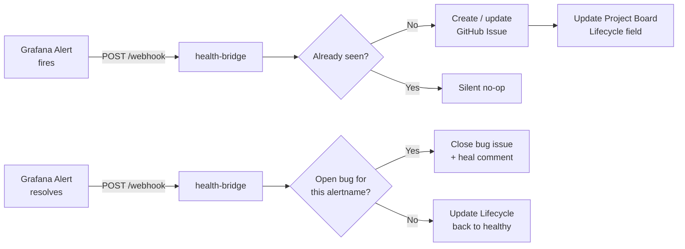



Companion to [Health Bridge](). That post covers the architecture of closing the loop from Grafana alerts to GitHub Issues. This one covers what you type when the bridge isn't processing alerts, duplicate bug issues appear, or a power outage strands board tiles in a degraded state that won't self-heal.

Before any commands below, source the environment:

```bash
source .env          # sets KUBECONFIG, TALOSCONFIG
source .env_devops   # sets OMNICONFIG + service accounts
```

## The Lifecycle in One Diagram



The bridge translates Grafana alert lifecycle into GitHub Issue + Project Board updates. When an alert fires, it creates or updates a bug issue and sets the board Lifecycle to `degraded` or `dead`. When it resolves, the bridge closes the matching bug and flips Lifecycle back to `healthy`.

## What Healthy Looks Like

The health-bridge pod is running in `monitoring`, the Grafana webhook contact point delivers alerts to it, every alert rule carries a `github_issue` label mapping to a Derio Ops board issue, and the bridge creates/closes bug issues as alerts fire and resolve. No stranded tiles, no duplicate bugs.

## Verify

### Service Status

```bash
# Pod status
kubectl get pods -n monitoring -l app=health-bridge

# Recent logs — should show project metadata loaded
kubectl logs -n monitoring -l app=health-bridge --tail=20

# Check readiness
kubectl logs -n monitoring -l app=health-bridge | grep "Loaded project metadata"
# Expected: Loaded project metadata: id=..., field=..., 10 lifecycle states
```

### ExternalSecret Sync

```bash
# Verify secrets are synced from Infisical
kubectl get externalsecret -n monitoring health-bridge-secrets
# Expected: STATUS=SecretSynced

# Check secret keys exist
kubectl get secret -n monitoring health-bridge-secrets -o jsonpath='{.data}' | jq 'keys'
# Expected: ["GITHUB_TOKEN", "WEBHOOK_SECRET"]
```

### Alert Rule Labels

Every rule the bridge processes needs a `github_issue` label:

```bash
GRAFANA_AUTH="admin:$(kubectl get secret -n monitoring victoria-metrics-grafana -o jsonpath='{.data.admin-password}' | base64 -d)"

# List all rules with their github_issue labels
curl -s -u "$GRAFANA_AUTH" \
  "https://grafana.frank.derio.net/api/v1/provisioning/alert-rules" | \
  jq '.[] | {title: .title, uid: .uid, github_issue: .labels.github_issue}'
```

Current mappings: exercise-reminder-stale → `willikins#11`, session-manager-stale → `willikins#13`, audit-digest-stale → `willikins#12`, agent-pod-not-running → `frank-ops#18`, plus 20 Layer trackers at `frank-ops#1`–`frank-ops#20`.

<!-- MEDIA: screenshot | Derio Ops board showing Layer trackers with Lifecycle tiles | Open the private derio-net/frank-ops board, filter to the Lifecycle view, capture the full grid -->


### Testing the Webhook

```bash
# Get webhook secret
WEBHOOK_SECRET=$(kubectl get secret -n monitoring health-bridge-secrets \
  -o jsonpath='{.data.WEBHOOK_SECRET}' | base64 -d)

# Send a test alert (warning → degraded)
curl -s -X POST http://health-bridge.monitoring.svc.cluster.local:8080/webhook \
  -H "Authorization: Bearer $WEBHOOK_SECRET" \
  -H "Content-Type: application/json" \
  -d '{
    "status": "firing",
    "alerts": [{
      "status": "firing",
      "labels": {"alertname": "test-bridge", "severity": "warning", "github_issue": "willikins#11"},
      "annotations": {"summary": "Manual test alert"},
      "startsAt": "'$(date -u +%Y-%m-%dT%H:%M:%SZ)'"
    }]
  }'
# Expected: {"processed": 1, "total": 1}

# Send a resolved alert to restore healthy state
curl -s -X POST http://health-bridge.monitoring.svc.cluster.local:8080/webhook \
  -H "Authorization: Bearer $WEBHOOK_SECRET" \
  -H "Content-Type: application/json" \
  -d '{
    "status": "resolved",
    "alerts": [{
      "status": "resolved",
      "labels": {"alertname": "test-bridge", "severity": "warning", "github_issue": "willikins#11"},
      "annotations": {"summary": "Manual test resolved"},
      "startsAt": "'$(date -u +%Y-%m-%dT%H:%M:%SZ)'",
      "endsAt": "'$(date -u +%Y-%m-%dT%H:%M:%SZ)'"
    }]
  }'
# Expected: {"processed": 1, "total": 1}
```

## Steps

### Adding or Updating a github_issue Label

```bash
RULE_UID="exercise-reminder-stale"
ISSUE="willikins#11"
RULE=$(curl -s -u "$GRAFANA_AUTH" \
  "https://grafana.frank.derio.net/api/v1/provisioning/alert-rules/$RULE_UID")
UPDATED=$(echo "$RULE" | jq --arg issue "$ISSUE" '.labels.github_issue = $issue')
curl -s -X PUT "https://grafana.frank.derio.net/api/v1/provisioning/alert-rules/$RULE_UID" \
  -u "$GRAFANA_AUTH" \
  -H "Content-Type: application/json" \
  -d "$UPDATED"
```

### Updating the Bridge

```bash
# In the health-bridge repo:
# 1. Make changes, run tests
go test -v ./...

# 2. Tag and push
git tag v0.4.0
git push origin v0.4.0
# GitHub Actions builds and pushes to GHCR

# 3. Update the image tag in frank repo
# Edit apps/health-bridge/manifests/deployment.yaml
# Change: image: ghcr.io/derio-net/health-bridge:v0.4.0
# Commit and push — ArgoCD syncs
```

### Reloading Rules After ConfigMap Edit

Grafana's provisioning files are read at boot, not watched:

```bash
git add apps/grafana-alerting/manifests/alert-rules-cm.yaml
git commit -m "feat(obs): ..."
git push origin main

# Wait for ArgoCD to sync the ConfigMap
kubectl annotate application -n argocd grafana-alerting \
  argocd.argoproj.io/refresh=hard --overwrite

# Restart Grafana to pick up the new ConfigMap
kubectl delete pod -n monitoring -l app.kubernetes.io/name=grafana
```

Two gotchas: Grafana's RWO PVC + RollingUpdate deadlocks the rollout — scale to 0 briefly if it hangs. And always check for `parseError` in the new pod's logs before trusting the change.

## Recover

### Bridge Not Processing Alerts

1. **Check pod logs** for errors:
   ```bash
   kubectl logs -n monitoring -l app=health-bridge --tail=50
   ```

2. **Verify the webhook contact point** exists in Grafana:
   ```bash
   curl -s -u "$GRAFANA_AUTH" \
     "https://grafana.frank.derio.net/api/v1/provisioning/contact-points" | \
     jq '.[] | select(.name == "Health Bridge Webhook")'
   ```

3. **Verify the notification policy** routes Feature Health alerts:
   ```bash
   curl -s -u "$GRAFANA_AUTH" \
     "https://grafana.frank.derio.net/api/v1/provisioning/policies" | \
     jq '.routes[] | select(.receiver == "Health Bridge Webhook")'
   ```

### "Not Ready" on Readiness Probe

The bridge couldn't load project metadata from GitHub on startup:

```bash
# Pod logs will show the error
kubectl logs -n monitoring -l app=health-bridge | head -5
```

Common causes: `GITHUB_TOKEN` expired or missing scopes (needs repo, project, read:org), project number wrong in ConfigMap, or GitHub API rate limit.

### Alerts Skip the Bridge (No github_issue Label)

Bridge logs show `Alert <name> has no github_issue label, skipping`. Add the label to the alert rule.

### Duplicate Bug Issues

Before v0.2.0, the bridge had no dedup logic. On v0.3.0+, the safety net matches the title prefix and body feature-ref. If duplicates still appear, they're all closed together on next resolve.

```bash
# Check for recent duplicates
gh issue list -R derio-net/frank-ops --label bug --state open

# Close duplicates by hand, keeping the earliest open
gh issue close <number> --repo derio-net/frank-ops --comment "Duplicate"
```

### Stranded Board Tiles After Power Outage

When Grafana is replaced mid-incident (e.g., power outage), the fresh pod never fired the alert, so it never sends `resolved`. The tile stays degraded and any bug stays open.

The cure is to replay the missing `resolved` webhooks:

```bash
SECRET=$(kubectl get secret -n monitoring health-bridge-secrets \
  -o jsonpath='{.data.WEBHOOK_SECRET}' | openssl base64 -d -A)

# The frank-ops# trackers that are stuck (from bridge logs / board):
ISSUES="18 1 12 13 15 24 3 5 6 8"
NOW=$(date -u +%Y-%m-%dT%H:%M:%SZ)
alerts=""
for n in $ISSUES; do
  alerts="${alerts}{\"status\":\"resolved\",\"labels\":{\"alertname\":\"DatasourceError\",\"github_issue\":\"frank-ops#${n}\",\"severity\":\"critical\"},\"annotations\":{\"summary\":\"Outage recovery\"},\"startsAt\":\"${NOW}\",\"endsAt\":\"${NOW}\"},"
done
payload="{\"status\":\"resolved\",\"alerts\":[${alerts%,}]}"

kubectl port-forward -n monitoring svc/health-bridge 18080:8080 &
curl -sS -X POST http://127.0.0.1:18080/webhook \
  -H "Authorization: Bearer ${SECRET}" -H "Content-Type: application/json" \
  -d "${payload}"
```

`alertname: DatasourceError` matches the `[Bug] DatasourceError is dead` titles for create-era bugs. The whole thing is idempotent — re-running on already-healthy tiles is a no-op.

Verify with:
```bash
kubectl logs -n monitoring -l app=health-bridge --tail=40 | grep -E 'Closed bug|→ healthy'
```

## Missteps

| What we assumed | Why it was wrong | What it cost |
|---|---|---|
| The bridge's in-memory dedup state is enough — pod restarts are rare | A power outage or deployment rollout restarts the bridge pod, clearing its in-memory dedup. The GitHub search safety net catches most duplicates, but the first alert after restart can still create a duplicate bug. | v0.3.0 added body-ref matching and v0.4.0 added DatasourceError → degraded mapping to minimize the impact. |
| A resolved webhook would always be delivered, even across pod restarts | When Grafana is replaced fresh (e.g., after power loss), the new process never fired the original alert, so it never sends `resolved`. The bridge only knows what a webhook tells it. | Stranded board tiles and open bug issues that require manual recovery until someone replays the resolved webhooks. |
| Grafana provisioning files would be watched and reloaded automatically | Grafana reads provisioning files at boot only. A ConfigMap edit committed and synced via ArgoCD doesn't take effect until Grafana restarts. | Multiple incidents where rule changes appeared committed but continued using old rules. |

## Quick Reference

| Component | Namespace | Port | Purpose |
|-----------|-----------|------|---------|
| health-bridge | monitoring | 8080 | Grafana webhook → GitHub lifecycle updates |
| Webhook endpoint | — | — | `POST /webhook` (Bearer auth) |
| Health check | — | — | `GET /healthz` |
| Readiness check | — | — | `GET /readyz` |

## References

- [Prometheus Blackbox Exporter](https://github.com/prometheus/blackbox_exporter)
- [Grafana Alerting API](https://grafana.com/docs/grafana/latest/developers/http_api/alerting_provisioning/)
- [Building Post 23: Health Bridge]()
