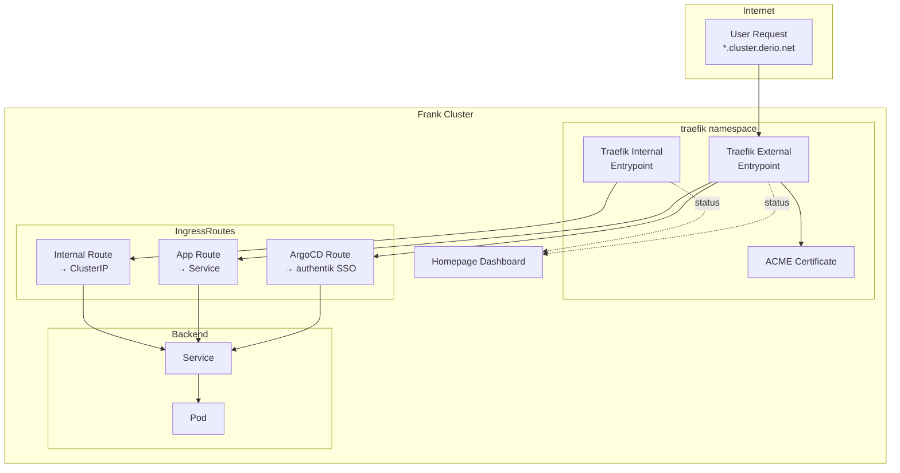



This is the operational companion to [Ingress](), which covers the Traefik architecture, the internal/external entrypoint split, and the Homepage dashboard configuration. Here you'll find the commands to run when a route is broken, a certificate is expiring, or the dashboard goes blank.

Before any commands below, source the environment:

```bash
source .env          # sets KUBECONFIG, TALOSCONFIG
source .env_devops   # sets OMNICONFIG + service accounts
```

## What Healthy Looks Like

- All three Traefik pods are `Running`.
- ACME certificates show `Ready: True` with a recent renewal date.
- The Homepage dashboard is accessible at `homepage.cluster.derio.net` and shows tiles for all services.
- IngressRoutes resolve for both internal and external entrypoints.



## Verify

### Check Traefik Pods

```bash
kubectl get pods -n traefik -l app.kubernetes.io/name=traefik

# Check the deployment details
kubectl get deployment -n traefik traefik
```

```console
$ kubectl get pods -n traefik
NAME                       READY   STATUS    RESTARTS   AGE
traefik-6f5b8c7d9-abc12    1/1     Running   0          45d
traefik-6f5b8c7d9-def34    1/1     Running   0          45d
traefik-6f5b8c7d9-ghi56    1/1     Running   0          45d
```

### Check ACME Certificate Status

```bash
# List all certificates
kubectl get certificate -A

# Check a specific certificate
kubectl describe certificate -n traefik traefik-default-cert

# Check the ACME challenge status in Traefik logs
kubectl logs -n traefik -l app.kubernetes.io/name=traefik --tail=50 | grep -i acme
```

```console
$ kubectl get certificate -A
NAMESPACE   NAME                              READY   SECRET                            AGE
traefik     traefik-default-cert              True    traefik-default-cert-tls          60d
traefik     wildcard-derio-net-cert           True    wildcard-derio-net-cert-tls       30d
argocd      argocd-server-tls                 True    argocd-server-tls                 120d
```

### Check IngressRoutes

```bash
# List all IngressRoutes
kubectl get ingressroute -A

# Check a specific route
kubectl describe ingressroute -n <namespace> <name>
```

### Check Homepage Status

```bash
# Check if the config update was picked up
kubectl rollout status -n homepage deployment/homepage

# Check if the tiles render correctly by curling the page
kubectl exec -n homepage deploy/homepage -- wget -qO- http://localhost:3000/api/services
```

## Steps

### Check HTTP Routing

```bash
# Check if the internal entrypoint is working
kubectl port-forward -n traefik svc/traefik-internal 9000:9000

# Check if the external entrypoint is working
kubectl port-forward -n traefik svc/traefik 9000:9000
```

Then visit `http://localhost:9000/dashboard/`.

### Restart Homepage Pod

When tiles are stale, SSO is misconfigured, or the config needs to be refreshed:

```bash
kubectl rollout restart -n homepage deployment/homepage
kubectl rollout status -n homepage deployment/homepage
```

## Recover

### Route Returns 404

```bash
# Check if the IngressRoute exists
kubectl get ingressroute -A | grep <service-name>

# Check if the Service exists and has endpoints
kubectl get svc -n <namespace> <service-name>
kubectl get endpoints -n <namespace> <service-name>

# Check Traefik logs for routing errors
kubectl logs -n traefik -l app.kubernetes.io/name=traefik --tail=50 | grep <service-name>
```

If the IngressRoute is missing, add it following the pattern in `apps/traefik/ingressroutes/`. If the Service has no endpoints, the backing pod is not running or the label selector is wrong.

### Certificate Not Renewing

```bash
# Check certificate expiry
kubectl get certificate -A -o wide

# Check if the ACME issuer is reachable
kubectl exec -n traefik deploy/traefik -- wget -qO- https://acme-v02.api.letsencrypt.org/directory

# Check Traefik ACME logs for the specific certificate
kubectl logs -n traefik -l app.kubernetes.io/name=traefik --tail=100 | grep -B5 -A5 "certificate.*renew"
```

Common causes: DNS resolution failure for the domain, Let's Encrypt rate limiting, or the ACME HTTP-01 challenge port (80) not being reachable from the internet. If the certificate is managed via cert-manager instead of Traefik's built-in ACME:

```bash
# Check cert-manager resources
kubectl describe certificaterequest -n <namespace> <name>
```

### Homepage Dashboard is Blank

```bash
# Check the pods
kubectl get pods -n homepage

# Check logs
kubectl logs -n homepage deploy/homepage --tail=50

# Check if the config updated
kubectl get configmap -n homepage homepage-config -o yaml
```

Homepage uses a ConfigMap for its settings. If the `configMapGenerator` in `kustomization.yaml` was changed, the pod needs to be restarted to pick it up:

```bash
kubectl rollout restart -n homepage deployment/homepage
```

### Broken Forward Authentication (SSO)

If a service's Auth middleware is misconfigured, you may get 401 or 500 on the route. Check:

```bash
# Check the middlewares on the IngressRoute
kubectl describe ingressroute -n <namespace> <name> | grep -A 10 "middlewares"

# Check the auth service is running
kubectl get pods -n authentik

# Check auth middleware definition
kubectl get middleware -n traefik
```

To bypass SSO for debugging (temporarily), remove the `middlewares:` block from the IngressRoute, test the route, then add it back.

### Homepage Tile Shows Broken Icon

If a tile renders but the icon is broken (the "GoatCounter goat" placeholder):

```bash
kubectl logs -n homepage deploy/homepage --tail=20 | grep -i icon
```

The icon URL in the tile config may need updating. Edit the `services.yaml` entry for the service in `apps/homepage/config/services.yaml`.

## Missteps

| What we assumed | Why it was wrong | What it cost |
|---|---|---|
| Homepage picks up config changes automatically | Homepage reads the ConfigMap at startup. The `configMapGenerator` produces a new ConfigMap name on change, but the deployment doesn't auto-roll. The pod must be manually restarted. | Stale tiles persisted until someone noticed and restarted. |
| Authentik forward-auth works for every route | The Hermes agent-shell dashboard route needed simple basic auth, not forward auth. The forward-auth middleware was blocking legitimate traffic. | One debugging session to revert to basic auth (#629). |
| All internal routes go through the external entrypoint | Some services shouldn't be internet-facing at all. The fix was an internal-only entrypoint (`traefik-internal`) that skips ACME and external middleware. | Re-architecture to split entrypoints, then migration of internal routes. |

## Quick Reference

| Command | What It Does |
|---------|-------------|
| `kubectl get pods -n traefik` | Check Traefik pods |
| `kubectl get certificate -A` | List all TLS certificates |
| `kubectl get ingressroute -A` | List all HTTP routes |
| `kubectl describe ingressroute -n <ns> <name>` | Show route details |
| `kubectl rollout restart -n homepage deploy/homepage` | Restart Homepage |
| `kubectl logs -n traefik deploy/traefik \| grep <svc>` | Check Traefik logs for a service |
| `kubectl get endpoints -n <ns> <svc>` | Check if service has backends |
| `kubectl get middleware -n traefik` | List Traefik middlewares |

## References

- [Building Post — Ingress]()
- [Traefik Documentation](https://doc.traefik.io/traefik/)
- [Homepage Documentation](https://gethomepage.dev/)
