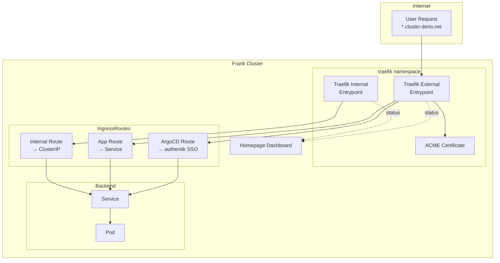



This is the operational companion to [Ingress](), which covers the Traefik architecture, the internal/external entrypoint split, and the Homepage dashboard configuration. Here you'll find the commands to run when a route is broken, a certificate is expiring, or the dashboard goes blank.

Before any commands below, source the environment:

```bash
source .env          # sets KUBECONFIG, TALOSCONFIG
source .env_devops   # sets OMNICONFIG + service accounts
```

## What Healthy Looks Like

- All three Traefik pods are `Running`.
-  certificates show `Ready: True` with a recent renewal date.
- The Homepage dashboard is accessible at `homepage.cluster.derio.net` and shows tiles for all services.
- IngressRoutes resolve for both internal and external entrypoints.
- **No IngressRoute name ends in `-frank`** — the legacy domain was retired in August 2026.
- **Every retired `*.frank.derio.net` name returns `NXDOMAIN`**, with the single exception of `omni.frank.derio.net`.
- The kube-apiserver trusts **exactly one**  issuer, `auth.cluster.derio.net`.


```mermaid
graph TB
    subgraph internet["Internet"]
        req["User Request<br/>*.cluster.derio.net"]
    end

    subgraph cluster["Frank Cluster"]
        subgraph traefikNS["traefik namespace"]
            direction TB
            ext["Traefik External<br/>Entrypoint"]
            int["Traefik Internal<br/>Entrypoint"]
            acme["ACME Certificate"]
        end

        subgraph routes["IngressRoutes"]
            direction TB
            r1["ArgoCD Route<br/>→ authentik SSO"]
            r2["App Route<br/>→ Service"]
            r3["Internal Route<br/>→ ClusterIP"]
        end

        subgraph apps["Backend"]
            svc["Service"]
            pod["Pod"]
        end

        homepage["Homepage Dashboard"]
    end

    req --> ext
    ext --> acme
    ext --> r1
    ext --> r2
    int --> r3
    r1 --> svc
    r2 --> svc
    r3 --> svc
    svc --> pod
    ext -.->|status| homepage
    int -.->|status| homepage
```

## Verify

### Check Traefik Pods

```bash
kubectl get pods -n traefik -l app.kubernetes.io/name=traefik

# Check the deployment details
kubectl get deployment -n traefik traefik
```

```console
$ kubectl get pods -n traefik
NAME                       READY   STATUS    RESTARTS   AGE
traefik-6f5b8c7d9-abc12    1/1     Running   0          45d
traefik-6f5b8c7d9-def34    1/1     Running   0          45d
traefik-6f5b8c7d9-ghi56    1/1     Running   0          45d
```

### Check ACME Certificate Status

```bash
# List all certificates
kubectl get certificate -A

# Check a specific certificate
kubectl describe certificate -n traefik traefik-default-cert

# Check the ACME challenge status in Traefik logs
kubectl logs -n traefik -l app.kubernetes.io/name=traefik --tail=50 | grep -i acme
```

```console
$ kubectl get certificate -A
NAMESPACE   NAME                              READY   SECRET                            AGE
traefik     traefik-default-cert              True    traefik-default-cert-tls          60d
traefik     wildcard-derio-net-cert           True    wildcard-derio-net-cert-tls       30d
argocd      argocd-server-tls                 True    argocd-server-tls                 120d
```

### Check IngressRoutes

```bash
# List all IngressRoutes
kubectl get ingressroute -A

# Check a specific route
kubectl describe ingressroute -n <namespace> <name>
```

### Check the Retired Domain Stays Retired

Two checks, and both are worth running the *positive* way round. `dig +short` printing nothing means the same thing whether the name is gone or the resolver is broken, so assert on the response status:

```bash
# every retired name must be NXDOMAIN — not merely "no output"
for h in auth grafana argocd longhorn hubble infisical paperclip sympozium n8n-01; do
  printf '%-28s %s\n' "$h.frank.derio.net" \
    "$(dig +noall +comment "$h.frank.derio.net" | grep -o 'status: [A-Z]*')"
done

# the two deliberate survivors
dig +short omni.frank.derio.net                     # must still resolve
grep -n 'frank\.derio\.net:' \
  clusters/hop/apps/headscale/manifests/configmap.yaml   # split-DNS suffix, must stay

# no compatibility routes crept back
kubectl -n traefik-system get ingressroute -o name | grep -- '-frank' || echo "clean"
```

### Check the Cluster Trusts Only One Issuer

The authoritative check is behavioural — mint a token through each host and submit both to `TokenReview`. The legacy one must be **rejected**:

```bash
kubectl -n kube-system get pods -l component=kube-apiserver \
  -o jsonpath='{range .items[*]}{.spec.containers[0].command}{"\n"}{end}' | grep -c -- '--oidc-'
# must print 0 — structured auth replaced the flags entirely
```

`scripts/tmp/p6-verify.sh` (gitignored, base clone) runs the whole board — routes, Authentik objects, both token paths, Omni, and DNS — and reports PASS/FAIL/PENDING per check.

> Gate on `kubectl get nodes`, never on `/readyz`. The latter includes etcd readiness and is served per-apiserver behind the Omni round-robin, so one flapping member makes it fail intermittently while the cluster is perfectly usable.

### Check Homepage Status

```bash
# Check if the config update was picked up
kubectl rollout status -n homepage deployment/homepage

# Check if the tiles render correctly by curling the page
kubectl exec -n homepage deploy/homepage -- wget -qO- http://localhost:3000/api/services
```

## Steps

### Check HTTP Routing

```bash
# Check if the internal entrypoint is working
kubectl port-forward -n traefik svc/traefik-internal 9000:9000

# Check if the external entrypoint is working
kubectl port-forward -n traefik svc/traefik 9000:9000
```

Then visit `http://localhost:9000/dashboard/`.

### Restart Homepage Pod

When tiles are stale,  is misconfigured, or the config needs to be refreshed:

```bash
kubectl rollout restart -n homepage deployment/homepage
kubectl rollout status -n homepage deployment/homepage
```

## Recover

### Route Returns 404

```bash
# Check if the IngressRoute exists
kubectl get ingressroute -A | grep <service-name>

# Check if the Service exists and has endpoints
kubectl get svc -n <namespace> <service-name>
kubectl get endpoints -n <namespace> <service-name>

# Check Traefik logs for routing errors
kubectl logs -n traefik -l app.kubernetes.io/name=traefik --tail=50 | grep <service-name>
```

If the IngressRoute is missing, add it following the pattern in `apps/traefik/ingressroutes/`. If the Service has no endpoints, the backing pod is not running or the label selector is wrong.

### Certificate Not Renewing

```bash
# Check certificate expiry
kubectl get certificate -A -o wide

# Check if the ACME issuer is reachable
kubectl exec -n traefik deploy/traefik -- wget -qO- https://acme-v02.api.letsencrypt.org/directory

# Check Traefik ACME logs for the specific certificate
kubectl logs -n traefik -l app.kubernetes.io/name=traefik --tail=100 | grep -B5 -A5 "certificate.*renew"
```

Common causes: DNS resolution failure for the domain, Let's Encrypt rate limiting, or the ACME HTTP-01 challenge port (80) not being reachable from the internet. If the certificate is managed via cert-manager instead of Traefik's built-in ACME:

```bash
# Check cert-manager resources
kubectl describe certificaterequest -n <namespace> <name>
```

### Homepage Dashboard is Blank

```bash
# Check the pods
kubectl get pods -n homepage

# Check logs
kubectl logs -n homepage deploy/homepage --tail=50

# Check if the config updated
kubectl get configmap -n homepage homepage-config -o yaml
```

Homepage uses a ConfigMap for its settings. If the `configMapGenerator` in `kustomization.yaml` was changed, the pod needs to be restarted to pick it up:

```bash
kubectl rollout restart -n homepage deployment/homepage
```

### Broken Forward Authentication (SSO)

If a service's Auth middleware is misconfigured, you may get 401 or 500 on the route. Check:

```bash
# Check the middlewares on the IngressRoute
kubectl describe ingressroute -n <namespace> <name> | grep -A 10 "middlewares"

# Check the auth service is running
kubectl get pods -n authentik

# Check auth middleware definition
kubectl get middleware -n traefik
```

To bypass SSO for debugging (temporarily), remove the `middlewares:` block from the IngressRoute, test the route, then add it back.

### A Retired `*.frank.derio.net` Name Still Answers

Deleting the manifest from Git does **not** delete the object — every Application here runs `prune: false`, so removal only stops ArgoCD managing it. The app sits `OutOfSync` and the route keeps serving:

```bash
# find the true owner — the routes live in apps/traefik/manifests but belong to
# traefik-extras, while the similarly-named `traefik` app is the Helm chart
kubectl -n traefik-system get ingressroute <name> \
  -o jsonpath='{.metadata.annotations.argocd\.argoproj\.io/tracking-id}'

kubectl -n traefik-system delete ingressroute <name>
kubectl -n traefik-system get ingressroute <name>   # assert NotFound, not "Synced"
```

Do this only after the `cluster.derio.net` equivalent is confirmed working — it is the moment the legacy edge stops serving.

### `kubectl` Rejects a Kubeconfig That Used to Work

Almost always a token minted before the issuer cutover. The apiserver now trusts only `auth.cluster.derio.net`, so anything carrying `iss: auth.frank.derio.net` is rejected outright:

```bash
# decode the issuer WITHOUT printing the token
python3 - <<'PY'
import base64, json, os
tok = os.environ["TOK"]                    # export TOK=... first
p = tok.split(".")[1]; p += "=" * (-len(p) % 4)
c = json.loads(base64.urlsafe_b64decode(p))
print("iss =", c.get("iss"), "| exp =", c.get("exp"))
PY
```

Re-mint it. There is no fallback — the overlap that would have covered this closed in August 2026.

### Homepage Tile Shows Broken Icon

If a tile renders but the icon is broken (the "GoatCounter goat" placeholder):

```bash
kubectl logs -n homepage deploy/homepage --tail=20 | grep -i icon
```

The icon URL in the tile config may need updating. Edit the `services.yaml` entry for the service in `apps/homepage/config/services.yaml`.

## Missteps

| What we assumed | Why it was wrong | What it cost |
|---|---|---|
| Homepage picks up config changes automatically | Homepage reads the ConfigMap at startup. The `configMapGenerator` produces a new ConfigMap name on change, but the deployment doesn't auto-roll. The pod must be manually restarted. | Stale tiles persisted until someone noticed and restarted. |
| Authentik forward-auth works for every route | The Hermes agent-shell dashboard route needed simple basic auth, not forward auth. The forward-auth middleware was blocking legitimate traffic. | One debugging session to revert to basic auth (#629). |
| All internal routes go through the external entrypoint | Some services shouldn't be internet-facing at all. The fix was an internal-only entrypoint (`traefik-internal`) that skips ACME and external middleware. | Re-architecture to split entrypoints, then migration of internal routes. |
| Merging the retirement PR would remove the legacy routes | `prune: false` means removal from Git stops management, not the object. All nine `*-frank` routes kept serving. The Authentik half of the same PR *did* self-remove — blueprint `state: absent` is real declarative deletion — which made the other half look done. | Nine routes served a retired domain until a live check caught them; now a manual delete step. |
| `omnictl apply` proves the patch was applied | It reads a local file. Two applies reported success while re-applying the pre-merge config from an unpulled checkout. | Two wasted apply cycles; caught only because the legacy-token check stayed red. |
| "The alert is gone" means the fix worked | For a dead-man's switch the alert also clears when the underlying failure resolves on its own. The only real test is to induce the miss it must tolerate. | Nearly closed a false-positive page without fixing its cause. |

## Quick Reference

| Command | What It Does |
|---------|-------------|
| `kubectl get pods -n traefik` | Check Traefik pods |
| `kubectl get certificate -A` | List all  certificates |
| `kubectl get ingressroute -A` | List all HTTP routes |
| `kubectl describe ingressroute -n <ns> <name>` | Show route details |
| `kubectl rollout restart -n homepage deploy/homepage` | Restart Homepage |
| `kubectl logs -n traefik deploy/traefik \| grep <svc>` | Check Traefik logs for a service |
| `kubectl get endpoints -n <ns> <svc>` | Check if service has backends |
| `kubectl get middleware -n traefik` | List Traefik middlewares |
| `kubectl -n traefik-system get ingressroute -o name \| grep -- -frank` | Check no legacy route crept back |
| `dig +noall +comment <name>.frank.derio.net \| grep status:` | Assert `NXDOMAIN` (not just empty output) |
| `bash scripts/tmp/p6-verify.sh` | Full retirement board — routes, issuer, Omni, DNS |

## References

- [Building Post — Ingress]()
- [Traefik Documentation](https://doc.traefik.io/traefik/)
- [Homepage Documentation](https://gethomepage.dev/)
