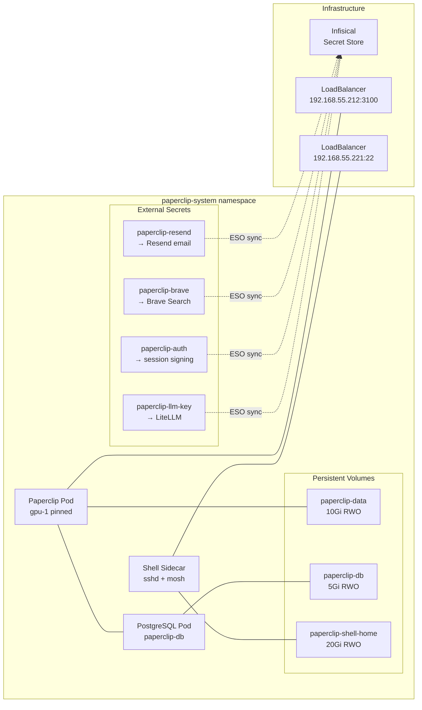



This is the operational companion to [Paperclip — AI Agent Orchestrator](). That post covers architecture and deployment. This one covers health checks, database access, the shell sidecar, and common failure modes.



## What Healthy Looks Like

- The Paperclip pod is `1/1 Running` on `gpu-1`.
- PostgreSQL pod is `1/1 Running`.
- All four ExternalSecrets show `SecretSynced`.
- The web UI responds at `http://192.168.55.212:3100`.
- The shell sidecar LB is reachable at `192.168.55.221`.

## Verify

```bash
# All-in-one
kubectl get pods,pvc,externalsecret -n paperclip-system

# Web UI
curl -s -o /dev/null -w "%{http_code}" http://192.168.55.212:3100/

# Database
kubectl exec -it -n paperclip-system \
  $(kubectl get pod -n paperclip-system -l app.kubernetes.io/instance=paperclip-db -o name) \
  -- psql -U paperclip -d paperclip -c "SELECT count(*) FROM pg_tables;"

# Shell sidecar
ssh agent@192.168.55.221 -t tmux new -A -s main
```

## Steps

### Restart Paperclip

```bash
kubectl rollout restart deployment/paperclip -n paperclip-system
kubectl get pods -n paperclip-system -w
```

Uses `Recreate` strategy (RWO PVC — rolling update would deadlock). Expect 10–30s downtime.

### Reconcile Shell Inventory

```bash
# After editing apps/paperclip/manifests/configmap-shell-inventory.yaml
kubectl -n paperclip-system exec -c paperclip-shell deploy/paperclip -- \
  paperclip-shell-reconcile
```

Use `kubectl exec`, not SSH — sshd scrubs the container env (no `FRANK_C2_TELEGRAM_*` means alerts silently fail).

### Add a Tool to the Shell Sidecar

1. Add entry to the relevant section in `configmap-shell-inventory.yaml` (`mise:`, `npm-global:`, `pipx:`, `cargo:`).
2. Commit and push (ArgoCD syncs the ConfigMap).
3. Run `paperclip-shell-reconcile` on the live pod.

### Database Backup

```bash
# Manual backup via Longhorn UI
# http://192.168.55.201 → Volumes → paperclip-db → Create Backup

# Or via pg_dump
kubectl exec -it -n paperclip-system deploy/paperclip-db-postgresql -- \
  pg_dump -U paperclip -d paperclip > paperclip-backup-$(date +%F).sql
```

## Recover

### Pod CrashLoopBackOff

```bash
kubectl logs -n paperclip-system -l app.kubernetes.io/name=paperclip --previous
kubectl describe pod -n paperclip-system -l app.kubernetes.io/name=paperclip | grep -A 10 Events
```

Common causes:
- **Database not ready** — Paperclip starts before PostgreSQL accepts connections.
- **Missing secret** — `CreateContainerConfigError` if a non-optional ExternalSecret fails to sync. Check `kubectl get externalsecret -n paperclip-system`.
- **OOM** — Paperclip's working set grew beyond 12Gi. Check `kubectl top pods -n paperclip-system`. If OOMKilled (exit 137), bump the memory limit in the deployment.

### Multi-Attach Error on PVC

```bash
# Force-delete the stuck pod to release the volume
kubectl delete pod -n paperclip-system -l app.kubernetes.io/name=paperclip \
  --grace-period=0 --force
kubectl get pods -n paperclip-system -w
```

### ExternalSecret Not Syncing

```bash
kubectl describe externalsecret paperclip-llm-key -n paperclip-system
kubectl get clustersecretstore infisical
```

Check the Infisical secret path hasn't changed and the ClusterSecretStore is healthy. Retired secrets (`paperclip-anthropic`, `paperclip-ghcr`) can be left in place — they're `optional: true`.

### Shell Sidecar Tool Install Fails

```bash
cat /var/log/cont-init.d/40-shell-inventory.log
```

Common causes:
- **Transient registry 5xx** — re-run `paperclip-shell-reconcile`.
- **mise activation gap** — `mise install` downloads the runtime but doesn't activate it. Run `mise use -g python@3.12 node@20 rust@stable` first.
- **Inventory typo** — fix the ConfigMap and re-reconcile.

### LoadBalancer IP Not Assigned

```bash
kubectl get svc paperclip-lb -n paperclip-system
kubectl get ciliumpoolipaddress -A | grep 192.168.55.212
```

## Missteps

| What we assumed | Why it was wrong | What it cost |
|---|---|---|
| Paperclip's working set fits in 1Gi | Initial deployment shipped with 1Gi. Production workflows OOM-killed it repeatedly. The real working set is closer to 12Gi under load. | Two rounds of memory tuning and a node migration to gpu-1. |
| Rolling update works with RWO PVC | RWO allows one writer. A rolling update starts the new pod before the old one terminates — the new pod can't mount the volume. | Switched to `Recreate` strategy. |
| `ssh agent@... paperclip-shell-reconcile` fires Telegram alerts on failure | sshd doesn't inherit K8s `envFrom` injections. The reconcile runs with no `FRANK_C2_TELEGRAM_*` — failures exit 0 silently. | Documentation now mandates `kubectl exec` for reconcile. |
| Adding a service to the host allowlist is a simple config change | A regression from #534 dropped UI domains from the allowlist, breaking external access. | Hot-fix in #535 to restore the missing domains. |
| `paperclip-anthropic` and `paperclip-ghcr` ExternalSecrets can be safely deleted | They were retired but their `optional: true` secretRef entries were still referenced. Deleting them caused `CreateContainerConfigError` on the next deploy. | Left in place with `optional: true`. |

## Quick Reference

| Command | What It Does |
|---------|-------------|
| `kubectl get pods,pvc,externalsecret -n paperclip-system` | Full status |
| `kubectl rollout restart deployment/paperclip -n paperclip-system` | Restart (10–30s downtime) |
| `kubectl exec -c paperclip-shell deploy/paperclip -- paperclip-shell-reconcile` | Reconcile shell tools |
| `ssh agent@192.168.55.221` | Connect to shell sidecar |
| `kubectl logs -n paperclip-system -l app.kubernetes.io/name=paperclip --previous` | Last pod's logs |
| `kubectl describe externalsecret -n paperclip-system <name>` | ExternalSecret sync status |
| `kubectl top pods -n paperclip-system` | Resource usage (OOM check) |

## References

- [Building Post — Paperclip]()
- [Paperclip GitHub](https://github.com/paperclipai/paperclip)
