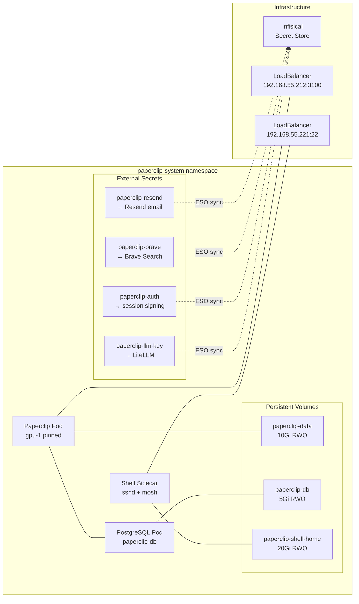



This is the operational companion to [Paperclip — AI Agent Orchestrator](). That post covers architecture and deployment. This one covers health checks, database access, the shell sidecar, and common failure modes.


```mermaid
graph LR
    subgraph ns["paperclip-system namespace"]
        pc["Paperclip Pod<br/>gpu-1 pinned"]
        pg["PostgreSQL Pod<br/>paperclip-db"]
        shell["Shell Sidecar<br/>sshd + mosh"]

        subgraph pvs["Persistent Volumes"]
            pvcData["paperclip-data<br/>10Gi RWO"]
            pvcDB["paperclip-db<br/>5Gi RWO"]
            pvcShell["paperclip-shell-home<br/>20Gi RWO"]
        end

        subgraph secrets["External Secrets"]
            llm["paperclip-llm-key<br/>→ LiteLLM"]
            auth["paperclip-auth<br/>→ session signing"]
            brave["paperclip-brave<br/>→ Brave Search"]
            resend["paperclip-resend<br/>→ Resend email"]
        end
    end

    subgraph infra["Infrastructure"]
        infisical["Infisical<br/>Secret Store"]
        lb["LoadBalancer<br/>192.168.55.212:3100"]
        shellLB["LoadBalancer<br/>192.168.55.221:22"]
    end

    pc --- pvcData
    pg --- pvcDB
    shell --- pvcShell
    llm & auth & brave & resend -.->|"ESO sync"| infisical
    pc --- lb
    shell --- shellLB
    pc --- pg
```

## What Healthy Looks Like

- The Paperclip pod is `1/1 Running` on `gpu-1`.
- PostgreSQL pod is `1/1 Running`.
- All four ExternalSecrets show `SecretSynced`.
- The web UI responds at `http://192.168.55.212:3100`.
- The shell sidecar  is reachable at `192.168.55.221`.

## Verify

```bash
# All-in-one
kubectl get pods,pvc,externalsecret -n paperclip-system

# Web UI
curl -s -o /dev/null -w "%{http_code}" http://192.168.55.212:3100/

# Database
kubectl exec -it -n paperclip-system \
  $(kubectl get pod -n paperclip-system -l app.kubernetes.io/instance=paperclip-db -o name) \
  -- psql -U paperclip -d paperclip -c "SELECT count(*) FROM pg_tables;"

# Shell sidecar
ssh agent@192.168.55.221 -t tmux new -A -s main
```

## Steps

### Restart Paperclip

```bash
kubectl rollout restart deployment/paperclip -n paperclip-system
kubectl get pods -n paperclip-system -w
```

Uses `Recreate` strategy (  — rolling update would deadlock). Expect 10–30s downtime.

### Reconcile Shell Inventory

```bash
# After editing apps/paperclip/manifests/configmap-shell-inventory.yaml
kubectl -n paperclip-system exec -c paperclip-shell deploy/paperclip -- \
  paperclip-shell-reconcile
```

Use `kubectl exec`, not SSH — sshd scrubs the container env (no `FRANK_C2_TELEGRAM_*` means alerts silently fail).

### Add a Tool to the Shell Sidecar

1. Add entry to the relevant section in `configmap-shell-inventory.yaml` (`mise:`, `npm-global:`, `pipx:`, `cargo:`).
2. Commit and push (ArgoCD syncs the ConfigMap).
3. Run `paperclip-shell-reconcile` on the live pod.

### Database Backup

```bash
# Manual backup via Longhorn UI
# http://192.168.55.201 → Volumes → paperclip-db → Create Backup

# Or via pg_dump
kubectl exec -it -n paperclip-system deploy/paperclip-db-postgresql -- \
  pg_dump -U paperclip -d paperclip > paperclip-backup-$(date +%F).sql
```

## Recover

### Pod CrashLoopBackOff

```bash
kubectl logs -n paperclip-system -l app.kubernetes.io/name=paperclip --previous
kubectl describe pod -n paperclip-system -l app.kubernetes.io/name=paperclip | grep -A 10 Events
```

Common causes:
- **Database not ready** — Paperclip starts before PostgreSQL accepts connections.
- **Missing secret** — `CreateContainerConfigError` if a non-optional ExternalSecret fails to sync. Check `kubectl get externalsecret -n paperclip-system`.
- **** — Paperclip's working set grew beyond 12Gi. Check `kubectl top pods -n paperclip-system`. If OOMKilled (exit 137), bump the memory limit in the deployment.

### Multi-Attach Error on PVC

```bash
# Force-delete the stuck pod to release the volume
kubectl delete pod -n paperclip-system -l app.kubernetes.io/name=paperclip \
  --grace-period=0 --force
kubectl get pods -n paperclip-system -w
```

### ExternalSecret Not Syncing

```bash
kubectl describe externalsecret paperclip-llm-key -n paperclip-system
kubectl get clustersecretstore infisical
```

Check the Infisical secret path hasn't changed and the ClusterSecretStore is healthy. Retired secrets (`paperclip-anthropic`, `paperclip-ghcr`) can be left in place — they're `optional: true`.

### Shell Sidecar Tool Install Fails

```bash
cat /var/log/cont-init.d/40-shell-inventory.log
```

Common causes:
- **Transient registry 5xx** — re-run `paperclip-shell-reconcile`.
- **mise activation gap** — `mise install` downloads the runtime but doesn't activate it. Run `mise use -g python@3.12 node@20 rust@stable` first.
- **Inventory typo** — fix the ConfigMap and re-reconcile.

### LoadBalancer IP Not Assigned

```bash
kubectl get svc paperclip-lb -n paperclip-system
kubectl get ciliumpoolipaddress -A | grep 192.168.55.212
```

## Missteps

| What we assumed | Why it was wrong | What it cost |
|---|---|---|
| Paperclip's working set fits in 1Gi | Initial deployment shipped with 1Gi. Production workflows OOM-killed it repeatedly. The real working set is closer to 12Gi under load. | Two rounds of memory tuning and a node migration to gpu-1. |
| Rolling update works with RWO PVC | RWO allows one writer. A rolling update starts the new pod before the old one terminates — the new pod can't mount the volume. | Switched to `Recreate` strategy. |
| `ssh agent@... paperclip-shell-reconcile` fires Telegram alerts on failure | sshd doesn't inherit K8s `envFrom` injections. The reconcile runs with no `FRANK_C2_TELEGRAM_*` — failures exit 0 silently. | Documentation now mandates `kubectl exec` for reconcile. |
| Adding a service to the host allowlist is a simple config change | A regression from #534 dropped UI domains from the allowlist, breaking external access. | Hot-fix in #535 to restore the missing domains. |
| `paperclip-anthropic` and `paperclip-ghcr` ExternalSecrets can be safely deleted | They were retired but their `optional: true` secretRef entries were still referenced. Deleting them caused `CreateContainerConfigError` on the next deploy. | Left in place with `optional: true`. |

## Quick Reference

| Command | What It Does |
|---------|-------------|
| `kubectl get pods,pvc,externalsecret -n paperclip-system` | Full status |
| `kubectl rollout restart deployment/paperclip -n paperclip-system` | Restart (10–30s downtime) |
| `kubectl exec -c paperclip-shell deploy/paperclip -- paperclip-shell-reconcile` | Reconcile shell tools |
| `ssh agent@192.168.55.221` | Connect to shell sidecar |
| `kubectl logs -n paperclip-system -l app.kubernetes.io/name=paperclip --previous` | Last pod's logs |
| `kubectl describe externalsecret -n paperclip-system <name>` | ExternalSecret sync status |
| `kubectl top pods -n paperclip-system` | Resource usage (OOM check) |

## LiteLLM-Backed Agents (opencode + hermes)

Paperclip can hire agents that run on Frank's own inference — opencode and Hermes, both routed through LiteLLM (`litellm.litellm.svc:4000` → Ollama on gpu-1). The building post covers *why* the wiring looks the way it does; this section is the day-to-day.

### Smoke-testing the CLIs against LiteLLM

Run these from the `paperclip` workload container (not the shell sidecar — the sidecar doesn't carry the adapter env). Use absolute paths so you test the binary the adapter actually invokes:

```bash
# opencode — provider-prefixed model shape is mandatory.
kubectl exec -n paperclip-system deploy/paperclip -c paperclip -- \
  /usr/local/bin/opencode run -m litellm/qwen-coder-14b '{"content":"ping"}'

# hermes — bare model alias; the ollama-cloud/ default-provider prefix in
# config.yaml is what makes the bare -m route to LiteLLM.
kubectl exec -n paperclip-system deploy/paperclip -c paperclip -- \
  /paperclip/agent-bin/hermes-agent/venv/bin/hermes \
  chat -q "say ack" -Q -m qwen-think-14b -t terminal,file,web --source tool
```

### Confirming the call actually reached LiteLLM

A clean exit isn't proof of routing — confirm in LiteLLM's access log that the request came from the paperclip pod IP:

```bash
# Find the paperclip pod IP, then grep LiteLLM for a 200 from it.
kubectl get pod -n paperclip-system -l app=paperclip -o jsonpath='{.items[0].status.podIP}'; echo
kubectl logs -n litellm deploy/litellm --tail=200 | grep 'POST /v1/chat/completions'
# Expect: "POST /v1/chat/completions HTTP/1.1" 200 OK from <paperclip pod IP>
```

### Cold-PV first boot

On a freshly-provisioned PVC, the opencode PVC install and the hermes shim may be absent until a shell-inventory reconcile runs. The MOTD prints a LiteLLM-backed-agents tip on login whenever either CLI is missing — that's the signal to reconcile:

```bash
# Are both CLIs present?
kubectl exec -n paperclip-system deploy/paperclip -c paperclip -- \
  sh -c 'ls /paperclip/agent-bin/node_modules/.bin/opencode /paperclip/agent-bin/bin/hermes'

# If either is missing, run the shell-inventory reconcile (installs land on the PVC).
kubectl exec -n paperclip-system deploy/paperclip -c paperclip-shell -- paperclip-shell-reconcile
```

The hermes `config.yaml` is re-seeded into `HERMES_HOME=/paperclip/agent-bin/.hermes/` by the `hermes-init` initContainer on **every** pod boot, so that part needs no manual step — bounce the pod and the template is back.

### Hiring a LiteLLM-backed agent

In the Paperclip UI, hire with the adapter's model field set to the **bare** alias and leave the provider/extraArgs fields alone:

| Adapter | Model field | Notes |
|---|---|---|
| `opencode_local` | `litellm/qwen-coder-14b` | provider-prefixed form required |
| `hermes_local` | `qwen-think-14b` | bare; `ollama-cloud/` prefix lives in the seeded `config.yaml`, not the hire payload |

**Do not** set `provider` or `extraArgs` from the UI for `hermes_local`. Two traps live there: the adapter's `VALID_PROVIDERS` whitelist doesn't include `ollama-cloud` (so the field is a silent no-op), and the schema-driven config form stores `extraArgs` as a single argv token with an embedded space rather than the two tokens argparse expects. Both are documented as "leave blank" rather than worked around.

### The hermes second-heartbeat trap

`hermes_local` agents fail on their **2nd heartbeat onward** by default — `Session not found`, exit 1 in ~2s — because of an upstream session-ID truncation bug ([derio-net/paperclip#1](https://github.com/derio-net/paperclip/issues/1)): the adapter truncates hermes's 22-char session ID to 16 chars, Paperclip stores the truncated value and feeds it back as `--resume`, and hermes can't find it. The first heartbeat always works; everything after strands.

Hire with `persistSession: false` so hermes starts fresh each heartbeat (no `--resume`, the bug never fires):

```jsonc
// adapterConfig on the hermes_local hire
{ "persistSession": false }
```

You lose cross-heartbeat session continuity — fine for tool-heavy issue work, bad for long multi-turn conversations. opencode is unaffected.

### Recovering an already-stranded hermes agent

If an agent already got the poisoned `{"sessionId":"from"}` state, the agent itself is fine — only the per-task session row is corrupt. Clear it in the paperclip database:

```bash
# Open psql in the paperclip-db pod (see "Database Health" above for connection).
# Then, for the affected (agent_id, task_key):
UPDATE agent_task_sessions
   SET session_params_json = NULL, session_display_id = NULL
 WHERE agent_id = '<uuid>' AND task_key = '<key>';
-- Or delete the task entirely to start clean.
```

After clearing, re-hire or re-assign with `persistSession: false` so it doesn't re-poison.

## References

- [Building Post — Paperclip]()
- [Paperclip GitHub](https://github.com/paperclipai/paperclip)
