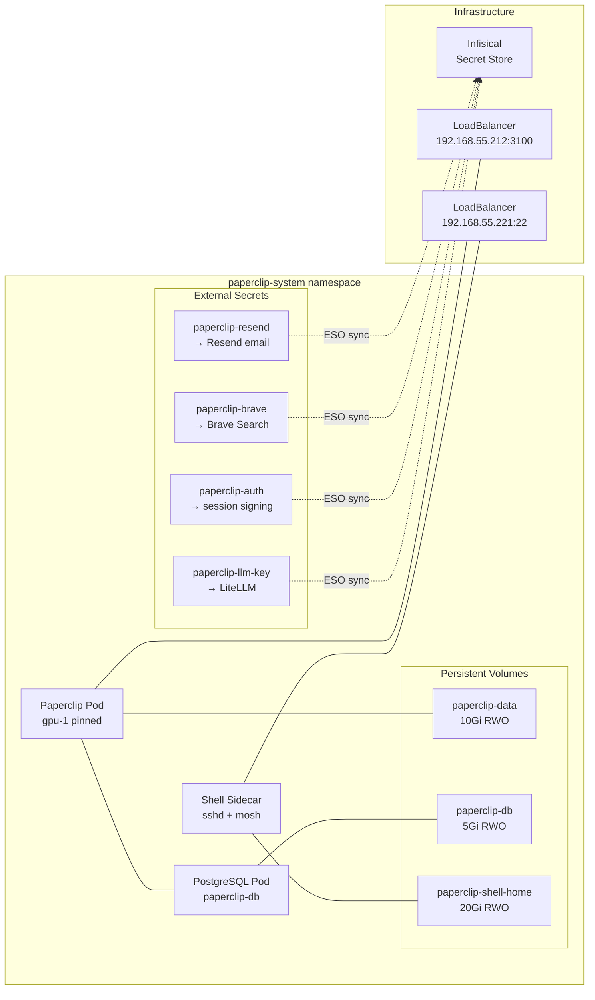



This is the operational companion to [Paperclip — AI Agent Orchestrator](). That post covers architecture, deployment, and why the LiteLLM-backed agents are wired the way they are. This one covers health checks, database access, the shell sidecar, hiring agents on local inference, and common failure modes.


```mermaid
graph LR
    subgraph ns["paperclip-system namespace"]
        pc["Paperclip Pod<br/>gpu-1 pinned"]
        pg["PostgreSQL Pod<br/>paperclip-db"]
        shell["Shell Sidecar<br/>sshd + mosh"]

        subgraph pvs["Persistent Volumes"]
            pvcData["paperclip-data<br/>10Gi RWO"]
            pvcDB["paperclip-db<br/>5Gi RWO"]
            pvcShell["paperclip-shell-home<br/>20Gi RWO"]
        end

        subgraph secrets["External Secrets"]
            llm["paperclip-llm-key<br/>→ LiteLLM"]
            auth["paperclip-auth<br/>→ session signing"]
            brave["paperclip-brave<br/>→ Brave Search"]
            resend["paperclip-resend<br/>→ Resend email"]
        end
    end

    subgraph infra["Infrastructure"]
        infisical["Infisical<br/>Secret Store"]
        lb["LoadBalancer<br/>192.168.55.212:3100"]
        shellLB["LoadBalancer<br/>192.168.55.221:22"]
    end

    pc --- pvcData
    pg --- pvcDB
    shell --- pvcShell
    llm & auth & brave & resend -.->|"ESO sync"| infisical
    pc --- lb
    shell --- shellLB
    pc --- pg
```

## What Healthy Looks Like

- The Paperclip pod is `2/2 Running` on `gpu-1` (the app container plus the `paperclip-shell` sidecar).
- PostgreSQL pod is `2/2 Running` (PostgreSQL plus the metrics exporter).
- All four ExternalSecrets show `SecretSynced`.
- The web UI responds at `http://192.168.55.212:3100`.
- The shell sidecar  is reachable at `192.168.55.221`.
- Both agent CLIs answer a one-line prompt through LiteLLM, and the requests show up in LiteLLM's access log from the Paperclip pod IP.

## Verify

```bash
# All-in-one
kubectl get pods,pvc,externalsecret -n paperclip-system

# Web UI
curl -s -o /dev/null -w "%{http_code}" http://192.168.55.212:3100/

# Database
kubectl exec -it -n paperclip-system \
  $(kubectl get pod -n paperclip-system -l app.kubernetes.io/instance=paperclip-db -o name) \
  -- psql -U paperclip -d paperclip -c "SELECT count(*) FROM pg_tables;"

# Shell sidecar
ssh agent@192.168.55.221 -t tmux new -A -s main
```

### Verify the LiteLLM-backed agent CLIs

Run these in the `paperclip` app container, not the shell sidecar — the adapters run in the app container, and only it carries `XDG_CONFIG_HOME`, `HERMES_HOME` and the `OLLAMA_*` env. Use the paths the adapters invoke:

```bash
# opencode — the provider-prefixed model shape is mandatory. Expect: ack
kubectl exec -n paperclip-system deploy/paperclip -c paperclip -- \
  /usr/local/bin/opencode run -m litellm/qwen-coder-14b 'reply with the single word ack'

# hermes — bare alias, exactly as the hermes_local adapter passes it.
# Expect a short reply followed by a session_id line.
kubectl exec -n paperclip-system deploy/paperclip -c paperclip -- \
  /paperclip/agent-bin/bin/hermes chat -q "say ack" -Q -m qwen-think-14b
```

A clean exit is not proof of routing. LiteLLM runs several replicas, so `kubectl logs deploy/litellm` reads only one of them, and the blackbox `litellm_chat` probe POSTs to the same endpoint all day. Grep every replica for the Paperclip pod's IP instead:

```bash
PC_IP=$(kubectl get pod -n paperclip-system -l app.kubernetes.io/name=paperclip \
  -o jsonpath='{.items[0].status.podIP}')
for p in $(kubectl get pods -n litellm -l app.kubernetes.io/name=litellm \
    --field-selector=status.phase=Running -o name); do
  kubectl logs -n litellm "$p" -c litellm --since=5m | grep -F "$PC_IP" | grep 'POST /v1/chat/completions'
done
# Expect: INFO: <PC_IP>:<port> - "POST /v1/chat/completions HTTP/1.1" 200 OK
```

One line per smoke call, possibly on different replicas.

## Steps

### Restart Paperclip

```bash
kubectl rollout restart deployment/paperclip -n paperclip-system
kubectl get pods -n paperclip-system -w
```

Uses `Recreate` strategy (  — rolling update would deadlock). Expect 10–30s downtime.

### Reconcile Shell Inventory

```bash
# After editing apps/paperclip/manifests/configmap-shell-inventory.yaml
kubectl -n paperclip-system exec -c paperclip-shell deploy/paperclip -- \
  paperclip-shell-reconcile
```

Use `kubectl exec`, not SSH — sshd scrubs the container env (no `FRANK_C2_TELEGRAM_*` means alerts silently fail).

### Add a Tool to the Shell Sidecar

1. Add entry to the relevant section in `configmap-shell-inventory.yaml` (`mise:`, `npm-global:`, `pipx:`, `cargo:`).
2. Commit and push (ArgoCD syncs the ConfigMap).
3. Run `paperclip-shell-reconcile` on the live pod.

### Hire a LiteLLM-Backed Agent

In the Paperclip UI, set only the model field (and, for hermes, the command path). The two adapters want different model shapes:

| Adapter | Model field | Other fields |
|---|---|---|
| `opencode_local` | `litellm/qwen-coder-14b` | none — the image binary and `XDG_CONFIG_HOME` config are picked up automatically |
| `hermes_local` | `qwen-think-14b` (bare) | `hermesCommand: /paperclip/agent-bin/bin/hermes`, `persistSession: false` |

The equivalent adapter config for a hermes hire:

```json
{
  "adapterType": "hermes_local",
  "adapterConfig": {
    "model": "qwen-think-14b",
    "hermesCommand": "/paperclip/agent-bin/bin/hermes",
    "persistSession": false
  }
}
```

Leave the hermes **provider** and **extraArgs** fields blank:

- `ollama-cloud` is not in the adapter's `VALID_PROVIDERS`, so selecting a provider there is silently ignored — or, worse, picking a real one like `openrouter` forces a cloud route with no key.
- `extraArgs` is only honoured as a JSON array of strings. A plain string is dropped without a warning.

`persistSession: false` is not optional for hermes — see [hermes agent fails from the second heartbeat](#hermes-agent-fails-from-the-second-heartbeat). Keep LiteLLM aliases for hermes away from the `claude`, `gpt-`, `o1-`/`o3-`, `hermes-`, `glm-` and `kimi` prefixes: the adapter maps those to a cloud provider and passes `--provider`, bypassing LiteLLM.

### Recover the Agent CLIs on a Cold PVC

On a freshly provisioned `paperclip-data` PVC the hermes venv is absent until the shell inventory reconciles, and the `hermes-init` initContainer only links the shim when the venv exists. opencode agents are unaffected, because the adapter uses the image-baked binary. The shell MOTD still prints a LiteLLM-backed-agents tip on login when either the hermes shim or the PVC copy of opencode is missing; a reconcile restores both.

```bash
# Is the hermes shim present, and does it resolve?
kubectl exec -n paperclip-system deploy/paperclip -c paperclip -- \
  sh -c 'ls -la /paperclip/agent-bin/bin/hermes && /paperclip/agent-bin/bin/hermes --version'

# If not, reconcile (installs land on the shared PVC), then restart so
# hermes-init re-links the shim.
kubectl exec -n paperclip-system deploy/paperclip -c paperclip-shell -- paperclip-shell-reconcile
kubectl rollout restart deployment/paperclip -n paperclip-system
```

The hermes `config.yaml` needs no manual step: `hermes-init` copies it into `HERMES_HOME=/paperclip/agent-bin/.hermes` on every pod boot, so any hand edit there is overwritten on the next restart. Change `apps/paperclip/manifests/configmap-hermes.yaml` instead.

### Database Backup

```bash
# Manual backup via Longhorn UI
# http://192.168.55.201 → Volumes → paperclip-db → Create Backup

# Or via pg_dump
kubectl exec -it -n paperclip-system deploy/paperclip-db-postgresql -- \
  pg_dump -U paperclip -d paperclip > paperclip-backup-$(date +%F).sql
```

## Recover

### Pod CrashLoopBackOff

```bash
kubectl logs -n paperclip-system -l app.kubernetes.io/name=paperclip --previous
kubectl describe pod -n paperclip-system -l app.kubernetes.io/name=paperclip | grep -A 10 Events
```

Common causes:
- **Database not ready** — Paperclip starts before PostgreSQL accepts connections.
- **Missing secret** — `CreateContainerConfigError` if a non-optional ExternalSecret fails to sync. Check `kubectl get externalsecret -n paperclip-system`.
- **** — Paperclip's working set grew beyond 12Gi. Check `kubectl top pods -n paperclip-system`. If OOMKilled (exit 137), bump the memory limit in the deployment.

### Multi-Attach Error on PVC

```bash
# Force-delete the stuck pod to release the volume
kubectl delete pod -n paperclip-system -l app.kubernetes.io/name=paperclip \
  --grace-period=0 --force
kubectl get pods -n paperclip-system -w
```

### ExternalSecret Not Syncing

```bash
kubectl describe externalsecret paperclip-llm-key -n paperclip-system
kubectl get clustersecretstore infisical
```

Check the Infisical secret path hasn't changed and the ClusterSecretStore is healthy. Retired secrets (`paperclip-anthropic`, `paperclip-ghcr`) can be left in place — they're `optional: true`.

### Shell Sidecar Tool Install Fails

```bash
cat /var/log/cont-init.d/40-shell-inventory.log
```

Common causes:
- **Transient registry 5xx** — re-run `paperclip-shell-reconcile`.
- **mise activation gap** — `mise install` downloads the runtime but doesn't activate it. Run `mise use -g python@3.12 node@20 rust@stable` first.
- **Inventory typo** — fix the ConfigMap and re-reconcile.

### hermes Agent Fails from the Second Heartbeat

**Symptom:** a `hermes_local` agent's first heartbeat succeeds; every later one fails with `Session not found`, exit 1, in about two seconds. The agent is eventually flagged `Stranded`.

**Cause:** an upstream session-ID round-trip bug ([derio-net/paperclip#1](https://github.com/derio-net/paperclip/issues/1), still open). The adapter truncates Hermes' 22-character session ID to a 16-character display ID, Paperclip stores the truncated value and replays it as `--resume`, and Hermes cannot find it. The adapter's output regex then captures the word `from` out of Hermes' error message and saves `{"sessionId":"from"}` as the task's session state.

**Prevent it:** hire with `persistSession: false` (see [Hire a LiteLLM-Backed Agent](#hire-a-litellm-backed-agent)). The adapter then never passes `--resume`. You lose session continuity across heartbeats — fine for tool-heavy issue work, poor for long multi-turn conversations. opencode agents are unaffected.

Check whether an agent is already poisoned:

```bash
kubectl exec -it -n paperclip-system \
  $(kubectl get pod -n paperclip-system -l app.kubernetes.io/instance=paperclip-db -o name) \
  -- psql -U paperclip -d paperclip -c \
  "SELECT agent_id, task_key, session_display_id, session_params_json, last_error
     FROM agent_task_sessions WHERE adapter_type = 'hermes_local'
     ORDER BY updated_at DESC LIMIT 20;"
```

### Stranded hermes Agent

The agent record is fine; only its per-task session row is corrupt. Clear the row, using the same psql connection as [Verify](#verify):

```sql
UPDATE agent_task_sessions
   SET session_params_json = NULL, session_display_id = NULL
 WHERE agent_id = '<uuid>' AND task_key = '<key>';
-- Or delete the row to start the task clean.
```

Then set `persistSession: false` on the agent before its next heartbeat, or it re-poisons on the second run.

### LoadBalancer IP Not Assigned

```bash
kubectl get svc paperclip-lb -n paperclip-system
kubectl get ciliumpoolipaddress -A | grep 192.168.55.212
```

## Missteps

| What we assumed | Why it was wrong | What it cost |
|---|---|---|
| Paperclip's working set fits in 1Gi | Initial deployment shipped with 1Gi. Production workflows OOM-killed it repeatedly. The real working set is closer to 12Gi under load. | Two rounds of memory tuning and a node migration to gpu-1. |
| Rolling update works with RWO PVC | RWO allows one writer. A rolling update starts the new pod before the old one terminates — the new pod can't mount the volume. | Switched to `Recreate` strategy. |
| `ssh agent@... paperclip-shell-reconcile` fires Telegram alerts on failure | sshd doesn't inherit K8s `envFrom` injections. The reconcile runs with no `FRANK_C2_TELEGRAM_*` — failures exit 0 silently. | Documentation now mandates `kubectl exec` for reconcile. |
| Adding a service to the host allowlist is a simple config change | A regression from #534 dropped UI domains from the allowlist, breaking external access. | Hot-fix in #535 to restore the missing domains. |
| `paperclip-anthropic` and `paperclip-ghcr` ExternalSecrets can be safely deleted | They were retired but their `optional: true` secretRef entries were still referenced. Deleting them caused `CreateContainerConfigError` on the next deploy. | Left in place with `optional: true`. |
| The hermes hire form's provider and extraArgs fields can route an agent to LiteLLM | `ollama-cloud` is not a valid adapter provider, so the field is ignored; `extraArgs` typed as a string is dropped. Routing actually comes from the seeded `config.yaml` default. | A reverted wrapper (PR #296) and a documented "leave these blank" rule. |
| `kubectl logs deploy/litellm \| grep POST` proves an agent call reached LiteLLM | `deploy/` reads one of several replicas, and the blackbox `litellm_chat` probe POSTs from its own IP around the clock. | A recipe that could show someone else's `200 OK`; replaced by the per-replica grep on the Paperclip pod IP. |

## Quick Reference

| Command | What It Does |
|---------|-------------|
| `kubectl get pods,pvc,externalsecret -n paperclip-system` | Full status |
| `kubectl rollout restart deployment/paperclip -n paperclip-system` | Restart (10–30s downtime) |
| `kubectl exec -c paperclip-shell deploy/paperclip -- paperclip-shell-reconcile` | Reconcile shell tools |
| `ssh agent@192.168.55.221` | Connect to shell sidecar |
| `kubectl logs -n paperclip-system -l app.kubernetes.io/name=paperclip --previous` | Last pod's logs |
| `kubectl describe externalsecret -n paperclip-system <name>` | ExternalSecret sync status |
| `kubectl top pods -n paperclip-system` | Resource usage (OOM check) |
| `kubectl exec -n paperclip-system deploy/paperclip -c paperclip -- /usr/local/bin/opencode run -m litellm/qwen-coder-14b 'reply with the single word ack'` | opencode smoke test via LiteLLM |
| `kubectl exec -n paperclip-system deploy/paperclip -c paperclip -- /paperclip/agent-bin/bin/hermes chat -q "say ack" -Q -m qwen-think-14b` | hermes smoke test via LiteLLM |
| `kubectl exec -n paperclip-system deploy/paperclip -c paperclip -- cat /paperclip/agent-bin/.hermes/config.yaml` | Show the seeded hermes default provider |

## References

- [Building Post — Paperclip]()
- [Paperclip GitHub](https://github.com/paperclipai/paperclip)
- [derio-net/paperclip#1](https://github.com/derio-net/paperclip/issues/1) — hermes session-ID truncation
