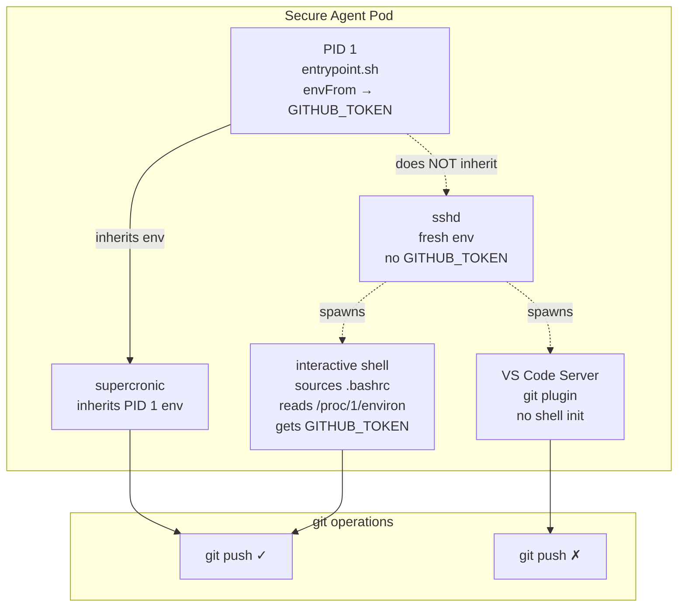



You ssh into the secure-agent-pod, run `git push`, and it works. You open VS Code's source control panel, click Sync, and get:

```
remote: Invalid username or token. Password authentication is not supported for Git operations.
fatal: Authentication failed for 'https://github.com/...'
```

Same pod, same user, same repo.



## Where the token actually lives

Kubernetes injects env vars into the container's PID 1 at startup. `GITHUB_TOKEN` is there via `envFrom`. Everything PID 1 spawns directly (sshd, supercronic) inherits it. But **SSH sessions do not inherit PID 1's env** — OpenSSH builds a fresh environment from `/etc/environment`, PAM, and login shell init files.

The usual workaround — sourcing `/proc/1/environ` in `.bashrc` — only works for interactive shells. VS Code's git plugin doesn't source `.bashrc`. Neither does cron, neither does any subprocess whose parent didn't set up the env explicitly.

## The fix

Read `/proc/1/environ` directly from the git credential helper, skipping the env var entirely:

```ini
[credential]
    helper = "!f() { echo \"username=clawdia-ai-assistant\"; echo \"password=$(tr '\\0' '\\n' < /proc/1/environ | sed -n 's/^GITHUB_TOKEN=//p')\"; }; f"
```

Every git invocation — regardless of how it was spawned — reads the kernel's view of PID 1's startup environment and returns the token. No shell init files needed.

```bash
# Verify
kubectl exec -n secure-agent-pod deploy/secure-agent-pod -c kali -- \
  git config --get credential.helper

kubectl exec -n secure-agent-pod deploy/secure-agent-pod -c kali -- \
  bash -c 'tr "\0" "\n" < /proc/1/environ | grep -c ^GITHUB_TOKEN='
```

Baked into the image at `/opt/gitconfig`, seeded to `~/.gitconfig` on first boot.

## Is this secure?

Strictly more secure than the env-var approach:

1. **`/proc/PID/environ` is kernel-enforced.** Readable only by the same uid (or root) via `ptrace_may_access`. PID 1 and the `claude` user both run as uid 1000.
2. **Nothing touches disk.** The token is only materialised for the duration of one `tr` + `sed` pipeline per git call.
3. **Smaller leakage surface.** The env-var approach puts `GITHUB_TOKEN` into every interactive shell's env, where it can leak via `env`, `ps e`, or shell history.

Token rotation works the same: ESO updates the K8s Secret, you restart the pod, PID 1 gets the new value.

## Recover

### Credential Helper Returns Empty Token

```bash
# Test the helper directly
kubectl exec -n secure-agent-pod deploy/secure-agent-pod -c kali -- \
  bash -c 'tr "\0" "\n" < /proc/1/environ | sed -n "s/^GITHUB_TOKEN=//p"'
```

If empty: PID 1 doesn't have `GITHUB_TOKEN` in its env. Check the K8s Secret exists, the ExternalSecret is synced, and the pod has been restarted since the last rotation.

### `EACCES` Reading /proc/1/environ

The entrypoint must run as the same uid as the user running git. If the entrypoint drops privileges, `chmod` the helper or run git as the pod's startup uid.

## Missteps

| What we assumed | Why it was wrong | What it cost |
|---|---|---|
| Sourcing `/proc/1/environ` in `.bashrc` is sufficient for all git workflows | VS Code's git plugin doesn't source shell init files. Credential failures appeared only in the editor, not the terminal. | Debugging session to identify the non-interactive gap, then implemented the credential helper approach. |
| The credential helper's inline `tr \| sed` pipeline is fragile | It survived rotation testing and is baked into the CI-build image. The kernel guarantees `/proc/1/environ` is always available and atomically read. | None — the pattern is now the canonical approach for all agent pods. |

## References

- [Operating on Secure Agent Pod]()
- [`proc(5)` — `/proc/pid/environ`](https://man7.org/linux/man-pages/man5/proc.5.html)
- [Git `gitcredentials(7)`](https://git-scm.com/docs/gitcredentials)
