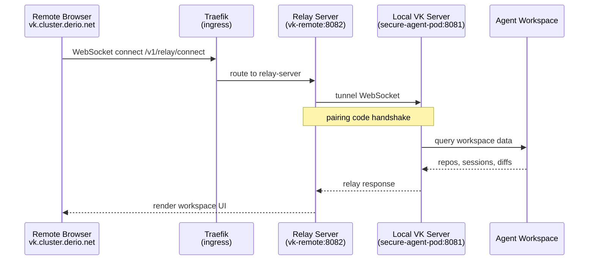



This is the operational companion to [VK Relay](). That post explains the architecture and deployment. This one is the day-to-day runbook.



## What Healthy Looks Like

- The `vk-remote` pod has two containers: `vk-remote` and `relay-server`, both `Running`.
- Relay server is listening on port 8082.
- `GET https://vk.cluster.derio.net/v1/relay/connect` returns 401 (JWT auth required — means the relay is up and routing).
- A browser is paired and shows workspace data through the remote UI.

## Verify

```bash
# Pod health
kubectl -n agents get pods -l app=vk-remote -o wide

# Relay logs
kubectl -n agents logs deploy/vk-remote -c relay-server --tail=10

# Endpoint reachable (expect 401)
curl -s -o /dev/null -w "%{http_code}" https://vk.cluster.derio.net/v1/relay/connect

# Local server relay connection
kubectl -n secure-agent-pod exec deploy/secure-agent-pod -c kali -- \
  env | grep VK_SHARED_RELAY
# Expected: VK_SHARED_RELAY_API_BASE=https://vk.cluster.derio.net
```

```console
$ kubectl -n agents get pods -l app=vk-remote
NAME                         READY   STATUS    RESTARTS   AGE
vk-remote-7949d8bb66-vpgpx   2/2     Running   0          21h

$ curl -s -o /dev/null -w "%{http_code}" https://vk.cluster.derio.net/v1/relay/connect
401
```

## Steps

### Restart the Relay

```bash
kubectl -n agents rollout restart deploy/vk-remote
kubectl -n agents rollout status deploy/vk-remote
```

### Re-Pair a Browser

```bash
# 1. Port-forward to the local VK server
kubectl -n secure-agent-pod port-forward deploy/secure-agent-pod 8081:8081

# 2. Open http://localhost:8081 → Settings → Relay Settings → "Generate pairing code"

# 3. Open https://vk.cluster.derio.net → Settings → "Pair host" → enter code

# 4. Stop the port-forward
```

## Recover

### 502 on Relay Endpoint

```bash
# Check relay container
kubectl -n agents describe pod -l app=vk-remote | grep -A5 relay-server
kubectl -n agents logs deploy/vk-remote -c relay-server --previous
```

The relay-server container is likely crashing. Check for port conflicts or startup failures.

### Workspace Data Not Loading

Symptom: the remote UI shows workspaces but they're empty.

```bash
# Check tunnel connections in relay logs
kubectl -n agents logs deploy/vk-remote -c relay-server --tail=30
```

If no tunnel connections appear:

1. The local VK server (secure-agent-pod) may not be running — check `kubectl -n secure-agent-pod get pods`.
2. `VK_SHARED_RELAY_API_BASE` may not be set — check the env var.
3. Cilium `NetworkPolicy` may block egress to `vk.cluster.derio.net`.

### Pairing Code Rejected

- Code expired (6-digit codes are short-lived — generate a fresh one).
- Browser and local server not on the same relay — verify both point to `vk.cluster.derio.net`.
- SPAKE2 key mismatch — regenerate and retry.

### Container Not at 2/2 Ready

If only one container is `Running`:

```bash
kubectl -n agents logs deploy/vk-remote -c <missing-container>
kubectl -n agents describe pod -l app=vk-remote
```

## Missteps

| What we assumed | Why it was wrong | What it cost |
|---|---|---|
| The relay and vk-remote can share a single container | Each has different lifecycle and routing needs. The relay needs its own readiness probe and port. | Split into two containers in the same pod. |
| A pairing code is valid until the browser closes it | Codes are short-lived by design (SPAKE2 handshake timeout). A stale UI showing an old code wastes a pairing attempt. | Added a "generate new code" instruction to the re-pairing flow. |
| A 502 on the relay path is always a relay-server crash | It can also be a Traefik IngressRoute misconfiguration or a Cilium egress policy blocking the WebSocket upgrade. | Added the three-layer diagnosis to the runbook. |

## Quick Reference

| Command | What It Does |
|---------|-------------|
| `kubectl -n agents get pods -l app=vk-remote` | Pod status (expect 2/2) |
| `kubectl -n agents logs deploy/vk-remote -c relay-server` | Relay server logs |
| `curl -s -o /dev/null -w "%{http_code}" https://vk.cluster.derio.net/v1/relay/connect` | Endpoint test (expect 401) |
| `kubectl -n agents rollout restart deploy/vk-remote` | Restart relay |
| `kubectl -n secure-agent-pod port-forward deploy/secure-agent-pod 8081:8081` | Local VK server (for pairing) |
| `kubectl -n secure-agent-pod exec deploy/secure-agent-pod -c kali -- env \| grep VK_SHARED_RELAY` | Check relay env var |

## References

- [Building Post — VK Relay]()
- [Operating on Secure Agent Pod]()
