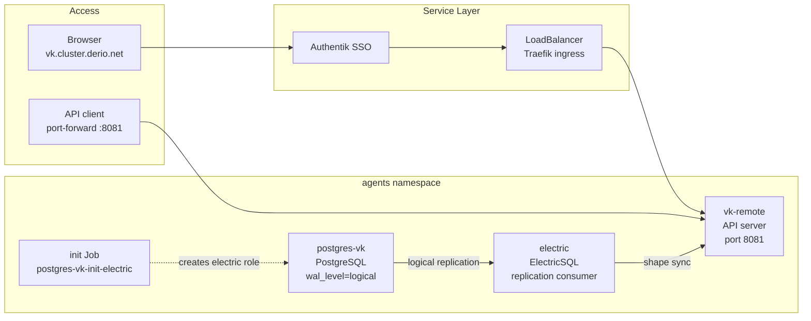



This is the operational companion to [VK Remote — Self-Hosting the Kanban Backend](). That post explains the architecture. This one is the day-to-day runbook.



## What Healthy Looks Like

- Three pods in `agents` namespace: `postgres-vk`, `electric`, `vk-remote` — all `Running`.
- The init Job `postgres-vk-init-electric` shows `Completions: 1/1`.
- PostgreSQL `wal_level` is `logical` and the replication slot `electric_slot_default` is `active`.
- vk-remote responds on port 8081 with a healthy API.
- Browser access works at `https://vk.cluster.derio.net` through Authentik SSO.

## Verify

```bash
# Pods
kubectl -n agents get pods -l 'app in (postgres-vk, electric, vk-remote)'

# Init job
kubectl -n agents get jobs

# PostgreSQL replication
kubectl -n agents exec deploy/postgres-vk -- psql -U remote -d remote -c \
  "SELECT slot_name, active FROM pg_replication_slots;"
kubectl -n agents exec deploy/postgres-vk -- psql -U remote -d remote -c \
  "SHOW wal_level;"

# ElectricSQL
kubectl -n agents logs deploy/electric --tail=10

# vk-remote API
kubectl -n agents exec deploy/vk-remote -- wget -qO- http://localhost:8081/v1/health
```

```console
$ kubectl -n agents get pods -l 'app in (postgres-vk, electric, vk-remote)'
NAME                              READY   STATUS      RESTARTS   AGE
electric-6c5f6487d7-prswg         1/1     Running     0          8d
postgres-vk-557b4b6b7-9xvwq       1/1     Running     0          8d
vk-remote-7949d8bb66-vpgpx        2/2     Running     0          21h
postgres-vk-init-electric-pgqzp   0/1     Completed   0          21h
```

## Steps

### Restart Any Component

```bash
kubectl -n agents rollout restart deploy/vk-remote
kubectl -n agents rollout status deploy/vk-remote

# Or for ElectricSQL
kubectl -n agents rollout restart deploy/electric
kubectl -n agents rollout status deploy/electric
```

PostgreSQL uses `Recreate` strategy (RWO PVC) — expect brief downtime for the entire stack.

### Login and Get a JWT Token

```bash
PASSWORD=$(kubectl -n agents get secret vk-remote-secrets \
  -o jsonpath='{.data.SELF_HOST_LOCAL_AUTH_PASSWORD}' | base64 -d)

kubectl -n agents port-forward svc/vk-remote 8081:8081 &
TOKEN=$(curl -s -X POST http://localhost:8081/v1/auth/local/login \
  -H 'Content-Type: application/json' \
  -d "{\"email\":\"admin@localhost\",\"password\":\"$PASSWORD\"}" | jq -r '.token')
```

### List Orgs and Projects

```bash
curl -s -H "Authorization: Bearer $TOKEN" http://localhost:8081/v1/organizations | jq
curl -s -H "Authorization: Bearer $TOKEN" http://localhost:8081/v1/projects | jq
```

## Recover

### ElectricSQL Not Syncing

Symptom: the kanban board doesn't update in real-time.

```bash
kubectl -n agents logs deploy/electric --tail=30
```

If connection errors:
1. Verify the `electric` PG role exists: `kubectl -n agents exec deploy/postgres-vk -- psql -U remote -d remote -c "SELECT rolname FROM pg_roles WHERE rolname = 'electric';"`
2. If missing, delete and re-trigger the init job: `kubectl -n agents delete job postgres-vk-init-electric` — ArgoCD will re-create it on next sync.
3. Restart ElectricSQL: `kubectl -n agents rollout restart deploy/electric`

### Init Job Failed

```bash
kubectl -n agents logs job/postgres-vk-init-electric
```

Common: PostgreSQL wasn't ready when the job ran — delete the job and let ArgoCD re-create it. Or password mismatch — check `kubectl -n agents get externalsecret vk-remote-secrets`.

### 502 on vk.cluster.derio.net

```bash
kubectl -n agents get pods -l app=vk-remote
kubectl -n agents logs deploy/vk-remote --tail=30
```

If CrashLoopBackOff:
1. Database connectivity — `SERVER_DATABASE_URL` uses variable substitution. If the Secret is missing, the env var resolves to an empty password.
2. Secret sync — `kubectl -n agents get externalsecret vk-remote-secrets -o jsonpath='{.status.conditions}'`

### Authentik SSO Not Working

```bash
kubectl exec -n authentik deploy/authentik-server -- python -c "
import os; os.environ.setdefault('DJANGO_SETTINGS_MODULE','authentik.root.settings')
import django; django.setup()
from authentik.outposts.models import Outpost
outpost = Outpost.objects.get(name='authentik Embedded Outpost')
print([p.name for p in outpost.providers.all()])
"
```

If `VK Remote (cluster)` is not in the list, assign it:

```bash
kubectl exec -n authentik deploy/authentik-server -- python -c "
import os; os.environ.setdefault('DJANGO_SETTINGS_MODULE','authentik.root.settings')
import django; django.setup()
from authentik.providers.proxy.models import ProxyProvider
from authentik.outposts.models import Outpost
outpost = Outpost.objects.get(name='authentik Embedded Outpost')
provider = ProxyProvider.objects.get(name='VK Remote (cluster)')
outpost.providers.add(provider)
"
```

### Cannot Login via API

Check:
1. Correct password: `kubectl -n agents get secret vk-remote-secrets -o jsonpath='{.data.SELF_HOST_LOCAL_AUTH_PASSWORD}' | base64 -d`
2. Correct email: must be `admin@localhost`
3. Database accessible — the login endpoint writes to PostgreSQL

## Missteps

| What we assumed | Why it was wrong | What it cost |
|---|---|---|
| The init job will always find PostgreSQL ready | The job runs as soon as ArgoCD syncs. If PG is still starting, the SQL migrations fail and the job exits non-zero. | Delete-and-retry loop for the init job until we made PG readiness explicit. |
| `SERVER_DATABASE_URL` with variable substitution safely handles empty secrets | If the ExternalSecret hasn't synced, the env var becomes `postgres://remote:@postgres-vk:5432/remote` — no password means authentication failure. | Added a startup probe that checks DB connectivity before serving. |
| Authentik SSO works as soon as the blueprint is applied | The blueprint creates the provider, but it must also be assigned to the embedded outpost. Without the assignment, Authentik returns 404. | Added the outpost-assignment step to the on-boarding checklist. |

## Quick Reference

| Command | What It Does |
|---------|-------------|
| `kubectl -n agents get pods -l 'app in (postgres-vk, electric, vk-remote)'` | Stack status |
| `kubectl -n agents get jobs` | Init job status |
| `kubectl -n agents exec deploy/postgres-vk -- psql -U remote -d remote -c "SHOW wal_level;"` | PG replication config |
| `kubectl -n agents logs deploy/electric --tail=30` | ElectricSQL sync status |
| `kubectl -n agents exec deploy/vk-remote -- wget -qO- localhost:8081/v1/health` | API health |
| `kubectl -n agents rollout restart deploy/vk-remote` | Restart vk-remote |
| `kubectl -n agents delete job postgres-vk-init-electric` | Re-trigger init job |

## References

- [Building Post — VK Remote Self-Host]()
- [Operating on VK Relay]()
- [Operating on Authentication]()
