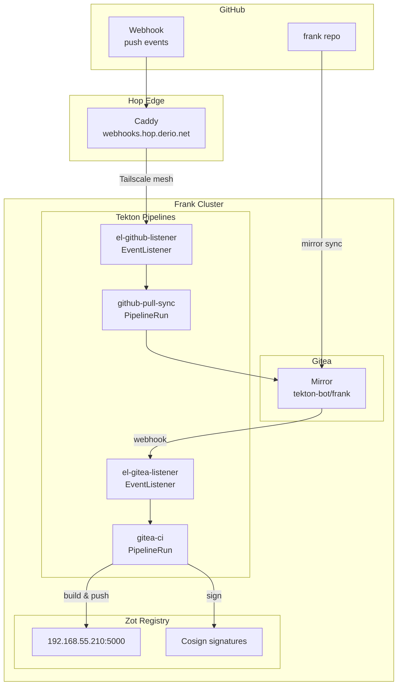



This is the operational companion to [CI/CD Platform](). That post covers the architecture. This one covers what you type to check health, trigger pipelines, and debug failures.



## What Healthy Looks Like

- All pods in `gitea`, `tekton-pipelines`, and `zot` namespaces are `Running`.
- ArgoCD apps show `Synced` and `Healthy`.
- All ExternalSecrets show `SecretSynced`.
- Gitea mirror `updated_at` is within the last 10 minutes.
- PipelineRuns complete successfully (no `Failed` state).
- Zot responds on `https://192.168.55.210:5000/v2/`.

## Verify

```bash
# Pods across all CI/CD namespaces
kubectl get pods -n gitea -o wide
kubectl get pods -n tekton-pipelines -o wide
kubectl get pods -n zot -o wide

# ArgoCD
kubectl get applications -n argocd gitea gitea-extras \
  tekton-pipelines tekton-triggers zot

# ExternalSecrets
kubectl get externalsecret -n gitea
kubectl get externalsecret -n tekton-pipelines
kubectl get externalsecret -n zot

# Gitea mirror
GITEA_URL="http://192.168.55.209:3000"
curl -s "$GITEA_URL/api/v1/repos/tekton-bot/frank" | jq '{mirror, updated_at}'

# Zot
curl -sk https://192.168.55.210:5000/v2/

# Recent PipelineRuns
kubectl get pipelinerun -n tekton-pipelines --sort-by=.metadata.creationTimestamp | tail -5
```

## Steps

### Trigger a Mirror Sync

```bash
ADMIN_TOKEN=$(kubectl get secret -n gitea gitea-secrets \
  -o jsonpath='{.data.admin-password}' | base64 -d)
curl -sf -X POST "$GITEA_URL/api/v1/repos/tekton-bot/frank/mirror-sync" \
  -H "Authorization: token $ADMIN_TOKEN"
```

### View Pipeline Logs

```bash
# With tkn
tkn pipelinerun logs -n tekton-pipelines --last

# Without tkn — find the pod and read per-step
kubectl get pods -n tekton-pipelines -l tekton.dev/pipelineRun --sort-by=.metadata.creationTimestamp | tail -5
kubectl logs -n tekton-pipelines <pod-name> -c step-test
kubectl logs -n tekton-pipelines <pod-name> -c step-build-and-push
```

### Cancel a PipelineRun

```bash
kubectl patch pipelinerun -n tekton-pipelines <name> \
  --type=merge -p '{"spec":{"status":"CancelledRunFinally"}}'
```

### Verify an Image Signature

```bash
cosign verify --key apps/tekton/cosign.pub \
  --insecure-ignore-tlog --allow-insecure-registry \
  192.168.55.210:5000/<repo>/<image>:<tag>
```

### Clean Up Old PipelineRuns

```bash
# Manual single-pipeline sweep
kubectl get pipelinerun -n tekton-pipelines \
  -o jsonpath='{range .items[?(@.status.conditions[0].status=="False")]}{.metadata.name}{"\n"}{end}' \
  | xargs -r kubectl delete pipelinerun -n tekton-pipelines

# Or trigger the CronJob
kubectl create job -n tekton-pipelines --from=cronjob/pipelinerun-ttl-gc \
  pipelinerun-ttl-gc-manual-$(date +%s)
```

### Manually Re-Trigger GitHub-primary Pull Sync

```bash
kubectl create -n tekton-pipelines -f - <<'EOF'
apiVersion: tekton.dev/v1
kind: PipelineRun
metadata:
  generateName: github-pull-sync-manual-
spec:
  pipelineRef:
    name: github-pull-sync
  params:
    - name: github-repo
      value: agentic-stoa/hum
    - name: gitea-repo
      value: agentic-stoa/hum
    - name: ref-from
      value: refs/heads/main
    - name: ref-to
      value: refs/heads/main
    - name: sha
      value: <commit-sha>
  workspaces:
    - name: shared-workspace
      volumeClaimTemplate:
        spec:
          accessModes: [ReadWriteOnce]
          storageClassName: longhorn-cicd
          resources: { requests: { storage: 1Gi } }
    - name: ssh-creds
      secret:
        secretName: stoa-bot-ssh-key
        defaultMode: 0400
EOF
```

## Recover

### Gitea Mirror Not Updating

```bash
kubectl logs -n gitea deploy/gitea --tail=50 | grep -i mirror
```

Check the `GITHUB_MIRROR_TOKEN` PAT hasn't expired. Verify `ALLOWED_HOST_LIST` in Gitea config includes GitHub.

### Webhook Not Triggering a PipelineRun

```bash
# Gitea webhook path
kubectl logs -n tekton-pipelines -l app.kubernetes.io/managed-by=EventListener --tail=30

# Look for interceptor rejections
kubectl logs -n tekton-pipelines -l eventlistener=github-listener --tail=200 \
  | grep -E "Triggered|interceptor|HMAC"
```

Known causes:
- **Gitea sends `X-Gitea-Event`, not `X-GitHub-Event`** — the interceptor needs a CEL filter, not the `github` interceptor.
- **Caddy strips the event header** — Hop's Caddy may drop `X-GitHub-Event` on the webhooks relay. The EventListener sees a request with no event type.
- **HMAC mismatch** — the webhook secret in GitHub doesn't match `STOA_GITHUB_WEBHOOK_SECRET` in Frank.

### PipelineRun Stuck in Pending

```bash
kubectl describe pipelinerun -n tekton-pipelines <name>
```

Check PVC provisioning (Longhorn health, pc-1 node status). The `longhorn-cicd` storage class must be available.

### PodSecurity Violation on Task Step

```bash
kubectl logs -n tekton-pipelines <pod> -c step-* | grep -i "permission denied\|psp\|podsecurity"
```

Fix: add `securityContext` to the Task step — `runAsNonRoot: true`, `capabilities.drop: ["ALL"]`, `seccompProfile.type: RuntimeDefault`.

### Pipeline Step Fails with `permission denied` on git

```bash
kubectl logs -n tekton-pipelines <pod> -c step-clone
```

`HOME=/` is read-only for UID 65534. Set `HOME=/tekton/home` env var on the step.

### Zot Returns 401 on Push

```bash
# Recreate the push credentials
ZOT_PASS=$(kubectl get secret -n tekton-pipelines zot-push-creds \
  -o jsonpath='{.data.\.dockerconfigjson}' | base64 -d | jq -r '.auths["192.168.55.210:5000"].password')
crane auth login 192.168.55.210:5000 -u tekton-push -p "$ZOT_PASS" --insecure
```

If the password changed in Infisical, the ExternalSecret needs to re-sync. Check `kubectl get externalsecret -n zot`.

## Gitea Actions Runner (2026-07 extension)

The agentic-stoa mirrors now run their GitHub Actions workflows on Frank via Gitea Actions (`apps/gitea-runner/` — act_runner + DinD on pc-1).

```bash
# Is the runner alive and registered?
kubectl -n gitea-runner get pods
kubectl -n gitea-runner logs deploy/act-runner -c runner --tail=20
# Gitea admin view: http://192.168.55.209:3000/-/admin/actions/runners (expect state Idle)

# Watch a run's job containers appear inside DinD
kubectl -n gitea-runner exec deploy/act-runner -c dind -- docker ps

# Status bridge: did the result reach GitHub?
kubectl -n tekton-pipelines get pipelinerun | grep stoa-status-bridge
```

Operational notes:

- **Capacity** lives in `apps/gitea-runner/manifests/config.yaml` (`runner.capacity: 2`). Drop to 1 if pc-1 strains before considering a node move.
- **DinD's image cache is an emptyDir** — wiped on pod restart, by design. The PVC keeps only the runner identity (`/data/.runner`) and the actions tool cache.
- **Registration is one-shot.** The runner registers once and persists identity on the PVC; rotating `STOA_GITEA_RUNNER_TOKEN` does NOT re-register. To force a fresh registration: scale to 0, delete `/data/.runner` (or the PVC), scale up.
- **Mutation authority**: the `CI_AUTHORITY` org variable in Gitea (org agentic-stoa → Settings → Actions → Variables) decides which side's mutating jobs run. `github` = parallel-safe default; flip to `gitea` at cutover.

## Missteps

| What we assumed | Why it was wrong | What it cost |
|---|---|---|
| Gitea webhooks use the same format as GitHub webhooks | Gitea sends `X-Gitea-Event`, not `X-GitHub-Event`. The `github` interceptor silently rejects non-GitHub events. | Switched to CEL interceptor that matches both formats. |
| `HOME=/` works for non-root Tekton task steps | The `git-clone` task writes to HOME, which is `/` — a read-only filesystem for UID 65534. | Set `HOME=/tekton/home` on every step that needs git. |
| `resources` in Tekton Task YAML is equivalent to `computeResources` | The field was renamed. Using the old name causes `ComparisonError` in ArgoCD because the API normalises it. | Replaced all `resources` blocks with `computeResources`. |
| Caddy on Hop passes all HTTP headers through to the upstream | Caddy's reverse proxy strips `X-GitHub-Event` unless explicitly configured. GitHub webhooks arrived at the EventListener without event headers. | Added `header_up X-GitHub-Event` to the Caddy relay route. |
| A cosign key rotation is seamless | Old signatures stay valid with the old public key, but every consumer must know about both keys. If only the new `cosign.pub` is committed, old images fail verification. | Documented the dual-key window in the rotation procedure. |
| The PipelineRun TTL GC is a nice-to-have cleanup | Before the GC was implemented, accumulated task pods from finished runs pushed the `kube_pod_status_ready` alert into false-positive territory. | Added the CronJob and rewrote the alert query to use deployment-scoped metrics. |

## Quick Reference

| Command | What It Does |
|---------|-------------|
| `kubectl get pods -n gitea -o wide` | Gitea status |
| `kubectl get pipelinerun -n tekton-pipelines` | Recent pipeline runs |
| `tkn pipelinerun logs -n tekton-pipelines --last` | Latest pipeline logs |
| `curl -sk https://192.168.55.210:5000/v2/` | Zot health |
| `cosign verify --key apps/tekton/cosign.pub ...` | Verify image signature |
| `kubectl logs -n tekton-pipelines -l eventlistener=...` | EventListener logs |
| `kubectl create job --from=cronjob/pipelinerun-ttl-gc ...` | Force PipelineRun GC |

## References

- [Building Post — CI/CD Platform]()
- [Tekton CLI](https://tekton.dev/docs/cli/)
- [cosign Verification](https://docs.sigstore.dev/cosign/verifying/)
