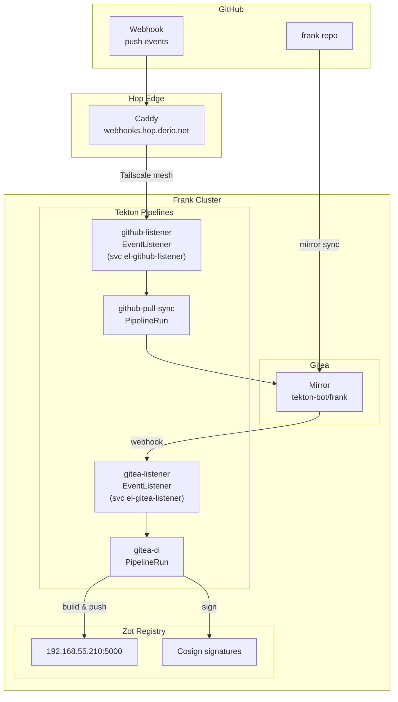



This is the operational companion to [CI/CD Platform](). That post covers the architecture. This one covers what you type to check health, trigger pipelines, and debug failures.

Two names appear throughout and are worth having up front. **`tekton-bot`** is a Gitea service account, created by hand at bootstrap, which owns the pull-mirror of the frank repo and whose API token drives every automated call below; its token lives in Infisical as `GITEA_API_TOKEN` and reaches the cluster as the `gitea-api-token` Secret in `tekton-pipelines`. **`el-<name>`** is Tekton's own prefix: an EventListener named `github-listener` generates a Deployment, Service and pod called `el-github-listener`, so the resource you patch and the endpoint you POST to have different names. Commands that select by label want `eventlistener=github-listener`; commands that hit a URL want `el-github-listener`.


```mermaid
graph TB
    subgraph github["GitHub"]
        gh_repo["frank repo"]
        gh_webhook["Webhook<br/>push events"]
    end

    subgraph hop["Hop Edge"]
        caddy["Caddy<br/>webhooks.hop.derio.net"]
    end

    subgraph frank["Frank Cluster"]
        subgraph gitea["Gitea"]
            gitea_svc["Mirror<br/>tekton-bot/frank"]
        end

        subgraph tekton["Tekton Pipelines"]
            el_listener["gitea-listener<br/>EventListener<br/>(svc el-gitea-listener)"]
            el_gh["github-listener<br/>EventListener<br/>(svc el-github-listener)"]
            pipeline["gitea-ci<br/>PipelineRun"]
            pull_sync["github-pull-sync<br/>PipelineRun"]
        end

        subgraph zot["Zot Registry"]
            zot_svc["192.168.55.210:5000"]
            cosign_sig["Cosign signatures"]
        end
    end

    gh_repo -->|"mirror sync"| gitea_svc
    gitea_svc -->|"webhook"| el_listener --> pipeline
    pipeline -->|"build & push"| zot_svc
    pipeline -->|"sign"| cosign_sig

    gh_webhook --> caddy -->|"Tailscale mesh"| el_gh --> pull_sync --> gitea_svc
```

## What Healthy Looks Like

- All pods in `gitea`, `tekton-pipelines`, and `zot` namespaces are `Running`.
- ArgoCD apps show `Synced` and `Healthy`.
- All ExternalSecrets show `SecretSynced`.
- Gitea mirror `updated_at` is within the last 10 minutes.
- PipelineRuns complete successfully (no `Failed` state).
- Zot responds on `https://192.168.55.210:5000/v2/`.

## Verify

```bash
# Pods across all CI/CD namespaces
kubectl get pods -n gitea -o wide
kubectl get pods -n tekton-pipelines -o wide
kubectl get pods -n zot -o wide

# ArgoCD
kubectl get applications -n argocd gitea gitea-extras \
  tekton-pipelines tekton-triggers zot

# ExternalSecrets
kubectl get externalsecret -n gitea
kubectl get externalsecret -n tekton-pipelines
kubectl get externalsecret -n zot

# Gitea mirror — the mirror repo is PRIVATE, so this needs the token
GITEA_URL="http://192.168.55.209:3000"
GITEA_TOKEN=$(kubectl -n tekton-pipelines get secret gitea-api-token \
  -o jsonpath='{.data.token}' | base64 -d)
curl -s -H "Authorization: token $GITEA_TOKEN" \
  "$GITEA_URL/api/v1/repos/tekton-bot/frank" | jq '{mirror, updated_at}'

# Zot — print the status code; the body is legitimately empty on success
curl -sk -o /dev/null -w '%{http_code}\n' https://192.168.55.210:5000/v2/

# Recent PipelineRuns
kubectl get pipelinerun -n tekton-pipelines --sort-by=.metadata.creationTimestamp | tail -5
```

**Do not drop the `Authorization` header from the mirror check.** Gitea answers an unauthenticated request for a private repo with `404`, which `jq` turns into a tidy object full of nulls rather than an error. Both invocations, same repo, same second (2026-07-29):

```console
$ curl -s "$GITEA_URL/api/v1/repos/tekton-bot/frank" | jq '{mirror, updated_at}'
{
  "mirror": null,
  "updated_at": null
}

$ curl -s -H "Authorization: token $GITEA_TOKEN" \
    "$GITEA_URL/api/v1/repos/tekton-bot/frank" | jq '{mirror, updated_at}'
{
  "mirror": true,
  "updated_at": "2026-07-28T22:10:37Z"
}
```

A missing token and a deleted mirror produce the same nulls. If you see nulls, check `whoami` before you check the mirror: `curl -s -H "Authorization: token $GITEA_TOKEN" "$GITEA_URL/api/v1/user" | jq .login` should print `tekton-bot`.

## Steps

### Trigger a Mirror Sync

`Authorization: token` wants an **API token**, not the admin password. Feeding it the password returns `401`, and with `curl -sf` that is a silent non-zero exit with no output at all, which reads exactly like success in a script. Use `tekton-bot`'s token and print the code:

```bash
GITEA_TOKEN=$(kubectl -n tekton-pipelines get secret gitea-api-token \
  -o jsonpath='{.data.token}' | base64 -d)
curl -s -o /dev/null -w '%{http_code}\n' -X POST \
  "$GITEA_URL/api/v1/repos/tekton-bot/frank/mirror-sync" \
  -H "Authorization: token $GITEA_TOKEN"
```

```console
200
```

`200` means Gitea accepted the request, not that the pull succeeded. Confirm the sync landed by re-reading `updated_at` from the Verify block above.

### View Pipeline Logs

```bash
# With tkn
tkn pipelinerun logs -n tekton-pipelines --last

# Without tkn — find the pod, then list its step containers before naming one
kubectl get pods -n tekton-pipelines -l tekton.dev/pipelineRun \
  --sort-by=.metadata.creationTimestamp | tail -5
kubectl get pod -n tekton-pipelines <pod-name> \
  -o jsonpath='{range .spec.containers[*]}{.name}{"\n"}{end}'
kubectl logs -n tekton-pipelines <pod-name> --all-containers --prefix
```

Step container names are derived from the Task's step names, so they are per-Task and there is no guessing them. `--all-containers --prefix` reads the lot and labels each line with its source, which is almost always what you want at 2am:

```console
$ kubectl logs -n tekton-pipelines kid-laptops-main-sync-4ps98-pull-and-push-pod \
    --all-containers --prefix
[pod/kid-laptops-main-sync-4ps98-pull-and-push-pod/prepare] 2026/07/27 17:12:41 Entrypoint initialization
[pod/kid-laptops-main-sync-4ps98-pull-and-push-pod/place-scripts] 2026/07/27 17:12:43 Decoded script /tekton/scripts/script-0-wnbvz
[pod/kid-laptops-main-sync-4ps98-pull-and-push-pod/step-pull-from-github-push-to-gitea] Cloning into 'repo'...
[pod/kid-laptops-main-sync-4ps98-pull-and-push-pod/step-pull-from-github-push-to-gitea] Pushing 6b9482f2695402b7e08c925c3dc6f452a8bc6d71 → gitea:refs/heads/main
[pod/kid-laptops-main-sync-4ps98-pull-and-push-pod/step-pull-from-github-push-to-gitea] remote: Processed 1 references in total
[pod/kid-laptops-main-sync-4ps98-pull-and-push-pod/step-pull-from-github-push-to-gitea] To ssh://192.168.55.209:2222/derio-homelab/kid-laptops.git
[pod/kid-laptops-main-sync-4ps98-pull-and-push-pod/step-pull-from-github-push-to-gitea]    5b89532..6b9482f  6b9482f2695402b7e08c925c3dc6f452a8bc6d71 -> main
[pod/kid-laptops-main-sync-4ps98-pull-and-push-pod/step-pull-from-github-push-to-gitea] OK
```

### Cancel a PipelineRun

```bash
kubectl patch pipelinerun -n tekton-pipelines <name> \
  --type=merge -p '{"spec":{"status":"CancelledRunFinally"}}'
```

### Verify an Image Signature

```bash
cosign verify --key apps/tekton/cosign.pub \
  --insecure-ignore-tlog --allow-insecure-registry \
  192.168.55.210:5000/<repo>/<image>:<tag>
```

### Clean Up Old PipelineRuns

```bash
# Manual single-pipeline sweep
kubectl get pipelinerun -n tekton-pipelines \
  -o jsonpath='{range .items[?(@.status.conditions[0].status=="False")]}{.metadata.name}{"\n"}{end}' \
  | xargs -r kubectl delete pipelinerun -n tekton-pipelines

# Or trigger the CronJob
kubectl create job -n tekton-pipelines --from=cronjob/pipelinerun-ttl-gc \
  pipelinerun-ttl-gc-manual-$(date +%s)
```

### Manually Re-Trigger GitHub-primary Pull Sync

Every `value:` below is an example. Substitute your own repo pair and commit before applying — `agentic-stoa/hum` is one of several repos this pipeline serves and is almost certainly not the one you are fixing.

```bash
kubectl create -n tekton-pipelines -f - <<'EOF'
apiVersion: tekton.dev/v1
kind: PipelineRun
metadata:
  generateName: github-pull-sync-manual-
spec:
  pipelineRef:
    name: github-pull-sync
  params:
    - name: github-repo
      value: <org>/<repo>          # e.g. agentic-stoa/hum
    - name: gitea-repo
      value: <org>/<repo>          # e.g. agentic-stoa/hum
    - name: ref-from
      value: refs/heads/main
    - name: ref-to
      value: refs/heads/main
    - name: sha
      value: <commit-sha>
  workspaces:
    - name: shared-workspace
      volumeClaimTemplate:
        spec:
          accessModes: [ReadWriteOnce]
          storageClassName: longhorn-cicd
          resources: { requests: { storage: 1Gi } }
    - name: ssh-creds
      secret:
        secretName: stoa-bot-ssh-key
        defaultMode: 0400
EOF
```

## Recover

### Gitea Mirror Not Updating

```bash
kubectl logs -n gitea deploy/gitea --tail=50 | grep -i mirror
```

Two things to check, both of which live somewhere non-obvious.

**The mirror .** `GITHUB_MIRROR_TOKEN` is an Infisical key. It reaches the cluster through the `gitea-secrets` ExternalSecret in namespace `gitea` (`apps/gitea/manifests/externalsecret-gitea.yaml`) and lands as key `github-mirror-token` on the `gitea-secrets` Secret. The ExternalSecret only tells you the key was *fetched*:

```console
$ kubectl -n gitea get externalsecret
NAME            STORETYPE            STORE       REFRESH INTERVAL   STATUS         READY
gitea-secrets   ClusterSecretStore   infisical   5m                 SecretSynced   True
```

`SecretSynced` and an expired PAT look identical from here, because Infisical will happily serve a dead token. The only thing that distinguishes them is GitHub's answer, so if the ExternalSecret is green and the mirror still will not pull, the PAT is the suspect, not the plumbing.

**`ALLOWED_HOST_LIST`.** Declared at `apps/gitea/values.yaml`, but the Gitea chart renders its config into a **Secret**, not a ConfigMap, so that is where the live copy is:

```console
$ kubectl -n gitea get secret gitea-inline-config -o jsonpath='{.data.webhook}' | base64 -d
ALLOWED_HOST_LIST=*.svc.cluster.local
```

Two traps stacked here. First, the value is scoped to in-cluster webhook delivery; mirror *pulls* are outbound and unaffected by it, so this is the setting to check when a webhook will not reach an EventListener, not when a mirror will not sync. Second, a values-only change to this file syncs the Secret without rolling the pod, so git and the live Secret can agree while the running Gitea serves the config it booted with. After any config change here, `kubectl -n gitea rollout restart deploy/gitea` and re-read the value from inside the pod.

### Webhook Not Triggering a PipelineRun

```bash
# Gitea webhook path
kubectl logs -n tekton-pipelines -l app.kubernetes.io/managed-by=EventListener --tail=30

# Look for interceptor rejections
kubectl logs -n tekton-pipelines -l eventlistener=github-listener --tail=200 \
  | grep -E "Triggered|interceptor|HMAC"
```

Known causes:
- **Gitea sends `X-Gitea-Event`, not `X-GitHub-Event`** — the interceptor needs a  filter, not the `github` interceptor.
- **Caddy strips the event header** — Hop's Caddy may drop `X-GitHub-Event` on the webhooks relay. The EventListener sees a request with no event type.
- ** mismatch** — the webhook secret in GitHub doesn't match `STOA_GITHUB_WEBHOOK_SECRET` in Frank.

### PipelineRun Stuck in Pending

```bash
kubectl describe pipelinerun -n tekton-pipelines <name>
```

Check  provisioning (Longhorn health, pc-1 node status). The `longhorn-cicd` storage class must be available.

### PodSecurity Violation on Task Step

`kubectl logs -c` takes one container name and does **not** glob. `-c step-*` fails outright, and it fails in the least helpful way, by refusing to read anything:

```console
$ kubectl logs -n tekton-pipelines kid-laptops-main-sync-4ps98-pull-and-push-pod -c 'step-*'
error: container step-* is not valid for pod kid-laptops-main-sync-4ps98-pull-and-push-pod out of: step-pull-from-github-push-to-gitea, prepare (init), place-scripts (init)
```

Use `--all-containers`, which is what you wanted anyway since a violation can surface in an init container:

```bash
kubectl logs -n tekton-pipelines <pod> --all-containers --prefix \
  | grep -i "permission denied\|psp\|podsecurity"
```

An empty result means the grep found nothing, not that the pod is clean. Re-run without the `grep` before concluding anything.

Fix: add `securityContext` to the Task step — `runAsNonRoot: true`, `capabilities.drop: ["ALL"]`, `seccompProfile.type: RuntimeDefault`.

### Pipeline Step Fails with `permission denied` on git

```bash
kubectl logs -n tekton-pipelines <pod> --all-containers --prefix
```

`HOME=/` is read-only for  65534. Set `HOME=/tekton/home` env var on the step.

### Zot Returns 401 on Push

```bash
# Recreate the push credentials
ZOT_PASS=$(kubectl get secret -n tekton-pipelines zot-push-creds \
  -o jsonpath='{.data.\.dockerconfigjson}' | base64 -d | jq -r '.auths["192.168.55.210:5000"].password')
crane auth login 192.168.55.210:5000 -u tekton-push -p "$ZOT_PASS" --insecure
```

If the password changed in Infisical, the ExternalSecret needs to re-sync. Check `kubectl get externalsecret -n zot`.

## Operate the Gitea Actions Runner

The agentic-stoa mirrors run their GitHub Actions workflows on Frank via Gitea Actions (`apps/gitea-runner/` — act_runner + DinD on pc-1).

```bash
# Is the runner alive and registered?
kubectl -n gitea-runner get pods
kubectl -n gitea-runner logs deploy/act-runner -c runner --tail=20
# Gitea admin view: http://192.168.55.209:3000/-/admin/actions/runners (expect state Idle)

# Watch a run's job containers appear inside DinD
kubectl -n gitea-runner exec deploy/act-runner -c dind -- docker ps

# Status bridge: did the result reach GitHub?
kubectl -n tekton-pipelines get pipelinerun | grep stoa-status-bridge
```

Operational notes:

- **Capacity** lives in `apps/gitea-runner/manifests/config.yaml` (`runner.capacity: 2`). Drop to 1 if pc-1 strains before considering a node move.
- **DinD's image cache is an emptyDir** — wiped on pod restart, by design. The PVC keeps only the runner identity (`/data/.runner`) and the actions tool cache.
- **Registration is one-shot.** The runner registers once and persists identity on the PVC; rotating `STOA_GITEA_RUNNER_TOKEN` does NOT re-register. To force a fresh registration: scale to 0, delete `/data/.runner` (or the PVC), scale up.
- **Mutation authority**: `CI_AUTHORITY` decides which forge's mutating jobs actually run. It is **two variables, not one** — each forge resolves it in its own Actions-variable namespace, so flipping only Gitea leaves GitHub's unset, GitHub defaults to `github`, and both sides run. Gitea's half is an org variable (agentic-stoa → Settings → Actions → Variables) and is readable over the API:

  ```bash
  GITEA_ADMIN=$(kubectl -n gitea get secret gitea-secrets -o jsonpath='{.data.username}' | base64 -d):$(kubectl -n gitea get secret gitea-secrets -o jsonpath='{.data.password}' | base64 -d)
  curl -s -u "$GITEA_ADMIN" \
    "$GITEA_URL/api/v1/orgs/agentic-stoa/actions/variables/ci_authority" | jq -r .data
  ```

  ```console
  gitea
  ```

  This is the one call in this post that needs admin credentials rather than `tekton-bot`'s token, and the error says why: `required=[read:organization], token scope=write:issue,write:repository,read:user`, HTTP 403. Both halves were flipped to `gitea` on 2026-07-22; reversing needs both.

## Missteps

| What we assumed | Why it was wrong | What it cost |
|---|---|---|
| Gitea webhooks use the same format as GitHub webhooks | Gitea sends `X-Gitea-Event`, not `X-GitHub-Event`. The `github` interceptor silently rejects non-GitHub events. | Switched to CEL interceptor that matches both formats. |
| `HOME=/` works for non-root Tekton task steps | The `git-clone` task writes to HOME, which is `/` — a read-only filesystem for UID 65534. | Set `HOME=/tekton/home` on every step that needs git. |
| `resources` in Tekton Task YAML is equivalent to `computeResources` | The field was renamed. Using the old name causes `ComparisonError` in ArgoCD because the API normalises it. | Replaced all `resources` blocks with `computeResources`. |
| Caddy on Hop passes all HTTP headers through to the upstream | Caddy's reverse proxy strips `X-GitHub-Event` unless explicitly configured. GitHub webhooks arrived at the EventListener without event headers. | Added `header_up X-GitHub-Event` to the Caddy relay route. |
| Rotating the cosign key is a one-file swap: commit the new `cosign.pub` and verification keeps working | Old signatures stay valid with the old public key, but every consumer must know about both keys. If only the new `cosign.pub` is committed, old images fail verification. | Keep both keys published for as long as any unexpired image carries the old signature, and `cosign verify` against each in turn rather than assuming one. There is no separate rotation runbook to link: `docs/runbooks/manual-operations.yaml` covers first-time key *generation* (`cicd-cosign-keypair` — private half into Infisical as `COSIGN_KEY`, public half committed to `apps/tekton/cosign.pub`), and a rotation is that procedure plus the dual-key window. |
| The PipelineRun  GC is a nice-to-have cleanup | Before the GC was implemented, accumulated task pods from finished runs pushed the `kube_pod_status_ready` alert into false-positive territory. | Added the CronJob and rewrote the alert query to use deployment-scoped metrics. |

## Quick Reference

| Command | What It Does |
|---------|-------------|
| `kubectl get pods -n gitea -o wide` | Gitea status |
| `kubectl get pipelinerun -n tekton-pipelines` | Recent pipeline runs |
| `tkn pipelinerun logs -n tekton-pipelines --last` | Latest pipeline logs |
| `curl -sk https://192.168.55.210:5000/v2/` | Zot health |
| `cosign verify --key apps/tekton/cosign.pub ...` | Verify image signature |
| `kubectl logs -n tekton-pipelines -l eventlistener=github-listener` | EventListener logs |
| `kubectl logs -n tekton-pipelines <pod> --all-containers --prefix` | All step logs from one task pod (`-c` does not glob) |
| `kubectl create job --from=cronjob/pipelinerun-ttl-gc ...` | Force PipelineRun GC |

## References

- [Building Post — CI/CD Platform]()
- [Tekton CLI](https://tekton.dev/docs/cli/)
- [cosign Verification](https://docs.sigstore.dev/cosign/verifying/)
