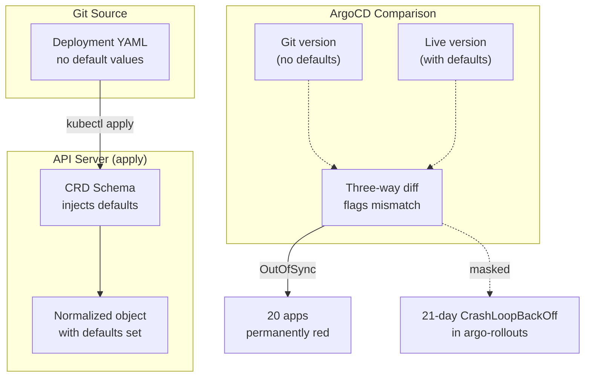



This is a debugging-focused companion to [Operating on GitOps](). That post covers day-to-day ArgoCD commands. This one covers what happens when `OutOfSync` stops being useful.

When I last ran `argocd app list`, 20 of 52 apps were `OutOfSync`. I'd been ignoring it — everything worked, dashboards were green. Then I investigated. Not one bug. **Seven.** And one of them was hiding a 21-day crashloop.



## What Healthy Looks Like

A healthy ArgoCD install isn't one where every app is `Synced` — it's one where `OutOfSync` actually means something is wrong. If the column is always red, you stop reading it.

Target: 52 apps, ≤2 `OutOfSync`, both with known and documented residuals.

## Diagnose

Start with a bird's-eye view of what's drifting:

```bash
kubectl -n argocd get applications -o json \
  | jq -r '.items[] | .metadata.name as $app
           | .status.resources[]?
           | select(.status != "Synced")
           | "\($app)\t\(.kind)/\(.name)\t\(.namespace // "cluster")"' \
  | sort
```

This gives you the *shape* of the drift: which app has which kind drifting, at which scope. Patterns jump out immediately.

On my cluster the output was dominated by three kinds: `ExternalSecret` (10 apps), `Application` (12 entries under `root`), and `CustomResourceDefinition` (12 entries).

## Recover

### Class A: CRD Schema Defaults

Symptom: every `ExternalSecret` drifts with fields like `deletionPolicy: Retain`, `conversionStrategy: Default` that the CRD schema injects but git doesn't have.

**Fix:** pin the defaults in git so the manifest matches what the CRD writes.

```yaml
spec:
  target:
    creationPolicy: Owner
    deletionPolicy: Retain
  data:
    - secretKey: ANTHROPIC_API_KEY
      remoteRef:
        key: ANTHROPIC_API_KEY
        conversionStrategy: Default
        decodingStrategy: None
        metadataPolicy: None
```

After pinning: 10 apps moved from `OutOfSync` to `Synced`.

### Class B: Default-Value Phantom Diff

Symptom: `root` app shows child Applications drifting because `prune: false` is explicit in git but ArgoCD normalises it away (it's the CRD schema default).

**Fix:** drop the explicit line.

```bash
for f in apps/root/templates/*.yaml; do
  sed -i '/^      prune: false$/d' "$f"
done
```

Same pattern applies to `group: ""` in `ignoreDifferences` blocks — ArgoCD treats empty-string groups as unset.

### Class C: Orphan CRDs

Symptom: Tekton and Argo Rollouts CRDs are `OutOfSync` — they were installed by a pre-ArgoCD bootstrap and have no `argocd.argoproj.io/tracking-id` annotation.

```bash
kubectl get crd rollouts.argoproj.io -o jsonpath='{.metadata.annotations}'
```

**Fix:** annotate them, then use `ignoreDifferences` for the metadata noise:

```bash
for crd in analysisruns.argoproj.io analysistemplates.argoproj.io \
           clusteranalysistemplates.argoproj.io experiments.argoproj.io \
           rollouts.argoproj.io; do
  kubectl annotate crd $crd \
    "argocd.argoproj.io/tracking-id=argo-rollouts:apiextensions.k8s.io/CustomResourceDefinition:/$crd" \
    --overwrite
done
```

```yaml
ignoreDifferences:
  - group: apiextensions.k8s.io
    kind: CustomResourceDefinition
    jsonPointers:
      - /metadata/labels
      - /metadata/annotations
      - /spec/preserveUnknownFields
```

### Class D: Zombie Sub-charts

Symptom: resources from disabled sub-charts persist because `prune: false` keeps them alive — `redis-cluster` Services, `ingress-nginx` ClusterRoles, ValidatingWebhookConfigurations.

**Pre-delete verification:**

```bash
# Are any Ingress resources still using the nginx IngressClass?
kubectl get ingress -A -o json \
  | jq -r '.items[] | select(.spec.ingressClassName=="nginx")
                   | "\(.metadata.namespace)/\(.metadata.name)"'
```

**Rollback dump before deleting anything:**

```bash
mkdir -p /tmp/argocd-drift
kubectl get clusterrole infisical-ingress-nginx -o yaml \
  > /tmp/argocd-drift/rollback-infisical-clusterrole.yaml
```

Then delete one at a time. Nothing broke in our case — every service uses Traefik now.

### Class E: Two Apps Fighting for One Namespace

Symptom: `sympozium-extras` and `sympozium` both try to own the same namespace's `tracking-id` annotation.

`managedNamespaceMetadata` won't help — it only applies to namespaces ArgoCD auto-creates, not chart-rendered ones.

**Fix:** apply labels out-of-band, delete the duplicate manifest.

```bash
kubectl label ns sympozium-system \
  pod-security.kubernetes.io/enforce=privileged \
  pod-security.kubernetes.io/audit=privileged \
  pod-security.kubernetes.io/warn=privileged --overwrite
```

Labels are sticky — once applied, they survive chart re-renders. Document as a manual op.

### Class F: Terminal Hook Noise

Symptom: completed Jobs (`postgres-vk-init-electric`, `PipelineRun`) show as `OutOfSync` — they complete, ArgoCD flags them because `requiresPruning: true` but `prune: false` refuses to clean up.

One-shot delete works but they'll come back on the next sync (they're supposed to). Permanent fix: `hook-delete-policy: BeforeHookCreation,HookSucceeded` on the hook definition.

### Class G: Chart-Operator Disagreement

Symptom: apps where the chart or operator injects fields git doesn't specify — timestamps, hashes, defaults.

| App | Field | Fix |
|-----|-------|-----|
| victoria-metrics-grafana | `checksum/config`, `checksum/secret` | Narrow `ignoreDifferences` on those JSON pointers |
| gpu-operator ClusterPolicy | Dozens of unset sub-fields defaulted by webhook | `ignoreDifferences` on `/spec` wholesale |
| vcluster-experiments StatefulSet | `vClusterConfigHash`, `whenScaled`, `revisionHistoryLimit` | Per-pointer `ignoreDifferences` |
| infisical Deployment | `updatedAt: "2026-04-04 UTC 21:31:24"` (stamped every render) | `ignoreDifferences` |
| infisical-postgresql PDB | `maxUnavailable: ""` diverges from K8s default | `pdb.create: false` in values |

## The Unmasked Bug

The most important fix wasn't about any of the seven drift classes.

When I resolved `argo-rollouts`'s drift, the controller logs became readable for the first time:

```
NAME                             READY   STATUS             RESTARTS           AGE
argo-rollouts-6b4c4dfbd9-ghl9c   0/1     CrashLoopBackOff   1154 (2m18s ago)   21d
```

1154 restarts. 21 days. The pod log:

```
level=fatal msg="Failed to download plugins: ...
  response code Not Found"
```

I had a `trafficRouterPlugins` entry in `values.yaml` pointing at a Cilium plugin URL that never existed — `argoproj-labs` has no such repo. The controller crashed on every startup. The drift noise had masked it completely.

## Takeaways

- **Classify before you fix.** Seven drift classes. Each needed a different fix. Blanket `ignoreDifferences` would have hidden the crashloop.
- **Pin schema defaults in git where possible.** Preferred over `ignoreDifferences` because real changes still flag.
- **Dump before you delete.** `kubectl get -o yaml > rollback.yaml` saves you from a bad Monday.
- **Read the logs of every app that moved from `Progressing`.** That's where the hiding things are.

## Missteps

| What we assumed | Why it was wrong | What it cost |
|---|---|---|
| `prune: false` is harmless to have explicit in git | ArgoCD normalises it away (it's the CRD schema default). The three-way diff flags the phantom gap on every child Application. | 12 templates edited to remove the explicit line. |
| Orphan CRDs will be adopted by ArgoCD when added to the Application | ArgoCD won't adopt resources that predate its tracking annotations, even if the manifest is correct. | Manual annotation + `ignoreDifferences` for metadata noise. |
| `managedNamespaceMetadata` fixes two-app namespace fights | That feature only works for auto-created namespaces, not chart-rendered ones. | Applied labels out-of-band via manual command. |
| Disabled sub-charts are harmless with `prune: false` | The resources persist forever. Only a manual audit with rollback dumps can clean them safely. | Zombie ClusterRoles, ValidatingWebhookConfigurations, and IngressClasses blocked cleanup for weeks. |
| A Cilium traffic router plugin exists and works | The plugin URL 404s — it was never published. The config was aspirational. | 21 days of controller crashloop, masked by drift noise. |
| `Progressing` in the health column means "mid-reconcile, probably fine" | When every second app is OutOfSync, you stop reading the column. Four apps had been `Progressing` for weeks. | Missed the crashloop signal until the noise was cleared. |

## References

- Plan: [`docs/superpowers/plans/2026-04-15--gitops--argocd-drift-cleanup.md`](https://github.com/derio-net/frank/blob/main/docs/superpowers/plans/2026-04-15--gitops--argocd-drift-cleanup.md)
- [Operating on GitOps]()
- [ArgoCD `ignoreDifferences`](https://argo-cd.readthedocs.io/en/stable/user-guide/diffing/)
- [Kubernetes ServerSideApply](https://kubernetes.io/docs/reference/using-api/server-side-apply/)
