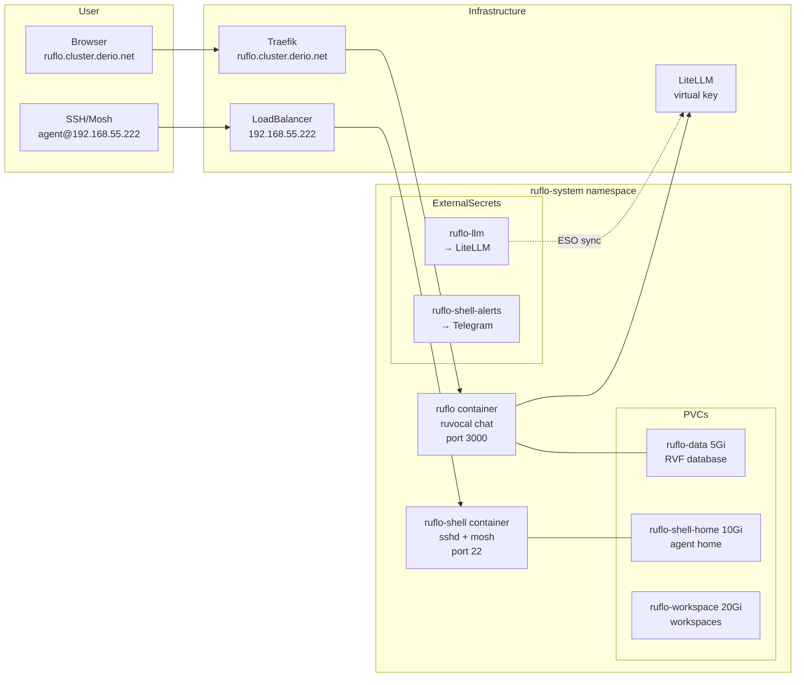



This is the operational companion to [Ruflo](). That post explains the architecture. This one covers connecting, installing tools, bumping images, and running swarms.



## What Healthy Looks Like

- `ruflo` Deployment is `2/2 Running` in `ruflo-system`.
- Web UI loads at `https://ruflo.cluster.derio.net` (Authentik SSO).
- SSH to `agent@192.168.55.222` succeeds.
- All ExternalSecrets show `SecretSynced`.
- Three PVCs (`ruflo-data`, `ruflo-shell-home`, `ruflo-workspace`) are `Bound`.

## Verify

```bash
kubectl get pods,pvc,externalsecret,svc -n ruflo-system

# Web UI via Traefik
curl -s -o /dev/null -w "%{http_code}" https://ruflo.cluster.derio.net

# SSH
ssh agent@192.168.55.222 -t tmux new -A -s main

# LiteLLM connectivity from ruvocal
kubectl -n ruflo-system logs deploy/ruflo -c ruflo --tail=20 | grep -i "litellm\|401\|model"
```

## Steps

### Add a Tool to the Shell

Edit `apps/ruflo/manifests/configmap-shell-inventory.yaml`, commit, push. Then reconcile:

```bash
ssh ruflo -- ruflo-shell-reconcile
```

To uninstall a tool, add it to the matching `removed:` array (e.g. `cargo: [eza]`).

### Restart Ruflo

```bash
kubectl rollout restart deploy/ruflo -n ruflo-system
kubectl rollout status deploy/ruflo -n ruflo-system --timeout=120s
```

Uses `Recreate` strategy (three RWO PVCs). Expect 30–60s downtime.

### Run a Claude-Flow Swarm

```bash
ssh ruflo
claude-flow version      # v3.10.x
claude-flow status       # should reach ruvocal at localhost:3000
claude -p "reply with exactly: AUTH-OK" --model haiku  # must succeed

cd /workspace/projects/<repo>
claude-flow swarm init -m 3
claude-flow swarm start -o "task description" -s development
```

## Recover

### 401 on Every Model Call

The LiteLLM virtual key was revoked or rotated. Force ESO re-sync:

```bash
kubectl annotate externalsecret ruflo-llm -n ruflo-system \
  force-sync=$(date +%s) --overwrite
kubectl rollout restart deploy/ruflo -n ruflo-system
```

### 502 Web UI / Readiness Probe Failing

```bash
kubectl get endpoints -n ruflo-system ruflo
kubectl describe pod -n ruflo-system -l app.kubernetes.io/name=ruflo
```

The probe at `/api/v2/feature-flags` is failing. Almost always upstream — LiteLLM down, OpenRouter rate-limiting, or the virtual key revoked.

### File Upload Returns 500

Check if the GridFS parity fix is deployed:

```bash
kubectl -n ruflo-system exec deploy/ruflo -c ruflo -- \
  sh -c 'grep -l "objectMode: true" /app/build/server/chunks/database-*.js'
```

If no match, the image predates the fix — bump to ruflo-server SHA ≥ `0ff7014`.

### SSH Key Bootstrap Not Applied

```bash
kubectl exec -n ruflo-system deploy/ruflo -c ruflo-shell -- \
  bash -c 'cp /etc/ssh-keys/authorized_keys "${AGENT_HOME:-/home/agent}/.ssh/authorized_keys"
           && chmod 600 "${AGENT_HOME:-/home/agent}/.ssh/authorized_keys"'
```

Or restart the pod to re-fire the `cont-init.d` hook.

## Missteps

| What we assumed | Why it was wrong | What it cost |
|---|---|---|
| `shareProcessNamespace: true` is fine for sidecar containers | s6-overlay v3 must be pid 1 in its container namespace. `shareProcessNamespace` breaks the init sequence — the shell container never reaches Ready. | Removed `shareProcessNamespace`, cross-container debugging now uses `kubectl exec -c`. |
| The readiness probe against `/` is safe | ruvocal SSR-renders the model list at request time, so hitting `/` triggers a full upstream dependency check every probe cycle. A slow LiteLLM response flaps the probe. | Switched to `/api/v2/feature-flags` as the probe path. |
| `OPENAI_API_KEY` is the OpenRouter key | LiteLLM authenticates against its own virtual key store. Using the raw OpenRouter key returns 401 on every model-list call. | Switched to a LiteLLM virtual key, documented the distinction. |
| The data layer uses PostgreSQL | Ruflo uses RVF (a file-based JSON store). Without a PVC at `/app/db`, every restart starts fresh — all hives vanish. | Added the `ruflo-data` PVC, documented the RVF deviation. |
| `mise install` activates the runtime immediately | `mise install` downloads the runtime but doesn't activate it. `npm install -g` without a prior `mise use -g node@20` writes to the system prefix and hits EACCES. | Manual `mise use -g` workaround until `agent-shell-base` auto-activates. |
| SSH key rotation applies on secret update | The `cont-init.d/30-authorized-keys` hook only fires at pod boot. Rotating the SOPS-encrypted Secret mid-life has no effect. | Either `kubectl exec` the copy command or restart the pod. |

## Quick Reference

| Command | What It Does |
|---------|-------------|
| `kubectl get pods,pvc,externalsecret -n ruflo-system` | Full status |
| `ssh agent@192.168.55.222` | SSH to shell sidecar |
| `kubectl rollout restart deploy/ruflo -n ruflo-system` | Restart (30-60s downtime) |
| `ssh ruflo -- ruflo-shell-reconcile` | Reconcile shell tools |
| `kubectl annotate externalsecret ruflo-llm -n ruflo-system force-sync=...` | Force ESO re-sync |
| `kubectl -n ruflo-system logs deploy/ruflo -c ruflo --tail=20` | Ruvocal logs |

## References

- [Building Post — Ruflo]()
- [Operating on Paperclip]()
- [ruvnet/ruflo](https://github.com/ruvnet/ruflo)
