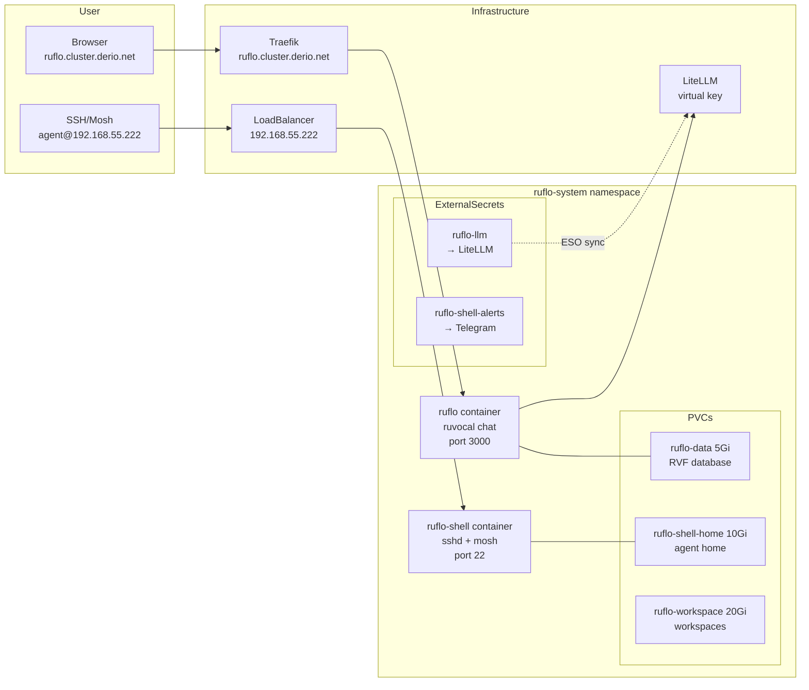



This is the operational companion to [Ruflo](). That post explains the architecture. This one covers connecting, installing tools, bumping images, and running swarms.


```mermaid
graph LR
    subgraph ruflo["ruflo-system namespace"]
        direction LR
        rv["ruflo container<br/>ruvocal chat<br/>port 3000"]
        sh["ruflo-shell container<br/>sshd + mosh<br/>port 22"]

        subgraph pvs["PVCs"]
            data["ruflo-data 5Gi<br/>RVF database"]
            home["ruflo-shell-home 10Gi<br/>agent home"]
            ws["ruflo-workspace 20Gi<br/>workspaces"]
        end

        rv --- data
        sh --- home

        subgraph secrets["ExternalSecrets"]
            llm["ruflo-llm<br/>→ LiteLLM"]
            alerts["ruflo-shell-alerts<br/>→ Telegram"]
        end
    end

    subgraph infra["Infrastructure"]
        lb["LoadBalancer<br/>192.168.55.222"]
        traefik["Traefik<br/>ruflo.cluster.derio.net"]
        litellm["LiteLLM<br/>virtual key"]
    end

    subgraph user["User"]
        ssh["SSH/Mosh<br/>agent@192.168.55.222"]
        web["Browser<br/>ruflo.cluster.derio.net"]
    end

    ssh --> lb --> sh
    web --> traefik --> rv
    rv --> litellm
    llm -.->|"ESO sync"| litellm
```

## What Healthy Looks Like

- `ruflo` Deployment is `2/2 Running` in `ruflo-system`.
- Web UI loads at `https://ruflo.cluster.derio.net` (Authentik SSO).
- SSH to `agent@192.168.55.222` succeeds.
- All ExternalSecrets show `SecretSynced`.
- Three PVCs (`ruflo-data`, `ruflo-shell-home`, `ruflo-workspace`) are `Bound`.

## Verify

```bash
kubectl get pods,pvc,externalsecret,svc -n ruflo-system

# Web UI via Traefik
curl -s -o /dev/null -w "%{http_code}" https://ruflo.cluster.derio.net

# SSH
ssh agent@192.168.55.222 -t tmux new -A -s main

# LiteLLM connectivity from ruvocal
kubectl -n ruflo-system logs deploy/ruflo -c ruflo --tail=20 | grep -i "litellm\|401\|model"
```

## Steps

### Add a Tool to the Shell

Edit `apps/ruflo/manifests/configmap-shell-inventory.yaml`, commit, push. Then reconcile:

```bash
ssh ruflo -- ruflo-shell-reconcile
```

To uninstall a tool, add it to the matching `removed:` array (e.g. `cargo: [eza]`).

### Restart Ruflo

```bash
kubectl rollout restart deploy/ruflo -n ruflo-system
kubectl rollout status deploy/ruflo -n ruflo-system --timeout=120s
```

Uses `Recreate` strategy (three RWO PVCs). Expect 30–60s downtime.

### Run a Claude-Flow Swarm

Swarm *workers are Claude Code processes* — `hive-mind spawn --claude` launches
one in your terminal (the Queen), and the hive dies with the session. Use
`bash -lc` over SSH so the `claude-local` profile.d shim is loaded (non-login
`ssh ruflo -- cmd` skips it).

```bash
ssh ruflo
cd /workspace/projects/<repo>
claude-flow hive-mind init                        # writes .claude-flow/ (NOT .mcp.json)
claude-flow hive-mind spawn --claude -o "task description" -m 3
```

**The `.mcp.json` launch requirement (frank#475).** `spawn --claude` resolves
Claude Code's `--mcp-config` from `[./.mcp.json, ~/.claude.json, ~/.claude/mcp.json]`
in order. With no `./.mcp.json` it falls to `~/.claude.json`, whose root
`mcpServers` is `null` (Claude Code 2.x stores MCP servers *per-project*, not at
the root), and CC rejects it:

```
Error: Invalid MCP configuration:
mcpServers: Invalid input: expected record, received undefined
```

Seed a valid `./.mcp.json` in the launch dir first (`cp ~/.mcp.json .mcp.json`)
— or just use `claude-local` below, which seeds it for you. (The explicit
`--mcp-config` flag is inert upstream — a kebab/camel key-normalization bug.)

**Auth: subscription vs. local models.** By default workers use the Anthropic
subscription (`claude` → `/login` once; persists on the shell-home PVC — re-run
if the OAuth token has expired). To run workers on the **local qwen lineup via
LiteLLM** instead (competing-paradigms experiment, frank#472), wrap the spawn in
`claude-local` — it seeds `.mcp.json` and exports the `ANTHROPIC_*` env for that
run, leaving the shell's default (subscription) untouched:

```bash
claude-local claude-flow hive-mind spawn --claude -o "task description" -m 3
# pick a different local model per run:
RUFLO_LOCAL_MODEL=qwen-think-14b claude-local claude-flow hive-mind spawn --claude -o "…"
# or export into the shell once, then run several commands locally:
claude-local
claude-flow hive-mind spawn --claude -o "…"
```

Local workers need **Ollama up** on gpu-1 (it time-shares the GPU with ComfyUI —
flip the GPU switcher first) and LiteLLM's `drop_params: true`
(`apps/litellm/values.yaml`), which strips Claude Code 2.1.x's `context_management`
request param that the `ollama_chat` provider would otherwise 400 on. Expect a
quality cliff — the Claude Code harness is tuned for Claude models; measuring
that cliff is the whole point of the experiment.

## Recover

### 401 on Every Model Call

The LiteLLM virtual key was revoked or rotated. Force ESO re-sync:

```bash
kubectl annotate externalsecret ruflo-llm -n ruflo-system \
  force-sync=$(date +%s) --overwrite
kubectl rollout restart deploy/ruflo -n ruflo-system
```

### 502 Web UI / Readiness Probe Failing

```bash
kubectl get endpoints -n ruflo-system ruflo
kubectl describe pod -n ruflo-system -l app.kubernetes.io/name=ruflo
```

The probe at `/api/v2/feature-flags` is failing. Almost always upstream — LiteLLM down, OpenRouter rate-limiting, or the virtual key revoked.

### File Upload Returns 500

Check if the GridFS parity fix is deployed:

```bash
kubectl -n ruflo-system exec deploy/ruflo -c ruflo -- \
  sh -c 'grep -l "objectMode: true" /app/build/server/chunks/database-*.js'
```

If no match, the image predates the fix — bump to ruflo-server SHA ≥ `0ff7014`.

### SSH Key Bootstrap Not Applied

```bash
kubectl exec -n ruflo-system deploy/ruflo -c ruflo-shell -- \
  bash -c 'cp /etc/ssh-keys/authorized_keys "${AGENT_HOME:-/home/agent}/.ssh/authorized_keys"
           && chmod 600 "${AGENT_HOME:-/home/agent}/.ssh/authorized_keys"'
```

Or restart the pod to re-fire the `cont-init.d` hook.

## Missteps

| What we assumed | Why it was wrong | What it cost |
|---|---|---|
| `shareProcessNamespace: true` is fine for sidecar containers | s6-overlay v3 must be pid 1 in its container namespace. `shareProcessNamespace` breaks the init sequence — the shell container never reaches Ready. | Removed `shareProcessNamespace`, cross-container debugging now uses `kubectl exec -c`. |
| The readiness probe against `/` is safe | ruvocal SSR-renders the model list at request time, so hitting `/` triggers a full upstream dependency check every probe cycle. A slow LiteLLM response flaps the probe. | Switched to `/api/v2/feature-flags` as the probe path. |
| `OPENAI_API_KEY` is the OpenRouter key | LiteLLM authenticates against its own virtual key store. Using the raw OpenRouter key returns 401 on every model-list call. | Switched to a LiteLLM virtual key, documented the distinction. |
| The data layer uses PostgreSQL | Ruflo uses RVF (a file-based JSON store). Without a PVC at `/app/db`, every restart starts fresh — all hives vanish. | Added the `ruflo-data` PVC, documented the RVF deviation. |
| `mise install` activates the runtime immediately | `mise install` downloads the runtime but doesn't activate it. `npm install -g` without a prior `mise use -g node@20` writes to the system prefix and hits EACCES. | Manual `mise use -g` workaround until `agent-shell-base` auto-activates. |
| SSH key rotation applies on secret update | The `cont-init.d/30-authorized-keys` hook only fires at pod boot. Rotating the SOPS-encrypted Secret mid-life has no effect. | Either `kubectl exec` the copy command or restart the pod. |

## Quick Reference

| Command | What It Does |
|---------|-------------|
| `kubectl get pods,pvc,externalsecret -n ruflo-system` | Full status |
| `ssh agent@192.168.55.222` | SSH to shell sidecar |
| `kubectl rollout restart deploy/ruflo -n ruflo-system` | Restart (30-60s downtime) |
| `ssh ruflo -- ruflo-shell-reconcile` | Reconcile shell tools |
| `kubectl annotate externalsecret ruflo-llm -n ruflo-system force-sync=...` | Force ESO re-sync |
| `kubectl -n ruflo-system logs deploy/ruflo -c ruflo --tail=20` | Ruvocal logs |

## References

- [Building Post — Ruflo]()
- [Operating on Paperclip]()
- [ruvnet/ruflo](https://github.com/ruvnet/ruflo)
