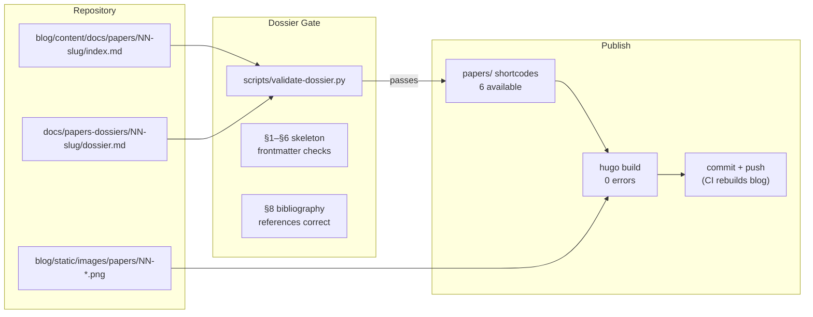



This is the operational companion to [Building The Frank Papers](). That post explains *why* there's a third series and what the dossier gate is for. This one is the cookbook: scaffold, dossier, prose, cover, ship.



## What Ready to Write Looks Like

- `blog/content/docs/papers/NN-slug/index.md` exists with `series: papers` frontmatter and the §1–§6 skeleton.
- `docs/papers-dossiers/NN-slug/dossier.md` exists.
- `python scripts/validate-dossier.py docs/papers-dossiers/NN-slug/dossier.md` exits 0.

## Steps

### Scaffold a New Paper

```bash
# Create the paper bundle
hugo new content/docs/papers/NN-slug/index.md

# Create the dossier directory
mkdir -p docs/papers-dossiers/NN-slug/
touch docs/papers-dossiers/NN-slug/dossier.md
```

### Write and Validate the Dossier

The dossier.md has sections: Problem Statement, Existing Solutions, Vendors Considered, Selection Criteria, Selected Approach, Open Questions.

```bash
python scripts/validate-dossier.py docs/papers-dossiers/NN-slug/dossier.md
```

The gate checks that every required section is present and above a minimum length. It exits non-zero if anything is missing — the PR check enforces this before review.

### Use the Paper Shortcodes

| Shortcode | When to Use |
|-----------|-------------|
| `` | Vendor comparison table from `data/vendors.yaml` |
| `` | Link to the paper's dossier |
| `...` | Mermaid architecture landscape |
| `...` | Key insight quote |
| `` | Auto-generates §8 from dossier refs |
| `...` | Notable decision scar |

### Generate a Cover Image

The cover image lives at `blog/static/images/papers/NN-descriptive-slug.png`. Each Paper gets a unique AI-generated cover from a prompt composed by the blog-craft metaphor system. The prompt encodes the Paper's central metaphor into Stable Diffusion syntax.

```bash
# The cover is generated as part of the blog-craft pipeline.
# See the building post for the prompt composition method.
```

### Publish

```bash
hugo   # Must exit 0
git add blog/content/docs/papers/NN-slug/ \
        docs/papers-dossiers/NN-slug/ \
        blog/static/images/papers/NN-*.png
git commit -m "feat(papers): Paper NN — Title"
```

## Recover

### Dossier Validation Fails

```bash
python scripts/validate-dossier.py docs/papers-dossiers/NN-slug/dossier.md --verbose
```

Common failures:
- Section below minimum word count — expand the analysis.
- Missing required section — add the section header and content.
- References don't match `[@key]` usage in prose — check §6 and §8 are in sync.

### Cover Image Not Appearing

```bash
# Check the file exists at the expected path
ls -la blog/static/images/papers/NN-*.png

# Check the frontmatter reference
grep cover blog/content/docs/papers/NN-slug/index.md
```

### Weight Collision with Another Paper

```bash
# Check weights across all papers
grep -h "weight:" blog/content/docs/papers/*/index.md | sort -t: -k2 -n
```

Weights should be unique. If two papers share a weight, the sidebar ordering is undefined. `faa3f993` was a dedicated fix for weight sorting bugs.

## Missteps

| What we assumed | Why it was wrong | What it cost |
|---|---|---|
| Sidebar ordering follows directory numbering | Hugo uses `weight:` frontmatter for sidebar order, not the directory prefix. Duplicate weights caused random ordering in the Papers TOC. | Dedicated PR to fix weights and add a validator. |
| Dossier validation is a nice-to-have | Without the gate, papers reached review with missing sections or underdeveloped vendor analysis, wasting review cycles. | The CI check now blocks PRs with failing dossiers. |
| Mermaid diagrams render identically in Papers as in operating posts | Papers navigate via prev/next, not a sidebar, and the Mermaid CSS theme was tuned for operating posts initially. | Cross-series Mermaid styling had to be unified in `custom.css`. |

## References

- [Building Post — The Frank Papers]()
- [Paper Bibliography Reference](https://github.com/derio-net/frank/blob/main/docs/papers-dossiers/README.md)
- [`scripts/validate-dossier.py`](https://github.com/derio-net/frank/blob/main/scripts/validate-dossier.py)
