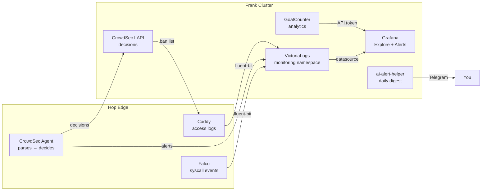



The companion to [Edge Observability](). This post is the cheat-sheet for the night Grafana pages you with `DatasourceError`.

Assumes both `.env` (Frank) and `.env_hop` (Hop) are available. Sourcing the wrong one silently sends commands to the wrong cluster — the single most common mistake.



## What Healthy Looks Like

- VictoriaLogs responds to queries in Grafana Explore — no `DatasourceError`.
- CrowdSec shows active decisions and the bouncer is connected.
- GoatCounter `count.js` returns 200 + ~8 KB at `https://counter.derio.net/count.js`.
- Falco alerts are limited to genuine security events, not `kube-system` routine noise.
- The daily digest arrives in Telegram on schedule.

## Verify

```bash
# VictoriaLogs query (from within cluster)
kubectl exec -n monitoring vlogs-q -- curl -sG \
  'http://victoria-logs-victoria-logs-single-server.monitoring.svc:9428/select/logsql/query' \
  --data-urlencode 'query=_time:5m kubernetes.namespace_name:caddy-system' \
  --data-urlencode 'limit=5'

# CrowdSec decisions
kubectl exec -n crowdsec-system deploy/crowdsec-lapi -- cscli decisions list
kubectl exec -n crowdsec-system deploy/crowdsec-lapi -- cscli bouncers list

# GoatCounter public ingest
curl -s -o /dev/null -w 'count.js: %{http_code} size=%{size_download}\n' \
  https://counter.derio.net/count.js

# Fluent-bit logs reaching VictoriaLogs
_time:5m source:syscall | stats by (priority, rule) count() as c | sort by (c desc)
```

## Steps

### Query Blog Access Logs

```bash
# All blog requests, last 5 minutes
_time:5m kubernetes.namespace_name:caddy-system AND _msg:"handled request"

# 5xx responses, last hour
_time:1h kubernetes.namespace_name:caddy-system AND _msg:"handled request" AND status:>=500

# Top-N paths, last 24h
_time:24h kubernetes.namespace_name:caddy-system AND _msg:"handled request" \
  | stats by (request.uri) count() as hits | sort by (hits desc) | limit 10
```

Use the dotted field shape (`kubernetes.namespace_name`) — the underscore form returns zero hits.

### Ban a Scraper

```bash
# Ban an IP for 4 hours
kubectl exec -n crowdsec-system deploy/crowdsec-lapi -- \
  cscli decisions add --ip 198.51.100.42 --duration 4h --reason "suspicious traffic"

# Ban a /16 range
kubectl exec -n crowdsec-system deploy/crowdsec-lapi -- \
  cscli decisions add --range 91.92.0.0/16 --duration 24h --reason "scraper farm"

# Unban
kubectl exec -n crowdsec-system deploy/crowdsec-lapi -- \
  cscli decisions delete --ip 198.51.100.42
```

### Re-Register the Caddy Bouncer

If the bouncer drops after a LAPI restart:

```bash
KEY=$(kubectl -n crowdsec-system get secret crowdsec-bouncer-keys \
  -o jsonpath='{.data.caddy-hop}' | base64 -d)
kubectl exec -n crowdsec-system deploy/crowdsec-lapi -- \
  cscli bouncers add caddy-hop -k "$KEY"
```

If both keys got de-synced, rotate both Secrets with the same new key.

### Rotate GoatCounter API Token

```bash
# Create a new token
kubectl exec -n goatcounter-system deploy/goatcounter -- sh -c \
  "goatcounter db create apitoken \
    -db sqlite+/home/goatcounter/goatcounter-data/goatcounter.sqlite3 \
    -name grafana-readonly-$(date +%Y%m%d) -user 1 -perm count,export,site_read"

# Update the Grafana Secret
kubectl create secret generic grafana-goatcounter-token -n monitoring \
  --from-literal=OBS_GOATCOUNTER_API_TOKEN=<NEW> \
  --dry-run=client -o yaml | kubectl apply -f -
kubectl rollout restart -n monitoring deploy/victoria-metrics-grafana
```

### Reset GoatCounter Bootstrap User

```bash
kubectl exec -n goatcounter-system deploy/goatcounter -- sh -c \
  "goatcounter db create site \
    -db sqlite+/home/goatcounter/goatcounter-data/goatcounter.sqlite3 \
    -vhost counter.cluster.derio.net \
    -user.email <email> -user.password '<strong-password>'"
```

## Recover

### Grafana `DatasourceError`

```bash
# Test VictoriaLogs directly
kubectl exec -n monitoring vlogs-q -- curl -sG \
  'http://victoria-logs-victoria-logs-single-server.monitoring.svc:9428/select/logsql/query' \
  --data-urlencode 'query=_time:1m' --data-urlencode 'limit=1'
```

If VictoriaLogs is up, the Grafana datasource config is stale — check `victoria-logs-datasource.yaml` in Grafana's provisioning ConfigMap.

### GoatCounter Public Ingest Down

Check in order:

```bash
# 1. From Hop — can Caddy reach the GoatCounter LB IP?
kubectl exec -n caddy-system deploy/caddy -- nc -vz 192.168.55.224 8080

# 2. Tailscale subnet routes
kubectl -n headscale-system exec ds/tailscale -- tailscale status | grep raspi

# 3. GoatCounter pod
kubectl -n goatcounter-system get pod
```

If `enableServiceLinks: false` is set on the pod, GoatCounter may fail to resolve its own SQLite path — a known regression.

### Falco Too Noisy

Tune `kube-system` rules by editing the Falco Helm values and re-syncing:

```bash
# Check current alert rate
_time:1h source:syscall AND kubernetes.namespace_name:kube-system \
  | stats by (rule) count() as c | sort by (c desc)
```

Add exceptions for known patterns: Helm hooks, node problem detectors, CSI sidecars.

## Missteps

| What we assumed | Why it was wrong | What it cost |
|---|---|---|
| VictoriaLogs field names use underscores | Fluent-bit emits dotted `kubernetes.namespace_name` with `Merge_Log On`. Underscore-form queries return zero hits. | Burned an evening debugging empty query results. |
| CrowdSec LAPI decisions survive pod restarts on Hop | The LAPI pod uses `emptyDir` — no PVC. Every restart wipes decisions and bouncer registrations. | Added `postStart` hook to re-register bouncer; manual fallback in the runbook. |
| The community blocklist works without enrollment | CrowdSec's community blocklists require an `app.crowdsec.net` account and enrollment token. Without enrollment, only local scenarios apply. | Deferred — free-tier sign-up pending. |
| `enableServiceLinks: false` is safe for all pods | GoatCounter with `enableServiceLinks: false` can't resolve its SQLite path via environment variable injection. | Debugging session to identify the regression. |

## Quick Reference

| Command | What It Does |
|---------|-------------|
| `cscli decisions list` (via kubectl exec) | Current bans |
| `cscli decisions add --ip <IP> --duration 4h` | Ban an IP |
| `cscli decisions delete --ip <IP>` | Unban an IP |
| `cscli bouncers list` (via kubectl exec) | Registered bouncers |
| `curl -s https://counter.derio.net/count.js \| wc -c` | GoatCounter liveness |
| `_time:5m source:syscall \| stats by (rule) count()` | Falco event rate by rule |
| `kubectl exec -n monitoring vlogs-q -- curl -sG ...` | Direct VictoriaLogs query |

## References

- [Building Post — Edge Observability]()
- [VictoriaLogs LogsQL](https://docs.victoriametrics.com/victorialogs/logsql/)
- [CrowdSec cscli](https://docs.crowdsec.net/docs/cscli/)
