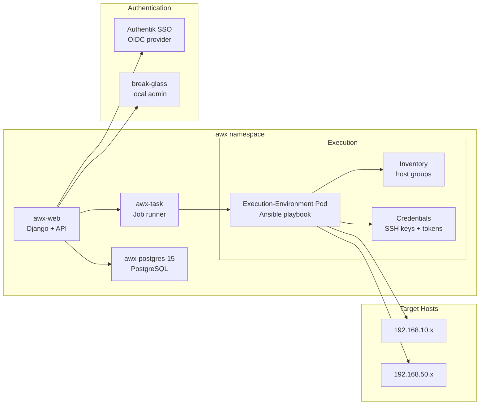



The companion to [Automation with AWX](). This post is the cheat-sheet for living with it — onboarding hosts, reading failed jobs, rotating the OIDC secret, and breaking glass when SSO is down.

Assumes the `awx` namespace exists and `.env` (Frank `KUBECONFIG`) is sourced.



## What Healthy Looks Like

- `awx-web` and `awx-task` pods are `Running`.
- `awx-postgres-15-0` is `Running` and migration Job is `Completed`.
- `kubectl -n awx get awx awx -o jsonpath='{.status.conditions}'` shows `Successful`.
- `curl -s https://awx.cluster.derio.net/api/v2/ping/` returns a JSON ping.
- SSO login via Authentik works and directs to the AWX dashboard.

## Verify

```bash
# Two-layer reconcile: ArgoCD → operator → pods
kubectl -n awx get awx awx -o jsonpath='{.status.conditions}'
kubectl -n awx get pods

# AWX API
curl -s https://awx.cluster.derio.net/api/v2/ping/ | python3 -m json.tool

# Pod-level reachability to a target host
kubectl -n awx exec deploy/awx-task -c awx-task -- \
  python3 -c "import socket;s=socket.socket();s.settimeout(4);s.connect(('192.168.10.14',22));print('OPEN')"
```

## Steps

### Onboard a New Host

```bash
# Fill the env file
# scripts/tmp/awx-hosts.env: ssh_alias | awx_host | ansible_user | become

bash agents/skills/awx-onboard-hosts/01-key-onboard.sh
bash agents/skills/awx-onboard-hosts/02-wire-up.sh
bash agents/skills/awx-onboard-hosts/03-formalize.sh
```

Preflight: verify the host is routable from an AWX task pod, not just from your Mac.

### Run a Job

```bash
ADMIN_PW=$(kubectl -n awx get secret awx-admin-password -o jsonpath='{.data.password}' | base64 -d)

# Launch a job template
kubectl -n awx exec deploy/awx-web -c awx-web -- \
  curl -s -u "admin:$ADMIN_PW" -X POST \
  http://localhost:8052/api/v2/job_templates/<id>/launch/

# Read job output
kubectl -n awx exec deploy/awx-web -c awx-web -- \
  curl -s -u "admin:$ADMIN_PW" \
  "http://localhost:8052/api/v2/jobs/<job-id>/stdout/?format=txt"
```

### Rotate the OIDC Secret

```bash
ADMIN_PW=$(kubectl -n awx get secret awx-admin-password -o jsonpath='{.data.password}' | base64 -d)
SECRET=$(kubectl exec -n authentik deploy/authentik-worker -- python -c '
import os; os.environ.setdefault("DJANGO_SETTINGS_MODULE","authentik.root.settings")
import django; django.setup()
from authentik.providers.oauth2.models import OAuth2Provider
print(OAuth2Provider.objects.get(client_id="awx").client_secret)')

kubectl -n awx exec deploy/awx-web -c awx-web -- curl -s -u "admin:$ADMIN_PW" \
  -X PATCH http://localhost:8052/api/v2/settings/oidc/ \
  -H 'Content-Type: application/json' \
  -d "{\"SOCIAL_AUTH_OIDC_SECRET\": \"$SECRET\"}"
```

**Trap:** PATCH to the `authentication` category returns 200 and silently drops the key. Must use the `oidc` category.

## Recover

### AWX Web CrashLooping After Config Change

```bash
kubectl -n awx logs deploy/awx-web --tail=50
```

First suspect: `extra_settings` with missing inner Python quotes. Check the rendered config:

```bash
kubectl -n awx get cm awx-awx-configmap -o jsonpath='{.data.settings}' | grep SOCIAL_AUTH
```

### SSO Button Missing

```bash
kubectl exec -n authentik deploy/authentik-worker -- python -c '
import os; os.environ.setdefault("DJANGO_SETTINGS_MODULE","authentik.root.settings")
import django; django.setup()
from authentik.blueprints.models import BlueprintInstance
b = BlueprintInstance.objects.filter(name="AWX OIDC Provider").first()
print(b.status, bool(b.last_applied_hash))'
```

If `error`, the blueprint is invalid for the running Authentik version — fix `invalidation_flow` and `redirect_uris`, let ArgoCD re-sync.

### Break-Glass: SSO is Down

```bash
kubectl -n awx get secret awx-admin-password -o jsonpath='{.data.password}' | base64 -d
```

Log in at `awx.cluster.derio.net` via username/password form (not the SSO icon). The local `admin` is deliberately excluded from Authentik.

### Job Fails with `unreachable`

```bash
# Re-test pod-level reachability
kubectl -n awx exec deploy/awx-task -c awx-task -- \
  python3 -c "import socket;s=socket.socket();s.settimeout(4);s.connect(('<HOST_IP>',22));print('OPEN')"
```

### Job Fails with `failed`

Read the specific task that failed, not the recap. The ansible task path in the output is the actionable line.

## Missteps

| What we assumed | Why it was wrong | What it cost |
|---|---|---|
| `Synced/Healthy` in ArgoCD means AWX is ready | ArgoCD installs the operator + CR. The operator then builds pods, runs migrations, and configures the app — none of which ArgoCD tracks. | Always read the pods directly; `Synced/Healthy` is only the first layer. |
| PATCH to `settings/authentication/` with the OIDC secret works | AWX accepts the PATCH with 200 but silently drops the key if the category is wrong. The key must go to `settings/oidc/`. | Debugging session to discover the silent 200 drop. |
| The Authentik blueprint applies correctly across version upgrades | The 2026.x Authentik schema change broke the AWX OIDC blueprint's `invalidation_flow` and `redirect_uris` shape. | Blueprint re-sync and manual fix. |
| An OIDC-authenticated user has RBAC automatically | SSO authenticates but doesn't authorize. The user lands in AWX with zero permissions. | Must map Authentik groups to AWX teams/roles explicitly. |

## Quick Reference

| Command | What It Does |
|---------|-------------|
| `kubectl -n awx get awx awx -o jsonpath='{.status.conditions}'` | Operator status |
| `kubectl -n awx get pods` | Pod-level status |
| `curl https://awx.cluster.derio.net/api/v2/ping/` | AWX API health |
| `kubectl -n awx exec deploy/awx-task -- python3 -c "socket connect test"` | Pod-level host reachability |
| `kubectl -n awx get secret awx-admin-password -o jsonpath='{.data.password}' \| base64 -d` | Break-glass admin password |
| `kubectl -n awx exec deploy/awx-web -- curl -s http://localhost:8052/api/v2/jobs/<id>/stdout/?format=txt` | Job output |

## References

- [Building Post — Automation]()
- [AWX Operator](https://github.com/ansible/awx-operator)
- Onboarding skill: `agents/skills/awx-onboard-hosts/`
