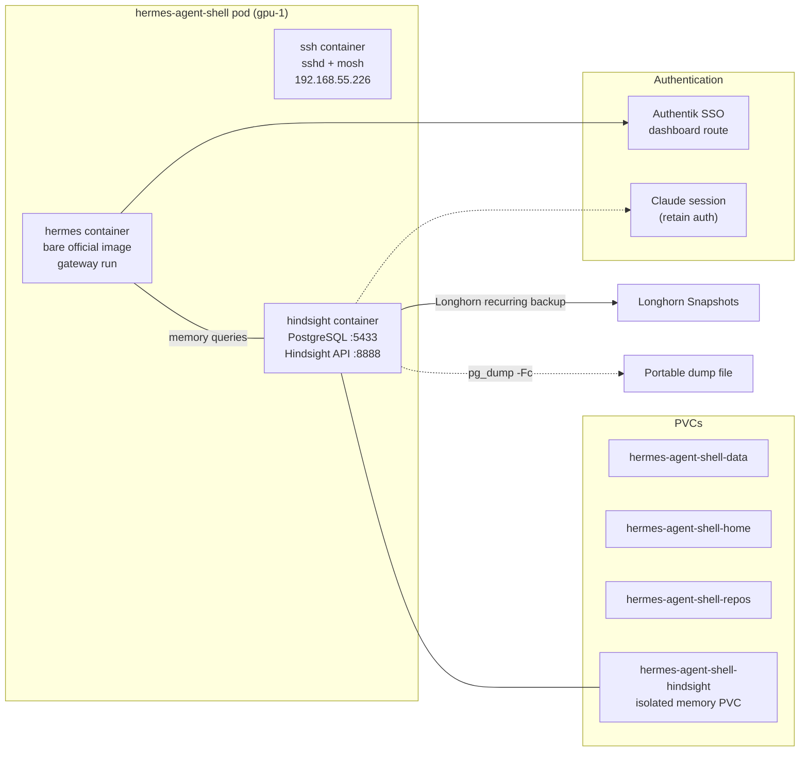



Companion to [Rebuilding the Hermes Shell](/docs/building/33-hermes-shell). The pod is now three containers: `hermes`, `ssh`, and `hindsight`. Most of what changed is the memory sidecar — a supervised PostgreSQL + Hindsight process on an isolated PVC.



## What Healthy Looks Like

- One pod `Running` on gpu-1, all three containers `Ready`.
- SSH/Mosh Service at `192.168.55.226` (TCP 22 + UDP 60032–60047).
- Hindsight `/health` returns `{"status":"healthy","database":"connected"}`.
- `memory_units` count in PostgreSQL is the expected value (369).

## Verify

```bash
# Pod status
kubectl -n hermes-agent-shell get pods,svc,pvc

# Hindsight health
kubectl exec -n hermes-agent-shell -c hindsight deploy/hermes-agent-shell -- \
  curl -sf http://127.0.0.1:8888/health

# Agent-facing memory status
kubectl exec -n hermes-agent-shell -c hermes deploy/hermes-agent-shell -- \
  bash -lc 'hermes memory status'

# Memory count from PostgreSQL
kubectl exec -n hermes-agent-shell -c hindsight deploy/hermes-agent-shell -- \
  psql -h 127.0.0.1 -p 5433 -U hindsight -d postgres \
  -tAc 'select count(*) from memory_units'
```

## Steps

### Connect via SSH

```bash
ssh agent@192.168.55.226

mosh --ssh="ssh agent@192.168.55.226" \
     --server="mosh-server new -p 60032:60047" 192.168.55.226
```

### Back Up Memory

**Tier 1 — Longhorn snapshots** (automatic via recurring backup group on the hindsight PVC).

**Tier 2 — Portable logical dump:**

```bash
kubectl exec -n hermes-agent-shell -c hindsight deploy/hermes-agent-shell -- \
  pg_dump -h 127.0.0.1 -p 5433 -U hindsight -Fc postgres > hindsight-$(date +%F).dump
```

### Restore Memory

```bash
# On the old data directory (Postgres refuses group-readable dir):
chmod 700 "$OLD_PGDATA"

# Stand up old PG → pg_dump -Fc → pg_restore --clean --if-exists into 127.0.0.1:5433
# Restart pod, then verify:
kubectl exec -n hermes-agent-shell -c hindsight deploy/hermes-agent-shell -- \
  psql -h 127.0.0.1 -p 5433 -U hindsight -d postgres \
  -tAc 'select count(*) from memory_units'
# Expected: 369
```

## Recover

### `hermes` Container CrashLoops

```bash
kubectl -n hermes-agent-shell logs deploy/hermes-agent-shell -c hermes --tail=30
```

Missing `args: ["gateway","run"]` — the bare entrypoint runs an interactive TUI. Ensure the manifest sets the gateway args. If `chown`-related: `chown -R hermes:hermes /opt/data`.

### `hindsight` CrashLoops After Restart

```bash
kubectl -n hermes-agent-shell logs deploy/hermes-agent-shell -c hindsight --tail=30
```

`fsGroup: 1000` re-loosens PGDATA to group-rwx on remount; Postgres refuses wider than 0750. The fix (`chmod 700 $PGDATA` on every boot) is baked into the sidecar's start script.

### Pod Flapping / Readiness Probe Fails

```bash
kubectl -n hermes-agent-shell describe pod -l app=hermes-agent-shell | grep -A 10 Events
```

`hindsight-api` binds `127.0.0.1` only — an `httpGet` probe against the pod IP draws `connection-refused`. The fix is `exec` probes that curl loopback, plus a `startupProbe` for the cold start.

### Recall Works, Retain Doesn't

Retain's `claude-code` provider needs an authenticated Claude session in the hindsight sidecar. `claude --version` only proves the binary exists.

```bash
# Check if the session is authenticated
kubectl -n hermes-agent-shell exec -c hindsight deploy/hermes-agent-shell -- \
  bash -lc 'claude status 2>&1 | grep -i "logged\|authenticated\|session"'
```

If not authenticated, log in: `kubectl exec -it -n hermes-agent-shell -c hindsight deploy/hermes-agent-shell -- claude` and complete the OAuth flow. Recall (local `BAAI/bge-small-en-v1.5` embeddings) is unaffected — it works without any LLM auth.

## Missteps

| What we assumed | Why it was wrong | What it cost |
|---|---|---|
| An `httpGet` probe works for a service that binds `127.0.0.1` | The kubelet probes the pod IP, not loopback. `hindsight-api` binds loopback-only for security. Probes drew `connection-refused` forever. | Switched to `exec` probes curling `127.0.0.1:8888/health` from inside the container. |
| `fsGroup: 1000` is safe for PostgreSQL data directories | On PVC remount, fsGroup re-loosens PGDATA permissions to group-rwx. Postgres refuses a data directory wider than 0750. | Added `chmod 700 $PGDATA` to the sidecar's boot script. |
| `claude --version` in the sidecar means retain works | The `claude-code` provider authenticates through a logged-in Claude session, not an API key env var. A binary install ≠ authenticated session. | Must explicitly check session auth; retain is best-effort until durable-auth is implemented. |
| The bare official image starts as a gateway server | The official image's entrypoint runs an interactive TUI by default. Without `args: ["gateway","run"]`, the container blocks at the TUI screen. | Added the gateway args to the manifest. |

## Quick Reference

| Command | What It Does |
|---------|-------------|
| `kubectl -n hermes-agent-shell get pods,svc,pvc` | Full status |
| `kubectl exec -n hermes-agent-shell -c hindsight deploy/hermes-agent-shell -- curl -sf http://127.0.0.1:8888/health` | Hindsight health |
| `kubectl exec -n hermes-agent-shell -c hindsight deploy/hermes-agent-shell -- psql ... -c 'select count(*) from memory_units'` | Memory count |
| `kubectl exec -n hermes-agent-shell -c hindsight deploy/hermes-agent-shell -- pg_dump ... > hindsight-$(date +%F).dump` | Logical memory backup |
| `ssh agent@192.168.55.226` | SSH to pod |
| `kubectl exec -n hermes-agent-shell -c hermes deploy/hermes-agent-shell -- bash -lc 'hermes memory status'` | Agent memory status |

## References

- [Building Post — Hermes Shell](/docs/building/33-hermes-shell)
- [willikins#285](https://github.com/derio-net/willikins/issues/285) — official-image migration
- `docs/runbooks/frank-gotchas/agent-shells.md` — restore mechanic detail
- [Operating on Local Inference]()
