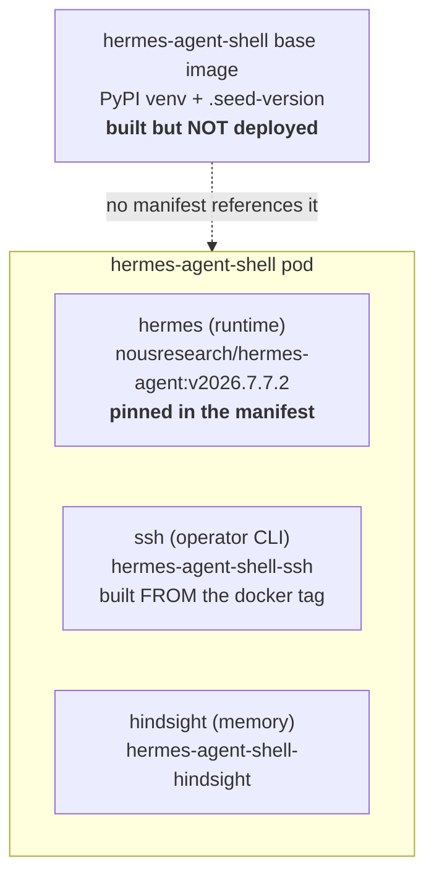



My agent shells are built from one repo — [`derio-net/agent-images`](/docs/building/14-secure-agent-pod) — and every one of those Dockerfiles hardcodes a pile of upstream versions: `talosctl`, `s6-overlay`, `supercronic`, a Hermes release tag, a ruflo git ref. Nothing watches them.

So they drift. Mine drifted until my agent shells were driving Talos with `talosctl v1.9.5` against a cluster running **v1.12.6** — three minors out, past the ±1 skew Talos supports. No alert, no symptom, no red mark anywhere. It works right up until a command touches the part of the API that moved, and then it fails looking like a cluster problem rather than a client problem.

What follows is the loop that fixes that: an **audit** that says what drifted and which of it matters, and an **update-then-verify** discipline that treats a pinned version as a claim to be checked rather than a number to be bumped.

**The load-bearing idea:** for most pins the target is "latest upstream." For `talosctl` and `omnictl` latest is *wrong* — the client must track the thing it talks to. An audit that doesn't know that will cheerfully tell you to break your skew in the other direction.

**To follow this you need** an image-build pipeline that re-pins your manifests on merge ([the CI/CD platform](/docs/operating/22-cicd-platform) does that here, on top of [the secure agent pod](/docs/building/14-secure-agent-pod)) and a cluster you can reach with `kubectl`. If you keep hardcoded version args in your own images, the shape transfers even though my pins won't.

## The loop at a glance

| Step | Command | Success signal |
|---|---|---|
| 1. Audit | `cd scripts && uv run python version_audit.py` | pins grouped by class; the `BEHIND` rows are your work-list |
| 2. Check the artifact | `gh api repos/<o>/<r>/releases/tags/<tag> --jq '.assets[].name'` | the asset the Dockerfile fetches is actually listed |
| 3. Edit the pin | one-line `ARG` change | parity test still green |
| 4. **Build the branch** | `gh workflow run build.yaml --ref <branch>` | every per-image smoke job green |
| 5. Merge → auto-bump | (the dispatch rewrites manifest pins) | bump PR opens, coverage passes, `skipped=` empty |
| 6. Verify live | `kubectl exec … -- <tool> --version` | the **pod** reports the new version |

Steps 4 and 6 are the ones people skip, and they are the two that catch things.

## 1. Audit — what drifted, and does it matter

```bash
# reads every version-bearing ARG/FROM out of the Dockerfiles and reports
# current-vs-upstream. A report, not a gate: always exits 0, and there is
# deliberately no scheduled workflow opening drift PRs.
cd scripts && uv run python version_audit.py
```

```
## rebuild-only pins - the image rebuild is the ONLY refresh path
  [  BEHIND]  S6_OVERLAY_VERSION       3.2.0.2   -> v3.2.3.2
              note: PID 1 in every agent shell - a regression stops
              containers booting rather than degrading a feature.
  [ unknown]  TALOSCTL_VERSION         v1.9.5    -> ?   (target: cluster, NOT upstream latest)
  [      ok]  TORCH_VERSION            2.13.0    -> 2.13.0

## bootstrap pins - first-boot seeds only; the tool self-updates in-pod
  [  BEHIND]  CODEX_VERSION            0.136.0   -> 0.145.0
  [UNPINNED]  @anthropic-ai/claude-code (none)   -> 2.1.218
```

### Read it through the two classes

| Class | What the Dockerfile line is | Does bumping it change a running pod? |
|---|---|---|
| **bootstrap** (`claude-code`, `codex`, `opencode`) | a first-boot seed; the CLI self-updates in-pod and floats forward via the shell inventory's `harnesses:` key | No — only what a *fresh* PVC starts from |
| **rebuild-only** (everything else) | rebuilding the image is the only path to a new version | Yes — staleness here is real |

Nine releases behind on a bootstrap pin is nearly meaningless. Three minors behind on `talosctl` is a correctness bug. Same `BEHIND` label, opposite urgency — which is why the report groups by refresh path instead of sorting by how far behind things are.

### The two pins where "latest" is the wrong answer

| Pin | Target | Why not latest |
|---|---|---|
| `TALOSCTL_VERSION` | the **cluster's** Talos version | Talos supports ±1 minor of client skew; latest puts the client *ahead* of the nodes and re-creates the drift the moment the cluster lags |
| `OMNICTL_VERSION` | the running **Omni server's** version | a client ahead of the server fails against the one control plane that manages machine config — and the server's version isn't in the repo at all (it lives in `omni.env` on the Omni host) |

Both carry an *anchor* in the script. Run without cluster access and the target prints `?`; that is the designed behaviour, not a gap:

```bash
# absolute KUBECONFIG — a relative path breaks once the script chdirs
KUBECONFIG=/abs/path/to/kubeconfig uv run python version_audit.py | grep TALOSCTL
#   [      ok]  TALOSCTL_VERSION   v1.12.6  -> v1.12.6   (target: cluster, NOT upstream latest)
```

The probe is a plain `kubectl get nodes` reading `osImage` (`Talos (v1.12.6)`). When it can't reach the cluster the target is `unknown` — never silently backfilled with the newest release. `LAST_MEASURED_CLUSTER_TALOS` at `scripts/version_audit.py:58` is the source of truth, and `scripts/tests/test_talosctl_pin_parity.py` fails the build if the two Dockerfiles that pin `talosctl` disagree with it or with each other.

## 2–3. Check the artifact, then edit the pin

Confirm the thing you're pinning to actually exists before committing — a pin at an unpublished tag is an `ImagePullBackOff` with a delay fuse:

```bash
gh api repos/aptible/supercronic/releases/tags/v0.2.47 \
  --jq '.assets[].name' | grep supercronic-linux-amd64
```

Then it's one line:

```dockerfile
# infra-shell/Dockerfile and kali/Dockerfile — same value in both
# (the parity test enforces it; the two drifting apart is the silent failure)
ARG TALOSCTL_VERSION=v1.12.6   # the CLUSTER's version, not upstream v1.13.7
```

## 4. Build the branch — the step the CI won't do for you

The trap that makes this fleet different: **its CI does not build pull requests.**

```yaml
# .github/workflows/build.yaml
on:
  push:
    branches: [main]     # <-- main only
  workflow_dispatch:
  repository_dispatch:
```

A bump PR shows a green check and has built *nothing*. Pushing the branch doesn't build it either — the `push` trigger is restricted to `main`. Dispatch it by hand:

```bash
gh workflow run build.yaml --ref <your-branch>
gh run watch
```

That runs a per-image smoke job booting each shell's `/init` under a Kubernetes-equivalent security context — precisely the failure an `s6-overlay` or base-image bump causes. Three defects that a green PR check would have waved through were caught here: a local patch that no longer applied, and two smoke assertions pinned to that patch.

## 5–6. Verify the running pod, not the image

After the merge, the dispatch rewrites the manifest pins and ArgoCD rolls the images. Now check the claim against reality:

```bash
# talosctl skew closed? ask the client that actually runs in the shell
kubectl exec -n secure-agent-pod <pod> -c kali -- talosctl version --client
#   Tag:  v1.12.6      <- matches the cluster
```

```bash
# and re-audit against the live cluster: every pin 'ok', anchor resolving
KUBECONFIG=/abs/path uv run python version_audit.py
```

"Verify the pod" is a rule rather than a nicety because a tool installed on a PVC can keep serving the old version behind a seed marker while the image ships a new one — pod Ready, ArgoCD green, wrong version running. The image tag is not evidence. `<tool> --version` inside the container is.

## Recover — when a bump lands wrong

- **`ImagePullBackOff` after a bump.** The pin points at a tag that never published, usually one flaky build leg. The auto-bump PR lists these in its `skipped=` output and leaves that image on its previous SHA. Re-run the leg, let it publish, re-bump.
- **A tool misbehaves but the pod is green.** Suspect the image-vs-pod gap above. Run `<tool> --version` *inside the running container*; if it disagrees with the image tag, the PVC copy is stale and needs its seed marker to change.
- **A local patch stops applying mid-build.** Don't reflexively rebase it — read the upstream change first. See below.
- **The audit disagrees with a written table.** Trust the audit run against the live cluster. The cluster is what `talosctl` must match, and the cluster moves.

## Reference — which pin moves what

A version bump only matters if the pin you moved is the one the running thing uses. My Hermes pod is the cautionary example: three Hermes provenances, only one of them a swept image.



| If you bump… | …you change | To move the running agent |
|---|---|---|
| `HERMES_VERSION` (PyPI) in the base image | an image **nothing deploys** — CI smoke is its only validation | it doesn't move anything running |
| `HERMES_TAG` in `hermes-agent-shell-ssh` | the operator CLI sidecar | `hermes --version` in the **`ssh`** container |
| the `nousresearch/hermes-agent:<tag>` line in the **manifest** | the runtime agent loop | this is the pin that matters |

`hermes --version` answers differently per container — one is built FROM the tag, the other pins it directly. Check the container you mean. (Hermes also tags calver on git/Docker but semver on PyPI: `v2026.7.20` *is* `0.19.0`. Map before assuming two pins match — see the [Hermes shell post](/docs/operating/28-hermes-shell).)

## Explanation — why a pin is a claim

A version in a Dockerfile isn't a fact. It's a claim: that this version exists, is compatible, and is actually running. The audit checks the first two; the live `--version` checks the third.

Every real problem I found lived in that gap. `talosctl` was pinned but wrong for the cluster it drove. A Hermes bump shipped in an image nothing deployed. A local patch was carefully maintained after upstream had already absorbed it — the build failed on a zero-fuzz `git apply`, and the correct fix was to *delete* the patch, because upstream had turned the exact behaviour it hacked in into a config knob. A patch that stops applying is upstream telling you something changed; read the change before you re-apply it.

None of those showed up as a red mark. You find them by checking the claim, not by reading the number.
