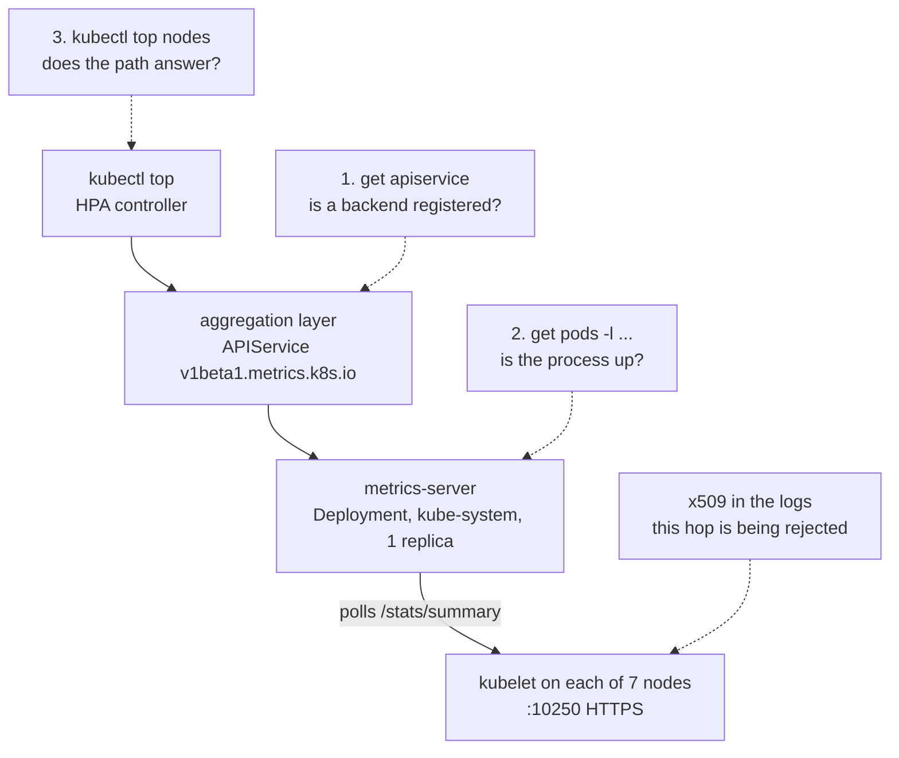



metrics-server serves the resource Metrics API (`metrics.k8s.io`) on Frank. It runs as a single Deployment in `kube-system`, managed by ArgoCD. This is the companion reference to [The Metrics API](): the commands you actually run day to day.

One `kubectl top` answer travels four hops. Each check in **Verify** cuts the chain at a different point, which is what makes them worth running in order:



The building companion carries the architecture diagram — why this path exists at all, and the option that was rejected. This one is for finding which hop is broken.

## What Healthy Looks Like

- `v1beta1.metrics.k8s.io` reads `AVAILABLE=True`.
- One `metrics-server` pod in `kube-system`, `1/1 Running`.
- `kubectl top nodes` prints seven rows with non-zero CPU and memory.
- Every  on the cluster reports a real percentage in `TARGETS`, not `<unknown>`.

Pod readiness is deliberately not on that list. Ready means the pod's own probe passed; it says nothing about whether kubelet scrapes are succeeding. The third bullet is the real signal.

## Verify

Three checks, cheapest first. Output captured 2026-08-03.

**1. Is a backend registered, and is it answering?**

```console
$ kubectl get apiservice v1beta1.metrics.k8s.io
NAME                     SERVICE                      AVAILABLE   AGE
v1beta1.metrics.k8s.io   kube-system/metrics-server   True        9d
```

`NotFound` means nothing serves the API at all, and `kubectl top` will say `error: Metrics API not available`. `AVAILABLE=False` is a different problem — something is registered but not answering, so go to check 2. Expect `False` for roughly the first 30 seconds after a deploy or a restart, while the first scrape window lands.

**2. Is the process up?**

```console
$ kubectl -n kube-system get pods -l app.kubernetes.io/name=metrics-server
NAME                              READY   STATUS    RESTARTS      AGE
metrics-server-6d9fff4668-8g9vc   1/1     Running   6 (14h ago)   9d
```

**3. Does the whole path answer?**

```console
$ kubectl top nodes
NAME      CPU(cores)   CPU(%)   MEMORY(bytes)   MEMORY(%)
gpu-1     1325m        4%       24260Mi         18%
mini-1    394m         2%       9192Mi          14%
mini-2    989m         7%       15257Mi         24%
mini-3    693m         4%       9002Mi          14%
pc-1      434m         10%      4982Mi          15%
raspi-1   528m         13%      1694Mi          51%
raspi-2   628m         15%      1893Mi          57%
```

Seven rows with real numbers means everything downstream works — `kubectl top pods`, and every HPA on the cluster.

Two checks are deliberately not repeated here: reading the rendered arg list to prove `--kubelet-insecure-tls` is live, and asking an HPA's `.status.conditions` whether the *controller* (not just a human) can read the API. Both belong to the deploy-time path and are in the building companion's *Verifying the Metrics API* section. Use them when you have just changed the values file; use the three above when something has gone quiet.

## Steps

### Add a CPU or memory HPA

The common case. The **target Deployment must declare CPU (or memory) `requests`** — the HPA computes utilization as a percentage of the request, so with no request it cannot compute anything and `TARGETS` stays `<unknown>`.

```bash
kubectl autoscale deployment <name> -n <ns> --cpu=70% --min=1 --max=4
```

Then read it back. Frank ships exactly one HPA, on the Tekton webhook, and it is the reference for what a working one looks like:

```console
$ kubectl get hpa -A
NAMESPACE          NAME                       REFERENCE                             TARGETS         MINPODS   MAXPODS   REPLICAS   AGE
tekton-pipelines   tekton-pipelines-webhook   Deployment/tekton-pipelines-webhook   cpu: 18%/100%   1         5         1          126d
```

A real percentage is the pass; `<unknown>/100%` means the Metrics API is not serving that workload's pods. The `18%` is a dated sample and nothing more — the same command read `cpu: 1%` on 2026-08-01 and `2%` later the same day. The command is the durable artefact, the digit is weather.

For anything ArgoCD-managed, declare the HPA in git rather than imperatively, and add an `ignoreDifferences` on `/spec/replicas` for the target Deployment so ArgoCD and the HPA do not fight over the replica count.

> **Note:** this is CPU/memory autoscaling only. Scaling on *custom* metrics (queue depth, , tokens/s) needs a separate adapter that Frank does not run yet — tracked in [#701](https://github.com/derio-net/frank/issues/701). metrics-server serves `metrics.k8s.io` and nothing else.

## The failure mode: pod Ready, `top` empty

This is the one that wastes an afternoon. `kubectl top nodes` returns `error: Metrics API not available` or empty rows, **while the metrics-server pod is `Running` and `Ready`.** Ready means the pod's own probe passed — it says nothing about whether kubelet scrapes are succeeding, which is the bottom hop of the diagram above.

Go straight to the logs:

```bash
kubectl logs -n kube-system -l app.kubernetes.io/name=metrics-server --tail=50
```

- **`x509: certificate signed by unknown authority`** → the `--kubelet-insecure-tls` arg is missing or did not apply. Talos kubelets present self-signed serving certs, so without that flag every scrape is rejected at the TLS handshake. It is the only arg `apps/metrics-server/values.yaml` sets; the building companion shows how to read the rendered arg list back and why re-declaring other flags only appends duplicates.
- **`unable to fully scrape metrics ... <node>`** for one node → that kubelet is unreachable (node NotReady,  flap, firewall). Cross-check `kubectl get nodes` and that node's health. One bad node degrades `top` for that node only; the other six keep answering.
- **Clean logs but `top` empty for ~30s after a restart** → normal. The APIService reads `Available=False` until the first scrape window lands. Wait, do not restart — restarting resets the window and makes the wait start over.

## Recover

metrics-server is stateless. Restarting is safe and loses only the in-memory scrape window, which repopulates in about 15 seconds:

```bash
kubectl rollout restart deployment metrics-server -n kube-system
```

That 15 seconds is `--metric-resolution=15s`, which comes from the **chart's defaults** — `apps/metrics-server/values.yaml` does not set it. If you change the resolution expecting the values file to be the lever, you will be editing the wrong file.

Config changes go through git: edit `apps/metrics-server/values.yaml`, commit, let ArgoCD sync. The Application to sync is the leaf `metrics-server`, not `root` — the root App-of-Apps only re-templates the Application spec, while the values file is pulled by the leaf through its `$values` source ref. A hard refresh is a reasonable first try:

```bash
kubectl annotate application metrics-server -n argocd argocd.argoproj.io/refresh=hard --overwrite
```

Do not treat it as the recovery, though. Frank's own incident record has `refresh: hard` failing to clear a stale Application twice in one session; what cleared both, within seconds, was an explicit sync operation. Pass `syncOptions` explicitly — a manually-triggered sync does **not** inherit `spec.syncPolicy.syncOptions`:

```bash
kubectl -n argocd patch application metrics-server --type=merge \
  -p '{"operation":{"sync":{"revision":"HEAD","syncOptions":["ServerSideApply=true","RespectIgnoreDifferences=true"]}}}'
```

metrics-server is exactly the shape most exposed to that staleness: a multi-source Application combining an upstream chart with a `$values` ref into this repo. So finish by asserting on the artefact rather than the tile — read the rendered args back, or re-run check 1. `Synced` is a claim about a comparison, not about the cluster.

## Operational caveats

**One replica, and it is the only aggregated API on the cluster.** Two separate facts that compound. The single replica is a deliberate footprint choice recorded in the values file — metrics-server is stateless and cheaply restarted, so a brief gap is acceptable. The second fact is that `v1beta1.metrics.k8s.io` is the only APIService on Frank backed by a Service at all, which makes it the only one whose unavailability can slow API discovery:

```console
$ kubectl get apiservice | grep -v Local
NAME                     SERVICE                      AVAILABLE   AGE
v1beta1.metrics.k8s.io   kube-system/metrics-server   True        9d
```

Every other row of `kubectl get apiservice` reads `SERVICE: Local` — served by the API server itself, with nothing to become unavailable. So if several unrelated ArgoCD apps go `ComparisonError` at once, check metrics-server before chasing each app individually.

**Nothing pages when this layer stops working.** No Grafana rule under `apps/grafana-alerting/manifests/` mentions metrics-server or `metrics.k8s.io`, and `docs/runbooks/manual-operations.yaml` has no entry for it either. The building companion's thesis is that Ready is not working; the operating consequence is that when this breaks, the things that notice are a human typing `kubectl top` and an HPA quietly reporting `<unknown>` — neither of which is a page. Until that changes, check 1 and check 3 are the monitoring.

## Quick Reference

| Question | Command | Honest signal |
|---|---|---|
| Is a backend registered? | `kubectl get apiservice v1beta1.metrics.k8s.io` | `AVAILABLE=True`, not the pod's phase |
| Is the process up? | `kubectl -n kube-system get pods -l app.kubernetes.io/name=metrics-server` | `Running` — but Ready proves nothing here |
| Does the path answer? | `kubectl top nodes` | seven rows with non-zero numbers |
| Which hop is rejected? | `kubectl logs -n kube-system -l app.kubernetes.io/name=metrics-server --tail=50` | `x509` = kubelet hop; per-node = that node |
| Can an autoscaler read it? | `kubectl get hpa -A` | a real percentage, not `<unknown>` |
| Anything else aggregated? | `kubectl get apiservice \| grep -v Local` | exactly one row |
| Force a real resync | `kubectl -n argocd patch application metrics-server --type=merge -p '{"operation":{"sync":...}}'` | the rendered args, not `Synced` |

## References

- Building companion: [The Metrics API]() — the fork, the Talos flag, and the deploy-time verification path
- [Operating on Green]() — the `Synced`-against-a-stale-revision incident behind the Recover section
- Issue: [#394](https://github.com/derio-net/frank/issues/394) · Deferred adapter: [#701](https://github.com/derio-net/frank/issues/701)
- Gotcha: `agents/rules/frank-gotchas.md` → *Other in-cluster apps* (metrics-server / Talos); `docs/runbooks/frank-gotchas/argocd.md` → *`Synced` against a stale revision*
