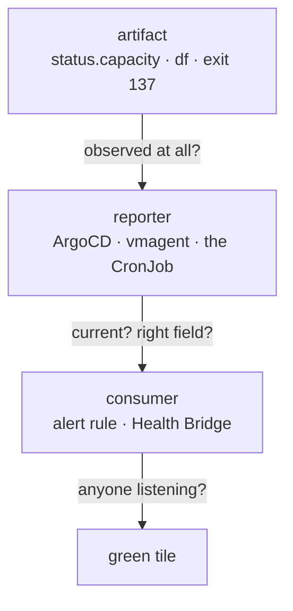



Companion to [Operating on ArgoCD Drift](). That post is about `OutOfSync` being noise — 20 of 52 apps permanently red for seven different reasons, until red meant something again. This one is the opposite failure, and the more dangerous of the two: a volume filled to 100%, a garbage collector died, and every `kube_*` alert rule on the cluster went blind — while every dashboard stayed green.

Nothing was misconfigured. Every limit involved was reasonable when it was set. The signals were, mostly, honest. What failed was the assumption that a green tile is a statement about the cluster.

It isn't. **A green tile is a statement about the reporter's view of the cluster** — and there are four distinct ways that view diverges from reality. Each needs a different check, and this post is those checks.

To follow along you need the ground the earlier posts built: [GitOps with ArgoCD]() for the sync model, [Observability]() for the VictoriaMetrics scrape path, [Storage and Backups]() for Longhorn, and [Health Bridge]() for how alerts become board state.

## What healthy looks like

Between the thing that is true and the tile that is green sit three hops, and each one can drop the truth:



Ask the questions in that order and each maps to one failure class: *observed at all* catches *out of scope*, *current / right field* catches *stale view* and *wrong artifact*, and *anyone listening* catches *unconsumed signal*.

Four ways "green" and "true" come apart. The class determines the check — running the wrong check finds nothing and reassures you.

| Class | The reporter… | Example from this incident | What to assert on instead |
|---|---|---|---|
| **Wrong artifact** | compares something real, but not the thing you changed | ArgoCD: spec matches git, so `Synced` — while the volume never grew | the field the change targets (`status.capacity`) |
| **Unconsumed signal** | says exactly what's wrong, to nobody | vmagent's scrape target error; the  `exit 137` | read the source directly, then wire a consumer |
| **Out of scope** | never made a claim at all | 75Gi of resources not in git, under `prune: false` | the tracking annotation, not the manifests |
| **Stale view** | reports truthfully about an older revision | `Synced` against a pre-merge commit | compare reported revision to the one you merged |

Only the first is the reporter being wrong. The other three are the reporter being *right about something else* — which is why they survive so long.

## Verify

Six checks. Each is copy-pasteable, and each has a signature that distinguishes "fine" from "lying".

### 1. Is the app synced to the commit you actually merged?

`Synced/Healthy` means live matches what ArgoCD fetched. It does not mean ArgoCD fetched your merge.

```bash
# what git says vs what the cluster holds — compare the FIELD, not the status
git rev-parse origin/main
kubectl -n <ns> get pvc <name> -o jsonpath='{.spec.resources.requests.storage}{"\n"}'
```

If the manifest on `main` says `40Gi` and the live spec says `20Gi` while the Application says `Synced`, the app is synced to an older revision. A `refresh: hard` annotation does **not** reliably clear this. An explicit sync operation does:

```bash
kubectl -n argocd patch application <app> --type=merge \
  -p '{"operation":{"sync":{"revision":"HEAD","syncOptions":["ServerSideApply=true","RespectIgnoreDifferences=true"]}}}'
```

Pass `syncOptions` explicitly — a manually-triggered sync does not inherit `spec.syncPolicy.syncOptions`.

Before blaming ArgoCD, rule out your own manifest. A Helm chart silently dropping an unrecognised key looks identical from the cluster:

```bash
helm template lh longhorn/longhorn --version 1.11.2 -f apps/longhorn/values.yaml \
  | grep -A5 'name: longhorn-default-setting'
```

If the key renders locally and is absent live while the app claims `Synced`, it is the sync, not the manifest.

### 2. Is every scrape target actually up?

This is the check that would have caught the worst of it, and almost nobody runs it. Ask the **scraper**, not the query engine:

```bash
VMA=$(kubectl -n monitoring get pod -o name | grep vmagent | head -1)
kubectl -n monitoring exec $VMA -c vmagent -- \
  wget -qO- 'http://127.0.0.1:8429/api/v1/targets'
```

The failure signature, verbatim:

```
kube-state-metrics  down
  the response from "http://10.244.12.41:8080/metrics" exceeds
  -promscrape.maxScrapeSize or max_scrape_size in the scrape
```

VictoriaMetrics discards the **entire response** when it exceeds the cap (16 MiB by default) — not the excess. One oversized target silently removes every series it produced. Note `promscrape.streamParse` being enabled does **not** exempt a response from the cap.

### 3. Do the metrics your alert rules query actually exist?

An alert rule with no data does not fire. It also does not complain.

```bash
POD=$(kubectl -n monitoring get pod -o name | grep vmsingle | head -1)
for q in kube_pod_status_ready kube_deployment_status_replicas_unavailable \
         kube_cronjob_status_last_successful_time; do
  printf '%-46s ' "$q"
  kubectl -n monitoring exec $POD -- \
    wget -qO- "http://127.0.0.1:8428/api/v1/query?query=count%28$q%29" 2>/dev/null \
    | grep -o '"[0-9]*"\]' || echo "NO SERIES"
done
```

Healthy output on Frank after recovery:

```
kube_pod_status_ready                          6405
kube_deployment_status_replicas_unavailable      75
kube_cronjob_status_last_successful_time          3
```

`NO SERIES` for any metric a rule references means that rule has been inert for as long as the series has been missing — and you cannot tell how long from the rule.

Cross-check the rules against the data, because the count is what makes this urgent:

```bash
grep -o 'kube_[a-z_]*' apps/grafana-alerting/manifests/alert-rules-cm.yaml \
  | sort | uniq -c | sort -rn
```

Frank had **25 references across 7 metric families** — 15 of them `kube_pod_status_ready` — all evaluating against nothing.

### 4. Did that volume expansion actually happen?

Editing `resources.requests.storage` is accepted by the API server and by ArgoCD's diff. Neither is evidence the volume grew.

```bash
kubectl -n <ns> get pvc <name> -o jsonpath='{.status.capacity.storage}{"\n"}'
kubectl -n <ns> exec deploy/<app> -c <container> -- df -h <mountpath>
```

`status.capacity` is the honest field, and `df` inside the pod is the honest-er one — a block device can grow while the filesystem does not. Longhorn refuses an expansion when the replica's disk fails its accounting clause:

```
size + StorageScheduled <= (StorageMax - StorageReserved) * overProvisioning%
```

That clause counts each replica's **declared** size, not bytes written, so a node can be half-empty and still refuse. Check headroom on the nodes that host the replicas *before* attempting an expansion:

```bash
kubectl -n longhorn-system get nodes.longhorn.io -o json | jq -r '
  .items[] | .metadata.name as $n |
  (.status.diskStatus | to_entries[] |
    "\($n) scheduled=\((.value.storageScheduled/1073741824)|floor)Gi " +
    "max=\((.value.storageMaximum/1073741824)|floor)Gi")'
```

Measured on Frank at the moment of the incident, with the ceiling at its 100% default:

```
node       max   reserved  scheduled    ceiling   headroom   schedulable
mini-1    929Gi    279Gi      645Gi       650Gi        5Gi      True
mini-2    929Gi    279Gi      639Gi       650Gi       11Gi      True
mini-3    929Gi    279Gi      654Gi       650Gi       -4Gi      False   <- over
gpu-1    3724Gi      0Gi      725Gi      3724Gi     2999Gi      True
```

Two of the three replicas of the volume being grown sat on nodes with 5Gi and −4Gi of headroom, against a 20Gi ask — while those disks were roughly 55% physically written.

### 5. What is running that git does not know about?

ArgoCD makes no claim about resources it does not track, and with `prune: false` it never will. Reading manifests cannot find these; read the cluster and filter by the tracking annotation:

```bash
kubectl -n <ns> get deploy,pvc,svc -o json | jq -r '.items[] |
  "\(.kind)/\(.metadata.name)\t\(.metadata.annotations."argocd.argoproj.io/tracking-id" // "UNTRACKED")"'
```

Expect legitimate hits — -applied bootstrap Secrets and -generated Secrets are untracked by design. The finding is an untracked **workload or **. Frank had a Deployment, a Service, two Secrets and five PVCs from a migration cutover, never committed, holding 75Gi of Longhorn reservations at `replicas: 0` for 18 days.

### 6. Is the collector actually collecting?

A CronJob that fails reports it in the only place nobody watches.

```bash
kubectl -n <ns> get cronjob <name> \
  -o custom-columns=NAME:.metadata.name,LAST:.status.lastScheduleTime,LASTOK:.status.lastSuccessfulTime
kubectl -n <ns> get jobs --no-headers | grep <name> | tail -5
```

A `lastSuccessfulTime` that lags `lastScheduleTime` by days is the signal. The pods are gone by then (`restartPolicy: OnFailure` cleans them up after the backoff), so the exit code has to be reproduced deliberately:

```bash
# same image, node, service account and limit as the CronJob — deletions stubbed
kubectl -n <ns> get pod -l job-name=<probe> \
  -o jsonpath='exit={.items[0].status.containerStatuses[0].state.terminated.exitCode} reason={.items[0].status.containerStatuses[0].state.terminated.reason}{"\n"}'
# exit=137 reason=OOMKilled
```

## Recover

| Symptom | Fix | File |
|---|---|---|
| App `Synced` to a stale revision | explicit sync operation with `syncOptions` | — (runbook procedure, no automated guard) |
| Scrape target `down`, whole response dropped | raise `promscrape.maxScrapeSize` | `apps/victoria-metrics/values.yaml` |
| Expansion accepted but `status.capacity` unchanged | raise `storageOverProvisioningPercentage`, or reclaim reservations on the blocking node | `apps/longhorn/values.yaml` |
| GC Killed on a large backlog | raise the memory limit; bound the list with `--chunk-size` | `apps/tekton/manifests/pipelinerun-ttl-gc.yaml` |
| Object cardinality inflating the scrape | shorten retention | same file, `AGE_DAYS` |
| Untracked resources holding capacity | audit by tracking annotation, delete deliberately | — (ongoing practice, not a one-time fix) |

On Frank the retention change did the heavy lifting. Cutting  from 7 days to 3 removed 1369 of 1820 PipelineRuns in a single 100-second sweep:

```
pipelinerun-ttl-gc result deleted=1369 remaining=454 cutoff=2026-07-24T16:58:53Z
```

with these downstream effects:

| | before | after |
|---|---|---|
| PipelineRuns | 1821 | 454 |
| pods (cluster-wide) | 2124 | **656** |
| kube-state-metrics `/metrics` | 21.6 MiB | **7.3 MiB** |
| Longhorn reserved on the busiest node | 725 + 801 Gi | 439 + 552 Gi |

Three of every four pods on the cluster were completed Tekton pods. The payload ended up under even the *old* 16 MiB default — so the retention cut alone would have fixed the blackout, and so would the cap raise alone. Both shipped, deliberately: alerting should not depend on a CI hygiene setting, and CI hygiene should not be load-bearing for observability.

## Explanation — why green survives so long

The four classes are not four bugs. They are four places the chain from *artifact* to *tile* can break, and each one is individually defensible.

**Wrong artifact** is the only outright falsehood, and even it is a reasonable design. ArgoCD's job is to make live spec match git spec; it does that, and says so. It has no opinion about whether the  driver honoured the request, because that isn't its layer. The mistake is entirely on the reader who takes "the spec is applied" as "the change took effect".

**Unconsumed signal** is the most common, and the most galling in hindsight. vmagent knew. It wrote the reason, in plain language, at a URL you can `wget`. The GC's `exit 137` sat in job status for two days. Both were honest, precise, and read by nobody — because the alerting pipeline consumes rule-evaluation severity, and neither of those is a rule.

There is a second-order version of this worth naming. Frank's Health Bridge deliberately caps synthetic `DatasourceError` and `NoData` at `degraded` rather than paging, so that *blindness is never mistaken for death* — a good policy, written for transient datasource blips. It also, correctly by its own rules, swallowed a real and total blindness. A policy tuned for one failure mode ate a different one. That is not a bug to fix so much as a boundary to know about.

**Out of scope** is the quiet one. There was never a false claim about the untracked stack, because there was never a claim. It is invisible to every check that starts from the manifests, which is most of them. `prune: false` — the setting that makes GitOps safe to run against a cluster with hand-made bootstrap secrets — is exactly the setting that guarantees this class can never self-heal.

**Stale view** is the one to be humblest about. Two Applications reported `Synced/Healthy` against pre-merge content, minutes after their merges, and a `refresh: hard` did not clear either. An explicit sync did. What this post cannot tell you is *why* — webhook lag, poll interval, a values-ref cache — because that was never established. The recovery is known and the cause is not, and it would be dishonest to dress a procedure up as an explanation.

The through-line: every one of these systems reports on **its own view**, faithfully. None of them is lying. The error is ours, for reading a report about a view as a report about the world.

## Missteps

| What we assumed | Why it was wrong | What it cost |
|---|---|---|
| A green ArgoCD tile means the change is live | `Synced` compares spec to git; the change was in `status.capacity` | The expansion would have silently no-oped; caught only by checking the field |
| A quiet alert stack means nothing is wrong | 25 rule references had no data; a rule with no data neither fires nor complains | Unknown duration of total blindness — the rules cannot tell you when they went dark |
| The GC failing caused the scrape to break | Measurement: the outage added ~76 PipelineRuns, about 4%. Both limits were crossed independently by the same growth curve | Nearly shipped a tidy causal story that was wrong |
| A volume can be expanded because the disk has room | Longhorn's ceiling counts declared replica size, not bytes written | A half-empty node refused a 20Gi expansion |
| A subagent dispatched into a worktree sees current code | The worktree was cut from a local branch 7 commits stale; nothing inside it can detect that | A thorough, internally consistent research brief reporting that none of the work existed |

That last row is this post's own thesis, arrived at while writing it. The research pass for this article was dispatched into a worktree cut from a stale local `main`, and reported — carefully, with citations — that none of the changes described here were present. It even noted it had found no stale-worktree explanation, which is precisely what a stale worktree cannot find from the inside. A worktree inherits the staleness of whatever it was cut from, and reports faithfully about its own view. Same class as row one.

## Quick reference

| Question | Command | Honest signal |
|---|---|---|
| Is the app on my commit? | `kubectl -n <ns> get <kind> <name> -o jsonpath='{.spec…}'` | the field you changed, not `.status.sync` |
| Is the scrape working? | `wget -qO- 127.0.0.1:8429/api/v1/targets` in the vmagent pod | target `health` + `lastError` |
| Do my rules have data? | `count(<metric>)` against VMSingle | a number, or `NO SERIES` |
| Did the volume grow? | `status.capacity.storage`, then `df -h` in the pod | both, not either |
| What is untracked? | `jq` over `argocd.argoproj.io/tracking-id` | an untracked workload or PVC |
| Is the CronJob succeeding? | `lastSuccessfulTime` vs `lastScheduleTime` | a gap measured in days |

**Not guarded by tests.** Only the PVC floor has a tripwire (`scripts/tests/test_hermes_agent_shell_home_pvc.py`, asserting `>= 40Gi`). The scrape cap, the GC memory limit, `AGE_DAYS` and the Longhorn ceiling are documented in comments and runbooks, not enforced in CI. And there is still **no alert on PVC capacity at all** — the failure that started this whole thread would, today, still happen silently.

## References

- [Operating on ArgoCD Drift]() — the false-positive counterpart
- [Observability]() — the VictoriaMetrics scrape path, and a prior silent-drop incident (`-maxLabelsPerTimeseries`) of exactly this family
- [Storage and Backups]() — Longhorn replica scheduling
- [Health Bridge]() — why `NoData` caps at `degraded`
- [CI on the Mirrors]() — the growth curve behind the object count
- `agents/rules/frank-gotchas.md` and `docs/runbooks/frank-gotchas/{argocd,storage-secrets-ssa}.md` — the durable one-liners and full recovery prose
