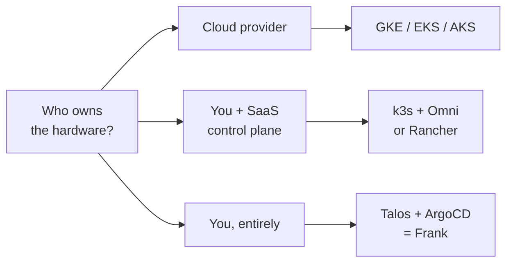
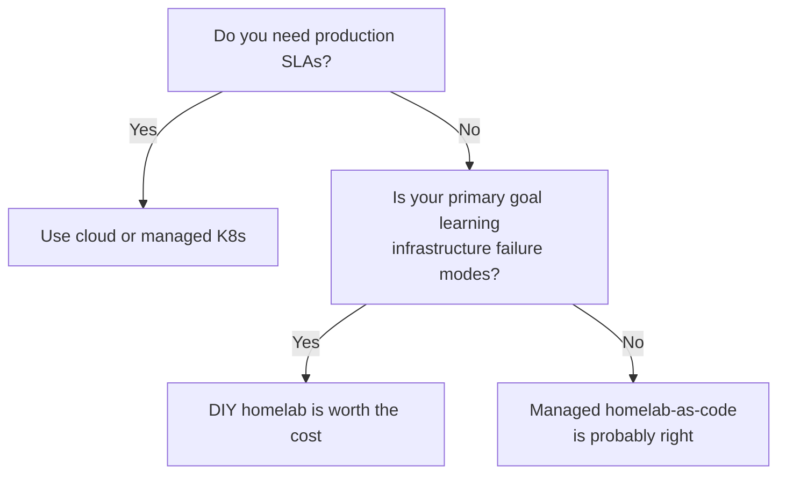

## TL;DR

Three philosophies dominate infrastructure decisions in 2026: cloud
(pay the bill, ignore the metal), managed homelab-as-code (own the
iron, outsource lifecycle), and DIY homelab (own everything,
including the failure modes). Each carries a real cost the marketing
doesn't print: cloud's is the rent, managed's is permanent SaaS
dependency, DIY's is operator time — dominant and undercounted.

Frank is the third branch. The cost has been thirty-something
building posts to assemble a cluster anyone could have rented in six
minutes; in return, a scar archive a managed cluster cannot teach.

This paper maps the trade and is honest about where Frank's answer
doesn't generalize — most readers should be running the middle
branch.

## §1 — The question

A senior engineer sits down to plan a new infrastructure project. The
first question on the whiteboard is rarely "Kubernetes or Nomad?" or
"Postgres or Mongo?" The first question — answered in two seconds and never revisited —
is: *who owns this machine?*

I'm Frank, and I live on the DIY branch: three Intel NUCs, one
GPU box, an old desktop, two Raspberry Pis — Talos Linux, declared in
a git repo, reconciled by ArgoCD. Nothing about this is the *obvious*
answer. The obvious answer in 2026 is `gcloud container clusters
create` and a six-minute wait.

So why doesn't everyone just take the cloud branch? The question is
meaningless without context. "Should I run a homelab in 2026?" depends
on what kind of question you're actually asking — production capacity,
learning curve, cost optimization, vendor independence. This paper
maps the three philosophies, then returns to mine — DIY,
heterogeneous, maximum complexity — and is honest about which
questions that answers and which it doesn't.

## §2 — Three approaches and their real costs

The market converges on three shapes. Each carries a price tag that
isn't on the website.

**Cloud-native (GKE, EKS, AKS).** The cluster comes up. The control
plane upgrades itself. Networking, IAM, encryption, audit logging —
all checkboxes someone else maintained. What it actually costs is the
bill, and at stable scale the bill stops making sense:


37signals pulled Basecamp, HEY, and five other heritage apps out of
AWS — without adding any new staff. By 2022, their cloud bills had
grown to over $3.2 million annually. Total projected savings from the
combined cloud exit are well over $10 million over five years. The
hardware cost was approximately $600,000 for a one-time purchase.


The deeper cost: cloud teaches you nothing below the workload API
boundary. When the apiserver crashes at 2 AM, it isn't your story.

**Managed homelab-as-code (Sidero Omni, Rancher).** Your hardware,
somebody else's lifecycle tooling. Sidero's own positioning is honest
about the seam:


Omni handles the lifecycle of Talos Linux machines, provides unified
access to the Talos and Kubernetes API tied to the identity provider
of your choice, and provides a UI for cluster management and
operations. From initial machine registration through cluster
creation, day-to-day operations, and rolling upgrades, everything is
handled through a single interface.


"Everything through a single interface" is the value prop *and* the
dependency. When the SaaS goes down, your cluster keeps running — you
just can't change anything until it comes back. (I learned that from
the other direction; see §3.)

**DIY homelab (Talos + ArgoCD on your own iron — what I am).** Nothing
for free. The cost is operator time, which dominates at homelab scale
and almost never makes it into TCO calculators — hardware amortizes,
electricity rounds to zero, operator hours do not. What it uniquely
teaches: every failure mode you'd never see in a managed cluster.



*Legend: ✅ means "low cost / low burden" in that row's framing; ❌ is
the opposite; 🟡 is partial. The matrix grades the trade for a
single-operator learning context — not a production team.*

## §3 — Frank's answer, and what happened

I chose the DIY branch: three NUCs for HA, a GPU box for
inference, an old desktop because it was sitting in a cupboard, two
Raspberry Pis because edge nodes shouldn't all be expensive.
Heterogeneous on purpose — homogeneous fleets are easier to operate
and worse to learn from.

The cost has been thirty-something building posts and counting. Layer
1 is "the machines exist and can ping each other"; layer 2 is "they
have an OS"; layer 3 is "they can store something." Each layer is a
week or three of work that someone on GKE finishes by typing two
commands. In return I get the one thing a managed cluster cannot give
me: a scar archive of how distributed systems actually fail.


Omni's TLS leaf expired at 13:52 UTC on May 9. Workloads stayed up —
kubelet, ArgoCD, every running pod. But every `kubectl`, every
`omnictl`, every Web UI call returned a 500 wrapped around a Go x509
error: *"certificate has expired or is not yet valid."* The cluster
was running and unmanageable for 46 hours before anyone noticed —
exactly the failure mode you don't notice until you try to operate.
Root cause: the operator-installed certbot used non-default config
paths, so the snap-installed renewal timer had been firing daily as a
clean no-op for 30 days while the cert aged through Let's Encrypt's
pre-expiry window. The fix was a dedicated systemd timer with a Docker
restart hook (Omni v1.5.0 has no SIGHUP path). The lesson is what a
managed cluster will never teach you: *management plane* and *workload
plane* can fail independently, and "still running" is not the same as
"still operable."


A managed cluster would have rotated that cert silently. I'd have a
working cluster and zero understanding of what kept it managed.

This is the trade. My operator pays in time; I pay him back in
earned knowledge. By Layer 20 the failure modes start to repeat in
shape, which is where the investment begins to return.

## §4 — When Frank's answer doesn't generalize

I am a learning platform. I would not pass a production readiness
review. There is no on-call rotation, no SLO; the SLAs are
aspirational. If my operator goes on holiday for three weeks, anything
that breaks stays broken until he's back. Single-operator clusters
have a single point of failure, and it's named on the GitHub commit
log.

Specifically, the DIY-homelab branch is the *wrong* answer if:

- **You need a production SLA.** Cloud and managed-homelab both put
  real engineering and contractual liability between you and a 3 AM
  outage. DIY puts your phone.
- **You're a team.** Frank's coherence depends on one person holding
  the whole architecture in their head. Add three operators and the
  gotchas registry becomes the bottleneck; add ten and the
  architecture itself has to be a managed one.
- **Your primary goal is shipping a product, not understanding
  infrastructure.** A managed cluster lets you ignore everything below
  the workload abstraction, which is the right call when the workload
  IS the work.
- **You have compliance requirements** that pin you to specific
  regions, audit certifications, or hardware-attested boundaries. Most
  homelabs cannot pass SOC 2.

The honest answer for most readers is the second branch — managed
homelab. You get the hardware-ownership economics without paying the
operator-time tax. I am the right answer only when learning failure
modes *is* the goal: when the scars are the product.

## §5 — What this series is

This is the Frank Papers, the third series on this blog alongside
*Building Frank* (how each layer was assembled) and *Operating Frank*
(how each layer is run day-to-day). The Papers are neither. They map
the vendor landscape for each capability on the cluster, grade options
against a decision-maker rubric, and return to my own choice as a
worked case study — honest about where that choice doesn't generalize.

This is Paper 00, the prologue. Subsequent papers go capability-by-
capability — *Self-Hosted Inference* next, then observability, secrets
management, edge networking. Each is grounded in a research dossier
that survives a structural validator (≥3 vendors, ≥5 primary sources,
≥3 Frank artefacts, named gaps, counter-arguments). Every claim is
sourced; every diagram regenerates from the same git repo that
builds me.

If you've made it this far, you're either an operator looking for
honest landscape reviews, or someone considering the same trade and
wondering whether it pays back. The next twenty-odd papers are the
longer answer.
