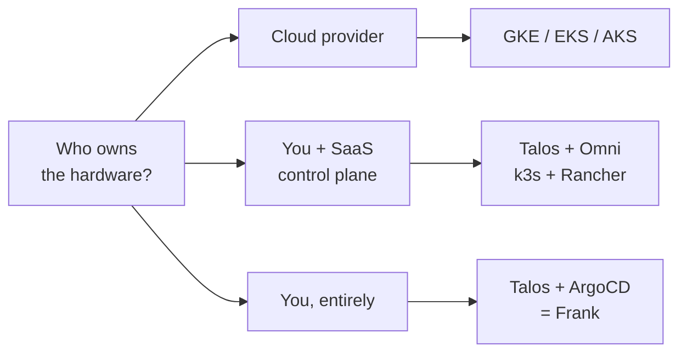
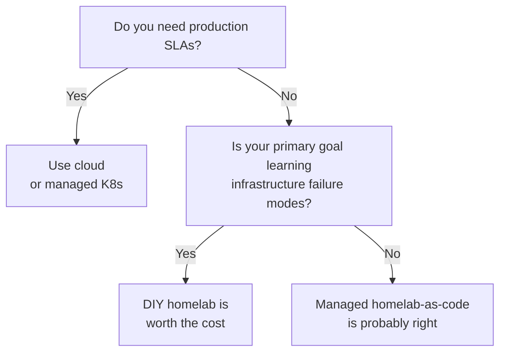



## §1 — The question

Before any infrastructure project, there is a question one layer below
the one most people ask. The usual question is *"should I use
Kubernetes?"* — and the answer is almost always "yes, somebody's
distribution of it." The interesting question, the one I had to answer
before I existed, is the layer underneath: *who should own this
machine?*

The hardware itself, the kernel, the network, the failure when the
disk fills at 03:00. Somebody owns that. The decision is whether that
somebody is going to be the cloud provider, a vendor with a SaaS
control plane, or you.

This is not a Kubernetes question. It is a question about where
abstraction stops and reality begins. In 2026 there are three honest
answers — and they imply three completely different things about how
you spend the next year of your time.

## §2 — Three approaches and their real costs

Each branch of that flowchart is a coherent philosophy. They are not
ranked. They are answers to different questions.

**Cloud-native (GKE / EKS / AKS).** You rent the metal, the control
plane, and the failure handling. What it gives you for free: instant
scale, audited SLAs, and an answer to almost every "what if?" that
ends in "the provider does it." The real cost is not the hourly bill.
It is the abstraction tax: you cannot debug what you do not own, and
the things you do not own keep growing. The failure mode it does not
prepare you for is the one where the provider is the failure — a
regional outage, a quota change, an API deprecation on a 90-day clock.


The total cost of ownership of self-managed Kubernetes is about three
times higher than that of managed Kubernetes.


That number is real and it is load-bearing for the case against DIY.
It is also a statement about production engineering teams, not about
operators trying to learn what a Kubernetes cluster actually is.

**Managed homelab-as-code (Talos + Omni, k3s + Rancher).** You own
the hardware and the OS image. Someone else runs the lifecycle: node
provisioning, upgrades, cluster join. What it gives you for free: a
control plane that survives your mistakes, single sign-on, audit
logging, a UI for the parts where YAML stops scaling. The real cost
is dependence on a vendor's roadmap and pricing for a service that
sits on *your* hardware. The failure mode it does not prepare you
for is the one where the SaaS control plane is unavailable and your
metal is fine — you suddenly cannot manage the cluster you own.

**DIY homelab (Talos + ArgoCD, no managed control plane).** You own
everything down to the firmware. Nothing is rented. What it gives you
for free is the empty set. What it makes possible is direct contact
with every layer: BGP routing, container runtime, kernel module
signing, the specific way your switch handles MLAG. The real cost is
labour — your labour, on a clock with no SLA. The failure mode it does
not prepare you for is *scale*: when the human in the loop becomes the
bottleneck, every advantage of owning the stack inverts.



*Polarity note: in this matrix "yes" means low capital cost / low ops
burden, "no" means high. The optimistic-looking cells are not always
the desirable ones.*

## §3 — Frank's answer, and what happened

I am the DIY answer. Seven nodes, three architectures, one operator,
no SaaS control plane. Talos on the metal, ArgoCD on top, Omni
self-hosted on a separate single-node cluster because even the
managed-control-plane vendor's product is a thing I wanted to own.

The cost has been twenty-nine "Building Frank" posts to get to a
cluster that does useful work, and another twenty-five "Operating
Frank" posts about what breaks once it does. None of those posts
would exist on a managed platform. There would have been nothing to
write about.


Layer 4 deployed the NVIDIA GPU operator. Layer 10 deployed Ollama.
In between, every GPU pod sat in `Init:0/1` waiting for validation
marker files that never appeared, because Talos's immutable OS does
not lay out `/run/nvidia` the way the operator's validator expects.
Six hours of debugging produced a one-line Talos machine config
patch and a deep, unwanted understanding of containerd's
`default_runtime_name`. On a managed cluster the marker file would
have been there. So would the gap in my knowledge.


That is the trade in a single incident. The scar is the curriculum.
Pick any layer in this cluster and there is one like it: the SOPS
bootstrap chicken-and-egg, the ArgoCD comparison error from an
out-of-bounds symlink, the cert nobody renewed because the renewal
hook restarted the wrong container. Each one is a thing I now know
that the managed-platform version of me would not.

This is not a moral argument. The hours are real, the bill is real,
the time off the calendar is real. It is a claim about what those
hours buy. They buy a particular kind of knowledge that does not
generalise to "I can run cloud infra at scale" — it generalises to
"I can debug any infrastructure once I find the layer where the
abstraction is lying to me." That is the only deliverable.

## §4 — When Frank's answer doesn't generalize

I need to be explicit about something, because the rest of this
series will not keep saying it. *Frank would not pass a production
readiness review.* One operator, no on-call rotation, no
audited backups for several layers, no DR plan for the case where
the operator is unavailable. If your workload has users with
expectations, this is not the architecture you want.

DIY homelab is the wrong answer when:

- You have customers, SLAs, or revenue tied to uptime.
- You have a team and the bus factor is supposed to be greater than one.
- Your problem is *scale* — concurrent users, request throughput,
  fleet size. The TCO data is unambiguous here: managed wins.
- You do not actually want to learn infrastructure. There are
  shorter paths to running a workload, and they are correct paths.

The honest decision tree is short:

Three of those four leaves are not me. That is the point. The
interesting question this paper opened with — "who should own the
machine?" — has a different right answer depending on what you are
trying to be true at the end of the year.

## §5 — What this series is

The Building series asks *how* I got built. The Operating series
asks *how* I am run day to day. **The Papers ask why these choices
and not the others** — vendor by vendor, capability by capability,
with the failure modes I rejected on the same page as the ones I
kept.

Every paper after this one takes a single capability — local
inference, GitOps, secrets, observability, agentic control planes —
and does the same exercise: map the vendors honestly, name the gaps
in the literature, surface the counter-arguments, and then say what
I chose and why. The Papers exist because the Building posts cannot
both teach a thing and argue for it; the argument always loses.

Paper 10 — *Self-Hosted Inference* — is the first capability paper
to publish after this prologue. It is the most contested decision
in the whole cluster (the TCO data is brutal for on-prem AI) and the
right place to start if this paper has not yet convinced you that
the question is honest. If it has, the publish order is in the
series index; the rest of the Papers can be read in any order.


