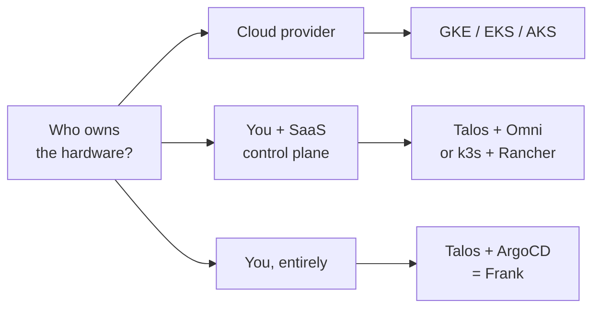
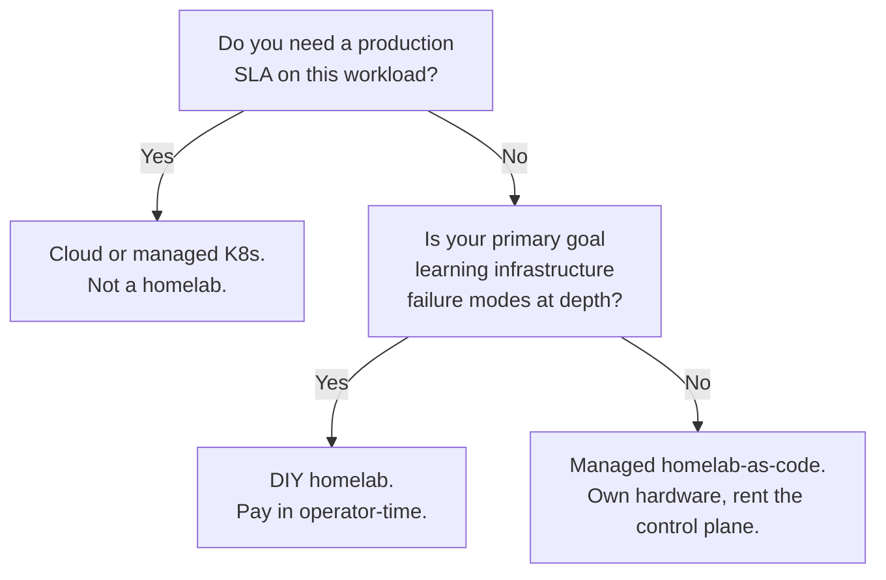



## §1 — The question

There is a question that sits one layer beneath "should we use Kubernetes?", and most teams skip past it without noticing. Not "which orchestrator?" Not "which cloud?" The question is: **who should own this machine?**

Three answers are live in 2026. Each is internally consistent. Each has won real workloads. The trap is not picking the wrong one — it is picking before understanding which question you are actually answering.

Frank is one node in that tree. The cluster running this blog post is heterogeneous metal: three Intel NUC control-plane nodes, a desktop tower with an RTX 5070, a 2013 desktop, two Raspberry Pi 4s. Talos Linux on every machine. ArgoCD reconciling everything from a single git repo. No SaaS in the loop. Whatever breaks, breaks where I can see it.

The rest of this paper argues that this is not the right answer for most readers — and explains why it is the right answer for me.

## §2 — Three approaches and their real costs

The marketing version of each option is well-understood. The lived cost is not.

**Cloud-native** (GKE, EKS, AKS) is the default. You declare a cluster, the provider runs the control plane and the metal, you pay per-node-hour and per-egress-byte. The capital cost is zero; the operational floor is your team's ability to write CI pipelines.

The real cost is invisibility. Failure modes are abstracted away. When EBS throttles, when a control-plane upgrade takes a node down at 2am, when your cross-AZ traffic explodes the bill, you see only the symptom. The provider is the substrate, and the substrate is a black box.

The 37signals cloud exit makes the cost-side argument concretely:


By 2022, their cloud bills had grown to over \$3.2 million annually. Migration to owned hardware cut that to \$1.3 million per year — without adding any new staff — and database queries ran 3–5× faster.


That is the most-cited data point in this argument. It is also a narrow data point: stable workloads, predictable traffic, a team large enough to staff a small ops function. Most teams are not 37signals.

**Managed homelab-as-code** (Talos + Omni, k3s + Rancher) is the middle. You buy the hardware; a SaaS control plane handles registration, lifecycle, OS upgrades, kubeconfig issuance. You get the bandwidth-cost win and the data-locality win, without the "what do I do when etcd is sad" lesson. Sidero's own framing of the seam:


From initial machine registration through cluster creation, day-to-day operations, and rolling upgrades, everything is handled through a single interface.


The real cost: a one-vendor dependency that owns the most operational surface. If Omni's API key is the choke point for every cluster mutation, you have re-introduced the cloud's coordination cost in a smaller, prettier wrapper.

**DIY homelab** (Talos + ArgoCD, no SaaS) is what Frank is. You own everything down to the systemd extensions. The real cost is operator time: the dominant cost at this scale, and the one most cost analyses silently exclude. You learn what an entire stack feels like to operate, in exchange for a working week.



Read the matrix with the polarity convention: ✅ means "this concern is low / handled / a win." ❌ means "you carry this concern yourself." The point is not that DIY is best — the point is that the three columns disagree about which problems are worth carrying.

## §3 — Frank's answer, and what happened

Frank picked the rightmost column, on purpose, because the goal is to learn.

Twenty-nine [Building posts]() document the climb. Hardware, OS, networking, storage, GPU, GitOps, observability, secrets, local inference, multi-tenancy, agent orchestration, public edge, CI/CD — every layer was deliberately chosen to be a different paradigm than the layer beneath it, so the cluster would have *opinions* by the time it ran anything real.

The cost did not stay theoretical:


**The GPU validation crash.** The NVIDIA GPU Operator on Talos Linux would not pass post-install validation. Talos is immutable; the operator wanted to load a kernel module the OS would not stage. Six debugging sessions, one Sidero issue, and a custom validation-markers DaemonSet later, the pod stabilised. Documented in full at [Layer 12 — GPU Talos Fix](). Net cost: roughly a working week. Net gain: I now understand exactly what "the GPU plugin requires a privileged init container with host PID namespace" *means* in a way that a managed cluster will never teach.


That scar generalises. Every layer has at least one of them. They are in [`agents/rules/frank-gotchas.md`](https://github.com/derio-net/frank/blob/main/agents/rules/frank-gotchas.md) — one-line summaries linking to full per-topic runbooks. There are over a hundred so far. None of them would have appeared on a managed cluster. They appeared on Frank because the cluster has nowhere to hide its failure modes from the operator.

The honest accounting is this: a year of evenings to get to a working, observable, GitOps-managed cluster that runs my own LLM inference, hosts my own blog, runs my own agentic workloads, and survives a node loss. The cluster is not faster than the cloud. It is not cheaper than the cloud, once you price an evening at market rate. It is **legible** in a way the cloud is not, and legibility is the entire point.

## §4 — When Frank's answer doesn't generalize

The cluster you build to learn is not the cluster you would run a business on. Frank's design choices fail explicit tests:

- No multi-region redundancy. A single power event at this location takes everything down.
- The operator is one person. There is no on-call rotation, no SLO, no postmortem culture beyond what one person can sustain.
- Heterogeneous-on-purpose. Production clusters standardise; Frank diversifies, because diversity is the lesson.
- The blast radius of a mistake includes the operator's own development environment.

If any of these conditions are blockers for the workload you are imagining, the cluster you are imagining is not Frank.

Read this as a forcing function. If you cannot answer the first question with "no," there is no homelab argument to have. If you can answer it with "no" but cannot answer the second with "yes," the middle column is almost certainly right and the rest of this series will be less useful to you than a Talos + Omni tutorial.

## §5 — What this series is

Frank's blog already has two voices. The [Building series]() is first-person, narrative, exhaustive — *how* every layer went in. The [Operating series]() is the SRE handbook — *how to run* every layer on a normal day.

The Frank Papers are the third voice. Each Paper is a landscape review of one capability — auth, storage, GPU operators, local inference, secrets — written for the staff engineer or CTO who is deciding *which* tool. The structure is constant: vendor map, capability matrix, scar tissue from running one of them at Frank scale, decision rubric, and an honest section on where Frank's choice would not generalise. Every Paper gates on a published research dossier (vendors, primary sources, named gaps, counter-arguments) before drafting begins — the same dossier you can read for this paper via the link at the top.

Publishing order is decision-weight, not table-of-contents order. Paper 10 (Self-Hosted Inference) is the first to land after this prologue, because that is the question Frank gets asked most. The series will run for as long as the cluster keeps generating decisions worth writing down.

The cluster will, as ever, have opinions.


