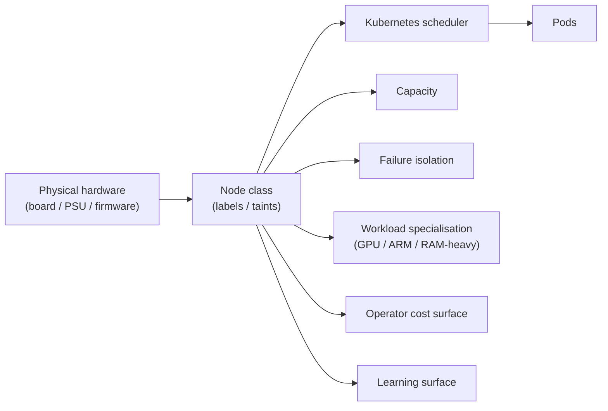
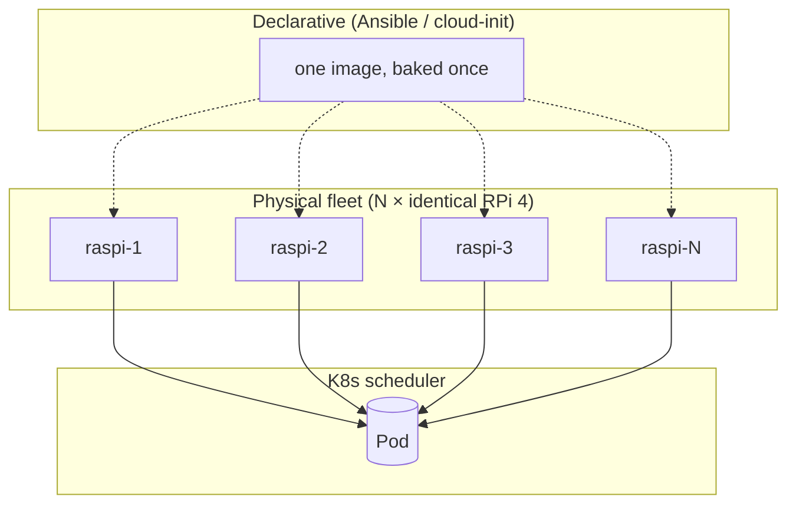
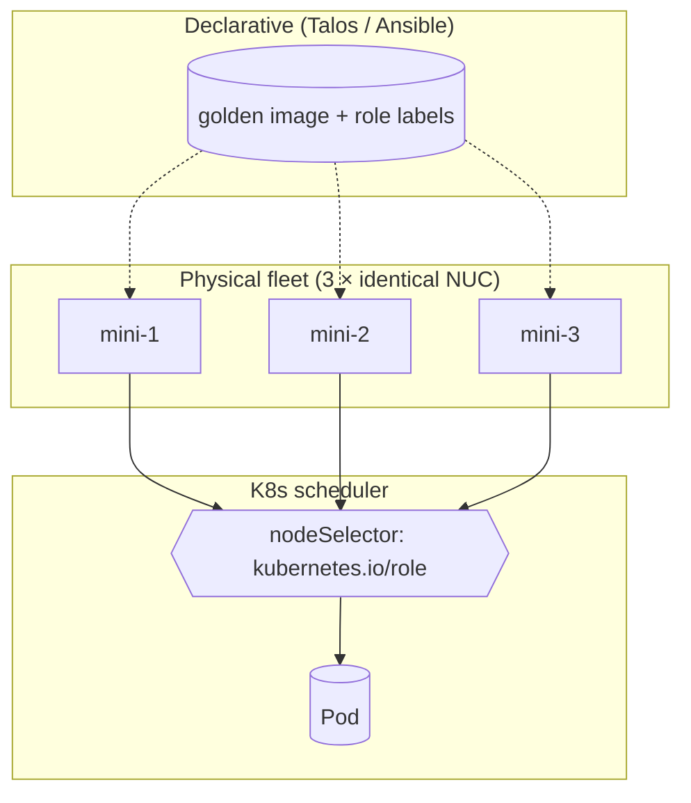
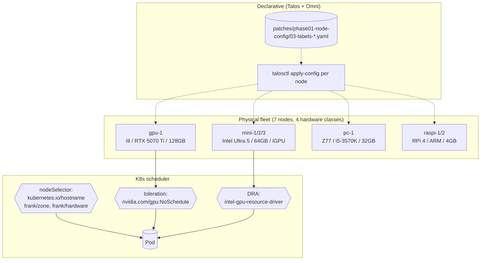
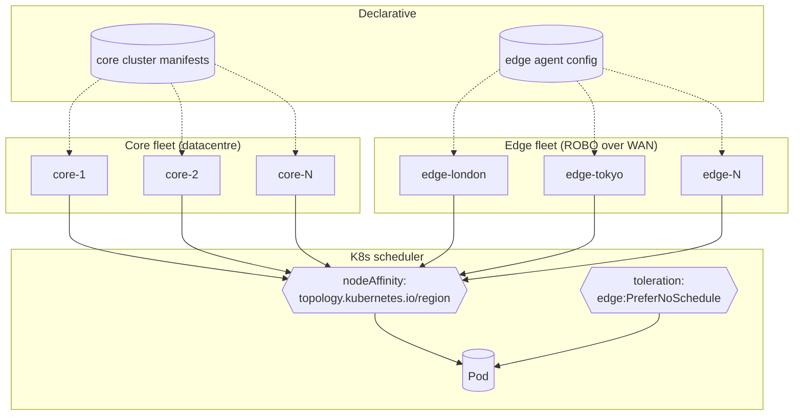
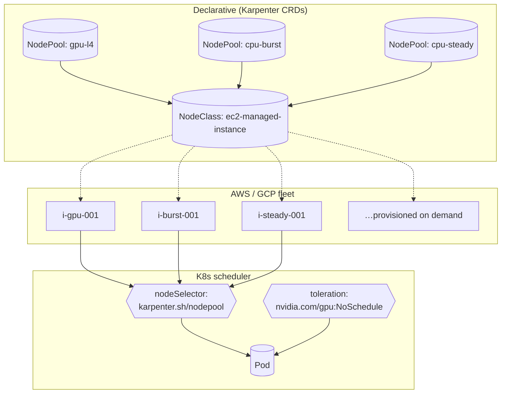
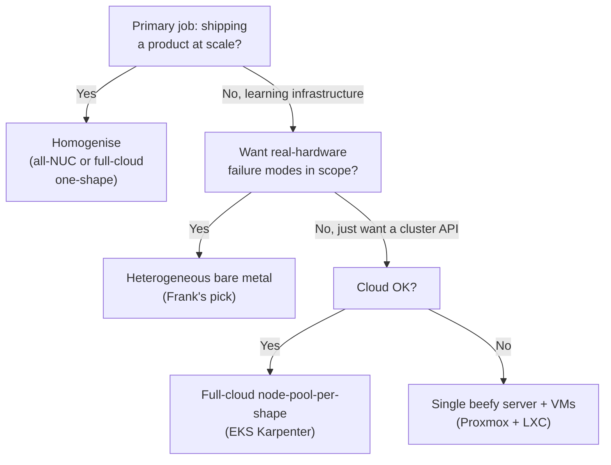

## TL;DR

*Write last.*

## §1 — The capability

The question that comes before any cluster decision: *what do you put
in the rack?* And, more sharply: *do you buy seven of the same box, or
seven different boxes?*

It looks like a procurement question. It isn't. The shape of the fleet
decides what the scheduler ever has to think about. A homogeneous
fleet — one image, one driver matrix, one firmware story — lets the
scheduler treat nodes as a fungible pool of CPU and RAM. A
heterogeneous fleet forces every workload to declare which class of
node it tolerates, and forces every operator to maintain N driver
matrices, N image manifests, N firmware schedules. Neither is wrong.
They are answers to different questions.

Node-class heterogeneity sits in a specific slot in the stack —
between physical hardware (board, PSU, firmware) and the Kubernetes
scheduler — and it does five jobs at once:



Capacity. Failure isolation. Workload specialisation. Operator cost
surface. Learning surface. The vendor space — six fleet shapes, walked
in §2 — splits on which of those jobs each shape treats as primary.
All-NUC fleets optimise operator cost surface to near zero and
sacrifice the learning surface entirely. All-RPi fleets do the same
on cheaper silicon. Frank's heterogeneous bare metal optimises the
learning surface and pays for it in operator cost. Full-cloud Karpenter
declares the heterogeneity in CRDs and hides the hardware completely.

The production-SRE answer for production-SRE jobs is homogenize. That
is right, and that doesn't make it right for a learning cluster. Both
are true. The rest of this paper walks the trade.

## §2 — The landscape

Six fleet shapes, two axes, one stubborn truth: no single shape pays
zero on every dimension. The X-axis is *class count* — does the fleet
deliberately contain one class of node or several? The Y-axis is
*hardware visibility* — is the operator touching real boards (bare
metal) or declaring shapes in CRDs and letting a provider materialise
nodes (cloud-managed)?


    title Fleet shape — 2026
    x-axis "Single class" --> "Multi class"
    y-axis "Bare metal" --> "Cloud managed"
    quadrant-1 "Multi · Cloud (Karpenter-style)"
    quadrant-2 "Single · Cloud (one-shape EKS)"
    quadrant-3 "Single · Bare metal (all-NUC / all-RPi)"
    quadrant-4 "Multi · Bare metal (Frank)"
    "All-RPi homelab": [0.05, 0.05]
    "All-NUC mini-fleet": [0.10, 0.10]
    "Heterogeneous bare metal (Frank)": [0.85, 0.10]
    "Edge+core split": [0.70, 0.35]
    "Single beefy server + VMs": [0.05, 0.10]
    "Full-cloud node-pool-per-shape": [0.85, 0.90]


**All-RPi homelab** — what every Pi-cluster YouTube series ships. One
ARM image, one driver matrix, no GPU story, a $300 entry price. It
teaches scheduling and packaging; it does not teach the failure modes
of unfamiliar hardware because the hardware is all the same.

**All-NUC mini-fleet** — the production-SRE default for small fleets.
Three identical mini-PCs, identical BIOS, identical firmware
schedule, one golden image. Every operator-hour spent on the fleet
amortises across every node. The cost is that you never encounter the
class of bug that exists *between* node classes — because there is
only one class.

**Heterogeneous bare metal (Frank)** — deliberately mixed: 3× Intel
Ultra 5 minis as a control plane, 1× i9/RTX 5070 Ti as the
discrete-GPU worker, 1× legacy Z77/i5-3570K as a general-purpose
worker, 2× RPi 4 as ARM edge workers. Four hardware classes under one
scheduler. The operator pays per-class cost in firmware updates,
driver matrices, multi-arch image manifests, and per-host gotchas;
the cluster pays back in failure modes the operator now recognises by
their shape.

**Edge+core split (KubeEdge / OpenYurt / k3s edge agents)** — what
"real" enterprise edge looks like. A beefy core fleet plus thin
remote nodes attached over WAN. Heterogeneous by topology, not
intent — the heterogeneity is the *price* of pushing workloads to the
edge, not the goal. Operates one image but multiple network classes
and multiple latency regimes.

**Single beefy server + VMs (Proxmox + LXC)** — the homelab default.
One large bare-metal host runs a Kubernetes lab inside VMs or LXC
containers. Skips real-hardware heterogeneity entirely. Perfectly
rational if the goal is *Kubernetes-as-software* and not
*Kubernetes-as-hardware-curriculum*. It is the leaf for people who
have decided the hardware question is uninteresting.

**Full-cloud node-pool-per-shape (EKS Karpenter / GKE node pools)** —
heterogeneity outsourced. NodePool / NodeClass CRDs declare the
shapes; the cloud materialises them on demand and recycles them when
idle. Same scheduler problem, no hardware visible to the operator.



The capability matrix is the dossier-row view. Read the partials, not
the columns: no shape is ✅ everywhere. Frank's heterogeneous bare
metal trades "one golden image" and "single driver matrix" for
"real-hardware lessons" and "ARM+x86 / iGPU+dGPU in one cluster."
Karpenter wins on every column except "real-hardware lessons" — by
design; the hardware is the cloud's problem, not yours. The all-NUC
and all-RPi shapes are nearly indistinguishable on the matrix; the
difference is silicon, not posture.


Karpenter recommends using as few NodePools as possible to keep your
configuration simple and manageable. It is recommended to create
NodePools that are mutually exclusive. So no Pod should match multiple
NodePools. If multiple NodePools are matched, Karpenter will use the
NodePool with the highest weight.


That advice — "as few NodePools as possible" — is the
operator-cost-of-classes argument made by the vendor whose own
product manages those classes. The CRD-driven fleet still pays the
tax; it just pays it in YAML rather than in firmware tickets. The
literature does not measure the tax (see §4 and the dossier's named
gap), but every serious fleet-shape doc acknowledges it implicitly.

## §3 — How each option handles the hard part

The hard part is *how does each shape express heterogeneity — or hide
it — to the scheduler?* Every shape has a different answer. This
section walks five of them with a shared visual language:

- **Squares** = physical nodes
- **Rounded rectangles** = Kubernetes primitives (Node, NodePool,
  MachineDeployment, vCluster)
- **Diamonds** = scheduler decision points (nodeSelector, tolerations,
  DRA)
- **Cylinders** = persistent fleet state (Karpenter CRDs, Cluster
  API DB, Talos machine configs)
- **Dashed edges** = out-of-band provisioning paths
- **Solid edges** = runtime / scheduling paths

The single-beefy-server-with-VMs shape is omitted from this section
on purpose — it has no "hard part" at the scheduler level, which is
the §6 punchline.

### All-RPi homelab — single class, single image



There are no diamonds because there are no decisions. Every node is
the same; every pod can land on any node. Geerling's Turing-Pi build
is the canonical example. The provisioning path is dashed — bake one
image, flash every SD card, boot — and the runtime path is the
default scheduler with no special wiring. The hard part isn't
hard.

The shape has one weakness: the day one Pi is materially different
from the others (a Pi 3B+ in a Pi-4 cluster; a Pi with a different
SD card brand; a Pi attached to a slightly slower switch) the
shape's invariant breaks silently. Geerling's own episode-3 writeup
notes "some quirks I'd like to iron out, especially when it comes to
the slower Pi 3 B+ compute modules I'm using on this Turing Pi" —
heterogeneity creeping into the ostensibly-homogeneous shape.

### All-NUC mini-fleet — single class, declarative labels



One image, three nodes, one diamond — `kubernetes.io/role` to pin
control-plane workloads. Otherwise identical to the all-RPi shape on
faster silicon. The image-bake is real (BIOS-update procedure, NIC
driver pin, microcode rev) but it pays back on every node, every
quarter. Production-SRE rituals exist for this fleet shape: a
quarterly fleet-wide BIOS sweep, a microcode rev across the whole
fleet at once, a single golden-image rev.

### Heterogeneous bare metal — Frank's choice



Three diamonds, because three different classes of decision. The
provisioning shape is the same as all-NUC — talosctl apply-config —
but the patches are *per-node*, not fleet-wide. Each of `mini-1`,
`mini-2`, `mini-3`, `gpu-1`, `pc-1`, `raspi-1`, `raspi-2` carries its
own label patch under `patches/phase01-node-config/03-labels-*.yaml`.
The scheduler now sees not just "Node" but "Node with iGPU /
discrete GPU / x86 / ARM / legacy". Workloads declare which class
they tolerate; the scheduler matches.

The failure mode worth naming: a pod authored against the wrong
node class lands on a node that "looks compatible" and breaks in
production. The defensive answer is over-specified
`nodeSelector` (pin to `kubernetes.io/hostname` when you mean a
specific machine, not just a class) and defensive tolerations (carry
`nvidia.com/gpu:NoSchedule` even on a Deployment whose GPU need is
not strictly required, in case the operator re-asserts the taint —
see the §5 scar).

### Edge+core split — heterogeneous by topology



The decision diamond is *topology*, not hardware. KubeEdge,
OpenYurt, and k3s-as-edge-agent all sit in this shape. The
heterogeneity exists because the workload graph is split — payment
processing in the core, point-of-sale at the edge — not because
anyone wanted two classes of node. The shape pays a different tax:
network partitions are first-class, the control plane has to tolerate
arbitrarily-long edge disconnections, and the edge nodes often run a
trimmed Kubernetes distribution (k3s) rather than full Kubernetes.

### Full-cloud node-pool-per-shape — Karpenter



The diamond is `karpenter.sh/nodepool` and the provisioning is
fully dynamic — Karpenter watches the scheduler queue, sees a pod
that demands `gpu-l4`, materialises an L4 EC2 instance, attaches it,
schedules the pod, and recycles the instance when idle. The
heterogeneity surface is *declarative CRDs*; the firmware/driver/BIOS
problem is the cloud provider's.

The trade is real: zero hardware lessons. You will never learn what a
PSU brown-out looks like on a 2013 motherboard from this shape. You
also will never have to operate one. For most production teams that
is the right trade.

Five shapes, five different ways of answering the same question:
how does the scheduler know which class of node a pod belongs on?
The provisioning surface, the scheduler primitive, and the operator
cost shift, but the question is always the same.

## §4 — What scale changes

The fleet-shape rankings in §2 are not stable across scale. Three
axes flip them, and each changes the shape of the operator's day.

**Node count.** At 3–7 nodes (Frank's regime) the heterogeneity tax
is paid in operator-hours per quarter — a firmware update on pc-1
that doesn't propagate to the minis, a multi-arch chart that doesn't
ship arm64, a per-class gotcha that needs a runbook. At 50 nodes
the per-class firmware-update hour starts dominating; the
homogeneous fleet's "one BIOS sweep per quarter" is a measurable
cost lever. At 500 nodes Karpenter, Cluster API, or a cloud
node-pool product is doing the work whether you ship it or not —
multi-class becomes a CRD problem, not a human-operator problem. The
literature does not number these inflection points; the dossier's
named gap is exactly the absence of an apples-to-apples
operator-overhead-per-class benchmark at small N.

**Image multi-arch tax.** A homogeneous x86 fleet only consumes
amd64 manifests; the day you add a single RPi worker you discover
which of your Helm charts ship multi-arch and which ship x86-only
with a stale arm64 alpha (or no arm64 at all). The cost is one-off
per chart — a fork, a multi-arch rebuild, a private registry push —
but it pays compound interest on every new chart you add. Frank's
private Zot registry exists in part to host the arm64 forks the
upstream charts won't ship.


A 'machine' is the declarative spec for an infrastructure component
hosting a Kubernetes Node (for example, a VM). A MachineDeployment
provides declarative updates for Machines and MachineSets.


Cluster API's MachineDeployment is the shape this problem converges
to at scale. Each class — `arm64-edge`, `amd64-cpu`, `amd64-gpu` —
gets a MachineDeployment, rolling-update semantics across the class
follow the Deployment pattern, and the per-class operational ritual
is bounded by the per-class manifest. Karpenter's NodePool is the
same idea with cloud provisioning bolted on; Talos label patches are
the same idea at small N without the CRD layer.

**What breaks first.** At 5 nodes the smoking gun is a single old PSU
on a single old motherboard — the pc-1 case study, §5. At 50 nodes
it is the driver matrix on the GPU class: Nvidia driver N+1 ships,
the operator rolls it, three of the seven GPU nodes fail to
re-register their CDI device because the kernel module hash drifted.
At 500 nodes it is the firmware-vendor CVE that lands on a Tuesday
afternoon and you have to roll only the 41 nodes that have that
exact BIOS version. The *class of failure mode* changes with N; only
the heterogeneous fleet teaches all three classes at once, because
only the heterogeneous fleet has all three classes of failure in
scope.

## §5 — Frank's choice, and what happened

I chose heterogeneous bare metal. Three Intel Ultra 5 minis as the
control plane, each with an integrated GPU wired through K8s 1.35
DRA. One i9 + RTX 5070 Ti as the discrete-GPU worker. One Z77 /
i5-3570K board from 2013, kept in the fleet as a general-purpose
worker — and as a deliberately-included class of failure mode. Two
Raspberry Pi 4s as ARM edge workers. The provisioning chain: per-node
Talos machine-config patches under `patches/phase01-node-config/`,
two parallel GPU stacks (NVIDIA operator on gpu-1, vendored Intel
DRA chart on minis under `patches/phase05-mini-config/`), per-pod
`nodeSelector` plus defensive tolerations, a multi-arch image story
for every chart that touches the Pi nodes.

The choice was deliberate, and so was the cost. Three scars are
worth naming.


pc-1 rebooted seven times in 33 days, no kernel panic, no OOM, no
thermal trip, no watchdog. Inter-reboot intervals 4–11 days. The
kernel logger streamed to Omni over SideroLink up until the second
of each silence, then nothing — the failure was faster than printk.
245 lines of VictoriaMetrics history, in-cluster privileged debug
pods, hardware DMI inventory, and absence-of-ECC reasoning landed on
"the 12-year-old PSU was browning out under transient load."
PSU-swapped 2026-05-07; soak clean at T+3.87 days. A homogeneous
fleet of 2025 NUCs would never have taught us what a silent hardware
reset looks like through Talos. The cluster has plenty of compute;
pc-1 stayed because the failure mode it carries is itself the
lesson.



`kubectl port-forward` — and every CLI that wraps it, like
`argocd --port-forward` — regularly fails on pods scheduled to gpu-1
with `failed to execute portforward in network namespace
cni-…: read: connection reset by peer`. Only gpu-1's netns exhibits
this. Every metric-scraping script that worked on the minis had to
be rewritten as `kubectl exec deploy/<target> -- wget -qO-
localhost:<port>`. A homogeneous fleet of identical workers would
not have this per-host class of bug — and would not have taught the
engineer to write exec-based scrape scripts in the first place, a
habit that pays off the day production has the same flake under a
different name.



mini-1/2/3 each carry an Intel Ultra 5 with an integrated GPU. The
"obvious" path — install the upstream `intel-resource-driver-operator`
chart — does not work under K8s 1.35, because the upstream chart
predates the DRA API changes that landed in that release. Frank
ships a vendored chart under `patches/phase05-mini-config/` with the
1.35 DRA patches, one per mini, with per-host CDI containerd
configuration. The NVIDIA stack on gpu-1 took its own integration
pass; neither pass was reusable for the other. That's the
heterogeneity tax in concrete form — and the reason every reference
to "the GPU layer" in this cluster requires "on which host?" as a
follow-up question.


The cluster's own node table makes the heterogeneity self-evident:

```
$ kubectl get nodes -o wide
NAME      STATUS   ROLES           ARCHITECTURE   OS-IMAGE      KERNEL-VERSION
mini-1    Ready    control-plane   amd64          Talos v1.10   6.6.x
mini-2    Ready    control-plane   amd64          Talos v1.10   6.6.x
mini-3    Ready    control-plane   amd64          Talos v1.10   6.6.x
gpu-1     Ready    <none>          amd64          Talos v1.10   6.6.x (+nvidia)
pc-1      Ready    <none>          amd64          Talos v1.10   6.6.x
raspi-1   Ready    <none>          arm64          Talos v1.10   6.6.x
raspi-2   Ready    <none>          arm64          Talos v1.10   6.6.x
```

Four hardware classes, two architectures, three different kernel
extensions (vanilla, nvidia, arm64-mainline), one cluster. Every row
in that table is a lesson Frank wouldn't have without it.

This is the trade. Heterogeneous bare metal is the right answer for
Frank's shape — learning platform, single operator, declarative
first, scars-as-deliverables — *and* it costs me a 245-line
investigation about a 12-year-old PSU, an `exec-based` rewrite of
every scrape script, and a vendored chart for the Intel DRA driver.
The four other shapes in §6 would cost different things; none of
them would cost nothing.

## §6 — When Frank's answer doesn't generalise

Frank's answer is one leaf. Three others are real, and treating them
as legitimate is the only honest way to write this section.



Four leaves, three questions: *what is the primary job* (shipping at
scale versus learning infrastructure), *do you want real-hardware
failure modes in scope* (Frank: yes — that's the point), *is cloud
acceptable* (homelab no, regulated SaaS often yes).

**Homogenise** wins when the primary job is shipping a product and
the fleet is sized around a workload that is bounded. Every
production SRE will tell you this. They are not wrong; for a fleet
running one workload at scale, identical hardware is cheaper to
operate, cheaper to debug, cheaper to plan capacity for. If your team
already knows what a PSU brown-out looks like and your job is to
ship, homogenise.

**Heterogeneous bare metal** is Frank's leaf. It wins when the
primary job is learning, the operator wants real-hardware failure
modes in scope, and "scars-as-deliverables" is an accepted output.
The cost is everything in §5, doubled when the cluster grows.

**Single beefy server + VMs** wins when the goal is
*Kubernetes-as-software* — you want to learn the scheduler, the API,
the operators — and you don't want to maintain seven boards. Proxmox
+ LXC is the rational homelab answer. It is a perfectly legitimate
choice and Frank explicitly chose not to take it; nothing in this
paper is an argument against it for the team whose hardware question
is "I already have one box."

**Full-cloud node-pool-per-shape** wins when cloud is acceptable and
you want the cluster API without the hardware. Karpenter, GKE node
pools, AKS node pools. The day-to-day operator surface is CRDs and
billing; the hardware is the cloud's problem. For a regulated SaaS
team that wants Kubernetes and cannot afford to spend operator-hours
on motherboards, this is right.

Three of the four leaves end in a working cluster. They end in
*different* working clusters, and the difference is in what the
operator now knows about hardware. Frank's leaf is the one that
maximises that knowledge surface; the others minimise it
intentionally. Both are defensible.

## §7 — Roadmap & where this space is going

Three trends will reshape the §3 diagrams over the next two years.

**ARM-on-server is normalising.** Ampere, AWS Graviton, the next
round of Apple-silicon-derived server cores — ARM is leaving the
"edge / Raspberry Pi" box and moving into mainline server racks. The
multi-arch image tax is in the process of becoming a multi-arch
image *expectation*. Helm charts that ship amd64-only in 2027 will
start to look like Helm charts that ship glibc-only in 2025 — a
compatibility gap, not a default. Frank's private-registry arm64 fork
ritual is a workaround for a transitional moment that is closing.

**Karpenter NodePool taxonomy is becoming the lingua franca for
"what shapes does my cluster need."** Even on bare metal, the
NodePool / NodeClass CRD pair is the cleanest way to declare "this
cluster has these kinds of nodes." Cluster API converged on the
shape; Talos and Sidero will likely grow first-class NodePool-shaped
primitives within 18 months. The per-node Talos label patches Frank
uses today are the small-N expression of the same idea; expect them
to consolidate into a higher-level abstraction once the scheduler
ecosystem standardises on the NodePool vocabulary.

**Dynamic Resource Allocation is the next inflection.** DRA (K8s
1.32+, graduating through 1.34+) abstracts "what hardware does this
pod need?" out of nodeSelector and into a first-class resource API.
iGPU vs dGPU vs NPU vs storage accelerator stops being a per-vendor
wiring problem and starts being a DRA driver problem. Frank already
runs this on the minis under a vendored chart — the patches in
`phase05-mini-config/`. Expect the pattern to spread to every NIC,
every crypto accelerator, every storage class with non-standard
performance properties in the next two years. The capability matrix
in §2 will look different the day DRA covers "all accelerator
classes" — `arch_diversity` and `gpu_diversity` will collapse into a
single `resource_diversity` column.

The fleet-shape question — *same boxes or different boxes?* — is not
going away. The vocabulary will shift; the trade will not. Paper 01
will get re-checked against the landscape in two years. The vendor
names will be different. The capability matrix will be a different
shape. The scars will be new ones. The pattern — that operator cost
and learning surface trade against each other, and the answer
depends on which one your job actually values — will not have
changed.
