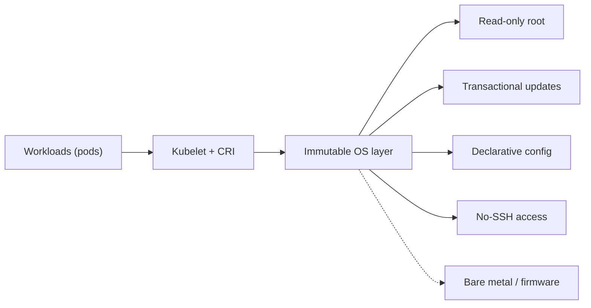
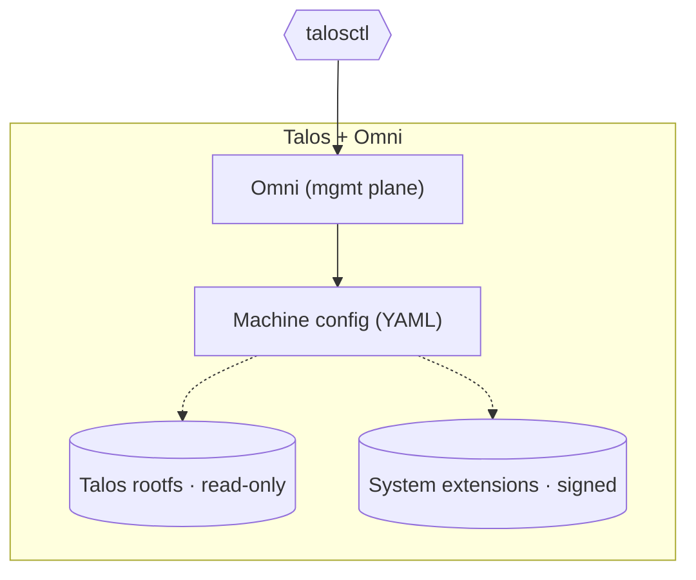
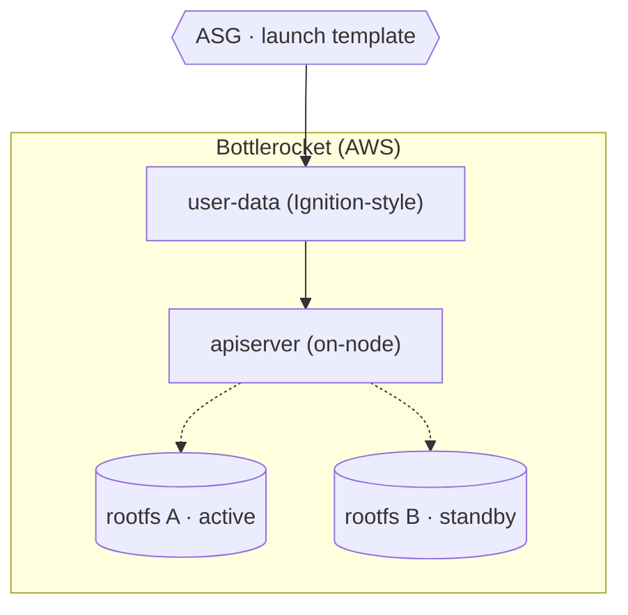
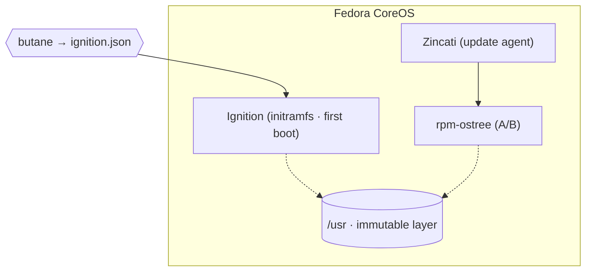
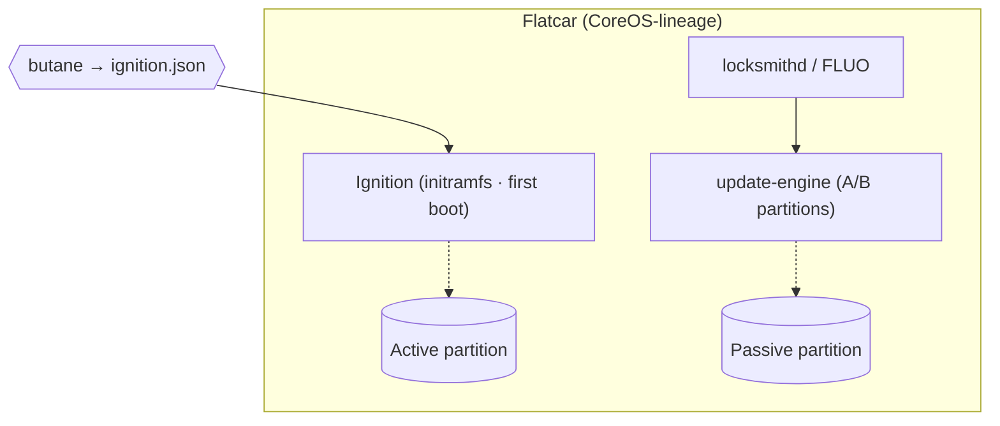
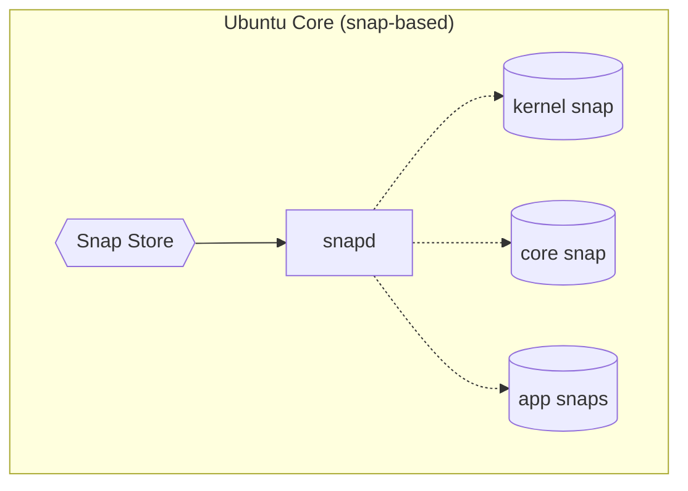
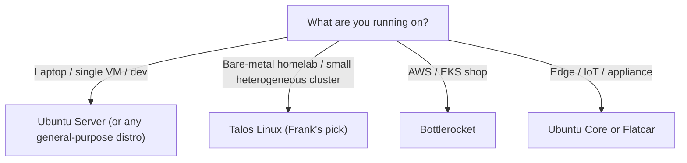

## TL;DR

*Write last.*

## §1 — The capability

A node reboots for a kernel update. Then a second node, on the other side of the rack, reboots for an unrelated security update an hour later. Then, three months later, someone with `sudo` on one of the nodes runs `apt install` from muscle memory and walks away. The question is whether the cluster notices the difference between those three events — and whether any of them can quietly invalidate the assumption that node-3 is interchangeable with node-1.

That is the capability under examination. Not "the operating system" in the general-purpose-Linux sense — most distributions can host a kubelet if you ask politely. The capability is *the OS layer that keeps cluster nodes interchangeable*: the discipline that says a node's state is the rendered output of a config you keep in Git, the upgrade story that says updates land atomically or not at all, and — at the limit — the absence of any interactive way to drift.

The diagram is honest about what "immutable OS" actually contains. It is not one job; it is at least four — a read-only root filesystem so the running OS *can't* be edited in place, transactional A/B updates so an upgrade either lands fully or rolls back fully, declarative config so a node can be rebuilt from a YAML file rather than reconstructed from memory, and (at the strict end) the absence of SSH so the operator cannot accidentally cause drift by trying to fix something. Every vendor in this space treats one of those four as the primary problem and treats the rest as supported.

I run Talos. That choice was not made on the merits in the abstract; it was made on the merits of running a deliberately heterogeneous cluster, where the cost of a per-host playbook would be highest and the value of "every node is the rendered output of a Git commit" is highest. Other clusters have other shapes, and a different shape produces a different answer.

## §2 — The landscape

Six options dominate immutable OS for cluster nodes in 2026 — plus the mutable-distro baseline that the immutable side exists to argue against. They split cleanly on two axes. The horizontal axis is the OS's update posture: traditional in-place package install on the left, fully immutable image-based root on the right. The vertical axis is how the OS is configured: a config-management overlay (Ansible, Puppet, Chef) at the bottom, an API-driven contract at the top.


        title Immutable OS landscape — 2026
        x-axis Mutable --> Immutable
        y-axis "Config-mgmt overlay" --> "API-driven"
        quadrant-1 "Immutable · API-driven"
        quadrant-2 "Mutable · API-driven"
        quadrant-3 "Mutable · Config-mgmt"
        quadrant-4 "Immutable · Config-mgmt"
        "Talos Linux": [0.92, 0.92]
        "Bottlerocket": [0.85, 0.85]
        "Fedora CoreOS": [0.75, 0.40]
        "Flatcar": [0.72, 0.42]
        "Ubuntu Core": [0.70, 0.30]
        "Ubuntu + Ansible": [0.15, 0.20]




The matrix grades each option on the four jobs from §1 plus the licensing and management-surface axes. The "no SSH / no shell" column is the one that does the most work; it is also the column that most clearly separates the genuinely-immutable vendors (Talos, Bottlerocket) from the image-based-but-still-shellable ones (Fedora CoreOS, Flatcar, Ubuntu Core).

**Talos Linux** optimises for declarative reach. The OS has no shell and no SSH; the only way to interact with a node is through `talosctl`, which speaks an API that takes a machine-config YAML as its source of truth. The trade is the steepest re-training curve of the six — most of what an experienced Linux operator knows about day-2 ops does not apply, and the troubleshooting story is different enough to feel unfamiliar.

**Bottlerocket** is structurally similar — a minimal image-based OS, an API server in place of SSH, transactional A/B updates — but optimised for AWS workflows. The integration story is ECR for images, EKS for the control plane, and Auto Scaling Groups for the update orchestration. Outside AWS, Bottlerocket loses much of its leverage; inside AWS, almost nothing competes.


We've removed everything that's not needed to run containers, which reduces the attack surface area and the resources used. All software changes are applied via image-based updates, which enable faster, more reliable updates that can be quickly rolled back if necessary.


**Fedora CoreOS** and **Flatcar** are siblings. Both descend from the original CoreOS Container Linux, both bootstrap through Ignition on first boot, both use atomic A/B partition updates (rpm-ostree on Fedora CoreOS, the Flatcar update engine on Flatcar). Both retain SSH and a real shell, which puts them in a softer immutability quadrant than Talos or Bottlerocket. The practical difference between them is governance: Fedora CoreOS rides Red Hat's release train, Flatcar rides Microsoft's. The technical surface is very close.

**Ubuntu Core** is the embedded/IoT angle. Everything is a snap — including the kernel and core OS components — and transactional updates fall out of the snap model rather than from a separate A/B partition scheme. The model fits appliances and edge devices well, but it has not historically been the first choice for general-purpose Kubernetes nodes.

**Ubuntu + Ansible** is the baseline this paper exists to argue against. Familiar tooling, broad community, no retraining, no special-case kernel-module dance. The cost is that *every* invariant the immutable side gets for free has to be paid for in playbooks, drift-detection, and operator discipline. The cluster ends up immutable only by convention, which is exactly the convention immutable-by-construction projects refuse to rely on.


An ImmutableServer is one that, once instantiated, is never modified. Updates and fixes occur not by changing the existing server, but by creating a new one.


## §3 — How each option handles the hard part

The hard part of running an OS under Kubernetes is rebuilding a node from zero, on demand, with no drift, no interactive steps, and no chance for a careless package install to invalidate cluster invariants. Every vendor in this list has an answer; the answers diverge enough to need separate diagrams. The diagrams use a shared visual language — squares for the management surface (Omni, Ignition, the AWS control plane), cylinders for on-disk state, hexagons for the operator-facing tooling, solid edges for boot and runtime paths, dashed edges for update and re-render paths.

### Talos Linux

The management surface is Omni (self-hosted control plane) and the operator surface is `talosctl`. Both speak the same gRPC API; both refuse to do anything not expressible as a change to the machine-config YAML. A node's state is *defined* by that YAML — labels, kernel modules, scheduling exceptions, container runtime config — and a node's only legitimate path to "different state" is "render new YAML, apply it, reboot." The rootfs partition is read-only at runtime; kernel modules (NVIDIA, i915, custom udev rules) arrive as signed system extensions baked into the boot image, not installed at runtime. There is no `apt install`, because there is no `apt` and no shell to run it from.

Failure recovery is shaped by the same model. A broken node is not repaired; it is wiped and re-installed from the same image, with the same machine-config, and joins the cluster as a fresh replica of its former self. The only persistent state on a node is whatever the workloads put there, and workloads are not supposed to be node-stateful.

### Bottlerocket

Bottlerocket runs an on-node API server in place of SSH; configuration changes are POSTed to it from a launch template or via SSM. Updates are A/B partition swaps coordinated through an AWS ASG: a node is launched from a new AMI, drained, and replaced rather than upgraded in place. The integration story does most of the lifting — ECR for images, EKS for the control plane, ASG for rolling node replacement — and outside that integration the model loses much of its appeal.

The failure mode is rebuild-the-node, identical in shape to Talos. The difference is in where the orchestration lives: Talos's lives in Omni; Bottlerocket's lives in AWS.

### Fedora CoreOS

Fedora CoreOS bootstraps once, on first boot, via Ignition: a JSON document supplied to the initramfs that configures the machine, then never runs again. Subsequent updates land via rpm-ostree — atomic A/B updates against an immutable `/usr` tree, with rollback on the previous boot. Zincati handles the update cadence and the inter-node coordination so an entire fleet does not reboot at the same moment. SSH and a real shell remain, which makes Fedora CoreOS more forgiving than Talos at the cost of a softer immutability boundary.

### Flatcar Container Linux

Flatcar is the direct lineage continuation of the original CoreOS Container Linux, now stewarded by Microsoft (after Kinvolk's acquisition). First-boot provisioning is Ignition, same shape as Fedora CoreOS. Updates are dual-partition A/B swaps coordinated by `locksmithd` (or by the Flatcar Update Operator inside Kubernetes), which is a different mechanism from rpm-ostree but solves the same problem. The architectural difference between Fedora CoreOS and Flatcar is mostly a question of which release cadence and governance model fits — the on-node surface is almost identical.

### Ubuntu Core

Ubuntu Core takes the immutability idea further than the partition-A/B model — *everything* is a snap, including the kernel and core OS. snapd handles transactional install and rollback for the entire system, including the kernel snap. The model fits IoT and appliance workloads better than general-purpose Kubernetes nodes; the Store-coordinated update model and the per-snap confinement story are the design points, not the K8s integration story.

(The mutable Ubuntu + Ansible baseline is omitted from the architecture lineup because it has no "hard part" the same way. The whole *point* of the mutable baseline is that the OS is whatever you have configured it to be at the moment you looked. That is the §6 punchline, not a §3 diagram.)

## §4 — What scale changes

Three scale axes flip vendor rankings. The first two are quantitative; the third is philosophical.

**Node count.** At one node, immutable is overkill. A laptop, a dev VM, a single Hetzner box — Ubuntu Server with whatever you usually run is fine, the blast radius of a mistake is small, and the cognitive overhead of the immutable model is not paid for by anything. At five-to-twenty nodes, immutable starts to win clearly, because human-paced config drift becomes the dominant failure mode rather than the dominant *cost*. At one hundred nodes and above, immutable is the only sane choice — whichever flavour. Bottlerocket-with-ASG and Talos-with-Omni both solve the orchestration problem; the question is whether the cluster lives in AWS.

**Heterogeneity.** Frank's seven nodes span x86 mini-PCs, ARM Raspberry Pis, an i9 with a discrete GPU, three Intel iGPU mini-PCs, and a 2013-era i5-3570K reused as an edge node. Talos's machine-config render pipeline absorbs that heterogeneity by parameterising on machine ID — `nodeLabels`, `extensions`, `disks`, scheduling rules all flow through the same patch mechanism regardless of architecture. A mutable-plus-Ansible host group would need per-host playbooks; an image-based approach (CoreOS, Flatcar, Bottlerocket) needs per-platform images for each architecture. Talos's API-driven model is the cheapest at heterogeneity — and it is precisely heterogeneity that the immutable model defends against, because every additional axis of variation is another way for drift to enter.

**Update cadence.** Bottlerocket plus ASG can do continuous rolling node replacement because the control plane (ASG) schedules it and the OS is built to be replaced rather than upgraded. Talos plus Omni does the same, today through `talosctl upgrade` per machine and increasingly through Omni-orchestrated rollouts. Fedora CoreOS and Flatcar use Zincati and locksmithd respectively to coordinate within a fleet, which is closer to the Bottlerocket model in mechanism but closer to manual in operator-experience. The mutable baseline relies on whatever you bolted on top — `unattended-upgrades`, Ansible cron, Foreman — which is almost always the weakest link in the stack. The honest comparison is not "which immutable OS updates faster" but "which model fails *predictably* under load."

The throughline: immutable OS is a forcing function for treating nodes as cattle. The vendors differ in how much friction they put between the operator and the cattle metaphor, but they all agree that the metaphor is the point.

## §5 — Frank's choice, and what happened

I run Talos. Every node, control-plane and worker alike, on Frank's home cluster and on the Hop edge cluster — `mini-1`, `mini-2`, `mini-3`, `gpu-1`, `raspi-1`, `raspi-2`, `pc-1`, and `hop-1`. Two different management surfaces — Sidero Omni for Frank (seven heterogeneous machines, a real management plane earns its keep) and plain `talosctl` for Hop (one Hetzner box, the management plane would be overhead). One OS underneath.

The honesty of that choice is what makes the resulting scars worth writing down. A mutable distro with a competent Ansible setup would have hidden every one of them — and would have produced different scars at different points, in places I would not have been looking for them.


A single config patch applied on top of Talos's running config — half the change took effect, the other half silently vanished. The lesson: `talosctl apply-config --config-patch` rebuilds the base file, not the running config. Every patch must arrive as part of one full invocation; there is no incremental-patch model the way kubectl conditioned us to expect. Talos's immutability isn't a UX nicety; it forces machine config to be treated as a single source-of-truth render. The fix changed how every Talos patch is authored in this repo from that day forward — combined patch files, never layered apply commands.



Hop is a single-node cluster. By default Talos refuses to schedule workloads on a control-plane node. The result, on a single-node cluster, is that no pod ever enters `Running` — with no obvious signal. An evening spent assuming the CNI was broken; the actual fix was `allowSchedulingOnControlPlanes: true` in the cluster config. The immutable-OS guarantee includes "no — you can't do that the old way," and "the old way" sometimes means "the only way that ever made sense on a one-node cluster." The defaults are not wrong; they are tuned for the multi-node case the project assumes you are in.



The NVIDIA GPU Operator's stock init containers wait forever for `/run/nvidia/validations/toolkit-ready`, a marker file the toolkit DaemonSet would normally create. Except Talos disables that DaemonSet, because the driver and toolkit on Talos come from signed system extensions baked into the image — there is no userspace toolkit container to install. The fix landed as a separate plan, `gpu--operator-talos-fix`, with its own scar tissue: a sidecar that writes the marker file Talos's design refuses to write itself. The immutable-OS guarantee includes "no — you can't do that the old way" applied to vendor tooling that assumes the old way is universal. Some vendor docs are written against an OS model that Talos rejects on purpose.


The three scars share a shape. None of them are bugs in Talos; all of them are emergent properties of running an OS that refuses to participate in conventions the surrounding ecosystem still assumes. The interfaces between Talos and ArgoCD-managed charts, between Talos and vendor operators built for general-purpose Linux, between Talos's "one config render" model and the kubectl-conditioned "many small patches" reflex — those are where the failures live. Exactly where the marketing material does not look.

Visible evidence:

A mutable Ubuntu + Ansible setup would have hidden every one of these failure modes inside the playbook layer, which is the right trade for a production team running familiar workloads and the *wrong* trade for a learning platform. Frank exists to encounter the `--config-patch` rebuild surprise so that the next operator on this stack does not have to.

## §6 — When Frank's answer doesn't generalize

Frank's answer — Talos on every node, Omni for Frank and plain `talosctl` for Hop — is one leaf of a four-leaf tree. The other three are real, and at least one of them is the right answer for almost any production team reading this.

The first branch is workload context, not node count, because workload context is what actually changes the answer. A laptop or a single dev VM has no immutability problem worth paying for — Ubuntu Server (or any general-purpose distro) is correct, full stop. Bare-metal homelabs and small heterogeneous clusters are where Talos's API-driven model earns out: enough nodes to feel drift, enough heterogeneity to want a single render pipeline, not enough cloud alignment to make Bottlerocket worth the integration tax. AWS-native shops should run Bottlerocket — the EKS + ECR + ASG integration is genuinely worth more than the OS-purity argument. Edge and IoT workloads want Ubuntu Core's snap model or Flatcar's smaller surface and stable update cadence, depending on the device profile.

A fifth-leaf "we already run Fedora CoreOS in production at scale" override exists and is honest — there are large Fedora-CoreOS-based production clusters, and migrating off them for Talos's purity would be a bad trade. That branch belongs in prose, not on the diagram. The four visible leaves are the four answers that *make a decision* from a green field; the override is a Frank-style honesty note for the brownfield case.

This is the section where the paper has to be honest about its audience. If you are reading this from a production engineering team running Linux workloads on familiar hardware, the right answer for you is almost never Frank's answer. The right answer is one of the other three leaves. Frank's answer is correct *for Frank* — a maximum-complexity, heterogeneity-maximalist learning platform — and is documented here so anyone considering the trade understands the rest of the leaves before picking the same one.

## §7 — Roadmap & where this space is going

Three trends are worth naming. None of them are settled; all of them affect the next few years of immutable OS on cluster nodes.

**Image-based Linux is going mainstream.** The CoreOS pattern — atomic A/B partition updates, Ignition for first-boot bootstrap — is becoming table-stakes rather than novel. Even traditional distros are bolting it on: Ubuntu Core, Fedora Silverblue, openSUSE MicroOS, NixOS's image-mode workflows. The next few years will see fewer projects defend the in-place-package-upgrade model and more bolt on image-mode workflows as a parallel option.

**API-driven OS as a contract surface.** Talos's `talosctl` and Bottlerocket's on-node API server are both signals that "the OS is a resource you reconcile against" is the near-future model. Configuration-management tools (Ansible, Puppet, Chef) become the legacy interoperability layer rather than the primary management surface. The interesting question is not *whether* the API-driven model wins, but *who* owns the contract — vendor-controlled APIs (Bottlerocket) or open APIs (Talos), and whether the open standard ever consolidates into a shared OS-config interface the way CSI did for storage.

**Kubernetes-purpose-built distros normalising.** Talos, Bottlerocket, k0s, k3OS — the "general-purpose Linux that happens to run Kubernetes" model is losing ground to "Linux purpose-built for Kubernetes nodes." The cost is re-training. The win is one fewer configuration dimension — no separate userland to maintain, no general-purpose package manager to manage, no SSH access to harden. Vendor maturity in this space is closing the gap between "promising" and "operationally boring" faster than any other layer in the stack.

The space is not done evolving. Frank will revisit this paper when the answers change.
