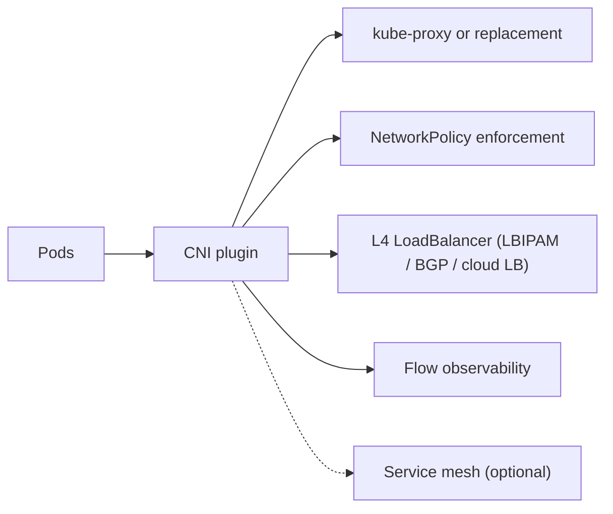
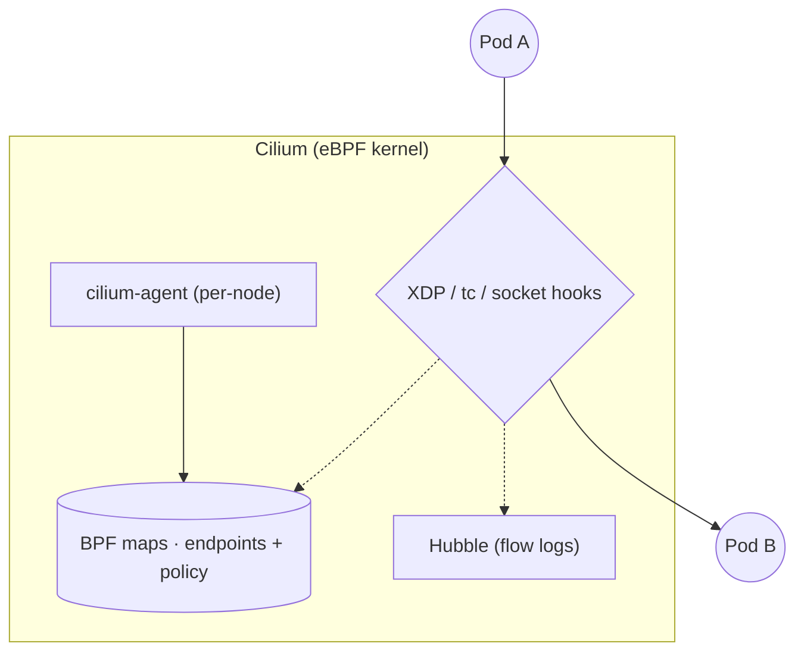
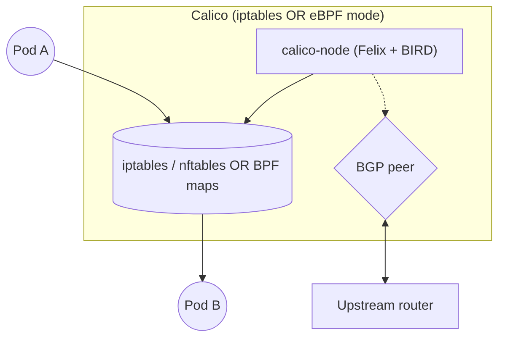
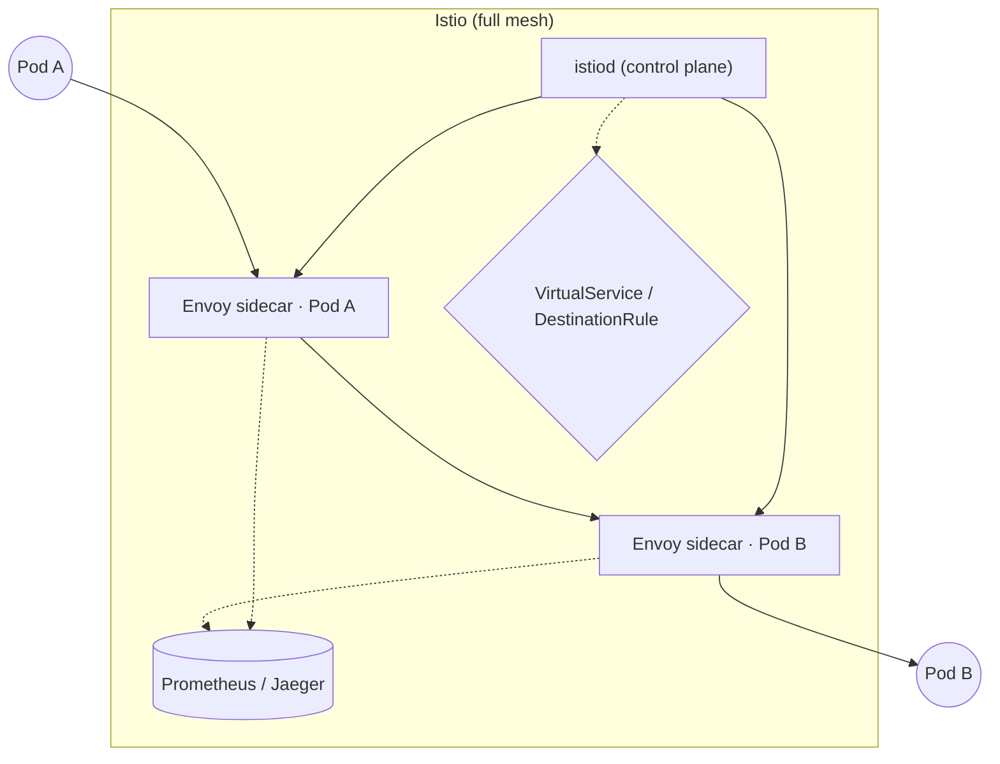
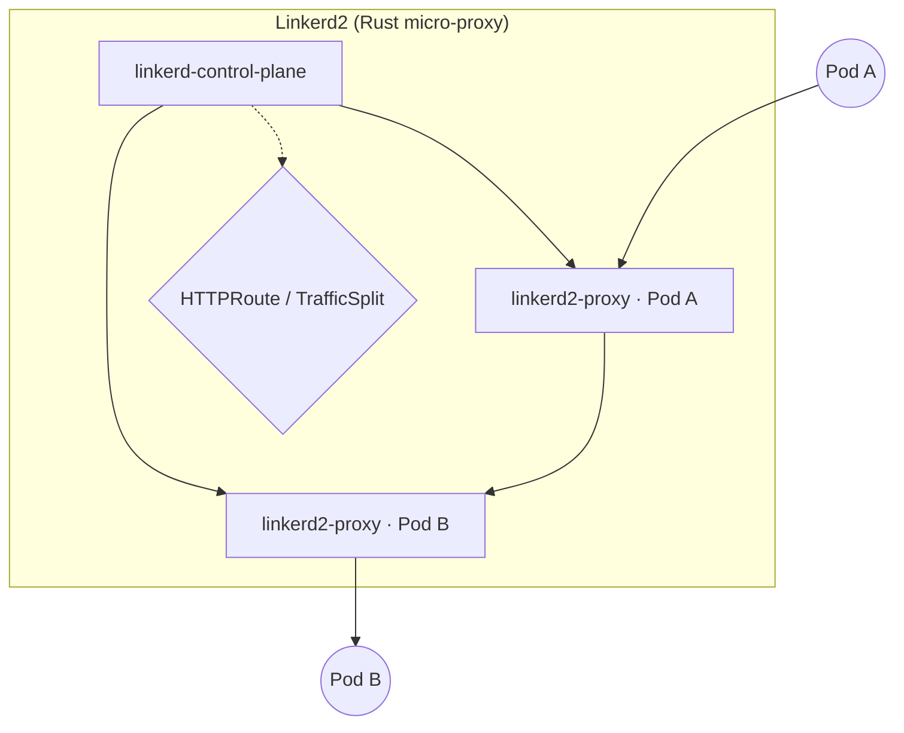
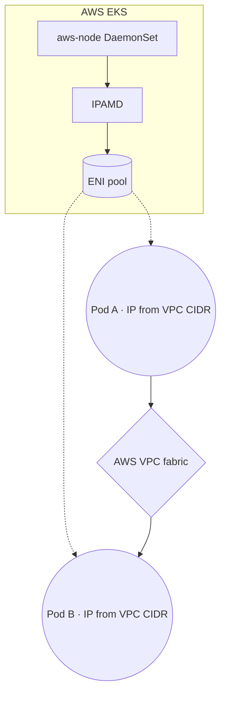
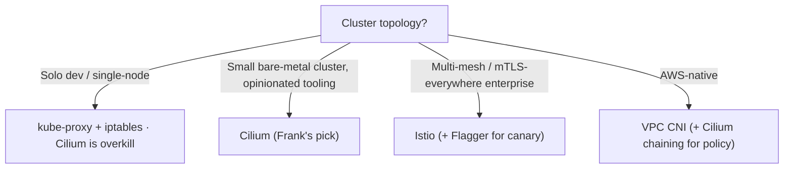

## TL;DR

Six options dominate Kubernetes networking in 2026 — Cilium, Calico,
kube-proxy + iptables, Istio, Linkerd2, and the cloud-managed VPC CNI —
and they split on two axes: kernel/eBPF vs userspace sidecars, and
structured flow observability vs reactive `kubectl describe`.

Frank runs Cilium. eBPF kube-proxy replacement on Talos, L2 LBIPAM,
Hubble for flow observability, no service mesh. The scars came in the
seams: an FQDN policy whose BPF rules persisted in the kernel for hours
after deletion, an `lbipam.cilium.io/ips` annotation that left a Service
`<pending>` for 41 days without `sharing-key`, half an hour spent
hunting a feature gate Cilium 1.17 had already shipped on.

Frank's answer does not generalize. Solo dev → kube-proxy. Enterprise
mesh → Istio. AWS-native → VPC CNI.

## §1 — The capability

A packet leaves Pod A on one node. It needs to arrive at Pod B on a different
node. Some controller decides whether the two pods are allowed to talk at
all. Something programs the kernel — or programs userspace — to forward the
packet between two virtual interfaces, possibly across a tunnel, possibly
through an L4 load-balancer if the destination is a `Service`. Something
later — maybe — produces a log entry that says "Pod A sent 3.2 MiB to Pod B
between 14:02 and 14:03". And every layer of this stack charges some kind of
tax: CPU per packet, memory per endpoint, sidecar resources per pod,
operator hours per incident.

That is the capability under examination. Not "networking" in the abstract
— Kubernetes already has the Pod-to-Pod-IP-reachability contract, the
Service abstraction, and the CNI interface. The capability is *who carries
the packet, who enforces the policy, who tells you what just happened, and
what tax do they charge for any of it?*



The six jobs the network layer does — pod-to-pod routing, the Service
abstraction (kube-proxy or replacement), NetworkPolicy enforcement, L4
external load-balancing, flow observability, optional mTLS — are not all
the same job. Some vendors treat one or two as primary and let the others
fall out of the design; others assume a service mesh is in place and build
everything on top of its sidecar proxies. The vendor space *splits* on
which jobs are primary and which dependencies are mandatory.

I run Cilium. That choice was not made on the merits in the abstract; it
was made on the merits of being on Talos bare metal, needing an L2
LoadBalancer without MetalLB, wanting flow observability without sidecars,
and being unwilling to add a service mesh solely for retries-and-mTLS on a
six-node cluster. Other clusters have other geometries, and an honest
review of the landscape has to admit that.

## §2 — The landscape

Six options dominate eBPF networking and service-mesh on Kubernetes in
2026, and they split on two axes. The horizontal axis is *data-plane
technology* — userspace sidecar proxies on the left (every pod gets a
Helper), kernel / eBPF on the right (the data plane is the kernel itself).
The vertical axis is *observability surface* — reactive `kubectl describe`
and `iptables -L` only at the bottom, structured flow logs and L7 traces
at the top.


        title eBPF networking — 2026
        x-axis "Userspace sidecar" --> "Kernel / eBPF"
        y-axis "Reactive only" --> "Structured observability"
        quadrant-1 "Kernel · Observable"
        quadrant-2 "Userspace · Observable"
        quadrant-3 "Userspace · Reactive"
        quadrant-4 "Kernel · Reactive"
        "Cilium": [0.85, 0.80]
        "Calico": [0.70, 0.45]
        "kube-proxy + iptables": [0.55, 0.05]
        "Istio": [0.10, 0.85]
        "Linkerd2": [0.15, 0.75]
        "AWS VPC CNI": [0.40, 0.40]




The matrix grades the options on eBPF data plane, kube-proxy replacement,
built-in L4 LoadBalancer, NetworkPolicy enforcement, L7 policy, flow-level
observability, mTLS, bare-metal support, and licensing. The
kube-proxy-replacement and mTLS columns do the most work — they're the
ones that determine whether you need any of the sidecar-mesh vendors at
all.

**Cilium** optimises for fusing the data plane and the observability
surface in the kernel. The cilium-agent on each node compiles eBPF
programs from Kubernetes objects and loads them into the kernel; the same
agent feeds Hubble with flow events from the same BPF code paths.


The Cilium agent compiles configuration into eBPF programs that are
loaded into the kernel and runs the related management tasks like
updating BPF maps.


The trade is that L7 inspection only works for the protocols Cilium's
parser supports (HTTP, gRPC, Kafka, DNS) — for anything more exotic, you
either bypass L7 policy or fall back to a sidecar mesh.

**Calico** is the other eBPF-capable option. It started as the original
NetworkPolicy implementation and has accumulated data planes: iptables,
eBPF, and (more recently) VPP. BGP peering for bare-metal pod-IP
routability is its differentiator; it can advertise pod CIDRs directly to
upstream routers in a way Cilium can but does not lead with. The trade is
that Calico's observability surface is thinner than Cilium's — there's
flow logging, but no Hubble equivalent in the OSS distribution.

**kube-proxy + iptables / IPVS** is the upstream default and the
null-hypothesis baseline for everything else on this list. It pairs with
any CNI plugin to provide the Service abstraction by writing iptables (or
IPVS) rules from `Service`/`Endpoints` objects. The cost shows up at scale
— rule-evaluation is O(N) in the number of Services — but for a six-node
cluster with under a hundred Services, the overhead is invisible. Its
purpose in this paper is to mark the lower bound: if your cluster is
small and stateful-workload-heavy and you do not need NetworkPolicy or
LoadBalancer or flow logs, *this is the right answer*, and the rest of
the matrix is solving a problem you do not have yet.

**Istio** is the canonical service mesh — Envoy sidecar on every pod,
full L7 inspection, mTLS by default, retries and traffic management and
fault injection as first-class features. The benefits are real; the cost
is exactly proportional — the sidecar runs on every pod, the control
plane runs, the per-request P50/P99 latency budget is everyone's
forever. Istio's place in the landscape is "the abstraction that catches
everything Cilium gives up to stay in the kernel".

**Linkerd2** is the lighter sidecar mesh — Rust-based micro-proxies,
smaller feature surface, smaller per-request overhead than Istio. Same
shape of trade as Istio with the dial turned down. For teams that want
the mTLS and traffic-management story without the operational weight of
Istio, Linkerd2 is the obvious pick.

**AWS VPC CNI** is the cloud-managed leaf. It assigns ENIs to pods so
pod IPs are routable on the VPC; AWS runs the data plane, you do not.
The trade is that the kernel and the L2/L3 fabric are AWS's, not yours —
NetworkPolicy comes from a chained CNI (Calico or Cilium), L4 load
balancing comes from `Service` of type `LoadBalancer` calling out to
ALB/NLB. For an AWS-native deployment this is correct and Cilium would
be overkill; for Frank, on bare metal, it is not an option at all.

## §3 — How each option handles the hard part

The hard part is *carrying a packet from one pod to another with policy
enforcement, observability, and load-balancing, without paying
per-request overhead that would not exist if there were no abstraction
in the first place.* Every vendor on this list has an answer; the
answers diverge enough that they need separate diagrams. The diagrams
below use a shared visual language — squares for control-plane
components, rounded rectangles for pods and workloads, diamonds for
decision points (policy gates, mesh routing), cylinders for kernel data
structures (BPF maps, conntrack), dashed edges for control and policy
paths, solid edges for data-plane / packet paths.

### Cilium



The cilium-agent on each node watches Kubernetes API objects
(`CiliumNetworkPolicy`, `Service`, `Endpoints`) and compiles them into
eBPF programs that attach to kernel hook points — XDP for the earliest
fastest-path drop decisions, tc (traffic-control) for per-packet
forwarding, socket hooks for connection-level policy. Per-endpoint and
per-policy state lives in BPF maps; lookups are O(1). Hubble subscribes
to the same hook code paths and emits structured flow events to its
relay and UI. There is no kube-proxy DaemonSet (`kubeProxyReplacement:
true`) and no sidecar proxy.

The failure mode is that BPF maps and the controller's view of the
world can drift. A `CiliumNetworkPolicy` that was deleted may leave
stale entries in the DNS-proxy LRU; an FQDN rule may need DNS-proxy
initialization on the node before it works. The kernel's view of the
world keeps carrying packets even when the controller no longer believes
the policy exists — see §5.

### Calico



Felix is the per-node controller; BIRD speaks BGP to upstream routers
to advertise pod CIDRs. In iptables mode the data plane is the kernel's
iptables/nftables; in eBPF mode it's BPF maps, similar to Cilium but
without the L7 hooks. Pod IPs are routable on the underlay network when
BGP peering is configured — a property that matters more for on-prem
clusters that share L3 with the rest of the data centre than for
homelabs on a flat /24.

The failure mode is split between two data planes — iptables-mode and
eBPF-mode have different debugging surfaces, different observability,
and different scaling characteristics. Choosing the wrong one for the
cluster size is the most common source of "Calico is slow" reports.

### Istio



Every pod gets an Envoy sidecar injected by `istio-init` or the admission
webhook. The sidecar terminates the source pod's TCP connection,
inspects the L7 payload, applies whatever `VirtualService` /
`DestinationRule` policy applies, and re-encrypts the connection to the
destination sidecar over mTLS. Both sidecars emit traces and metrics to
the configured backend. The control plane (istiod) reconciles
configuration from Kubernetes objects and pushes xDS updates to every
sidecar.

The failure mode is that *every* request pays the sidecar tax — two
extra TCP handshakes, two extra TLS handshakes (in the worst case),
two extra hops through userspace Envoy. At 10 RPS this is invisible;
at 10k RPS it's a real fraction of the SLO budget. The §4 numbers
quantify it.

### Linkerd2



Same shape as Istio with two substantial differences: the proxy is
written in Rust (not C++ Envoy) and the feature surface is smaller.
mTLS is on by default; L7 routing via HTTPRoute is supported; many of
Istio's more exotic features (fault injection, complex retry budgets,
JWT validation) are not. The Rust micro-proxy is measurably faster
than Envoy on the per-request fast path, with a smaller memory
footprint per sidecar.

The failure mode is the same as Istio's, with the dial turned down:
per-request overhead exists, just less of it. The architectural cost
— a sidecar on every pod — is identical.

### AWS VPC CNI



The aws-node DaemonSet runs on each EKS worker. IPAMD allocates ENIs
(elastic network interfaces) and secondary IP addresses from the VPC
CIDR; each pod gets a real VPC IP, fully routable across the VPC,
across peered VPCs, across Direct Connect. There is no overlay, no
VXLAN, no encapsulation — the VPC fabric *is* the pod network.

The failure mode is ENI exhaustion: each EC2 instance type has a fixed
limit on the number of ENIs and secondary IPs, so pod density per node
is capped by the instance type rather than by CPU/memory. NetworkPolicy
is not a first-class feature — VPC CNI defers that to a chained CNI
(Calico or Cilium-as-policy-engine). The trade is that AWS runs the
data plane and you do not — you lose the ability to instrument the
kernel or tune the forwarding path.

## §4 — What scale changes

Three scale axes flip vendor rankings. The first two are quantitative;
the third is operational.

**Pod count and BPF map sizing.** Cilium's BPF maps have
compile-time-bounded sizes. At 5,000 endpoints the defaults work; at
50,000 endpoints you start hitting policy-map exhaustion and have to
retune `--bpf-policy-map-max` and related limits. iptables-based
kube-proxy degrades linearly with Service count — at 5,000 Services the
resync is measured in seconds, at 10,000 Services in minutes. The
Cilium-published benchmark frames the crossover crisply:


iptables rule-evaluation cost is O(N) in the number of Services — at
10,000 Services, kube-proxy resync takes minutes; the eBPF map-lookup
is O(1).


For a six-node homelab with under a hundred Services, this is a
difference of milliseconds against milliseconds. For a thousand-node
cluster with tens of thousands of Services, it is the difference
between a working data plane and a degraded one.

**Per-request mesh overhead.** Istio sidecars add roughly 1–2 ms P50
and 5–10 ms P99 to every request, depending on the mesh version,
sidecar configuration, and whether mTLS is enforced. Linkerd2's Rust
proxy is closer to 0.5 ms P50. At 10 RPS that is free. At 10,000 RPS
it is a SLO budget you spent on mesh features. Cilium's L7 inspection
on the eBPF fast path measures in microseconds — but only for the
protocols its parser supports.

**Observability stack footprint.** Hubble's flow logs are cheap (BPF
ring buffer, structured events to a relay process). Istio's distributed
trace pipeline is not — at 1,000 RPS, the trace storage and aggregation
cost can match the workload's own resource budget. This is the
"observable by default" axis: Hubble is free observability for whoever
already runs Cilium; Jaeger / Tempo is a separate operational concern.

## §5 — Frank's choice, and what happened

I run Cilium. eBPF kube-proxy replacement on Talos, L2 LBIPAM
announcing on `eth*`/`en*` interfaces, Hubble UI on `192.168.55.202`,
IPAM in kubernetes mode. No service mesh. The whole configuration is
forty-seven lines of Helm values; the cluster has been running this
shape since the day it was bootstrapped.

```yaml
# apps/cilium/values.yaml
ipam:
  mode: kubernetes
kubeProxyReplacement: true
k8sServiceHost: 127.0.0.1
k8sServicePort: 7445
hubble:
  enabled: true
  relay: { enabled: true }
  ui:    { enabled: true }
l2announcements:
  enabled: true
externalIPs:
  enabled: true
```

I did not pick Cilium over Istio on the merits in the abstract. I
picked it because there is no service mesh on Frank — six nodes, mostly
stateful workloads, no requirement for mTLS-everywhere — and adding a
mesh solely to enable retries-and-traces would have meant paying the §4
sidecar tax forever in exchange for features the cluster does not use.
I did not pick Cilium over Calico on the merits either; I picked it
because the L2 LBIPAM and Hubble are in the same Helm chart as the CNI,
and I was unwilling to assemble three separate charts to get what one
chart already includes.

The honesty of that choice is what makes the resulting scars worth
writing down. A different vendor would have produced different scars;
a managed cloud CNI would have hidden them all.


An FQDN `CiliumNetworkPolicy` banned a misbehaving image registry. We
deleted the policy. Pods still could not reach the registry. The DNS
proxy's BPF maps had cached the original block decision and persisted
in the data path for hours after the `CiliumNetworkPolicy` was gone.
Restarting the cilium-agent DaemonSet on each affected node cleared
the LRU; without that, the deleted policy continued enforcing itself
silently. *The controller's view of the world and the kernel's view of
the world had drifted apart, and only the kernel's view was carrying
packets.* The recovery is in `docs/runbooks/frank-gotchas/networking.md`
under "Cilium 1.17 FQDN policies need DNS-proxy initialization".



We tried to share one LoadBalancer IP between Gitea's two Services
(`gitea-http` on `:3000` and `gitea-ssh` on `:2222` — the chart splits
them). We annotated both with
`lbipam.cilium.io/ips: "192.168.55.209"`. The HTTP Service got the IP;
the SSH Service stayed `EXTERNAL-IP <pending>` for **41 days**. No
event, no error, no diagnostic except `kubectl describe`. The fix
turned out to be a second annotation —
`lbipam.cilium.io/sharing-key: "gitea"` — on both Services. The `ips`
annotation alone is a request for an IP, not a sharing directive.
Cilium documents this; we did not read the doc carefully enough. The
outage hid in plain sight because pipelines clone via the in-cluster
ClusterIP and only operator workstations needing `git@host:repo.git`
were affected — and they had quietly switched to HTTPS. *Silent
failure plus a CI fallback path equals a 41-day half-broken Service
that nobody alerted on.*



Two protocols needed to share one IP — TCP/22 for SSH and
UDP/60000–60015 for mosh. We assumed Cilium would need a feature gate
for `MixedProtocolLBService` and went hunting through old GitHub
issues from the 2022-era debate. The issue had been settled long ago:
Cilium 1.17 on K8s 1.35 ships with it on, no annotation, no gate, no
per-protocol service split. The ports bind on a single EndpointSlice
and answer from the same Pod. We spent half an hour reading old
issues for a flag we did not need to flip. *Reading old GitHub issues
is not the same as reading the current release notes.*


The three scars share a shape. None of them are bugs in Cilium. All of
them are emergent properties of running an eBPF CNI whose state
machine spans the controller, the kernel BPF maps, the DNS proxy LRU,
and the Service/Endpoints object graph. The interfaces between those
state machines are where the failures live — exactly where the
marketing material does not look.

Visible evidence:


A managed cloud CNI would have hidden every one of these failure modes
behind its abstraction, which is the right trade for a production team
on AWS and the *wrong* trade for a learning platform on bare metal.
Frank exists to encounter the FQDN-stale-BPF trap so that the next
operator on this stack does not have to.

## §6 — When Frank's answer doesn't generalize

Frank's answer — Cilium with eBPF kube-proxy replacement, L2 LBIPAM,
Hubble, no service mesh — is one leaf of a four-leaf tree. The other
three are real.



The first branch is whether the cluster is large enough to need any of
this at all. A solo-dev kind cluster or a single-node k3s development
loop is fine on kube-proxy + iptables; Cilium adds operational surface
for benefits the cluster cannot use. The kube-proxy tax at single-digit
Service counts is undetectable.

The second branch is whether you control the kernel. On bare metal,
the answer is yes, and an eBPF CNI like Cilium can do its real work —
fast Service forwarding, L2 LBIPAM, structured flow observability.
For a small bare-metal cluster with opinionated tooling and a
heterogeneous mix of workloads, this is what Frank picked.

The third branch is the mTLS-everywhere enterprise — multi-team
clusters where every Pod needs a stable identity, every request
needs an audit trail, every traffic split needs to be controllable
per-route. Istio (with Flagger for progressive delivery on top, see
Paper 14) earns the sidecar tax in this geometry. Cilium can do some
of this with its own Service Mesh features; Istio still does it more.

The fourth branch is AWS-native. VPC CNI is correct; Cilium would
be overkill and would fight the VPC fabric. If you need NetworkPolicy
on AWS, chain Cilium *as a policy engine only* on top of VPC CNI —
that's what GKE Dataplane V2 does by default, and what AWS supports
explicitly via the security-groups-for-pods feature.

This is the section where the paper has to be honest about its
audience. If you are reading this from a fifty-node EKS cluster, the
right answer for you is almost never Frank's answer — it is the VPC
CNI leaf, with Cilium chaining if policy matters. Frank's answer is
correct *for Frank* and is documented here so that anyone considering
the same trade understands the rest of the leaves before picking it.

## §7 — Roadmap & where this space is going

Three trends are worth naming. None are settled; all affect the next
few years of Kubernetes networking.

**eBPF is winning the data-plane fight.** GKE Dataplane V2 ships
Cilium by default. EKS supports Cilium chaining as a first-class
option. Calico's eBPF data plane is GA. The iptables-kube-proxy
default still exists for upstream compatibility, but practically
nobody picks it on a new cluster in 2026 — and the Cilium-published
benchmarks (biased as they are toward Cilium's home turf) hold up on
the methodology. The pattern is clear enough that AWS has begun
publishing migration notes for clusters moving from kube-proxy to
eBPF-mode chained Cilium.

**The service-mesh and CNI layers are merging.** Cilium Service Mesh
and Istio's Ambient Mesh are converging on the same idea: do as much
as possible in the kernel and on the node, only fall back to a
sidecar / per-pod proxy when L7 control is genuinely needed. The
"every pod gets a sidecar" model is on its way out; the question for
the next eighteen months is whether the kernel layer or the
ambient-zTunnel layer claims the larger share of what used to be the
sidecar's job. Cilium's bet is the kernel; Istio's bet is the ambient
proxy. Both are plausible.

**Gateway API is replacing `Service` of type `LoadBalancer` + Ingress.**
Cilium, Calico, Istio, Linkerd2, and the cloud-managed CNIs all
support `GatewayClass` + `Gateway` + `HTTPRoute`. The L4 LoadBalancer
concern (LBIPAM, BGP, MetalLB) is increasingly an implementation
detail of the `Gateway` resource. In eighteen months the "which
LoadBalancer controller do you run" question may collapse the same
way the "which Ingress controller do you run" question is collapsing
into Gateway API.

The space is not done evolving. Frank will revisit this paper when
the answers change.

