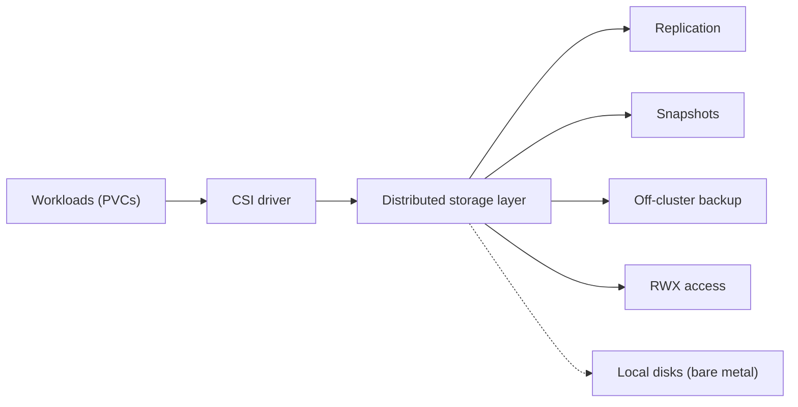
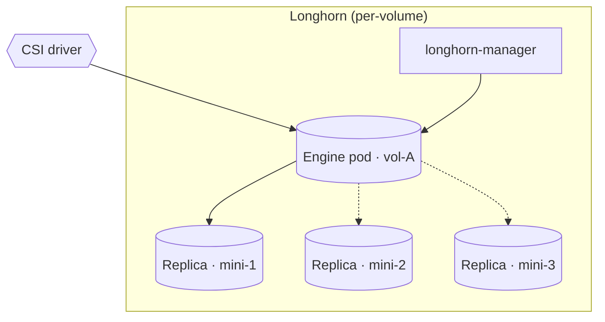
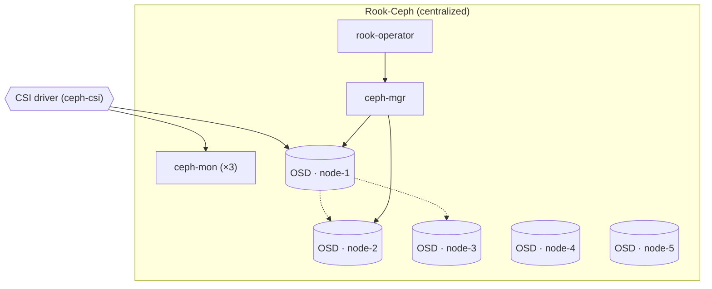
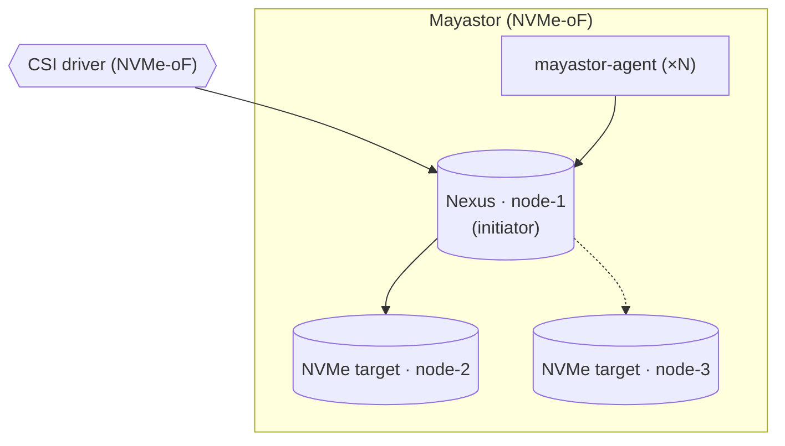
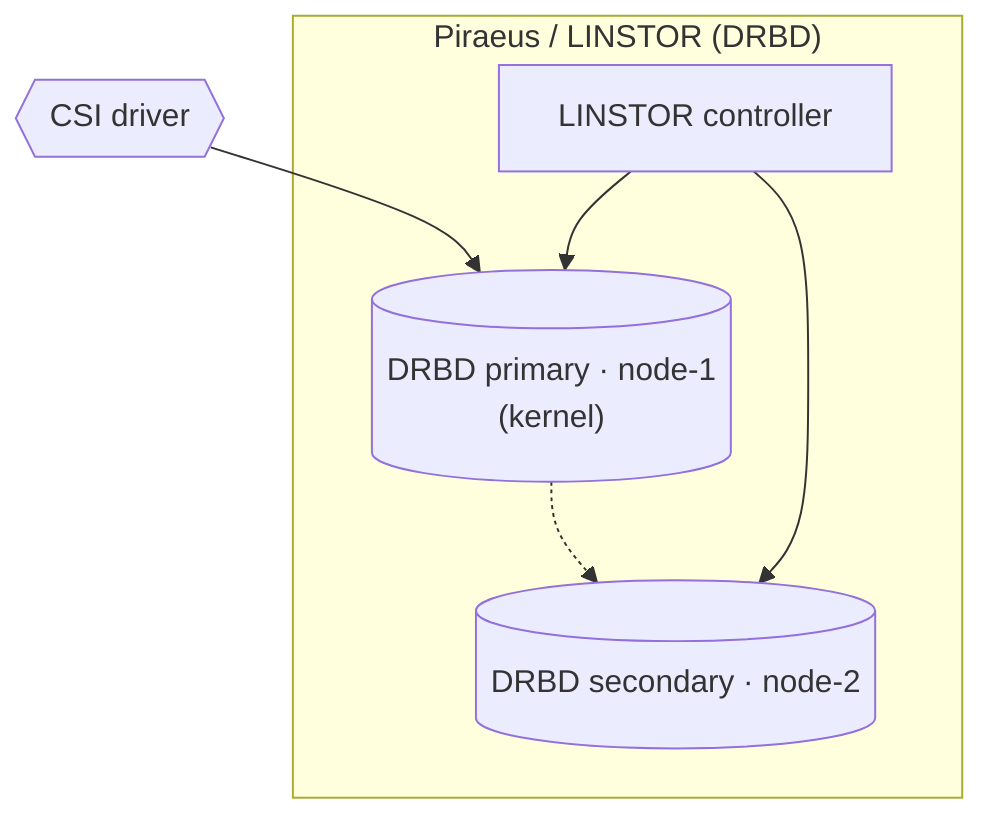
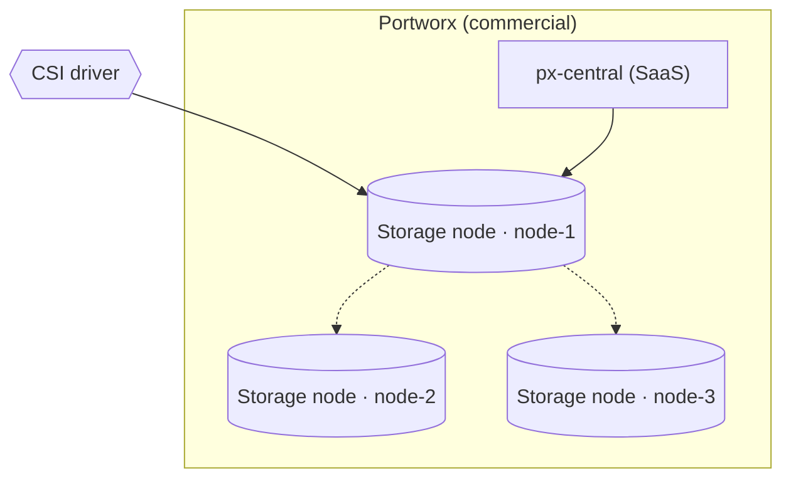
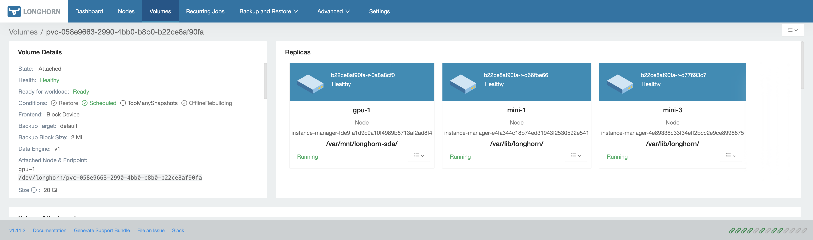
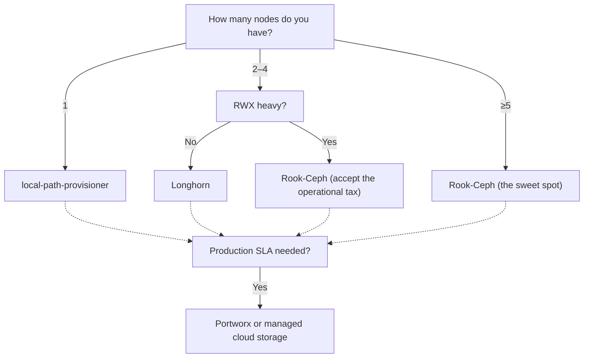

## TL;DR

Distributed storage on bare-metal Kubernetes is a four-job problem —
synchronous replication, snapshots, off-cluster backup, RWX — and the
six contenders in 2026 (Longhorn, Rook-Ceph, OpenEBS Mayastor,
Piraeus/LINSTOR, Portworx, local-path-provisioner) each treat one job
as primary and the rest as supported-eventually.

Frank runs Longhorn with three replicas across the three
control-plane nodes. The scars came in the seams between Longhorn and
the rest of the declarative stack: a RWO RollingUpdate deadlock, an
empty-ExternalSecret rejection, an ArgoCD-versus-secret-store fight
settled by `ServerSideApply=true` plus `ignoreDifferences` on Secret
data.

Frank's answer does not generalize. One node → local-path. Two-to-four
nodes → Longhorn (or Rook-Ceph if RWX is load-bearing). Five-plus →
Rook-Ceph is the sweet spot. Production SLA on top of any leaf →
Portworx or managed cloud storage.

## §1 — The capability

Three nodes go in. Three replicas come out. Then one node is rebooted
for a kernel update, and the only thing that matters is whether the
PVC mounted at `/var/lib/postgresql/data` still answers a write.

That is the capability under examination. Not "storage" in the
abstract — Kubernetes already has the storage abstraction; it is
called a PVC and it is provider-agnostic on purpose. The capability
is the *thing on the other end of CSI* on a bare-metal cluster: who
keeps your bytes alive when a host you control disappears, and who
pays the tax for keeping them alive?

The diagram is honest about what "distributed storage" actually
contains. It is not one job; it is at least four — synchronous
replication, point-in-time snapshots, off-cluster backup, and
read-write-many access for the workloads that need it. Every vendor
in this space treats one of those four as the primary problem and
relegates the rest to "supported, eventually." The vendor space
*splits* on which job is primary.

I run Longhorn. That choice was not made on the merits in the
abstract; it was made on the merits of the three control-plane
nodes I already had. Other clusters have other geometries, and a
different shape produces a different answer. The point of this
paper is to make the trade legible — capability by capability, with
the same diagram language for each vendor — and then return to
Frank's choice and the operational scars that proved it was
correct only on Frank's terms.

## §2 — The landscape

Six options dominate distributed storage on bare-metal Kubernetes in
2026, and they split cleanly on two axes. The horizontal axis is
licensing — open source on the left, commercial-with-contract on the
right. The vertical axis is harder to name without picking a fight,
so the diagram calls it *centralized* versus *replicated-per-volume*:
does the system maintain one cluster-wide data plane (CRUSH map,
metadata service, OSD pool), or does it stand up an independent
replica set per PVC?


        title Distributed storage on bare metal — 2026
        x-axis OSS --> Commercial
        y-axis Centralized --> "Replicated per volume"
        quadrant-1 "Per-volume · Commercial"
        quadrant-2 "Per-volume · OSS"
        quadrant-3 "Centralized · OSS"
        quadrant-4 "Centralized · Commercial"
        "Longhorn": [0.25, 0.75]
        "Rook-Ceph": [0.25, 0.25]
        "OpenEBS Mayastor": [0.30, 0.80]
        "Piraeus / LINSTOR": [0.20, 0.85]
        "Portworx": [0.75, 0.70]
        "local-path-provisioner": [0.10, 0.95]




The matrix grades the options on the four jobs from §1 plus the
license axis and a minimum-node count. The min-node column is the
one that does the most work; it is also the one most vendor docs
mention only in a footnote.

**Longhorn** optimises for operator legibility. Rancher's UI shows
you every volume, every replica, every snapshot — and the per-volume
engine model means a corrupted Postgres volume cannot poison the
storage of an unrelated workload. The trade is that the same per-
volume architecture is genuinely worse than CRUSH for huge fleets.
Longhorn is comfortable at ≤10 nodes and stops scaling well around 50.

**Rook-Ceph** is the inverse trade. You install an operator and you
get Ceph — a real distributed filesystem with twenty years of
research behind it, unified block/file/object, the works. The price
is admission: Ceph wants ≥5 hosts to populate a healthy CRUSH map
under the default rule, and you must learn enough Ceph to debug
when the operator's friendly abstraction leaks.


Ceph maximizes the separation between data and metadata management by
replacing allocation tables with a pseudo-random data distribution
function (CRUSH) designed for heterogeneous and dynamic clusters of
unreliable object storage devices (OSDs).


**OpenEBS Mayastor** is the performance answer. NVMe-over-Fabrics
on the data path; the control plane is a thin Kubernetes operator.
Mayastor was the first project in this list to treat the NVMe
latency floor as the primary design constraint, and the design has
aged well — newer projects in this space converge toward its
shape.

**Piraeus / LINSTOR** is DRBD with a Kubernetes wrapper. DRBD has
been in the Linux kernel since 2009; LINBIT has been selling
support for it since before Kubernetes existed. The unique trade
is that synchronous replication runs inside the kernel rather than
in userspace, which means the latency floor is *very* low and the
operational model is *very* unlike everything else on this list.
Two-node clusters are supported, which no other option here can
honestly claim.

**Portworx** is the commercial answer. Per-volume replication, RWX,
PX-Backup, snapshots, an SLA, a contract, a phone number. The other
five options on this list ask you to operate them; Portworx asks
you to pay them.

**local-path-provisioner** is the null hypothesis. It provisions
hostPath PVCs. There is no replication, no snapshot, no backup, no
failover. Its purpose in this paper is to mark the lower bound: if
your cluster has one node, *this is the right answer*, and the rest
of the matrix is solving a problem you do not have.

## §3 — How each option handles the hard part

The hard part of distributed storage is surviving a node loss
without losing acknowledged writes. Every vendor on this list has
an answer; the answers diverge enough that they need separate
diagrams. The diagrams below use a shared visual language —
squares for control-plane components, cylinders for data on disk,
hexagons for clients (CSI driver, kernel module), solid edges for
read/write hot paths, dashed edges for replication and failover.

### Longhorn

Each PVC gets a dedicated *engine pod* and three *replica pods*,
each replica on a different node. The engine writes to the
local replica synchronously and forwards to the other two over
the network. When the node hosting the engine dies, the manager
elects a new engine on a surviving replica's node and the CSI
driver re-attaches the volume. Time-to-recovery is dominated by
the kubelet's pod-eviction grace period, not by storage
machinery — typically 30–90 seconds before a new engine pod is
scheduled and the volume is re-mounted on the workload's pod.

The failure mode is per-volume, which is both a feature and a
limit. A corrupt replica on `mini-1` taints `vol-A` only;
`vol-B`'s replicas are independent. The limit: at 200 volumes
the cluster runs 200 engine pods, each holding its own TCP
connections to its replicas. Longhorn is not designed for that
density.

### Rook-Ceph

The data plane is one Ceph cluster. OSDs run as DaemonSets;
monitors hold the cluster map; CRUSH decides where objects live.
A workload's PVC is a block image carved out of a Ceph pool, and
the ceph-csi driver maps that image into the workload's pod via
the kernel's `rbd` module. When a node dies, CRUSH recomputes
placement and the surviving OSDs accept the orphaned PG replicas
within seconds. The workload's I/O blocks on the kernel-level
client briefly, then resumes.

The architecture is genuinely better than Longhorn's per managed
megabyte, and the price is the five-node minimum for a healthy
default CRUSH rule plus enough Ceph fluency to debug when something
below the operator abstraction fails.

### OpenEBS Mayastor

Mayastor builds a *Nexus* (an NVMe-oF initiator) on the node
running the workload, which front-ends one or more NVMe targets
on other nodes. Writes are synchronously fanned out to all
targets. The data path is NVMe-oF over TCP (or RDMA where the
fabric supports it), which means the latency floor is set by the
NIC, not by a userspace storage engine.

Failure recovery rebuilds the Nexus on a surviving node and
re-mounts the volume. The bet of the architecture is that
NVMe-oF will dominate the next decade of storage hardware, and
that betting on the protocol early is the right call. So far the
bet looks correct.

### Piraeus / LINSTOR

DRBD has been in the Linux kernel since 2009. Piraeus puts a
Kubernetes operator (LINSTOR) in front of it and exposes the
resulting block devices via a CSI driver. The data path runs
inside the kernel, which means there is no userspace engine to
crash and the failover model is the same as a thirty-year-old
high-availability cluster: a *primary* and one or more
*secondaries*; on primary loss, a secondary is promoted.

The architecture is the only one on this list that survives
honestly on two nodes — DRBD was designed for two-node
high-availability before Kubernetes existed. The trade is that
the operational model is unlike everything else in cloud-native
storage. You are not really operating a Kubernetes storage
system; you are operating DRBD, with a Kubernetes wrapper.

### Portworx

Architecturally similar to Longhorn — per-volume replicas across
named storage nodes — but with a commercial control plane, a
managed backup product (PX-Backup), an SLA, and a phone number.
Failure recovery is no different in shape; the difference is
that when the recovery does not work, somebody else is
responsible for figuring out why. The diagram is mostly
unremarkable on purpose. The point of Portworx is not its
architecture; it is its contract.

## §4 — What scale changes

Three scale axes flip vendor rankings. The first two are
quantitative; the third is philosophical.

**Node count.** Ceph's CRUSH map wants at least five OSD hosts to
produce a healthy default CRUSH rule with the standard `host`
failure domain and three replicas — the math comes straight from
the OSDI '06 paper and has not changed since.


We have designed and implemented Ceph, a distributed file system
that provides excellent performance, reliability, and scalability.


Longhorn's per-volume replicas work cleanly at three. Piraeus /
LINSTOR survives on two. local-path-provisioner is single-node by
construction. The decision tree in §6 makes this concrete: node
count is the first branch, and it eliminates more vendors than any
other criterion.

The community consensus on the Ceph minimum is not folklore — it
shows up in every practitioner thread on the topic:


Longhorn is much simpler to set up and operate. Ceph is more
powerful but requires more nodes and more tuning to perform well.
I run Longhorn on a 3-node cluster with NVMe drives and it just
works.


**Replica count versus write throughput.** Synchronous replication
taxes write throughput by approximately N× where N is the replica
count and the network is the bottleneck. On NVMe drives behind a
1 GbE NIC, the network always is. The interesting consequence: if
your workload is write-heavy and your fabric is unimpressive,
moving from `replicaCount: 3` to `replicaCount: 1` is not a small
optimisation — it is a 3× write-IOPS improvement, paid for with the
durability the cluster was supposedly there to provide. *Frank's
default of three replicas is honest only because Frank has three
control-plane nodes; the math of three-way replication is durable
only on three failure domains.*

**The NVMe latency floor.** Mayastor's NVMe-oF design aims at the
hardware floor — typically tens of microseconds on a quiet link.
Longhorn's userspace engine accepts a higher floor in exchange for
operational simplicity; the engine pod handles snapshots, replica
rebuilds, and protocol bookkeeping at the cost of an extra
context-switch on every I/O. This is the philosophical split that
defines the space: *performance-first* vendors trade
debuggability for latency, *operability-first* vendors trade
latency for legibility. There is no objectively correct answer,
but the answer is heavily constrained by what kind of operator is
on the keyboard at 2 AM.

## §5 — Frank's choice, and what happened

I run Longhorn. Three replicas across the three control-plane
nodes — `mini-1`, `mini-2`, `mini-3`. Not because the math of
`replica_count == control_plane_count` is durable (it isn't,
mathematically: losing two of three control-plane nodes loses
both quorum *and* two of three replicas in one event), but
because that was the geometry of the fleet I already had, and I
was not going to buy a fourth NUC to satisfy a math problem.

The honesty of that choice is what makes the resulting scars
worth writing down. A managed cluster would have hidden every
one of them.


An RWO PVC pinned to one node deadlocked a RollingUpdate. The
new pod could never attach the volume while the old pod still
held it; the Deployment sat in `Progressing` indefinitely. Switching
the Helm chart's strategy to `Recreate` fixed it on paper, and
then refused to fix it on the cluster — Helm's chart rendering
cannot delete keys from a live resource, and the old
`rollingUpdate:` block survived the strategy change as an orphan
field that re-enabled the broken behavior. The fix was a one-time
`kubectl patch` to delete the orphan block, after which the chart
rendered cleanly forever. An immutability boundary inside an
otherwise declarative stack: declarative tooling does not infer
"absent" from "removed from the values file."



An ExternalSecret with `data: []` was rejected by the admission
webhook. There is no "empty secret" valid state — when all keys
are removed, the ExternalSecret itself must be deleted, not
zeroed. ArgoCD will not infer that from a values diff. A human
has to know, which is to say: the operator has to know, which is
to say: the gotcha has to be written down or the next migration
re-discovers it.



`ServerSideApply=true`, `prune: false`, and `ignoreDifferences` on
Secret `/data` aren't decorations on the Application CR — they're
the only thing that prevents ArgoCD from fighting the secret store
at every sync. Learning that the first time costs an afternoon;
encoding it in every Application CR forever costs nothing. The
shape of the lesson is the same as the lesson itself: declarative
infrastructure needs an explicit policy for the resources it does
*not* own, or it pretends to own everything and breaks the things
it cannot.


The three scars share a shape. None of them are bugs in Longhorn;
all of them are emergent properties of running a storage layer
that the cluster's other declarative machinery does not entirely
understand. The interfaces between Longhorn, ArgoCD, External
Secrets, and the admission controllers are where the failures
live — exactly where the marketing material does not look.

Visible evidence:

A managed-storage product would have hidden every one of these
failure modes behind its SLA, which is the right trade for a
production team and the *wrong* trade for a learning platform.
Frank exists to encounter the RWO-RollingUpdate deadlock so that
the next operator on this stack does not have to.

## §6 — When Frank's answer doesn't generalize

Frank's answer — Longhorn on three control-plane nodes — is one
leaf of a four-leaf tree. The other three are real.

The first branch is node count. A single node has no distributed
storage problem; `local-path-provisioner` is correct, full stop.
At two-to-four nodes the question becomes whether RWX matters:
Longhorn does RWX through NFS-on-top, which is workable for log
collectors and broken for write-heavy multi-writer workloads;
Rook-Ceph's CephFS does RWX natively but extracts the five-node
operational tax even when the cluster is small. At five-plus
nodes Rook-Ceph stops being a hard sell and becomes the sweet
spot — the operational tax amortises, and you get unified
block/file/object out of one operator.

The dashed branch is the SLA override. *Any* of the four leaves
can be promoted to "Portworx or managed cloud storage" when the
business needs a contract behind the data plane. Frank doesn't —
the cluster's contract is a personal commitment to write down
what breaks. A real team with a real on-call rotation and real
revenue depending on uptime probably should.

This is the section where the paper has to be honest about its
audience. If you are reading this from a production engineering
team, the right answer for you is almost never Frank's answer.
The right answer is the SLA branch. Frank's answer is correct
*for Frank* and is documented here so that anyone considering the
trade understands the rest of the leaves before picking the same
one.

## §7 — Roadmap & where this space is going

Three trends are worth naming. None of them are settled; all of
them affect the next few years of distributed storage on bare
metal.

**NVMe-over-Fabrics is going mainstream.** Mayastor was early —
the design is becoming the expected baseline for any new
distributed-storage project, and the latency floor moves with the
hardware. Once NVMe-oF over RDMA is the assumed substrate, the
userspace-engine model that powers Longhorn looks like a legacy
choice rather than an operability win. The interesting question
is not *whether* NVMe-oF wins, but whether the operability-first
projects (Longhorn especially) can adopt it without losing the
per-volume isolation that is their actual selling point.

**Rook-Ceph's operator maturity is closing the gap.** The biggest
historical argument against Rook-Ceph was the operational tax —
you needed enough Ceph fluency to debug under the abstraction.
The Rook operator's recent releases have closed a lot of that
gap, with much friendlier failure modes and far less manual
intervention required for routine OSD failures. The "Rook tax"
is shrinking. The five-node floor is not.

**Snapshot and backup standardization.** The CSI snapshot API,
Velero, and Kopia layered on top are reaching the point where
"which backup tool" is no longer a vendor-lock-in decision.
Off-cluster backup is becoming portable across storage backends —
the same Kopia repository can hold snapshots from Longhorn,
Rook-Ceph, and Mayastor without surgery. This matters less for
single-vendor clusters like Frank and matters enormously for
anyone planning to migrate between storage backends without
re-snapshotting their entire data estate.

The space is not done evolving. Frank will revisit this paper
when the answers change.
