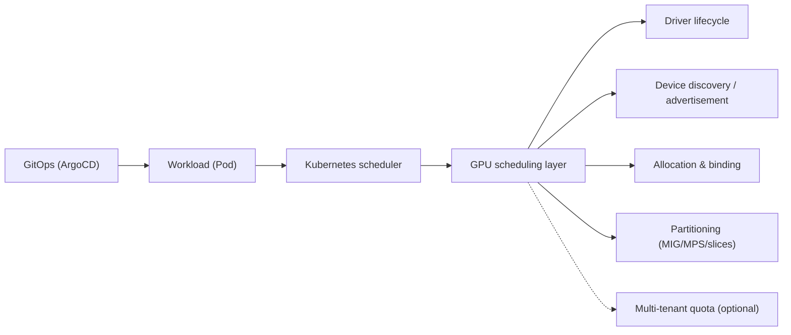
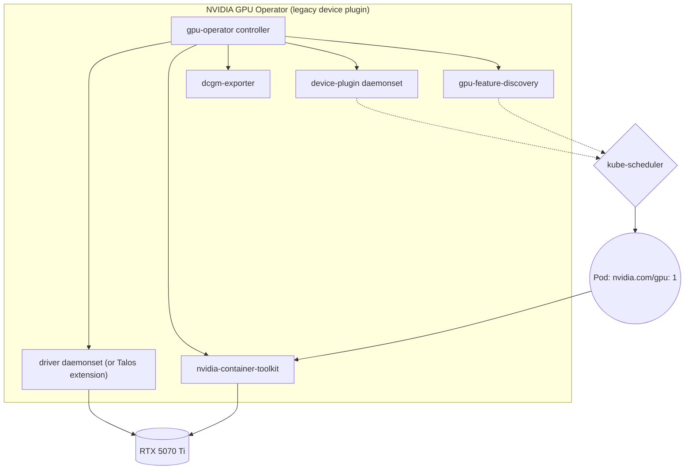
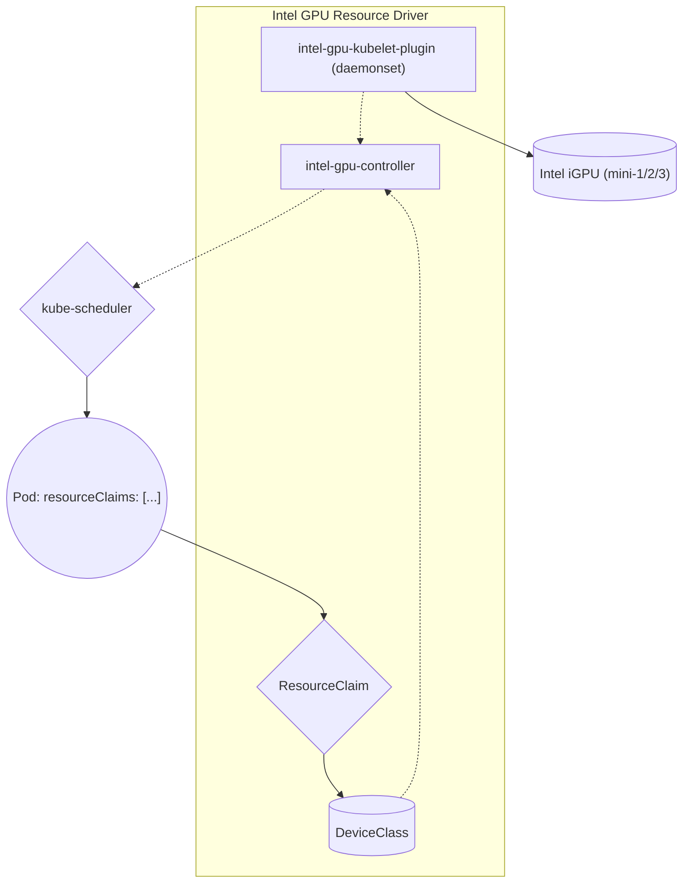
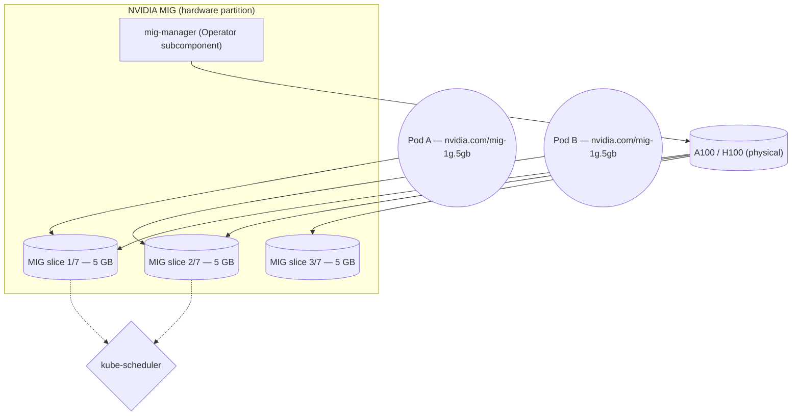
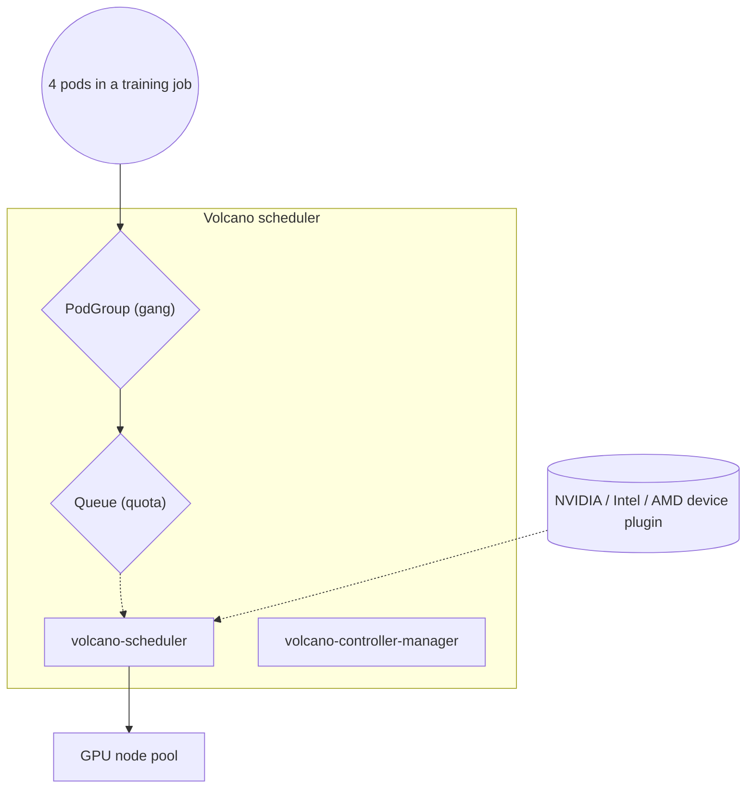
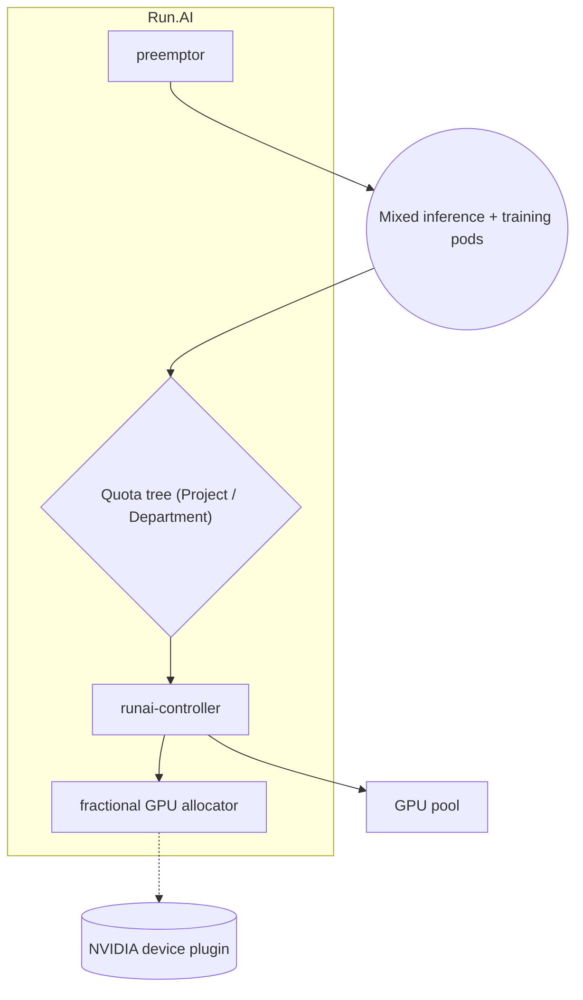
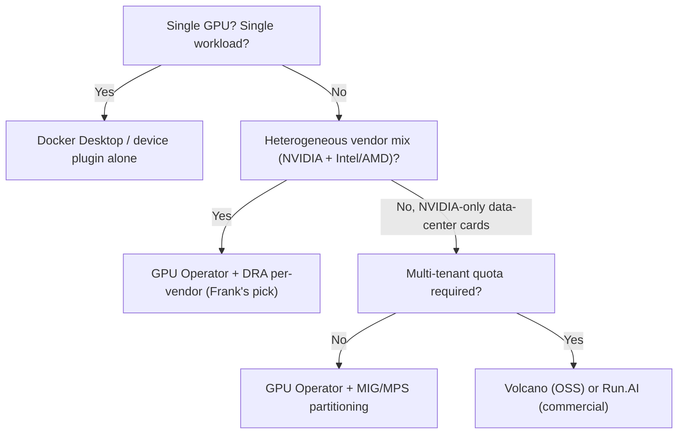

## TL;DR

GPU scheduling on Kubernetes is a four-job problem — driver lifecycle,
device discovery, allocation, partitioning — and the six contenders in 2026
(NVIDIA GPU Operator, Intel GPU Resource Driver / DRA, AMD ROCm device
plugin, NVIDIA MIG/MPS, Run.AI, and Volcano scheduler) each treat one or
two of those jobs as primary and demand a tax from the operator for the
rest.

Frank runs the NVIDIA GPU Operator on gpu-1 (with `driver.enabled: false`
because Talos system extensions own the driver) plus the Intel GPU Resource
Driver on mini-1/2/3, with an in-house `gpu-switcher` brokering exclusive
runtime access among Ollama, ComfyUI, and vLLM. The scars came in the
seams: Talos refused NVIDIA's stock driver installer, the
`nvidia.com/gpu:NoSchedule` taint re-asserted after every restart, Ollama
tripped the cgroup OOM-killer with `OLLAMA_KEEP_ALIVE` pinning the page
cache.

Frank's answer does not generalize. Single GPU, single workload → device
plugin alone. NVIDIA-only data-centre fleet → Operator + MIG/MPS.
Multi-tenant batch at scale → Volcano (OSS) or Run.AI (commercial).

## §1 — The capability

A pod requests `nvidia.com/gpu: 1`. The scheduler picks a node. The kubelet
calls the device plugin. The plugin returns a device ID. The container
runtime injects `/dev/nvidia0` into the pod's namespace. The application
runs CUDA against the card.

Five hops, four vendor components, and a kernel module loaded at boot. The
capability under examination is not "GPU access" in the abstract — that
much has been working since 2018. The capability is *what happens when the
silicon is heterogeneous and the workloads are mixed*: when one node has a
discrete RTX 5070 Ti and another has an Intel iGPU and a third has nothing
at all, when the workloads are sometimes an inference server holding the
card for a week and sometimes a training batch wanting forty minutes and
sometimes a Stable Diffusion job wanting six seconds of exclusive access,
who tells the scheduler which pod gets which silicon, and what tax do they
charge for that decision?

The four jobs GPU scheduling does — driver lifecycle, device discovery,
allocation, partitioning — are not all the same job. Some vendors treat
one as primary and let the others fall out of the design; others ship a
single operator that bundles all five. The vendor space *splits* on
single-vendor-versus-multi-vendor scope and on whether the option still
speaks the legacy device-plugin API or has migrated to Dynamic Resource
Allocation.

Frank runs the NVIDIA GPU Operator on gpu-1 and the Intel GPU Resource
Driver on mini-1/2/3. That choice was not made on the merits in the
abstract; it was made on the merits of owning a single discrete NVIDIA
card alongside three Intel iGPUs and wanting both visible to the same
scheduler. The point of this paper is to make the trade legible, then
return to Frank's choice and the operational scars that proved it was
correct only on Frank's terms.

## §2 — The landscape

Six options dominate Kubernetes GPU scheduling in 2026, and they split on
two axes. The horizontal axis is *vendor scope* — does the option speak
one vendor's hardware (NVIDIA-only, Intel-only, AMD-only) on the left, or
abstract across vendors on the right? The vertical axis is *device-model
generation* — the legacy Kubernetes device-plugin API at the bottom, the
newer Dynamic Resource Allocation framework (KEP-4381 structured
parameters) at the top.


        title GPU scheduling — 2026
        x-axis "Single-vendor" --> "Multi-vendor"
        y-axis "Device plugin (legacy)" --> "DRA (KEP-4381)"
        quadrant-1 "Multi-vendor · DRA"
        quadrant-2 "Single-vendor · DRA"
        quadrant-3 "Single-vendor · device plugin"
        quadrant-4 "Multi-vendor · device plugin"
        "NVIDIA GPU Operator": [0.15, 0.40]
        "Intel GPU Resource Driver": [0.20, 0.85]
        "AMD ROCm device plugin": [0.18, 0.10]
        "NVIDIA MIG / MPS": [0.12, 0.45]
        "Run.AI": [0.30, 0.30]
        "Volcano scheduler": [0.85, 0.25]




The matrix grades the options on NVIDIA / Intel / AMD support, DRA, GPU
partitioning, gang scheduling, multi-tenant quota, and licensing. The DRA
column is the one that does the most work; it is also the one that has
moved the fastest in the last eighteen months.

**NVIDIA GPU Operator** optimises for vendor-managed lifecycle of every
NVIDIA component. The Operator's own positioning is unambiguous:


The NVIDIA GPU Operator uses the operator framework within Kubernetes to
automate the management of all NVIDIA software components needed to
provision GPU.


Five components in one operator: driver, container toolkit, device plugin,
GPU Feature Discovery for node labelling, DCGM exporter for metrics. The
trade is that the Operator wants to install the driver itself — and on
immutable host operating systems (Talos, Bottlerocket, Flatcar) that
assumption breaks. On Frank, `driver.enabled: false` plus a Talos system
extension is the workaround. The convenience of "one Helm install" is
real; the convenience of "one Helm install on any host OS" is not.

**Intel GPU Resource Driver** is the leading DRA-native production
implementation. Intel's own positioning makes the contrast with the
legacy device plugin explicit:


Intel resource drivers for Kubernetes is an alternative for Intel device
plugins, facilitating workload offloading by providing accelerator access
on Kubernetes cluster worker nodes. The resource drivers are based on
Dynamic Resource Allocation (DRA) framework in Kubernetes.


DRA lets a pod request *a class of accelerator with constraints* (memory
size, codec capability, queue depth) instead of an opaque integer count.
The benefit is fine-grained allocation and device sharing. The cost is
that DRA's API has churned through KEP-3063 (control-plane controller,
withdrawn in 1.32), KEP-4381 (structured parameters, the current path),
and a long-tail of in-tree changes; running it in 2026 means tracking the
upstream Kubernetes release cadence closely. Frank's `apps/intel-gpu-driver/`
ships a vendored chart with K8s 1.35 patches because the upstream chart
lagged.

**AMD ROCm device plugin** is the most conservative option in the
landscape. ROCm-stack device plugin exposing AMD Instinct and Radeon
GPUs via the same legacy device-plugin contract NVIDIA used in 2018. No
DRA, no partitioning, no GPU Operator equivalent — just `amd.com/gpu: 1`
and the ROCm runtime on the host. Its position in the landscape is
"this works, and that is all".

**NVIDIA MIG / MPS** is the partitioning answer. MIG is hardware-level
isolation:


The Multi-Instance GPU (MIG) User Guide explains how to partition supported
NVIDIA GPUs into multiple isolated instances, each with dedicated compute
and memory resources.


MPS is the software counterpart — time-sliced or spatially shared access
to one physical card from multiple processes. The trade is that MIG only
works on A100/H100-class data-center cards (consumer cards like the RTX
5070 Ti do not support it) and MPS requires the application to be
written for shared CUDA contexts. On Frank's hardware, neither applies;
gpu-switcher fills the gap as a poor-man's userspace partitioner.

**Run.AI** is the commercial answer for multi-tenant clusters. Acquired
by NVIDIA in 2024. Fractional GPU allocation, quota trees, gang scheduling,
priority pre-emption, the things every team eventually wants once five
teams share fifty cards. The trade is the commercial contract; for a
homelab it is the wrong shape.

**Volcano scheduler** is the OSS answer to Run.AI's shape:


Volcano is a cloud native system for high-performance workloads, which
has been accepted by Cloud Native Computing Foundation (CNCF) as its
first and only official container batch scheduling project.


Volcano replaces (or augments) the default Kubernetes scheduler with
batch-aware policies: gang scheduling ("all-or-nothing" pod groups),
queue-based quota, GPU-aware placement. It is multi-vendor in the sense
that it doesn't care which device plugin exposed the GPU — it works on
top of whatever vendor's plugin you ship. Its position in the landscape
is the multi-vendor, single-control-plane sweet spot for batch shops.

## §3 — How each option handles the hard part

The hard part of GPU scheduling is *deciding which pod gets which physical
or virtual GPU slice*, without leaking driver state between tenants and
without making the scheduler do per-card book-keeping it was never designed
for. Every vendor on this list has an answer; the answers diverge enough
that they need separate diagrams. The diagrams below use a shared visual
language — squares for controllers, rounded rectangles for daemons /
pods, diamonds for decision points, cylinders for hardware / device
sources, dashed edges for discovery and advertisement, solid edges for
binding and runtime paths.

### NVIDIA GPU Operator

The Operator is six daemonsets coordinated by one controller. The driver
daemonset compiles modules against the host kernel at install time (or, on
Talos, is replaced by a system extension). The device plugin advertises
`nvidia.com/gpu: <count>` to the scheduler. GFD labels the node with the
GPU model / memory / compute capability. DCGM exports metrics. The
container toolkit injects `/dev/nvidia*` and library paths at runtime.

Allocation is opaque integer count. A 5070 Ti node advertises
`nvidia.com/gpu: 1`; whichever pod wins it gets exclusive access to the
whole card. The failure mode is heterogeneous workloads — an inference
server that wants the card for a week shares the same advertisement as a
six-second image generation job, and the scheduler has no way to express
the difference.

### Intel GPU Resource Driver (DRA)

The Intel driver replaces "advertise an integer count" with "expose a
ResourceSlice describing each accelerator and let pods request via
ResourceClaim". A pod's `resourceClaims` field references a DeviceClass;
the controller matches claims to claims-eligible devices. The model is
expressive: a pod can ask for *an Intel iGPU with ≥4 GB shared memory and
H.265 hardware decode*, and the controller will refuse to schedule it on
a node whose iGPU lacks the codec.

The failure mode is the API churn. Frank's vendored chart in
`apps/intel-gpu-driver/chart/` carries patches against Kubernetes 1.35's
DRA API shape because the upstream chart lagged for several months. DRA's
graduation to GA is on the 1.34 roadmap, but production deployments today
should expect to track upstream tightly.

### NVIDIA MIG / MPS

MIG carves one physical GPU into up to seven isolated instances at the
hardware level; each instance advertises its own scheduler resource
(`nvidia.com/mig-1g.5gb`, `nvidia.com/mig-2g.10gb`, etc.). The mig-manager
subcomponent of the GPU Operator handles partitioning at node-startup
time. Each slice has dedicated memory bandwidth, dedicated SMs, and
dedicated L2 cache — workloads on one slice cannot starve another.

The failure mode is fragmentation. Once a card is partitioned into 1g.5gb
slices, a pod that wants 4g.20gb of memory cannot schedule on it without
reconfiguring the partition geometry — which requires draining all pods
on the card first. Static partition layout is a node-level configuration
decision that fights with dynamic workload demand.

MPS is the software alternative. The same card stays whole; CUDA
contexts from multiple processes are time-multiplexed. No hardware
isolation — a misbehaving tenant can DOS the others — but no
fragmentation either. The trade is sharper isolation for sharper
flexibility.

### Volcano scheduler

Volcano replaces (or augments) the default scheduler with batch-aware
policies. A training job submits *a PodGroup* — N pods that must all
schedule together or none of them. Quotas live on Queues, not Namespaces;
a team's GPU budget is tracked at the Volcano layer. The vendor's own
gang-scheduling line is the load-bearing claim:


Ensure all tasks of a job start simultaneously, suitable for distributed
training and big data scenarios.


The failure mode is the dual-scheduler hazard: Volcano and the default
scheduler can race on the same node if pods aren't pinned to one or the
other via `schedulerName`. The fix is operational discipline — every
GPU pod ships `schedulerName: volcano` — but the discipline must be
maintained as the cluster grows.

### Run.AI

Run.AI sits on top of the NVIDIA device plugin and adds fractional
allocation (a pod can ask for 0.25 GPU), hierarchical quota (Department →
Project → User), and priority-based pre-emption. The architecture is
heavier than Volcano's but the policy expressiveness is greater. The trade
is the commercial contract; the product is single-vendor (NVIDIA) and
positioned at multi-tenant AI platforms.

## §4 — What scale changes

Three scale axes flip vendor rankings. The first two are quantitative;
the third is operational.

**GPU count per node.** A single-card node can run the NVIDIA device
plugin alone — Frank's gpu-1 with one 5070 Ti is the canonical case. A
four-card node with mixed workloads needs partitioning (MIG/MPS) or a
batch scheduler (Volcano) to keep utilisation above the embarrassing
threshold. The crossover is not a number; it is *"how often does an
allocated card sit idle while another pod waits?"* If the answer is
"never", stay with the device plugin. If the answer is "every Tuesday
afternoon", consider partitioning or batching.

**Tenant count.** One tenant per cluster needs no quota beyond
ResourceQuota at the Namespace level. Ten teams sharing a fleet needs
quota trees and gang scheduling — Volcano's queue model or Run.AI's
project hierarchy. The Kubernetes-native answer (ResourceQuota +
PriorityClass) covers the case for small N and fails ungracefully at
moderate N because pre-emption cascades are not policy-aware.

**Driver re-validation cost.** Every node restart costs N seconds of GPU
unavailability while the NVIDIA driver re-validates and the Operator re-
advertises capacity. At one node it's free; at fifty nodes during a
rolling kernel update it is the SLO budget. The same re-validation also
re-asserts taints (see §5), which compounds the cost.

The upstream Kubernetes documentation is explicit about why DRA is the
scale answer for the device-plugin model:


These benefits provide significant improvements in the device allocation
workflow when compared to device plugins, which require per-container
device requests, don't support device sharing, and don't support
expression-based device filtering.


At small scale, those limitations don't matter. At ten-card-per-node, they
become the bottleneck — every workload either gets a whole card or none,
and the scheduler has no language for "this batch can run on whichever
card has 8 GB free".

## §5 — Frank's choice, and what happened

I run the NVIDIA GPU Operator on gpu-1 and the Intel GPU Resource Driver
on mini-1/2/3. One discrete RTX 5070 Ti (NVIDIA) advertised as
`nvidia.com/gpu: 1`; three Intel iGPUs advertised via Intel's DRA
ResourceSlice. The Operator runs with `driver.enabled: false` and
`toolkit.enabled: false` because Talos system extensions already provide
both. The Intel chart is vendored in `apps/intel-gpu-driver/chart/`
because the upstream chart lagged behind Kubernetes 1.35's DRA API. The
in-house `gpu-switcher` service brokers exclusive use of the 5070 Ti
among Ollama, ComfyUI, and vLLM at runtime — Kubernetes scheduling alone
cannot express "this workload temporarily owns the card, then releases
it" without MIG (which the 5070 Ti does not support) or MPS (which the
workloads were not written for).

I did not pick this stack on the merits in the abstract. I picked it
because the hardware is heterogeneous and the workloads are mixed.
NVIDIA-only would have left the iGPUs as dead silicon; Intel-only would
have left the 5070 Ti as dead silicon. A managed cloud-vendor GPU
scheduling product would have hidden every one of the scars below behind
its abstraction, which is the right trade for a production team and the
*wrong* trade for a learning platform.


Talos refused to validate NVIDIA's off-the-shelf driver installer. The
installer assumes mutable kernel-module space; Talos sandboxes it. The
GPU Operator's `driver` daemonset tried to build modules against an
immutable rootfs and crash-looped. The fix is a dedicated
`patches/phase04-gpu/` patch set that ships the NVIDIA bits the immutable
way — `nvidia-container-toolkit` and `nvidia-open-gpu-kernel-modules` as
Talos system extensions, kernel modules declared in the machine config
so they load at boot, and the Operator running with `driver.enabled:
false`. One of those scars where the immutable-OS guarantee makes the
easy path impossible and the hard path inevitable. The good news: once
the system extensions are in place, the GPU survives every cluster
upgrade automatically.



Workloads on gpu-1 sometimes failed scheduling with `Insufficient
nvidia.com/gpu`. The taint `nvidia.com/gpu:NoSchedule` had been re-
asserted by NVIDIA's driver re-validation after a node restart — the
Operator's daemonsets taint the node early in boot to prevent pods
landing before the driver is ready, and then *forget to remove the taint
in some race conditions* with the kubelet. Every GPU workload on Frank
now ships a defensive `tolerations: [{key: "nvidia.com/gpu", operator:
Exists, effect: NoSchedule}]`; without it, restarts are silently
disruptive. The lesson: *controller-asserted taints are not symmetric
with controller-removed taints, and the asymmetry shows up only when the
node has restarted.*



Ollama reported `system memory` errors on gpu-1. Not VRAM — the
container's cgroup RAM ceiling. `OLLAMA_KEEP_ALIVE` had been tuned high
to avoid model reloads, and the page cache for the loaded model weights
pinned the cgroup near `resources.limits.memory`. The kernel's cgroup
OOM-killer found it before the model did, and Ollama's error message
(carried up from CUDA) called it "system memory" — *which it was, in
the strictest sense — the container's system memory, not the host's,
and certainly not the GPU's*. The fix is two-pronged: raise the cgroup
ceiling (the workload genuinely needs more RAM than `nvidia-smi` numbers
suggest), and lower `OLLAMA_KEEP_ALIVE` so the page cache is released
between requests. Cross-references Paper 10's inference-stack scars;
lives at this layer because cgroup limits are set by the scheduler and
they interact with the GPU runtime's caching strategy in non-obvious
ways.


The three scars share a shape. None of them are bugs in the NVIDIA GPU
Operator or in the Intel DRA driver. All of them are emergent properties
of running multi-vendor GPU scheduling on an immutable host OS with
mixed long-lived and short-lived workloads. The interfaces between the
Operator, the kubelet, the cgroup hierarchy, and the GPU runtime are
where the failures live — exactly where the marketing material does not
look.

Visible evidence:

## §6 — When Frank's answer doesn't generalize

Frank's answer — NVIDIA GPU Operator + Intel GPU Resource Driver on a
heterogeneous bare-metal cluster — is one leaf of a four-leaf tree. The
other three are real.

The first branch is whether the workload mix even justifies a scheduling
layer beyond the device plugin. A laptop with one GPU running one CUDA
job at a time does not need DRA, partitioning, or a batch scheduler;
Docker Desktop or the bare NVIDIA device plugin covers the case.

The second branch is the heterogeneous-vendor split. NVIDIA + Intel +
maybe AMD in the same cluster (Frank) needs per-vendor schedulers
because no single vendor's operator speaks the others' hardware. The
right answer is the NVIDIA GPU Operator for NVIDIA cards and Intel's
DRA driver (or AMD's device plugin) for the rest.

The third branch is the partitioning / tenancy axis on NVIDIA-only
data-center fleets. A single 8×H100 node serving one team needs
MIG/MPS to keep utilisation high. The same node serving ten teams
needs Volcano's queue model or Run.AI's commercial product on top of
MIG.

This is the section where the paper has to be honest about its
audience. If you are running an NVIDIA-only data-center fleet, Frank's
answer is overkill; the right answer is one of the other three leaves.
If you are running a multi-vendor homelab or research cluster, Frank's
answer is approximately the only answer, and the scars in §5 are part
of the package. Frank's answer is correct *for Frank* and is documented
here so anyone considering the same trade understands the rest of the
leaves before picking it.

## §7 — Roadmap & where this space is going

Three trends are worth naming. None are settled; all affect the next few
years of GPU scheduling on Kubernetes.

**Dynamic Resource Allocation is eating the device plugin.** KEP-4381
(structured parameters) is the current DRA path after KEP-3063's
withdrawal; Intel's driver is DRA-native today, NVIDIA's GPU Operator
ships DRA support behind a feature flag, AMD lags. In eighteen months
the device-plugin API will be a legacy compatibility surface. New
workloads will land on DRA first, with the device plugin as a
backwards-compatibility path for older Kubernetes versions. The Intel
chart in `apps/intel-gpu-driver/` is already an early adopter, and the
churn cost (vendored chart, K8s 1.35 patches) is the price of being
there first.

**Partitioning is moving from hardware to software.** MIG is hardware-
level isolation on data-center cards only; MPS is software time-slicing
that works on any CUDA device. CUDA-stream-level partitioning in the
runtime — and Time-Slicing as a first-class GPU Operator feature — are
softening the "one card = one tenant" assumption. The consumer-card
fleets (Frank's RTX 5070 Ti) are likely to benefit most: hardware MIG
won't come to consumer SKUs, but software partitioning probably will.

**The scheduler tax is being unbundled.** Gang scheduling, quota trees,
and metric-based GPU placement are appearing as native Kubernetes
features (Kueue, scheduler plugins) rather than vendor-specific bolt-ons.
Volcano and Run.AI track this; the long-tail bet is that the OSS path
will absorb most of what Run.AI's commercial product currently
differentiates on, leaving the commercial value in fractional-GPU
allocation and management UI.

The space is not done evolving. Frank will revisit this paper when the
answers change.

