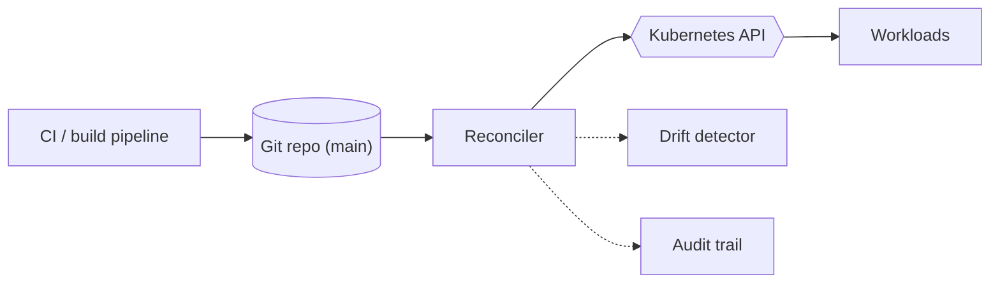
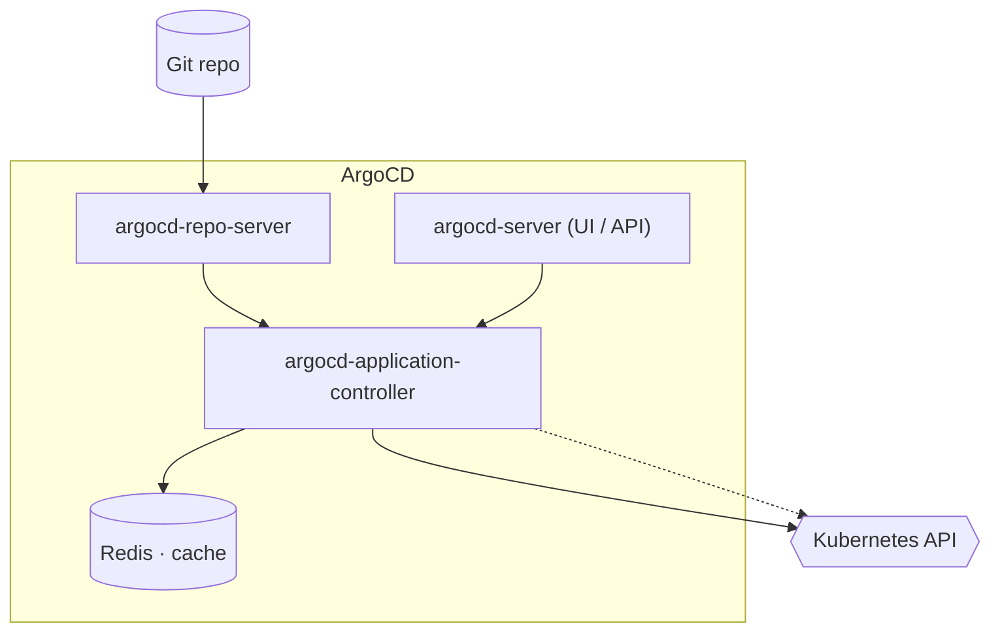
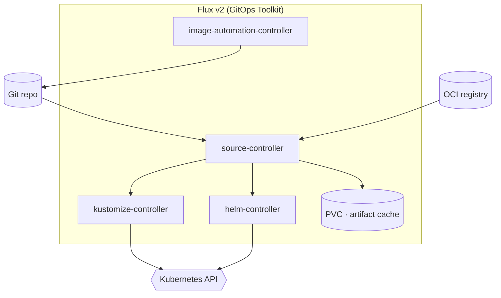
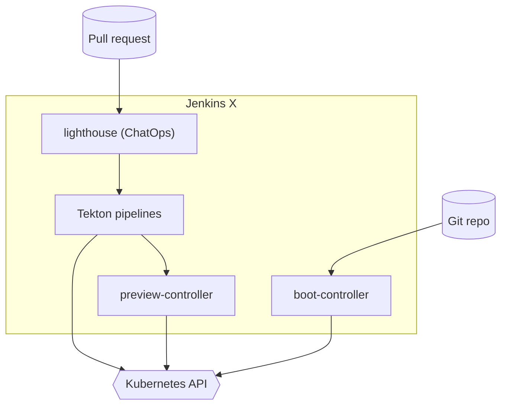
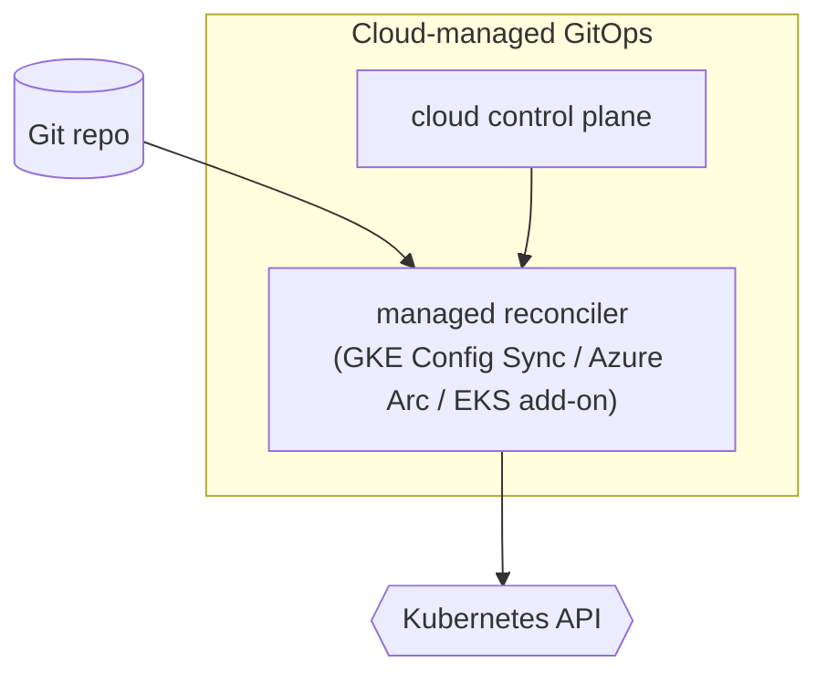
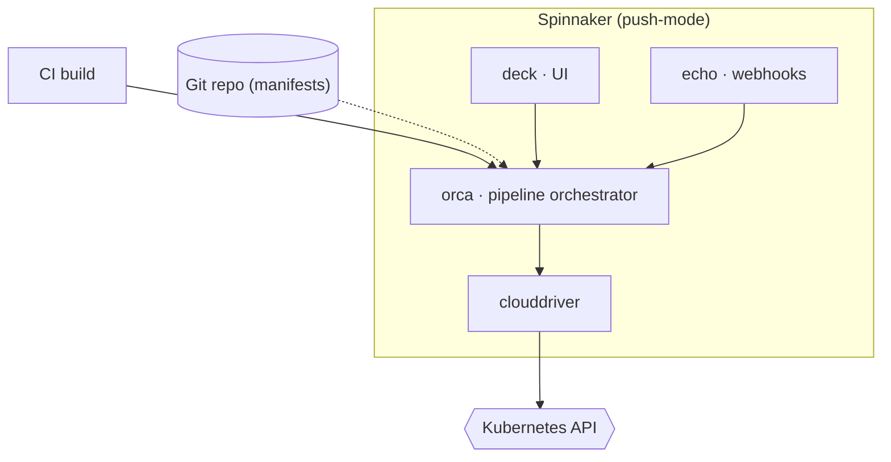
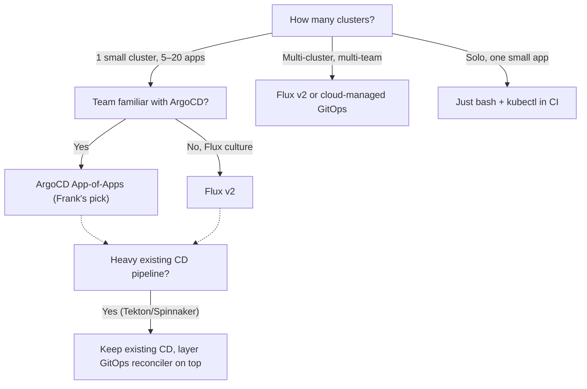

## TL;DR

*Write last.*

## §1 — The capability

The cluster is a folder. That is the GitOps premise, stripped to its
load-bearing claim: the desired state of every workload, every
ConfigMap, every Application CR, lives in a Git repository, and
something inside the cluster watches the repo and reconciles the
difference. Push code; the cluster catches up. Edit the cluster by
hand; the reconciler erases your edit. The audit trail is `git log`.

That is the *capability*. The diagram below is the stack position.

GitOps does four things at once, and the diagram lies a little by
drawing them as separate arrows: (1) it *reconciles* declared state to
live state; (2) it *detects drift* — anything in the cluster that does
not match the repo; (3) it *gates write access* to production — only
commits to `main` can change the cluster; (4) it *creates an audit
trail* by construction, because every change is a commit by a named
author with a timestamp and a message. Each of those four jobs has a
single-purpose tool that does it better than a reconciler. The
reconciler's claim is that buying all four with one decision is worth
giving up the best-in-class version of each.

The vendor landscape splits on whether you buy the all-four bundle and
on whether the reconciler runs inside the cluster (pull-mode) or
outside it (push-mode). That is the question the rest of this paper
addresses. It is not a question about CI/CD in general — CI/CD predates
GitOps by a decade. It is a question about *who watches Git, and where
they live*.

## §2 — The landscape

Six options dominate GitOps on Kubernetes in 2026, and they split
cleanly on two axes. The horizontal axis is licensing — open source
on the left, commercial-with-contract on the right. The vertical axis
is *bundling philosophy*: a single application that does the whole
job (opinionated), or a kit of controllers you compose yourself
(unbundled).


        title GitOps reconcilers — 2026
        x-axis OSS --> Commercial
        y-axis Unbundled --> Opinionated
        quadrant-1 "Opinionated · Commercial"
        quadrant-2 "Opinionated · OSS"
        quadrant-3 "Unbundled · OSS"
        quadrant-4 "Unbundled · Commercial"
        "ArgoCD": [0.20, 0.30]
        "Flux v2": [0.15, 0.20]
        "Jenkins X": [0.30, 0.75]
        "Cloud-managed GitOps": [0.80, 0.80]
        "Spinnaker": [0.25, 0.70]
        "Just bash + kubectl": [0.10, 0.10]




The matrix grades the options on the four jobs from §1 plus the
licensing and opinionation axes. Read it row-by-row: the "pull-mode
reconciler" column is the one that decides whether the option is
GitOps *at all* under the OpenGitOps definition, not just *CI/CD with
a Git source*.


Pulled Automatically: Software agents automatically pull the desired
state declarations from the source. Continuously Reconciled: Software
agents continuously observe actual system state and attempt to apply
the desired state.


**ArgoCD** is the most-deployed option in the category. The
argument for it is the UI, the App-of-Apps composition pattern, and
the controller's pragmatic handling of edge cases (post-sync hooks,
sync waves, prune policies). The argument against is that it ships
as one application — one Helm release reconciles the world — and
once you have committed to it, you have committed to its model of
what a sync looks like. There is no Lego.

**Flux v2** is the inverse trade. It ships as a *kit* — source-
controller fetches Git, kustomize-controller renders Kustomize,
helm-controller renders Helm, image-automation-controller bumps
image tags. Each is a small reconciler with a single responsibility,
and you wire them together. The UI is a third-party concern (Weave
GitOps was the canonical answer, now stewarded by community forks);
the cluster comes with `flux` CLI and `kubectl`.

**Jenkins X** is the opinionated answer for app teams. It bundles
GitOps with Tekton-based CI, preview environments per pull request,
ChatOps via Slack, and a `jx` CLI that abstracts the whole pipeline.
The trade is exactly that opinionation: when the Jenkins X model
fits the team's workflow, it fits beautifully; when it does not, the
abstractions become walls.

**Cloud-managed GitOps** is the hyperscaler answer. Anthos Config
Management on GCP, Azure Arc with GitOps add-ons on Azure, EKS
GitOps add-ons (Flux or ArgoCD, vendor-deployed) on AWS. The trade
is identical to managed Postgres: the operational tax goes to the
cloud vendor; the per-month bill arrives.

**Spinnaker** is the push-mode foil. It predates GitOps as a label
— Netflix open-sourced it in 2015, before "GitOps" was named — and
its model is *pipelines push to clusters*, not *clusters pull from
Git*. Spinnaker still fits modern teams, especially in multi-region
deployments where the pipeline-as-source-of-truth model maps neatly
to "deploy this canary to us-east first." It does not satisfy the
OpenGitOps definition, and that is fine; it is doing a different job.

**Just bash + kubectl in CI** is the null hypothesis. CI runs
`kubectl apply -f manifests/` on push to `main`. There is no
reconciler, no drift detector, no audit trail beyond `git log`
itself. The cluster does not pull anything; CI pushes. This option
is correct surprisingly often — see §6 — and the paper takes it
seriously rather than dismissing it.

## §3 — How each option handles the hard part

The hard part of GitOps is continuous reconciliation: not the *initial*
apply, but the *next* apply, and the next, and the next, against a
live cluster that may have drifted since the last sync. Each vendor
has a different answer; this section lays them out side-by-side with
one diagram per vendor in a shared visual language — squares for
control-plane components, cylinders for data on disk, hexagons for
clients (kubectl, the K8s API), solid edges for the apply hot path,
dashed edges for reconcile and drift-detect paths.

### ArgoCD

ArgoCD is three controllers in a trench coat. The *repo-server*
clones Git and renders manifests (Helm template, Kustomize build,
plain YAML, or one of several third-party plugins); the
*application-controller* compares rendered manifests against live
cluster state and applies the diff; the *argocd-server* exposes the
UI and the API. Redis caches rendered manifests so the repo-server
does not re-clone on every reconcile. The reconcile cadence is 3
minutes by default — long enough that a hand-edit will survive for
about a minute and a half on average before being reverted, short
enough that you cannot accidentally hide a manual change for the
afternoon.

The App-of-Apps composition pattern is ArgoCD's distinguishing
feature. A single *root* Application CR templates every other
Application CR via a Helm chart; the root reconciles itself, which
means *adding a new workload to the cluster is one file plus one
values entry*, and the reconciler does the rest. Frank's whole
30+ Application tree falls out of one chart.

### Flux v2

Flux's answer is *don't ship one application; ship a Lego kit*. The
source-controller is the only thing that talks to Git or OCI; it
publishes immutable artifacts (tar.gz of rendered manifests) which
the other controllers consume. The kustomize-controller and the
helm-controller both reconcile from that artifact — they do not
re-fetch Git themselves. The image-automation-controller closes the
loop by writing image tag bumps back to Git on its own schedule.

The composition discipline is genuinely better for *some*
deployments — multi-tenant clusters with strict per-tenant blast
radius, or teams that already have strong Kustomize culture. The
trade is that the friendly UI Flux had through Weave GitOps is now
a community concern, and the operational model is more like
"running four controllers" than "running an app".

### Jenkins X

Jenkins X bundles GitOps with everything around it — Tekton for
CI, Lighthouse for ChatOps, a preview controller that spins up an
ephemeral environment per pull request. The reconciliation loop is
real (boot-controller is the GitOps reconciler), but the brand
identity of Jenkins X is the *bundle* — and the bundle's audience
is app-team developers who want preview environments and merge-to-
production with a `/lgtm` comment, not platform engineers who want
to compose primitives.

### Cloud-managed GitOps

The reconciler runs in the cluster the same way it would for OSS
ArgoCD or Flux; the difference is that the operator's runtime
configuration, upgrades, and SLA all belong to the cloud vendor.
Anthos Config Management on GKE is essentially Config Sync (a
Google-developed Kustomize reconciler) plus Policy Controller for
admission rules; Azure Arc with GitOps add-ons can install Flux or
ArgoCD on any Kubernetes cluster the Arc agent reaches. The data
path is the same; the bill is different.

### Spinnaker

Spinnaker is the foil. It is pipeline-first: a build artifact (image
tag, manifest version) triggers a *pipeline* that orchestrates a
deployment, possibly across multiple clusters or regions. There is
no continuous reconciliation loop in the OpenGitOps sense; if you
hand-edit the cluster after a deployment, Spinnaker will not notice
until the next pipeline run. That is the trade. Spinnaker fits teams
whose model of production is "we deploy in waves" — canary in
us-east, observe, promote to us-west, observe, promote globally —
and where the *pipeline* is the audit trail, not the Git repo.

## §4 — What scale changes

Three scale axes flip vendor rankings. The first two are
quantitative; the third is organisational.

**Application count per cluster.** ArgoCD's App-of-Apps pattern has
an unhappy interaction with the Kubernetes API's
`metadata.annotations` ceiling. Every resource carries
`kubectl.kubernetes.io/last-applied-configuration`, and any single
annotation greater than 262144 bytes is rejected. A chart-bundled
Grafana dashboard ConfigMap can reach 240 KB of JSON without
trying; render one of those through a manually-triggered sync that
does not pass `ServerSideApply=true` and the apply fails with a
`Too long: may not be more than 262144 bytes` admission error. The
controller's polling-loop sync honours `spec.syncPolicy.syncOptions`
correctly; only manual operations break the rule.


Manually-triggered syncs do NOT inherit spec.syncPolicy.syncOptions
... any chart-bundled CM larger than ~250KB ... fails with
metadata.annotations: Too long: may not be more than 262144 bytes.


**Cluster count.** Single-cluster, single-team: ArgoCD and Flux are
both comfortable; the choice is preference. Multi-cluster fan-out
(5+ clusters): ArgoCD's `ApplicationSet` controller and Flux's
generator chain (`OCIRepository` + `Kustomization` per tenant) start
to diverge in operational cost. ApplicationSet is centralised — one
ApplicationSet generates Applications for every cluster — and that
centralisation IS a feature when you want global rollouts and a
liability when one cluster is in a different network partition.
Flux's per-cluster model treats every cluster as independent, which
maps cleanly to the "fleet of edges" pattern and badly to the
"global config rollout" pattern.

**Drift-detection cadence.** ArgoCD polls every 3 minutes by
default; Flux's `interval` field defaults to 60 seconds and is
configurable per `Kustomization`. The interesting question is not
"which is faster" but *what is the smallest drift window your team
can detect and act on?* Sub-minute drift detection is only useful
if somebody is watching alerts; if drift is checked manually each
morning, anything below 24 hours is equivalent.

The community consensus on the ArgoCD-vs-Flux choice is not folklore
— it shows up explicitly in practitioner threads:


We picked Flux because we wanted everything to be a CR and we
didn't want a separate UI service running. We picked ArgoCD because
we wanted the UI and the App-of-Apps pattern.


## §5 — Frank's choice, and what happened

Frank chose ArgoCD. One `root` Application reconciles every leaf —
30+ Applications at last count, from Cilium and Longhorn at the
infrastructure layer to OpenRGB at the cosmetic-fun layer. The
declarative-everything principle is enforced by construction: if it
is not in `apps/`, it is not on the cluster, and ArgoCD will revert
your hand-edits within the sync window.

The honesty of that choice is what makes the resulting scars worth
writing down. A managed-GitOps offering would have hidden some of
them. The "just bash + kubectl" baseline would have hidden all of
them by erasing the reconciler.


An out-of-bounds symlink locked the ArgoCD comparison engine into
`ComparisonError` for the entire repo. Not the affected Application
— the *entire GitOps loop*. Commit `024ab58` moved `.claude/skills`
to `agents/skills` and left a symlink behind that pointed two levels
up (`../../agents/skills`), which escapes the repo root. ArgoCD's
repo-server refused to generate manifests for *any* source in the
repo until the symlink was fixed. Self-heal could not fire because
comparison itself was failing; the cluster ran on the last-known-good
cache for fourteen hours before anyone noticed. The fix was one
character (one `..` removed). `find . -type l -lname '*../../..*'`
after every symlink commit is now muscle memory.



We patched an Application's `syncPolicy` live to suspend `selfHeal`
during a validation test. Within the root's sync window, the
App-of-Apps re-templated the leaf Application from
`apps/root/templates/<app>.yaml` and SSA-reverted the patch. The
leaf came back exactly as the chart rendered it, including
`selfHeal: true`. The fix was not to fight the parent harder; the
fix was to *understand* that live spec mutations against
ArgoCD-managed Application CRs are not durable — they are reverted
within the sync window unless you also pause the parent or commit
to git. There is no third option.



`kubectl patch application … --type=merge -p
'{"operation":{"sync":...}}'` runs the sync client-side with
`kubectl apply`, which injects
`kubectl.kubernetes.io/last-applied-configuration` into every
resource. A chart-bundled Grafana dashboard ConfigMap at 241 KB
blew the 262144-byte annotation ceiling. The controller's
polling-loop sync honoured `spec.syncPolicy.syncOptions` correctly;
only the manual patch broke. `ServerSideApply=true` and
`RespectIgnoreDifferences=true` now go into every manual operation
payload by reflex, not by checklist.


The three scars share a shape. None of them are bugs in ArgoCD; all
of them are emergent properties of the App-of-Apps pattern under
adversarial-from-its-own-tooling conditions. A symlink commit looks
inert to a code reviewer; the root Application's re-templating is
documented but not noisy; the manual-patch syncOptions inheritance
is a paragraph in the docs you read once and then forget. The
reconciler does not make the system harder to reason about; it
makes the *consequences* of reasoning errors visible — which is the
entire reason Frank runs it.

Visible evidence:

A managed-GitOps product would have absorbed the symlink incident
into its support team's queue; a pure-CI `kubectl apply` flow would
not have noticed the symlink at all (you cannot break a comparison
engine you do not have). The trade Frank made is to live with
reconcilers loud enough to make every drift visible, including the
drift you accidentally introduced.

## §6 — When Frank's answer doesn't generalize

Frank's answer — ArgoCD with the App-of-Apps pattern on one ≤10-node
cluster — is one leaf of a four-leaf tree. The other three are real.

The first branch is cluster count. Solo developer running a single
small app — Frank's contention is that "just bash + kubectl" wins.
The reconciler exists to catch *drift*, and drift only matters when
*more than one person* (or one person across many sessions) is
editing the cluster. A solo developer with strong commit discipline
does not need a reconciler; they need a `Makefile`.

At one small cluster with 5–20 apps and a small team, the question
is *what GitOps culture does the team already have?* If the team
has Flux fluency, Flux is the right answer; if the team has ArgoCD
fluency or no GitOps fluency, ArgoCD's UI carries the onboarding
cost more cheaply. Both reach the destination; they take different
routes.

At multi-cluster fan-out, the trade flips: Flux's per-cluster model
or cloud-managed GitOps (Anthos Config Management, Azure Arc) pay
back the centralisation cost differently from ArgoCD's
ApplicationSet model.

The dashed branch — "heavy existing CD pipeline" — is a fifth-leaf
override on the pipeline-investment axis. A team that already runs
Tekton or Spinnaker probably should not throw it away; they should
*layer* a GitOps reconciler on top. ArgoCD plays this role
gracefully (a reconciler in front of any pipeline); Spinnaker plays
it poorly (Spinnaker IS the pipeline).

This is the section where the paper has to be honest about its
audience. If you are reading this from a single-cluster team
considering "should we even bother", the answer is *probably yes,
because the discipline of committing every cluster change is
load-bearing*. If you are reading from a multi-cluster team with
existing Spinnaker pipelines, the answer is *not the way Frank does
it*. The right answer is the leaf with your name on it.

## §7 — Roadmap & where this space is going

Three trends are worth naming. None of them are settled; all of
them affect the next few years of GitOps on Kubernetes.

**OCI-native GitOps.** Both ArgoCD and Flux v2 now support OCI
registries as the source of truth, not just Git. The implication
is real: Git for source code, OCI for rendered manifests, with the
reconciler watching both. The decoupling matters for compliance
teams that want signed artifacts — a Kustomize build pipeline can
sign its output, push the bundle to OCI, and the reconciler enforces
"this cluster runs what was signed", not "this cluster runs what
appeared in main." Expect this to become the default by 2028.

**ApplicationSets and dynamic generation.** ArgoCD ApplicationSets
and Flux's generator chain (`ImagePolicy`, file-based generators)
are converging on the same shape: *programmatically generate
Applications from a list* — a cluster matrix, a file glob, a list
of pull-requests. The "Application as value, not template" pattern
is becoming the default for multi-tenant platforms, and it will
push smaller-scale ApplicationSets into single-cluster usage too,
even where they were originally overkill.

**GitOps plus signed images plus admission control.** The
reconciler enforces "what's in Git." The signer enforces "what's in
this Git is what was built." Admission control (Kyverno, Gatekeeper,
Sigstore policy-controller) enforces "what is running was signed."
These three layers are converging on a single supply-chain story
that GitOps can plausibly own end-to-end by 2027 — `cosign` +
`ratify` + ArgoCD's `signature` field are already the building
blocks. The interesting question is which reconciler treats the
supply-chain story as a first-class concern rather than an
integration.

The space is not done evolving. Frank will revisit this paper when
the answers change.
