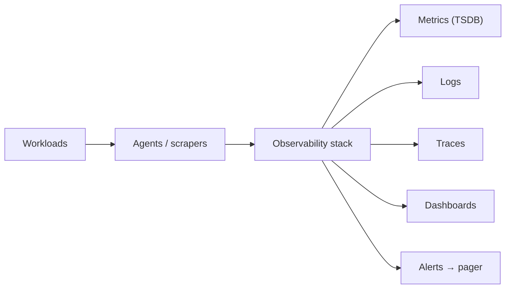
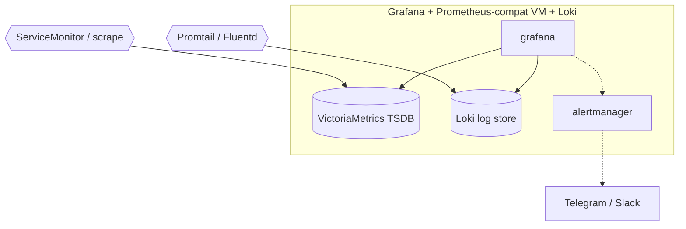
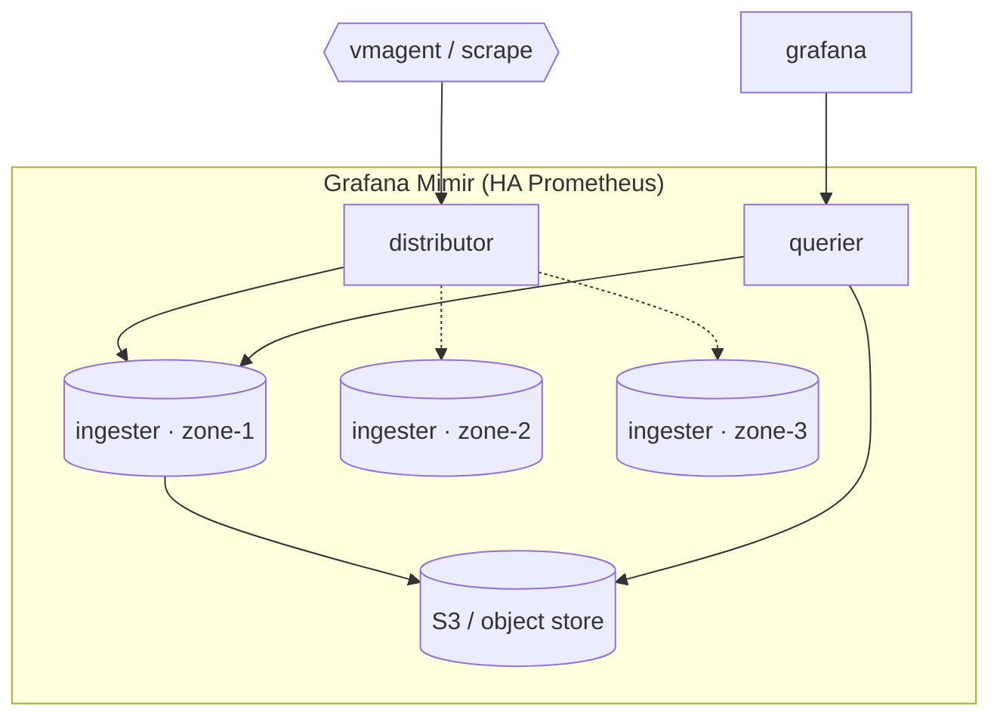
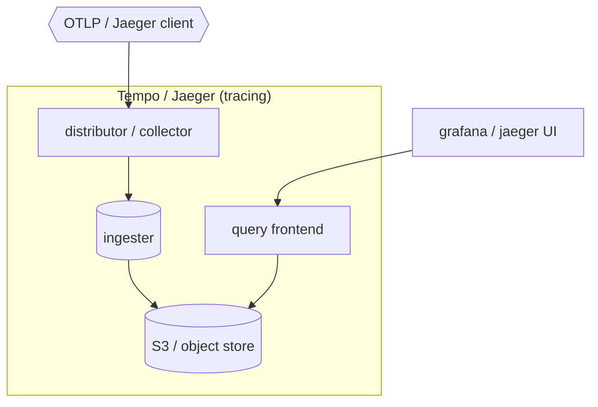
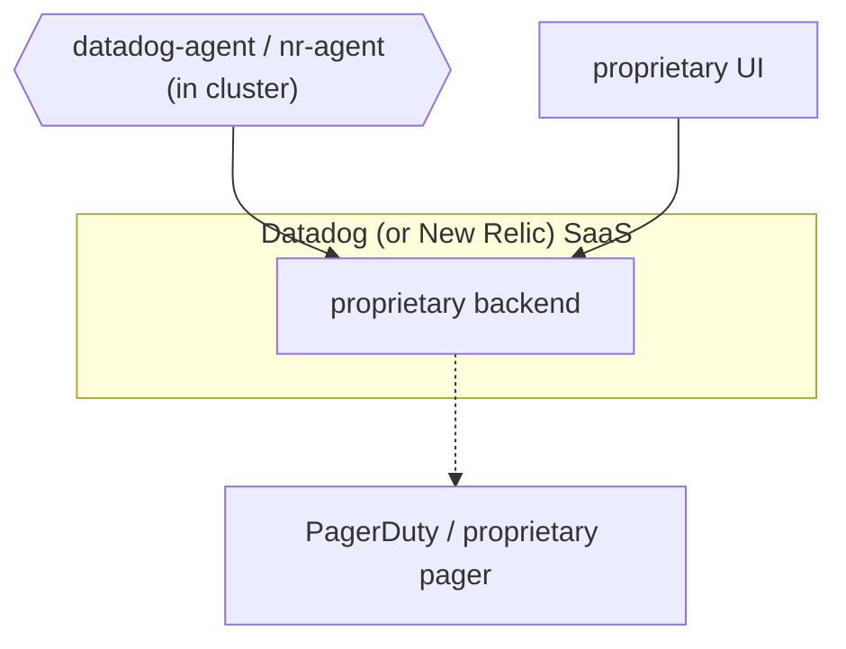
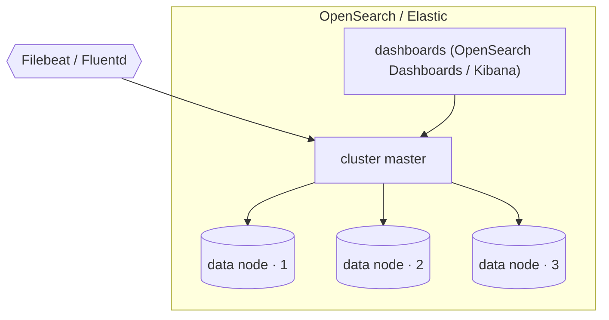
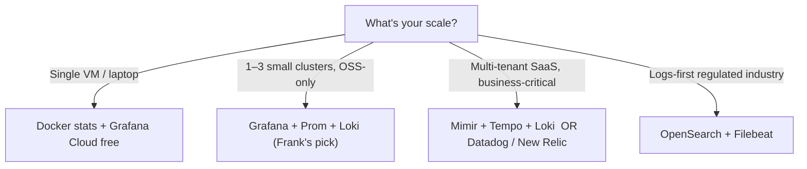

## TL;DR

*Write last.*

## §1 — The capability

It is 3 AM. A workload is misbehaving. The on-call human — or, more
charitably, the on-call agent — opens one tab. One screen. They need
to know two things, and they need to know them in five seconds:
*what is broken*, and *why*. If the screen cannot answer those two
questions, every other capability of the cluster is moot, because
the cluster is, by definition, broken in a way nobody can see.

That is the capability under examination. Not "monitoring" in the
abstract — every Kubernetes distribution ships with *some* dashboard.
The capability is the *thing that answers the 3 AM question*: who
keeps the metrics, who keeps the logs, who fires the page, who
renders the dashboard the on-call human reads to decide whether to
roll back, scale up, or go back to sleep.

The diagram is honest about what "observability" actually contains.
It is not one job; it is at least five — metrics, logs, traces,
dashboards, and alerts that reach a human. Every vendor in this
space treats one or two of those five as the primary problem and
ships the rest as adequate-or-better. The vendor space *splits* on
which job is primary, and on whether the answer is assembled from
parts or bought as one thing.


Your monitoring system should address two questions: what's broken,
and why? The "what's broken" indicates the symptom; the "why"
indicates a (possibly intermediate) cause.


Frank runs Grafana, with Prometheus-compatible VictoriaMetrics for
metrics and Loki for logs. No Tempo yet — tracing is not load-
bearing for the workloads Frank runs. Alerts are file-provisioned
via ConfigMaps and arrive in a Telegram chat. That choice was made
on the merits of *which scars Frank wanted to live with*, not on the
merits in the abstract. The point of this paper is to make the trade
legible — capability by capability — and then return to Frank's
choice and the operational scars that proved it was correct only on
Frank's terms.

## §2 — The landscape

Six options dominate cluster observability in 2026, and they split
cleanly on two axes. The horizontal axis is licensing — open source
on the left, commercial-with-contract on the right. The vertical
axis is the shape of the stack: *assembled* (you wire metrics +
logs + traces + alerts together yourself, often from different OSS
projects) versus *unified* (one product covers the whole telemetry
surface and bills as one thing).


        title Observability stacks — 2026
        x-axis OSS --> Commercial
        y-axis Assembled --> Unified
        quadrant-1 "Unified · Commercial"
        quadrant-2 "Unified · OSS"
        quadrant-3 "Assembled · OSS"
        quadrant-4 "Assembled · Commercial"
        "Grafana+Prom+Loki": [0.20, 0.30]
        "VictoriaMetrics": [0.15, 0.25]
        "Grafana Mimir": [0.20, 0.40]
        "Tempo / Jaeger": [0.15, 0.15]
        "Datadog / New Relic": [0.85, 0.85]
        "OpenSearch / Elastic": [0.35, 0.70]




The matrix grades the options on the five jobs from §1 plus the
license axis, HA-shape, and small-cluster TCO. The TCO column
deserves more honesty than the matrix gives it — *cheap at homelab
scale* really means *cheap on a single 3-node footprint with no
in-cluster log retention beyond a week*, which is the only TCO axis
this paper can defend with citations.

**Grafana + Prometheus + Loki** is the OSS reference assembly.
Grafana for the panels, Prometheus for the metrics scrape, Loki for
the index-light log store, Alertmanager (or Grafana's own unified
alerting) for the pager handoff. You build it. The reward is total
control and zero per-host bill; the price is that nothing in this
list assembles itself.

**VictoriaMetrics** is a drop-in for the Prometheus TSDB tier, with
a friendlier resource footprint at small scale. Frank swapped it in
specifically because the stock Prometheus retention costs more RAM
than is honest on a 3-control-plane footprint.


VictoriaMetrics uses 5x-10x less RAM than Prometheus for the same
data.


**Grafana Mimir** is the inverse trade. Where VictoriaMetrics is
"Prometheus, but smaller", Mimir is "Prometheus, but bigger" — a
horizontally sharded, object-store-backed, multi-tenant TSDB built
for SaaS-scale ingestion. The five-node minimum is unspoken but
real.

**Tempo / Jaeger** is the tracing side of the stack. Tempo is
Grafana's object-store-backed trace backend; Jaeger is the CNCF
predecessor with its own UI and its own data model. Neither matters
to Frank yet — tracing earns its keep when you have services
calling services in chains, which Frank does not.

**Datadog / New Relic** are the unified-commercial answer. One
agent per host, one bill, one contract, one dashboard product, one
support number. The other five options on this list ask you to
operate them; Datadog asks you to pay them. The four golden signals
are pre-wired and the alert engine has eight years of polish
behind it.

**OpenSearch / Elastic** is the logs-first answer. Full-text index
at write time means full-content queries are fast; the trade is
that storage and write CPU costs scale with log volume. The matrix
shows them as "partial" on metrics and traces because both projects
do support them, but the centre of gravity of each remains the log
store.

## §3 — How each option handles the hard part

The hard part of observability is turning the cluster's chaos into
*one screen* a human can read at 3 AM, *without* burying the real
incident under noise. Every vendor on this list has an answer; the
answers diverge enough that they need separate diagrams. The
diagrams below use a shared visual language — squares for control-
plane components, cylinders for data on disk (TSDB / log store /
trace store), hexagons for clients (agents, scrapers), solid edges
for ingest and query paths, dashed edges for alerting and async
handoffs.

### Grafana + Prometheus + Loki (Frank's stack)

Frank's actual shape. Prometheus's wire protocol on the ingest
side (which means everything that exports `/metrics` Just Works);
VictoriaMetrics' single-binary architecture on the storage side
(which means the resource footprint is honest at three nodes); Loki
on the log side; Grafana's own unified alerting engine routing
through a Telegram webhook. When a node dies, Grafana keeps
rendering against the surviving VM replica and the alertmanager
keeps firing pages; the failure mode is *the dashboard stops
updating*, which is, mercifully, very visible.

The unique scar of this stack lives in the *alert provenance*
boundary. Grafana's alerting engine distinguishes "alerts created
via the API" (which the UI can edit) from "alerts created via file
provisioning" (which it cannot). Frank's alerts are all
file-provisioned — sourced from ConfigMaps in
`apps/grafana-alerting/manifests/` — and the UI dutifully shows them
as read-only. The kept-honest version is that the editor lets you
click *Save* and silently throws away the edit on the next pod
restart. *That* is the scar.

### Grafana Mimir

Mimir is what Prometheus looks like when somebody decides that the
single-binary model has to go. The distributor sharded across
ingesters via consistent hashing; the ingesters write to S3 (or
S3-compatible object storage) on a rolling window; the querier
reads from both the live ingesters and the object store
transparently. The cost is the architectural minimum of "distinct
distributors + ingesters + queriers + object store" — there is no
honest one-node Mimir. The reward is real horizontal scale and
real multi-tenancy. Recovery from a node loss is automatic;
recovery from an *object store* loss is "rebuild from cold storage,
hope you had backups."

### Tempo / Jaeger

Tracing is structurally different from metrics and logs because the
unit of data is not a sample; it is a *span*, and spans aggregate
into *traces* that span service boundaries. The pipeline is
collector → ingester → object store, and queries reconstruct the
trace from spans scattered across the store. The hard part is not
storage; it is *sampling* — head-based, tail-based, or none —
because the volume of traces at any meaningful production scale
is too high to keep all of them, and the choice of sampling
strategy directly determines what kinds of incidents the trace
store can answer questions about.

### Datadog / New Relic (commercial all-in-one)

Architecturally unremarkable on purpose — the value of the
commercial all-in-one is not its data plane shape; it is the *one
product covers everything* surface. One agent on every host
shipping metrics, logs, traces, and host telemetry into one
SaaS backend. The UI is one product. The bill is one bill. The
support line is one phone number. When the backend is broken,
somebody else's on-call rotation handles it. The diagram is mostly
unremarkable because the point of Datadog is not its architecture;
it is its contract.

### OpenSearch / Elastic (logs-first)

OpenSearch and Elastic are the inverted-index answer to logs. Every
log line is tokenised and indexed at *write* time — which means
full-text queries against years of logs run in milliseconds, and
which means storage and write-CPU cost are very real at scale. The
shape is a sharded inverted-index data plane fronted by Kibana or
OpenSearch Dashboards. Tracing and metrics are bolted on but are
not the centre of gravity; the centre of gravity is the log store.
The cost story flips here:


Loki indexes only metadata (labels) for log entries, while
Elasticsearch indexes the full content of logs. This fundamental
design choice has significant implications for storage costs, query
performance, and use cases.


## §4 — What scale changes

Three scale axes flip vendor rankings. The first two are
quantitative; the third is philosophical.

**Metric cardinality.** Prometheus's in-process TSDB is
cardinality-bound — millions of active time series degrade ingest
latency and inflate memory in ways that are not graceful. Two
escape hatches dominate the space: VictoriaMetrics, which keeps
the single-binary shape and engineers its storage layout to absorb
high cardinality with a smaller footprint; and Grafana Mimir,
which abandons the single-binary shape entirely and shards
ingesters horizontally. VictoriaMetrics' own benchmark — biased
but reproducible — claims a 5–10× RAM reduction over Prometheus
for the same data, and a 1.6–3.2× reduction in *scrape-agent*
resource cost via `vmagent` over Prometheus' agent mode and the
OpenTelemetry Collector.

**Log volume versus query cost.** Loki and Elasticsearch sit at
opposite ends of the index-at-write versus index-at-query trade.
Loki only indexes labels — log content is scanned at query time
out of object storage. Elasticsearch indexes every token at write
time, which makes queries fast and storage expensive. The
practitioner consensus is that Loki wins decisively on storage
cost at retention horizons longer than a month, and Elasticsearch
wins decisively on full-text query latency for selective
historical searches. There is no third answer; the trade is
structural.

**Tracing sample rate.** Tempo and Jaeger cost scale with trace
volume, which means the operational choice is not "do we run
tracing" but "what sampling strategy". *Head-based sampling*
decides at trace creation whether to keep a trace, which keeps the
ingest path cheap and loses the ability to retroactively keep
"interesting" traces. *Tail-based sampling* keeps all traces in a
buffer and decides at the end of the trace, which keeps the
diagnostically-interesting traces and shifts the cost into the
buffer. *No sampling* — keep everything — is honest at low volume
and disastrous at high volume. Most teams discover their sampling
strategy after their second incident with no useful trace data, not
before.

Cardinality, log volume, and trace volume scale-out independently —
which is why the unified-SaaS stacks bill per-each. When all three
grow simultaneously, the commercial bill grows multiplicatively;
when the OSS assembly is in the way, the cost is operator hours,
which scale slower but eventually win in the other direction.

## §5 — Frank's choice, and what happened

Frank runs Grafana with VictoriaMetrics as the Prometheus-compatible
TSDB and Loki as the log store. No Tempo yet — tracing is not
load-bearing for the workloads Frank runs. Alerts are file-
provisioned via ConfigMaps in `apps/grafana-alerting/manifests/`.
The contact point is a Telegram chat, with the bot token and chat
ID in Infisical. Honest about what was assumed (Grafana file-
provisioning would behave like a Kubernetes ConfigMap — hot-watched,
edits eventually consistent with what's on disk) and what turned
out to be true (it isn't).

The honesty of that choice is what makes the resulting scars worth
writing down. A managed SaaS would have hidden every one of them.


We provisioned an alert in apps/grafana-alerting/manifests/, edited
it in the Grafana UI, clicked Save, and lost the edit on the next
pod restart. File-provisioned alerts are read-only in the UI — the
provisioning files are read at pod boot, not watched live. The UI
shows no warning. The only durable edit path is ConfigMap → push →
ArgoCD sync → restart the Grafana pod. Twice rediscovered before it
earned its place in the gotcha registry.



An alert that read fine in Grafana 11 failed with sse.parseError in
Grafana 12. The 12.x server-side-expression engine wants a 3-step
A→B→C rule — a data-source query, a reduce expression, a threshold
expression. The old classic-condition format silently breaks under
the new engine. Half our alerts went dark on a minor-version bump.
We rewrote every file-provisioned rule by hand, because the
migration is not something the upgrade does on your behalf.



We assumed ALERTS{} would work in VictoriaMetrics for Grafana-
managed alerts. It does not. VM does not expose the same internal
series Prometheus does — there is no ALERTS metric to query. The
alertlist panel type is the only first-class way to render
currently-firing Grafana alerts when VM is the TSDB. The VM docs
mention this in a side-note; we discovered it by building a
dashboard that showed an empty panel for two weeks before anyone
noticed.


The three scars share a shape. None of them are bugs in Grafana or
in VictoriaMetrics; all of them are emergent properties of an
*assembled* observability stack where the pieces have slightly
different mental models of what "the same alert" means. The seams
are where the failures live — exactly where the marketing material
does not look.

Visible evidence:

A managed all-in-one would have hidden every one of these failure
modes behind its abstraction, which is the right trade for a
production team and the *wrong* trade for a learning platform.
Frank exists to encounter the SSE-parse-error on the upgrade so
that the next operator on this stack does not have to.

## §6 — When Frank's answer doesn't generalize

Frank's answer — Grafana + Prometheus-compatible VictoriaMetrics +
Loki, file-provisioned alerts to Telegram — is one leaf of a four-
leaf tree. The other three are real.

The first branch is scale and shape. A single VM has no
observability *stack* problem — `docker stats` plus a free Grafana
Cloud tier covers the entire need, and the operator's time is the
expensive resource. One-to-three small clusters with no
compliance constraint is where Frank lives: the OSS assembly is
cheap to run and the scars are tolerable.

A multi-tenant SaaS with revenue-grade SLA pushes the answer in
two directions at once. Either you scale the OSS assembly to
Mimir-shaped horizontal sharding (with all the operational tax of
running a horizontally sharded TSDB), or you pay Datadog / New
Relic and let somebody else's on-call rotation handle the data
plane. Both are correct answers; the choice is whether your team
has more spare engineering capacity than spare cash.

A logs-first regulated industry — finance, healthcare, anything
where audit retention is a legal requirement — pushes OpenSearch
or Elastic to the front of the line. The index-at-write design
that costs Loki on volume *wins* when the question is "find the
log line where customer X did Y in 2023," because Loki's index-at-
query model cannot answer that question in less than minutes at
years-scale.

This is the section where the paper has to be honest about its
audience. If you are reading this from a production engineering
team with real on-call hours and real revenue depending on
uptime, the right answer for you is almost never Frank's answer.
The right answer is one of the other three leaves. Frank's
answer is correct *for Frank* and is documented here so that
anyone considering the trade understands the rest of the leaves
before picking the same one.

## §7 — Roadmap & where this space is going

Three trends are worth naming. None of them are settled; all of
them affect the next few years of observability tooling.

**OpenTelemetry collector as the universal agent.** OTel is eating
the agent layer. Prometheus's own client libraries increasingly
defer to it; Grafana's recent agent shipments converge on it;
vendors of every shape now accept OTLP as a wire protocol. The
two-decade-old "every vendor has its own agent" anti-pattern is
finally dying, which means the choice of *agent* and the choice of
*backend* are decoupling for the first time. The interesting
question is not whether OTLP wins — it is winning — but what
happens to vendor lock-in when the wire is standardised and the
backend is the only thing left to switch.

**eBPF-native observability.** Cilium Hubble, Pixie, Parca,
Pyroscope, and a growing set of profiling tools collect telemetry
by reading kernel events directly, eliminating the in-pod agent
for a non-trivial subset of signals. Frank already runs Hubble for
network observability; profiling-as-a-cluster-capability is the
next direction the space moves. The cost of the eBPF approach is
that the signal lives below the userspace boundary, which makes it
hard to retrofit into applications that expect to instrument
themselves explicitly.

**AI-assisted alert triage.** Every commercial vendor is shipping
"AI alert grouping" or "anomaly detection" of varying quality. The
OSS side has not caught up. Whether the gap closes — and whether
the closing is real signal or wrapper-around-an-LLM theatre — is
the most consequential open question in this space for the next
2–3 years. Frank does not have an opinion yet because Frank has
not seen a real one work.

The space is not done evolving. Frank will revisit this paper when
the answers change.
