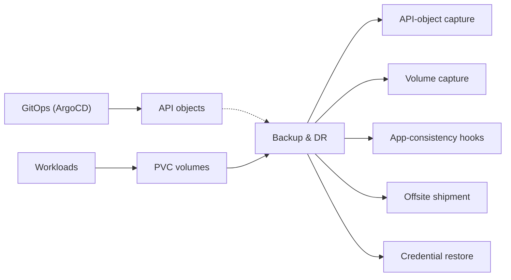
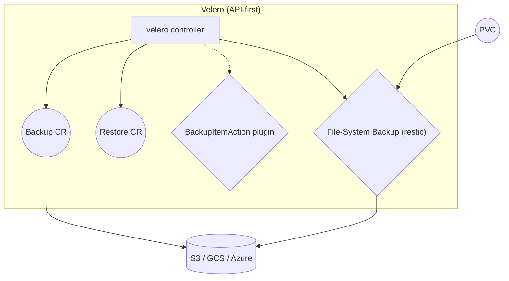
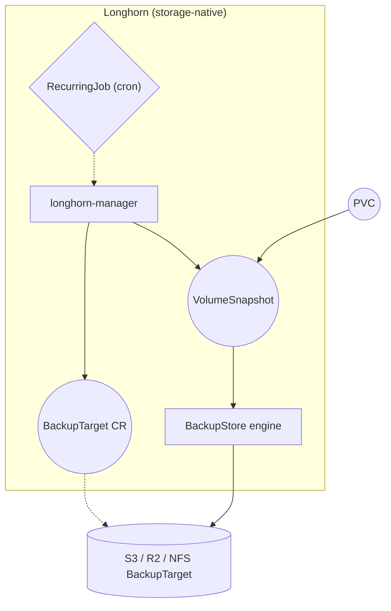
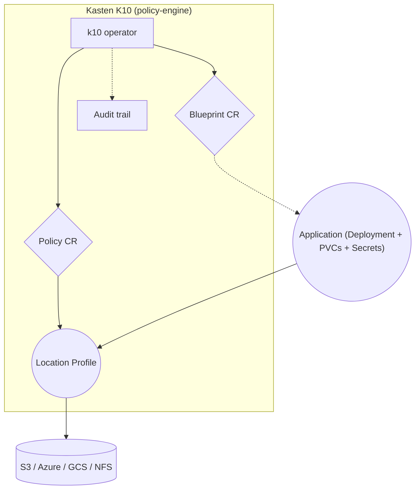
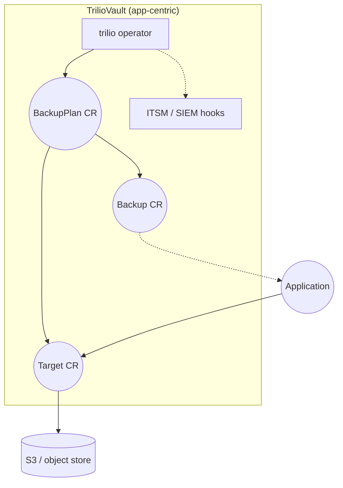
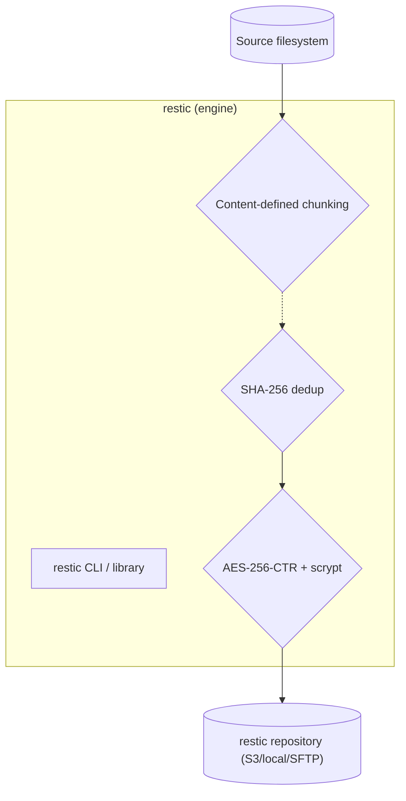
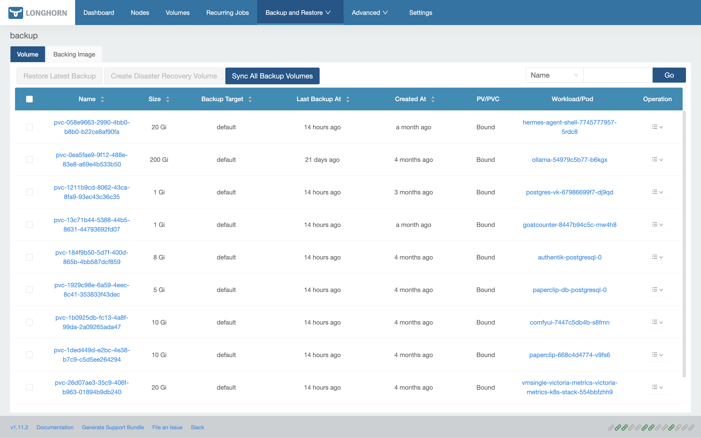
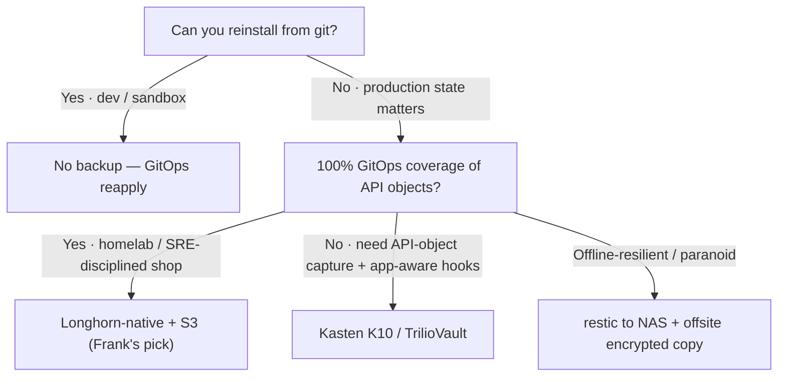

## TL;DR

Kubernetes backup & DR is a five-job problem — API-object capture, volume
capture, application-consistency hooks, offsite shipment, credential
restore — and the six contenders in 2026 (Velero, Longhorn-native, Kasten
K10, TrilioVault, restic, and the rclone-and-cron null hypothesis) each
treat one or two of those jobs as primary and assume you have something
else for the rest.

Frank runs Longhorn-native backup to Cloudflare R2. No Velero — ArgoCD
plus git already restores every Kubernetes API object in under ten
minutes, leaving only PVC contents and a small set of SOPS-encrypted
bootstrap secrets that must be applied before any restore can run. The
scars: a Longhorn 1.11 NFS mount-string bug, a RecurringJob schema with
no per-job target field, secrets that live outside the backup tool's
reach by design.

Frank's answer does not generalize. No GitOps coverage → Kasten K10.
Regulated workloads → Kasten K10. Paranoid → restic on a NAS.

## §1 — The capability

The cluster's persistent state has vanished tonight. Choose one: a corrupted
Longhorn volume nobody noticed until the daily replica check, an accidental
`kubectl delete ns` from a tired operator, a lost node with the only stable
replica of a critical PVC, or a full site loss. The question now is not
*whether* the state comes back — it must — but *against what artefact*, and
*in what order*. Restore the API objects? Restore the volume contents?
Re-apply the secrets that aren't in git? Decide which of the three is the
critical-path predecessor for the others?

That is the capability under examination. Not "backup" in the abstract —
Kubernetes already has VolumeSnapshot, Longhorn already ships a BackupTarget
CRD, every storage vendor has a CSI driver that can produce a point-in-time
copy. The capability is *what happens between the cluster's state becoming
unrecoverable and a hundred percent of that state being back on disk and
serving traffic*: who owns the K8s API-object capture, who owns the volume
contents, who owns the secrets that aren't backed up at all, and who
sequences the restore in an order the workloads can actually come up under?

The five jobs backup & DR does — API-object capture, volume capture,
application-consistency hooks, offsite shipment, credential restoration —
are not all the same job. Some vendors treat one as primary and let the
others fall out of the design; others assume your declarative ground truth
is somewhere else (git, an external CMDB, a wiki nobody updates) and build
everything on top of that assumption. The vendor space *splits* on which
job is primary, which dependency is mandatory, and how much of your
cluster lives in a place the backup tool can reach.

I run Longhorn-native backup to Cloudflare R2 and I deliberately do not run
Velero. That choice was not made on the merits in the abstract; it was made
on the merits of *Frank already living in git*. Every Deployment, Service,
ConfigMap, CRD, and StorageClass is committed and applied by ArgoCD. If the
cluster evaporates tonight, ArgoCD restores every Kubernetes API object in
under ten minutes. The one thing it cannot restore is the *contents of
PersistentVolumes* — and that is the only job left for a backup tool to do
on Frank. The point of this paper is to make the trade legible, and then
return to Frank's choice and the operational scars that proved it correct
only on Frank's terms.

## §2 — The landscape

Six options dominate Kubernetes backup & DR in 2026, and they split on two
axes. The horizontal axis is *what gets captured* — volume contents only on
the left, application-aware multi-resource capture (with quiesce hooks,
multi-PVC consistency, CRD-aware operators) on the right. The vertical
axis is *control-plane tax* — does the option require its own
controller/operator running on the cluster (bottom), or does it ride on
top of the storage layer with no extra control plane (top)?


        title Backup & DR — 2026
        x-axis "Volume-only" --> "Application-aware"
        y-axis "Adds control plane" --> "No extra control plane"
        quadrant-1 "App-aware · No control plane"
        quadrant-2 "App-aware · Adds control plane"
        quadrant-3 "Volume-only · Adds control plane"
        quadrant-4 "Volume-only · No control plane"
        "Velero": [0.55, 0.30]
        "Longhorn (native)": [0.20, 0.85]
        "Kasten K10": [0.90, 0.20]
        "TrilioVault": [0.85, 0.30]
        "restic": [0.15, 0.95]
        "rclone + cron": [0.05, 0.90]




The matrix grades the options on K8s API-object capture, PVC data,
application-awareness, deduplication, offsite shipment, whether it adds a
control plane, RBAC/audit, and licensing. The control-plane column is the
one that does the most work; it is also the one most vendor docs mention
only after you have read the install guide.

**Velero** is the default answer when people say "Kubernetes backup". Its
architecture treats Kubernetes API objects as first-class citizens —
Backups, Restores, and Schedules are themselves CRDs, processed by the
Velero controller. PVC data is a plugin: CSI VolumeSnapshot, or File-
System Backup mode that drives restic underneath. The trade is that
Velero's core competency — *backing up the Kubernetes API surface* — is
exactly the work that GitOps already does for any cluster managed by
ArgoCD or Flux. The Velero design docs are explicit about the model:


Each Velero operation – on-demand backup, scheduled backup, restore – is a
custom resource, defined with a Kubernetes Custom Resource Definition (CRD)
and stored in etcd.


That elegance is also where the redundancy lives. If your cluster is
already CRD-defined in git, Velero's API capture buys you very little.

**Longhorn (native)** inverts the trade. There is no separate backup
controller; the storage driver itself owns snapshot, dedup, and shipment.
A BackupTarget CR points at an S3-compatible endpoint or an NFS share; a
RecurringJob CR schedules backups against a label-selected group of
volumes; the longhorn-manager handles the rest. The Longhorn concepts docs
describe the data model directly:


Longhorn uses a unique mechanism to construct each backup at the block
level. Each backup consists of a metadata file and the data blocks. If a
data block is already saved in the secondary storage, this data block will
not be transferred again.


The benefit is *no extra control plane* — no new operator pods, no new RBAC
to audit, no new CRD to learn. The cost is *no application awareness* —
nothing quiesces a Postgres before the snapshot, nothing knows how to back
up a multi-PVC stateful set as a consistent unit. For workloads that are
fine with crash-consistent recovery (any reasonable database, plus most
filesystem workloads), this trade is the right one.

**Kasten K10 (by Veeam)** is the heritage commercial answer. Policy engine,
RBAC on every operation, audit trail, multi-cluster DR orchestration, and
the *Blueprint* model — a CRD that describes how a specific application's
operator quiesces and recovers, contributed back by the community for
common databases. The trade is the licence fee, the operator footprint, and
the second admin console. For a regulated production cluster with PII,
PCI, or HIPAA scope, the policy engine and audit trail are not optional;
they are the reason Kasten exists.

**TrilioVault** sits adjacent to Kasten. The product distinction is the
integration surface — ITSM/SIEM hooks, multi-cloud DR orchestration as a
first-class concept. The capability shape is the same: application-aware
capture with a full operator stack.

**restic** is the file-format primitive everything else converges on.
Content-defined chunking, SHA-256-keyed deduplication, AES-256-CTR
encryption at rest, scrypt key derivation. It is not, by itself, a
Kubernetes backup tool — it is a backup *engine* that the Kubernetes
backup tools (notably Velero's File-System Backup mode) drive underneath.
When the conversation in §3 turns to "what is actually moving the bytes
off-cluster", the answer for several of the vendors in this landscape is
"restic, with a Kubernetes-shaped wrapper".

**rclone + cron** is the null hypothesis. A sidecar that runs
`rclone sync /data s3://bucket/$(date +%F)/` every night. No API-object
capture, no consistency guarantee, no restore tooling beyond
`rclone copy` in the other direction. Its purpose in this paper is to
mark the lower bound: if your cluster is single-tenant and your
application is stateless or already replicates externally, *this is the
right answer*, and the rest of the matrix is solving a problem you do
not have.

## §3 — How each option handles the hard part

The hard part of backup & DR is not capturing the data; it is restoring it
*in an order the workloads can actually come up under*, with secrets and
config present before the volumes attach, with consistency boundaries
respected across multi-PVC apps, and with the restore tool's own
dependencies (its credentials, its bucket, its CRDs) available before the
restore runs. Every vendor on this list has an answer; the answers diverge
enough that they need separate diagrams. The diagrams below use a shared
visual language — squares for controller/operator components, rounded
rectangles for K8s objects (Deployments, Backups, CRs), diamonds for
decision points and hooks, cylinders for backup storage (S3, NFS, vault),
dashed edges for hook and control-plane paths, solid edges for data flow
(snapshot, restore).

### Velero

The Backup CR is the primary unit; a single Backup captures a namespace or
label-selected set of K8s API objects, optionally with their PVC data
attached. PVC capture has two modes: CSI VolumeSnapshot (storage-driver
snapshots, fast, dedup at the storage layer) or File-System Backup mode
(restic underneath, slower, dedup in the restic repo). BackupItemActions
are plugin hooks that run during the capture — pre-backup quiesce, post-
backup label fixup, exclude-rules for transient resources.

Restore is a separate CR that references a Backup; the controller iterates
the captured objects in a fixed order (namespaces first, then CRDs, then
the rest, then PVCs last so volumes attach after their consumers exist).
Time-to-restore is dominated by the PVC-data layer's throughput — CSI
snapshot restore is fast; restic restore is slow at TB scale.

The failure mode is the redundancy with GitOps: if every API object is
already in git, the velero-captured API objects are a second copy of
something git can already restore. The Backup CR provides a point-in-time
snapshot of the *cluster's state* at backup time, which is genuinely
useful for "restore exactly what was running at 02:00 last night" — but
not what Frank needs.

### Longhorn (native)

The BackupTarget CR is the configuration — an S3 URL or NFS URL plus a
credential Secret reference. The RecurringJob CR is the schedule — a cron
spec, a retention count, and a label-selected group of volumes. Inside the
longhorn-manager, the BackupStore engine handles block-level deduplication
against the secondary store: each block is content-addressed, so identical
blocks across volumes (or across backups of the same volume) are stored
once. The off-cluster artefact is a tree of metadata files plus a content-
addressed block pool.

Restore is initiated against the BackupTarget — pick a backup, point a new
PVC at it, the volume re-hydrates from the BackupStore. Time-to-restore is
dominated by the network throughput to the secondary store and the
deduplication ratio (a fresh restore from a cold bucket is much slower
than a restore where most blocks are already in the local Longhorn replica
pool).

The failure mode is the absence of application awareness. A multi-PVC
Postgres write-replicated across three volumes will produce three
*independently consistent* snapshots, not one *jointly consistent*
snapshot. For most workloads this is fine — Postgres recovers from a
crash-consistent snapshot — but for any application that crosses PVC
boundaries with in-flight transactions, the work is on the operator to
either accept crash consistency or build an out-of-band quiesce step.

### Kasten K10

The Policy CR is the primary unit — a schedule plus a Blueprint reference
plus a Location Profile. The Blueprint CR is the application-awareness
hook — Kasten ships Blueprints for common databases (Postgres, MySQL,
MongoDB, Cassandra) that quiesce the application via its operator before
the snapshot and resume it after. The audit trail captures every operation
with RBAC context.

Restore is initiated against a captured Application — Kasten reconstructs
the K8s API objects, the PVC contents, and the Blueprint-driven recovery
hooks (e.g., "after restoring this Postgres, run the WAL replay step
defined in the Blueprint"). The Blueprint model is the design space that
makes Kasten worth its licence fee.

The failure mode is the operator and policy-engine surface area itself.
At a small cluster the policy engine has nothing to police and the
audit trail has nothing to audit; at a regulated production cluster, it
is the difference between passing the SOC2 review and not.

### TrilioVault

The shape is similar to Kasten: a policy/plan CR drives application-aware
capture against a Target CR pointed at object storage. The product
distinction is the integration surface — ITSM/SIEM hooks for ticketing
and security audit, multi-cloud DR orchestration as a first-class concept.

The failure mode is the same as Kasten — the value is in the
application-awareness and the audit trail, which a small cluster
struggles to amortise.

### restic

restic does not run on Kubernetes by itself; it is the data-format engine
that Velero's File-System Backup mode invokes underneath. The interesting
property is the content-addressed repository: identical chunks across
hosts and across time are stored once, encrypted with a password-derived
key. Where restic shines in this landscape is the "encrypted offsite copy
on a NAS" leaf of the §6 decision tree — a periodic restic backup of the
manifests directory plus the SOPS-encrypted secrets, as a defence against
the case where the primary backup tool's own dependencies are also
compromised.

## §4 — What scale changes

Three scale axes flip vendor rankings. The first two are quantitative; the
third is operational.

**Volume count and snapshot rate.** A twenty-PVC cluster can run Longhorn
daily snapshots at 02:00 UTC and not notice — the snapshot fan-out is
small enough that workload IO is unaffected. A two-thousand-PVC cluster
cannot — the snapshot operations queue up, the BackupStore writes
contend with running-workload IO, the dedup-hash computation pegs CPU on
the longhorn-manager pod. The crossover is not a number; it is "do your
snapshot operations finish within the window before the next schedule
fires?" Once the answer is *not reliably*, the deduplication ratio
matters more than the schedule, and incremental-only backups (where
Longhorn's block-dedup is most valuable) stop being optional.

**Restore wall-clock at TB scale.** A 10 GB cluster restores from R2 in
under an hour over a residential gigabit link. A 10 TB cluster restores
in days, with the network as the bottleneck. The Kubernetes blog's CSI
VolumeSnapshot GA announcement frames the design intent precisely:


Volume snapshots provide Kubernetes users with a standardized way to copy
a volume's contents at a particular point in time without creating an
entirely new volume.


The *standardisation* matters at scale because it lets a backup tool use
storage-driver-native snapshots (fast, dedup-aware, often instant) instead
of a copy-the-whole-volume fallback. The order of magnitude that matters
for DR planning at TB scale is "do we have a local-first restore path?"
— a NAS or replicated object store inside the same data centre — because
re-pulling 10 TB across the public Internet is a *days* operation no
matter which backup tool you chose. Frank's NAS target is currently
disabled by a Longhorn 1.11 mount-string bug (see §5); that is a
scale-axis gap that does not matter today and will matter when the data
footprint grows.

**Application-consistency hooks at production scale.** A handful of
stateful apps can be quiesced by hand — log in, `pg_dump`, take the
snapshot, resume. At hundreds of stateful apps, the manual quiesce is
the bottleneck, and the gap between "we run pre-backup hooks" and "we
verify the hooks ran successfully" is exactly where Kasten and
TrilioVault earn their licence fees. The Blueprint model is not a
luxury for a regulated cluster; it is the only way the operator-of-record
can defend the restore in an audit.

Below those three axes is a quieter one: *dedup ratio and offsite cost*.
restic and Longhorn both deduplicate at the block layer; rclone+cron does
not. At a 5-10x dedup ratio, the difference between weekly full backups
and deduplicated incrementals is the difference between "free on R2's
tier" and a monthly bill. Frank's monthly R2 cost is zero because the
dedup ratio on Longhorn's BackupStore is high enough that the actual
block storage fits well inside the free tier.

## §5 — Frank's choice, and what happened

I chose Longhorn-native backup to Cloudflare R2. No Velero, deliberately
— ArgoCD plus git already restores every Kubernetes API object on the
cluster in under ten minutes; the only thing it cannot restore is the
*contents of PersistentVolumes*. Longhorn's BackupTarget plus RecurringJob
CRDs handle that with no additional control plane. The cost: no
application-aware hooks, no policy engine, no RBAC on restore. The trade
made sense for a GitOps-first homelab and made several scars visible
that a managed product would have hidden.

The case study is the live configuration: `apps/longhorn/manifests/backup-target-default.yaml`
points at `s3://frank-longhorn-backups@auto/` with `credentialSecret:
longhorn-r2-secret`. The `@auto` placeholder is what makes this work with
R2's custom endpoint — the actual endpoint is supplied via the Secret's
`AWS_ENDPOINTS` field. Two RecurringJobs target the `default` BackupTarget:
`daily-nas` at 02:00 UTC, retain 7 recovery points; `weekly-r2` at 03:00
UTC on Sunday, retain 4. The names are documentation of *intent*, not
current routing — see Scar 3.


The Secret that lets Longhorn talk to R2 is SOPS-encrypted and lives
outside ArgoCD's managed path — `ServerSideApply=true` rejects the
`.sops` field as schema-invalid. It is applied out-of-band with
`sops --decrypt secrets/longhorn/r2-secret.yaml | kubectl apply -f -`.
For DR this is load-bearing in a way that nothing else on Frank is: the
Secret that lets the backup tool *read its own bucket* is itself a thing
you must restore first. The disaster-recovery runbook has a "before you
do anything else" header that no other procedure on Frank has. We are
not Velero-restoring our way out of this; we are SOPS-decrypting our
way back in.



The original plan was dual-target: a local NAS over NFS for fast daily
restores, R2 for offsite weekly backups. The NAS BackupTarget showed
`AVAILABLE: false`. The status condition: `mount.nfs4: remote share not
in 'host:dir' format`. The mount command Longhorn's engine generates is
`mount -t nfs4 ... 192.168.50.42/volume1/frank-backup /var/...` — a
forward slash where the NFS mount utility requires a colon. Filed as
Longhorn GitHub issue #11412 in August 2025; fix targeted for Longhorn
v1.13.0; no backport, no workaround. The NAS target is commented out in
the manifest, waiting. The local-first restore axis is a roadmap item,
not a current capability — and the manifest commentary that explains
why is itself part of the documentation of Frank.



The two RecurringJobs originally specified `spec.backupTargetName` to
route each to a different BackupTarget. ArgoCD rejected both with
`.spec.backupTargetName: field not declared in schema`. The Longhorn 1.11
RecurringJob CRD has no per-job target selection — all RecurringJobs use
the `default` BackupTarget, full stop. Filed as Longhorn GH #11392 in
July 2025; closed with no resolution and no timeline. The names
`daily-nas` and `weekly-r2` are kept anyway, as documentation of *intent*
— when the NAS target re-enables and `backupTargetName` lands as a per-
job field, the routing snaps into shape with no manifest churn. The
names are the design; the schema is the gap.


Visible evidence:

The three scars share a shape. None of them are bugs in Frank's
architecture. All of them are emergent properties of running a backup
tool that does not yet ship the configuration matrix the design wants —
multi-target RecurringJobs, a working NFS mount-string, a SOPS-aware
ArgoCD plugin. The interfaces between the backup tool, the secret store,
the GitOps reconciler, and the upstream CRD schema are where the
failures live — exactly where the marketing material does not look.

A managed backup product like Kasten K10 would have hidden every one of
these failure modes behind its abstraction, which is the right trade for
a production team and the *wrong* trade for a learning platform. Frank
exists to encounter the SOPS-out-of-band requirement, the mount-string
bug, the schema gap so that the next operator on this stack does not
have to.

## §6 — When Frank's answer doesn't generalize

Frank's answer — Longhorn-native backup to R2, no Velero, no application-
aware control plane — is one leaf of a four-leaf tree. The other three
are real.

The first branch is whether the workload's persistent state is *the
asset* — for a dev/sandbox cluster reinstalled from git on demand, the
right answer is no backup at all and an ArgoCD reapply procedure that
runs in minutes. Spending operator time configuring Velero for a cluster
you would rather rebuild is the wrong trade.

For workloads with asset-grade persistent state, the second branch is
GitOps coverage of the API surface. ArgoCD or Flux with every
Deployment, Service, ConfigMap, and CRD in git? Longhorn-native (or the
equivalent CSI-snapshot-driven storage backup for other drivers) is
enough — the K8s API-object backup that Velero or Kasten provides
duplicates what the GitOps reconciler already does. Not on GitOps? You
need a tool that captures the Kubernetes API surface as part of its
primary work — Velero at the OSS end, Kasten or TrilioVault at the
commercial-with-app-aware end.

The fourth leaf is the *offline-resilient* override — teams whose threat
model includes "the primary backup tool's own dependencies are
compromised" (bucket wiped, KMS lost, restore tool itself the attack
vector). The right answer there is a parallel restic copy on a NAS plus
an encrypted offsite snapshot — separate keys, separate credentials,
separate restore procedure. Heavier than the other leaves; earns its
weight in a narrow set of scenarios.

This is the section where the paper has to be honest about its
audience. If you are reading this from a regulated production cluster,
the right answer for you is almost never Frank's answer. The right
answer is one of the other three leaves. Frank's answer is correct *for
Frank* and is documented here so that anyone considering the same trade
understands the rest of the leaves before picking it.

## §7 — Roadmap & where this space is going

Three trends are worth naming. None are settled; all affect the next
few years of backup & DR on Kubernetes.

**CSI VolumeSnapshot is becoming the lingua franca.** The CSI snapshot
API graduated to GA in Kubernetes 1.20 and has settled as the cross-
vendor primitive for point-in-time volume capture. Velero, Kasten, and
TrilioVault all consume it; Longhorn produces it; every modern CSI driver
implements it. The "which backup tool can talk to my storage?" question
is narrowing as CSI conformance broadens. The vendors that *don't* speak
CSI VolumeSnapshot — restic-only file-system backup, rclone-and-cron —
are the ones most likely to feel the squeeze.

**Application-aware blueprints are converging on operators.** Kasten's
Blueprint model and Velero's BackupItemAction plugin model are both
heading toward the same idea: ask the workload's CRD operator to quiesce
itself. Postgres, Mongo, and Cassandra operators increasingly ship
"back-yourself-up" verbs that any backup tool can invoke. The split
between "backup tool with application hooks" and "operator that knows
how to back itself up" is shrinking — and the question of *which
operator owns the quiesce* will determine whether your backup tool can
deliver application-consistent restore at all.

**GitOps is eating the K8s-API-object half of the problem.** Teams with
full ArgoCD or Flux coverage are increasingly skipping Velero's K8s-API
capture entirely, treating git as the source of truth and leaving only
PVC data to the backup tool. The vendor pitch for "we back up your YAML"
is weakening; the pitch for "we restore your data in a sequence your
workloads can come up under, and we capture the secrets that aren't in
git" is strengthening. Frank is the early version of that posture.

The space is not done evolving. Frank will revisit this paper when the
answers change.

