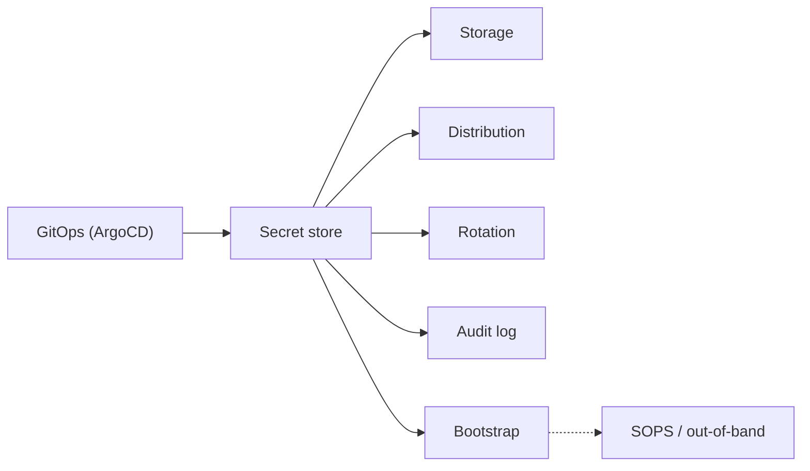
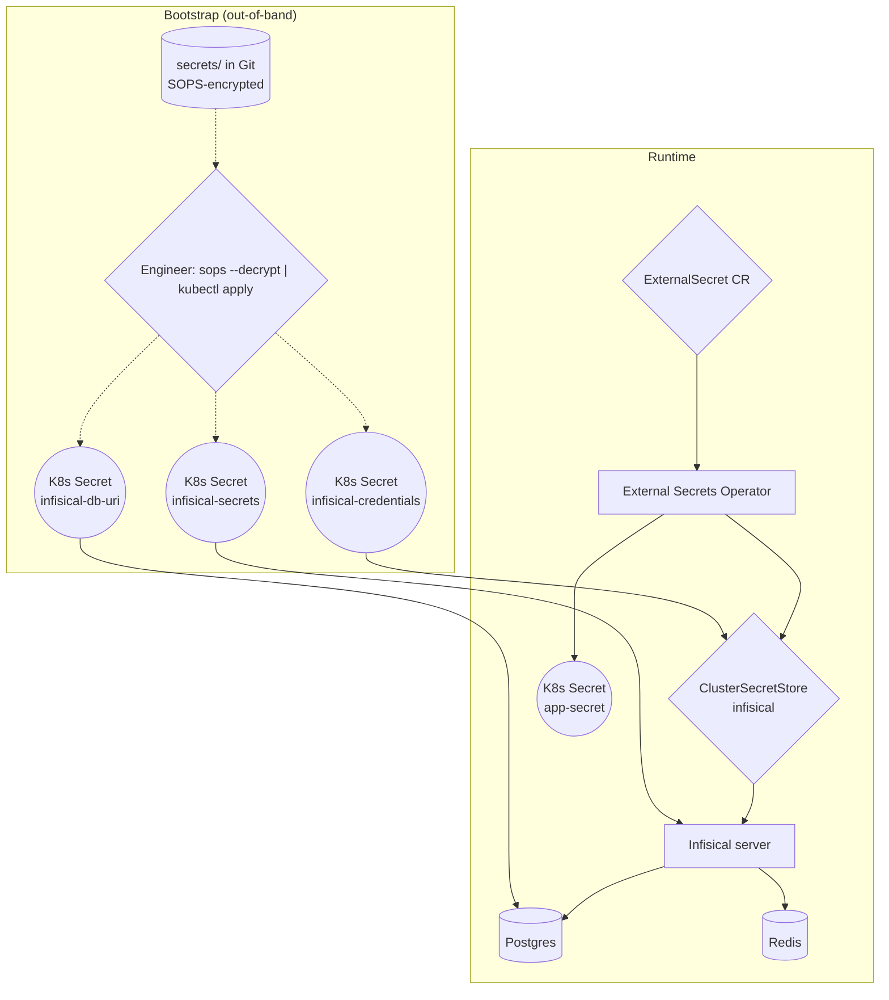
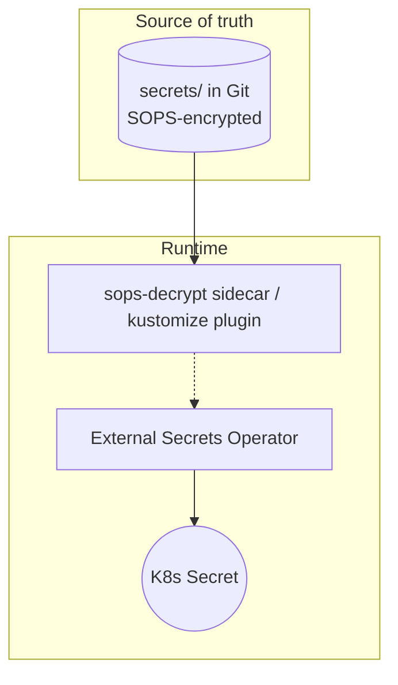
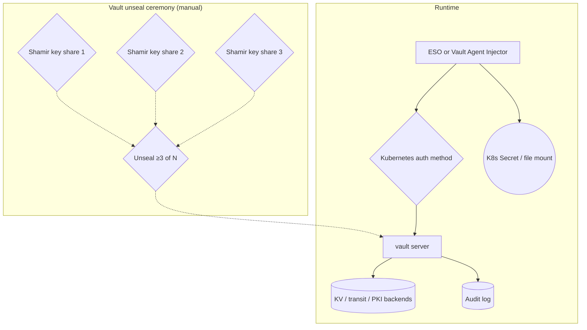
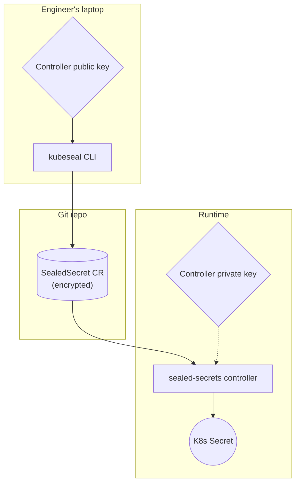
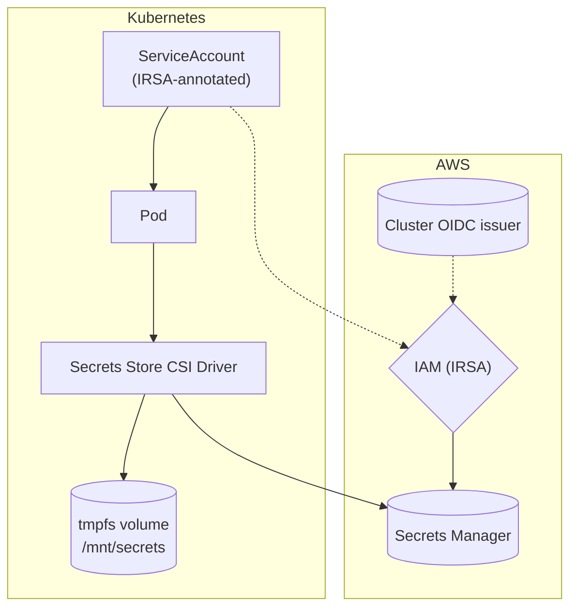
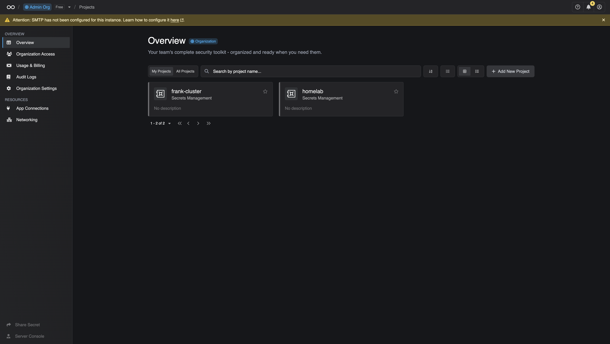
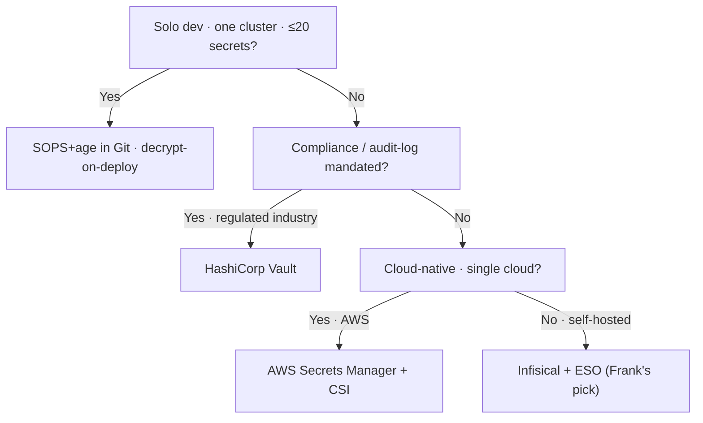

## TL;DR

Secrets management is a five-job problem — storage, distribution,
rotation, audit, and the bootstrap chicken-and-egg — and the six
contenders in 2026 (Infisical, ESO + SOPS-in-Git, HashiCorp Vault,
Sealed Secrets, AWS Secrets Manager + CSI, and the null-hypothesis
plaintext-in-Git) each treat one or two of those jobs as primary and
demand a tax from the operator for the rest.

Frank runs Infisical + External Secrets Operator, with SOPS-encrypted
Secrets in Git as the bootstrap layer. The scars came in the seams:
the ExternalSecret `data: []` admission-webhook rejection, the
`envFrom.secretRef` without `optional: true` wedge, and the
three-ArgoCD-app split forced by an Infisical chart bug.

Frank's answer does not generalize. ≤20 secrets → SOPS in Git.
Compliance audit → Vault. Single cloud → cloud Secrets Manager + CSI.

## §1 — The capability

A change is ready to ship. The Helm chart wants a database password. The
controller wants an API token. The cron job wants a service-account JWT.
The dashboard wants an OIDC client secret. The new app does not even have
an admin password yet — it needs one minted, written to a secret store,
and made available to the pod the moment it starts. And the chart that
ships the secret store *itself* wants its own admin password, its own
encryption key, its own database connection string. Where do those come
from?

That is the capability under examination. Not "secrets" as a generic
term, not "encryption" in the abstract — Kubernetes already has a
`Secret` resource and the cluster API can encrypt secrets at rest. The
capability is *the chain of custody from the moment a credential is
generated to the moment a container reads it*: where the source of truth
lives, who is allowed to read it, how a fresh cluster bootstraps the
system, and what tax is paid every time a key rotates.



Five jobs in one capability — storage, distribution, rotation, audit, and
bootstrap. The vendor space *splits* on which job is primary and which
dependency is mandatory. Some options optimise for storage and let the
others fall out of the design; others assume a cloud KMS and refuse to
exist without it; one of them is "the secret store itself needs secrets
to exist", and the only honest answer to that is an out-of-band loop the
declarative-everything principle reluctantly carves out as the single
exception it accepts.

I run Infisical with External Secrets Operator on top, with SOPS-encrypted
secrets in Git for the bootstrap layer. That choice was not made on the
abstract merits of feature matrices — it was made on the specific shape
of a homelab cluster that wants a UI for day-one ergonomics, native
Kubernetes Secret resources for app compatibility, and an explicit,
documented bootstrap loop that pretends to no magic.

## §2 — The landscape

Six options dominate secrets management on Kubernetes in 2026, and they
split on two axes. The horizontal axis is *where the source of truth
lives* — cloud-managed on the left (you outsource the server, IAM gates
access), self-hosted on the right (you run the server, your keys, your
storage). The vertical axis is *credential dynamism* — plain key-value
storage on the bottom (the secret is what you put in), dynamic credentials
on the top (the store mints a short-lived credential on read, signs a
PKI certificate, or rotates a backend password on a schedule).


        title Secrets management — 2026
        x-axis "Cloud managed" --> "Self-hosted"
        y-axis "Plain KV" --> "Dynamic credentials"
        quadrant-1 "Self-hosted · Dynamic"
        quadrant-2 "Cloud-managed · Dynamic"
        quadrant-3 "Cloud-managed · Plain"
        quadrant-4 "Self-hosted · Plain"
        "Infisical": [0.80, 0.40]
        "ESO + SOPS-in-Git": [0.85, 0.15]
        "HashiCorp Vault": [0.70, 0.90]
        "Sealed Secrets": [0.90, 0.10]
        "AWS Secrets Manager + CSI": [0.10, 0.55]
        "Plaintext in Git": [0.95, 0.05]




The matrix grades the options on self-hosting, UI, audit log, built-in
rotation, dynamic credentials, Kubernetes-native sync, bootstrap loop,
and licensing. The bootstrap-loop column is the one that does the most
work; it is also the one most vendor docs mention only after you have
read the install guide and discovered that the server cannot start
without secrets that do not yet exist anywhere.

**Infisical** optimises for day-one ergonomics. A web UI exists from the
first deploy; projects, environments, and identities map onto the mental
model most teams already have; the Helm chart is one app, the
ClusterSecretStore is one CR, ESO does the syncing. The trade is the
bootstrap loop — Infisical needs an admin password, an encryption key,
and a database URL *before* it can run, and those have to come from
somewhere that is not Infisical.

**ESO + SOPS-in-Git** is the no-server answer. External Secrets Operator
is one component (the operator itself) and SOPS-encrypted YAML in Git is
another; together they cover storage (Git), distribution (ESO sync),
and bootstrap (SOPS-decrypt-and-apply). There is no separate server, no
UI, no chicken-and-egg loop. The trade is that everything else — audit
log, rotation, dynamic credentials — is also missing.

**HashiCorp Vault** is the heritage answer. Predates the Kubernetes
operators by years; built for environments where the answer to "how
many features does the secret store need?" is "all of them". KV storage,
PKI, transit encryption, dynamic database credentials, audit log,
token-based auth, namespaces — it is in there. The vendor docs are
explicit about the design:


The storage backend is untrusted, and is used only to durably store
encrypted data.


The trade is operational weight. Vault has Shamir-split unseal keys, a
multi-step initialisation ceremony, a separate audit-log subsystem, and
its own Helm chart with enough configurable surface that the production
deployment guide is multi-page. For a homelab, that is the wrong shape.
For a regulated bank, it is the right shape.

**Bitnami Sealed Secrets** is the GitOps-purist answer. A controller
runs in the cluster with an asymmetric key pair; you encrypt secrets
locally with the public key and commit the resulting `SealedSecret` CR;
the controller decrypts on the cluster side and materialises the
Kubernetes Secret. There is no separate server, no UI, no API. The
trade is everything that depends on a *live* secret store: no audit
log of who-read-what-when, no rotation, no dynamic credentials. Rotate
the controller's private key and every SealedSecret in Git needs to be
re-encrypted.

**AWS Secrets Manager + Secrets Store CSI Driver** is the cloud-native
answer. AWS holds the secrets; IAM gates access; the CSI driver mounts
them as files in pod volumes. The bootstrap loop is solved by the cloud
identity — pods authenticate via IRSA (IAM Roles for Service Accounts)
which is itself trust-chained back to the cluster's OIDC issuer. The
trade is the AWS dependency and the fact that secrets do not become
Kubernetes Secret objects (they are tmpfs files), which is more secure
and less ergonomic.

**Plaintext in Git** is the null hypothesis. The `.env` file is committed.
The Helm values include the database password. The README says "remember
to remove this before shipping". Its purpose in this paper is to mark
the lower bound — and to be loudly disqualified by the empirical evidence
that 12.8 million such secrets leaked in public GitHub commits in 2023
alone. The community talk frames the entire decision as a trust-boundary
problem:


The trade-off between encrypt-in-Git (Sealed Secrets, SOPS) and
sync-from-external-store (ESO, CSI) is fundamentally an axis of where
you put the trust boundary.


Plaintext-in-Git puts the trust boundary at "everyone who has ever
cloned the repo", which is exactly the wrong answer.

## §3 — How each option handles the hard part

The hard part of secrets management is *bootstrapping the secret store
itself without trusting any one machine, any one engineer, or any one
Git history line*. Every option on this list has an answer; the answers
diverge enough that they need separate diagrams. The diagrams below use
a shared visual language — squares for controllers and servers, rounded
rectangles for Kubernetes Secret resources, diamonds for decision points
and auth gates, cylinders for persistent storage, dashed edges for
bootstrap and out-of-band paths, solid edges for runtime sync.

### Infisical + ESO + SOPS-for-bootstrap (Frank's stack)



Three SOPS-encrypted Secrets seed the system: `infisical-secrets`
(application env vars including `ENCRYPTION_KEY` and `AUTH_SECRET`),
`infisical-db-uri` (the Postgres connection string), and
`infisical-credentials` (the Machine Identity ESO uses to authenticate).
All three are applied manually with `sops --decrypt | kubectl apply -f -`
*before* ArgoCD ever touches the Infisical app. Once they exist,
ArgoCD takes over: Postgres, Redis, and Infisical itself each become
separate ArgoCD apps (a chart bug, documented in §5, forced the split).
ESO reads `infisical-credentials`, opens a Universal Auth session with
Infisical, and from that point forward every workload's secrets are
materialised by an `ExternalSecret` CR pointing at the
`ClusterSecretStore`.

The failure mode is the bootstrap step. If `secrets/` is lost, the
cluster cannot be rebuilt without rotating every credential. The SOPS
master keys (held in `~/.config/sops/age/keys.txt` on a small set of
operator laptops) are the actual root of trust, and Paper 09 will not
pretend otherwise.

### ESO + SOPS-in-Git (no Infisical)



The simplest possible secret-store: Git is the database. SOPS-encrypted
YAML files live alongside the app manifests; a kustomize plugin or a
sidecar decrypts at apply time; ESO is optional (you can also pipe
straight to `kubectl apply`). There is no server to bootstrap, no
chicken-and-egg loop. The trade is that the audit log is `git log`,
rotation is "edit the file and commit", and dynamic credentials are
not on the menu. For a one-cluster homelab with a small operator pool,
this is often the right answer.

### HashiCorp Vault



Vault's bootstrap is the heaviest in the landscape and the most
principled. Storage backend is untrusted; at startup, the master key
is reconstructed from Shamir shares held by separate operators; only
after enough shares are presented does Vault unseal and begin serving
requests. Kubernetes workloads authenticate via the Kubernetes auth
method (a ServiceAccount JWT exchanged for a Vault token), and ESO or
the Vault Agent Injector materialises the secrets.

The failure mode is the unseal ceremony. After every restart, every
node reboot, every Helm upgrade, Vault is *sealed* and refuses to
serve. Auto-unseal with a cloud KMS solves this at the cost of
trusting the cloud KMS — a trade that defeats some of the reason to
run Vault on-prem in the first place.

### Bitnami Sealed Secrets



Sealed Secrets inverts the bootstrap problem by making the *controller*
the only thing that needs a key at startup. The controller generates
its key pair on first install and stores the private key in a
Kubernetes Secret in its own namespace. Engineers encrypt locally with
the public key (via `kubeseal`), commit the SealedSecret CR to Git,
and the controller decrypts on the cluster side. There is no server,
no API, no audit log of reads — only an audit log of *applies*, via
`git log`.

The failure mode is private-key rotation. The controller's key pair is
the only thing that can decrypt the SealedSecrets in Git; lose it and
every SealedSecret in Git is now a glorified base64-encoded payload.
Rotation is supported but expensive: re-encrypt every SealedSecret in
the repo, commit, redeploy.

### AWS Secrets Manager + Secrets Store CSI Driver



The cloud-native answer has no bootstrap chicken-and-egg because the
cloud's identity system is the bootstrap. Pods authenticate to AWS via
IRSA — the ServiceAccount token is OIDC-trusted by AWS IAM, IAM grants
the role's Secrets Manager permissions, the CSI driver fetches the
secret and mounts it as a tmpfs file in the pod's volume. There is no
Kubernetes Secret object in etcd; there is no server to install
on-cluster.

The trade is the AWS lock-in — and the fact that *secrets are files,
not env vars or Secret objects*. This is more secure (no etcd snapshot
leak) and less ergonomic (no `envFrom`, no `secretRef`). Helm charts
that assume Secret objects need to be patched.

## §4 — What scale changes

Three scale axes flip vendor rankings. The first two are quantitative;
the third is operational.

**Secret count.** A cluster with ten secrets can run any option in this
matrix without strain — SOPS-in-Git works, Sealed Secrets works, even
manual `kubectl create secret` works. At a hundred secrets the
operational cost diverges sharply. SOPS-in-Git's per-rotation cost
becomes "find every consumer of this credential by grep". Sealed
Secrets' re-encrypt-on-controller-key-rotation becomes a multi-hour
ceremony. Infisical's UI starts paying for itself the moment two
engineers need to read the same secret from different terminals on
the same Tuesday. Vault's namespaces and ACLs start mattering. The
crossover is not a number — it is "how many secrets can one engineer
hold in their head simultaneously?" Below the threshold, simpler is
better; above it, simpler becomes the bottleneck.

**Rotation cadence.** Quarterly rotation is fine on every option in
the matrix. Per-incident rotation — one breach, every credential in
the cluster — flips the ranking entirely. Static credentials (KV in
Infisical, Sealed Secrets, SOPS) require an operator to mint a new
value and propagate it to every consumer; even with ESO doing the
sync, the consumer pods must restart to pick up the new env var, and
"restart every pod in the cluster" is rarely a free operation. Dynamic
credentials (Vault's database secrets engine, AWS Secrets Manager's
auto-rotate) sidestep this entirely: each pod gets a fresh short-lived
credential on a schedule the secret store controls. For a regulated
environment with a 24-hour rotation SLO, Vault and AWS Secrets Manager
are the only options that can keep up.

**Audit-log demand.** No compliance framework, no auditor, no
quarterly access review: SOPS+age in Git is enough — `git log` is the
audit log, every read of a secret is a `git checkout` event with a
timestamp and an author. SOC 2 / ISO 27001 / HIPAA / PCI-DSS / FedRAMP:
you need an audit log of *who-read-what-when at runtime*, and that is
where the secret-store-as-server options separate themselves from the
secret-store-as-Git-history options. Infisical, Vault, and AWS Secrets
Manager all log reads to a structured audit stream with retention
measured in years. Sealed Secrets and SOPS in Git do not. The
empirical scale of the failure mode this audit log catches is in
GitGuardian's annual report:


In 2023, we detected 12.8 million secrets exposed in public GitHub
commits — a 28% increase over 2022.


That number is not the cost of running a self-hosted secret store; it
is the cost of *not* running one, paid by everyone in aggregate. At
audit time, "we encrypt everything in Git" is a defensible posture;
"we keep nothing in Git" is a much stronger one.

## §5 — Frank's choice, and what happened

I run Infisical with External Secrets Operator, with SOPS-encrypted
secrets in Git as the bootstrap layer. The full chain: SOPS-encrypted
YAML in `secrets/` applied out-of-band to seed three Secrets
(`infisical-secrets`, `infisical-db-uri`, `infisical-credentials`);
Infisical running at `192.168.55.204` with its own Postgres and Redis
running as separate ArgoCD apps; ESO reading from Infisical via a
`ClusterSecretStore` and materialising native Kubernetes Secrets for
every workload that wants one.

I did not pick Infisical over Vault on the merits in the abstract. I
picked it because the UI is good enough that a single operator can
keep a hundred secrets sorted across `dev` and `prod` environments
without losing track, and because the API and the Helm chart are
documented well enough that the ESO integration is a single CR. I
ruled out Vault because the unseal ceremony is not justifiable at
homelab scale, and ruled out plain SOPS-in-Git because once the secret
count crossed forty I stopped being able to keep a mental index of
which app needed which credential. Sealed Secrets stayed in the
running until the moment I considered controller-key rotation.

The honesty of that choice is what makes the resulting scars worth
writing down. A different vendor would have produced different scars;
a managed cloud secret store would have hidden them all.


Infisical needs an admin password, an `ENCRYPTION_KEY`, a database
connection string, and a working Redis URL before it can start. The
Helm chart cannot materialise any of those from thin air. ArgoCD cannot
apply a Secret it does not know yet exists. The only accepted exception
to the declarative-everything principle is SOPS-encrypted secrets that
live in `secrets/`, applied manually via
`sops --decrypt secrets/infisical/infisical-secrets.yaml | kubectl apply -f -`
*before* the Infisical app is synced. Three Secrets, three commands,
one per cluster rebuild. Everything else after that is ArgoCD-managed.
*The bootstrap exception is the tax for declarative-everything*;
pretending it does not exist is what causes half the production
secret-store incidents in the field. The lesson: name the exception,
write it down, and apply it the same way every time.



We removed the last key from an `ExternalSecret`'s `data:` array and
left an empty `data: []`. The ESO admission webhook rejected the CR
with a schema-validation error. ArgoCD did not infer this from the
values-diff and parked the app in `OutOfSync` forever. The fix, once
diagnosed, is one of two: either delete the `ExternalSecret` entirely
(if no keys remain), or conditionally render the manifest behind a
`{{- if .Values.secrets }}` Helm guard. The lesson:
*"the last key was removed" is not a state most operators consider
possible*. The admission webhook does — and the consequence of not
considering it is an ArgoCD app that looks busted for the wrong
reason. The first ten minutes of the incident were spent looking at
the values diff and the Application; the next ten were spent looking
at the ESO controller logs, where the rejection was perfectly clear.



A Deployment used `envFrom.secretRef` for a Secret that did not exist
yet — because ESO had not synced from Infisical on the first deploy.
Without `optional: true` on the `envFrom` block, every rolling update
wedged on `CreateContainerConfigError` for the entire chart's pods,
with no visible signal except a stuck ReplicaSet. The fix is a
one-line annotation per `envFrom` block:

```yaml
envFrom:
  - secretRef:
      name: app-secret
      optional: true
```

*Easy when you know it, invisible when you don't.* The lesson is that
the `Secret` resource is a runtime dependency, not a build-time
dependency, and the chart that consumes it has to encode that
correctly. Otherwise the first deploy of every new app becomes a
ten-minute race between ArgoCD and ESO that ArgoCD usually loses.


A fourth scar is worth a paragraph instead of a callout — the
*Infisical chart's two-source `DB_CONNECTION_URI` bug*. The upstream
chart ships both `postgresql.enabled` and `useExistingPostgresSecret`
with no `else` branch between them; set both and the env var is
injected twice, the second binding silently wins, and the bundled
Postgres goes unused while the app talks to the external one. The fix
was to split one Infisical app into three ArgoCD apps — `infisical`,
`infisical-postgresql`, `infisical-redis` — each managed independently.
The three-app split is *not* the conventional Helm shape; it is the
shape forced by the chart's missing `else`.

Visible evidence (cluster-side capture deferred):



The four scars share a shape. None of them are bugs in Infisical
itself, or in ESO, or in SOPS. All of them are emergent properties of
running a self-hosted secret store whose bootstrap loop is real and
whose interfaces with the declarative machinery of the cluster need to
be exact. *The seams are where the scars live*, and the seams are
exactly where the marketing material does not look.

## §6 — When Frank's answer doesn't generalize

Frank's answer — Infisical + ESO + SOPS-for-bootstrap — is one leaf of
a four-leaf tree. The other three are real.



The first branch is whether the secret count justifies a server at all.
A solo developer with one cluster and twenty secrets does not need a
UI, an API, or an audit log of reads — `git log` is enough. SOPS+age
in Git with decrypt-on-deploy is the right answer; running Infisical
in that context is operational overhead in exchange for nothing the
developer needs.

The second branch is the compliance question. A regulated industry —
finance, healthcare, government — needs an audit log of who-read-what-when
with retention measured in years, and needs dynamic credentials so that
per-incident rotation is a knob and not a multi-day ceremony. Vault is
the only option in the matrix that has both, and at that compliance
load the operational tax of the unseal ceremony is amortised against
the audit fines avoided.

The third branch is cloud lock-in. A workload running exclusively on
AWS has the cloud's identity system available for free, IRSA solves
the bootstrap loop without any out-of-band step, and Secrets Manager
+ CSI is the lowest-friction answer in the landscape — *provided you
are happy to be on AWS forever*. The same applies in shape (with
different vendor names) on Azure and GCP.

Frank's leaf — Infisical + ESO + SOPS-bootstrap — is the answer for
the cluster that is none of the above. Self-hosted (no cloud lock-in),
small-but-not-tiny (a UI starts mattering), unregulated (no Vault-level
ceremony justified). If you are reading this from a fifty-secret
multi-cloud SOC 2 environment, the right answer for you is one of the
other leaves. Frank's answer is correct *for Frank* and is documented
here so that anyone considering the same trade understands the rest
of the leaves before picking it.

## §7 — Roadmap & where this space is going

Three trends are worth naming. None are settled; all affect the next
few years of secrets management on Kubernetes.

**OIDC-trusted workload identity is eating static credentials.** Cloud
KMS providers, Vault, and Infisical are all converging on "the pod
authenticates with its ServiceAccount JWT and the secret store mints
a short-lived credential". This is the secret-store-as-OIDC-RP model.
AWS already does it via IRSA; Vault has the Kubernetes auth method;
Infisical's Machine Identity supports JWT auth. In eighteen months
the "store a long-lived API key in a bootstrap Secret" pattern may
look as quaint as the "long-lived AWS access key" pattern looks today.
The bootstrap loop does not disappear, but it shrinks — the only
long-lived credential becomes the cluster's OIDC signing key, which
is the cluster's by definition.

**CSI driver vs ESO is the architectural fork to watch.** The Secrets
Store CSI Driver mounts secrets directly as tmpfs files; ESO
materialises them as native Kubernetes Secret objects. CSI is more
secure (no Secret object in etcd, no etcd-snapshot leak path) but less
ergonomic (no `envFrom`, no `secretRef`, harder Helm portability). ESO
is winning adoption but CSI is winning the security-first crowd. The
two are not strictly exclusive — some teams run both — but the long
arc bends toward CSI for high-security environments and ESO for
day-one ergonomics. Watch what the OpenShift and EKS defaults pick.

**Sealed Secrets is becoming a deployment-only artefact.**
Encrypt-in-Git is great for bootstrap and disaster recovery; it is
mediocre for day-two operations. Expect Sealed Secrets (and SOPS) to
live on as the *GitOps disaster-recovery layer beneath* a real secret
store — the same role SOPS plays in Frank's stack. Day-to-day
operations move to Infisical or Vault; rebuild-from-cold-Git stays in
SOPS or SealedSecret form because it is the only thing that survives
the secret store being unavailable.

The space is not done evolving. Frank will revisit this paper when
the answers change — most likely when the OIDC-trusted-identity story
matures enough that the bootstrap loop becomes a Kubernetes-native
operation rather than an out-of-band one.

