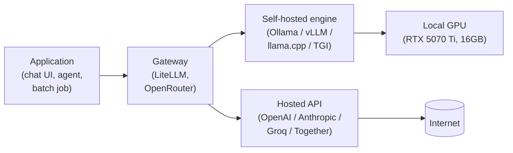
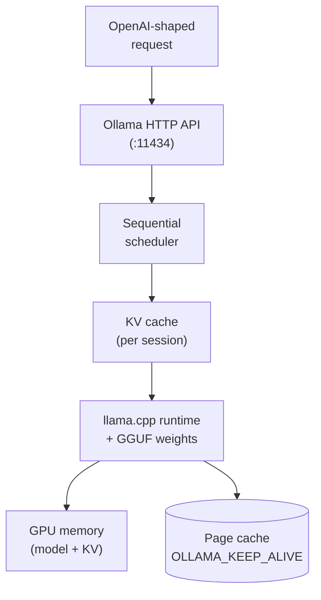
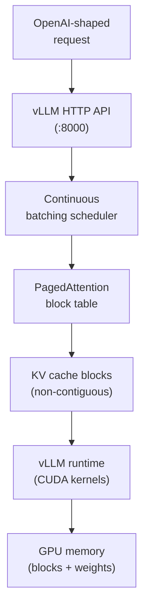
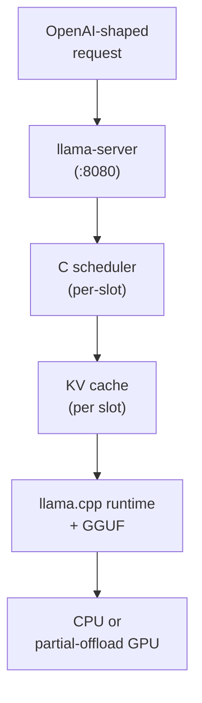
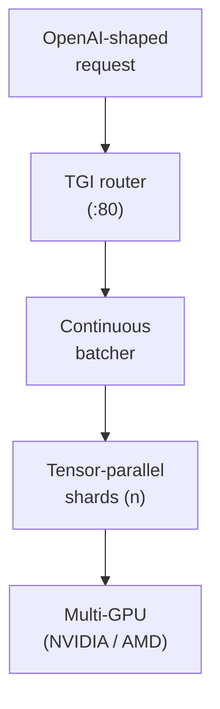
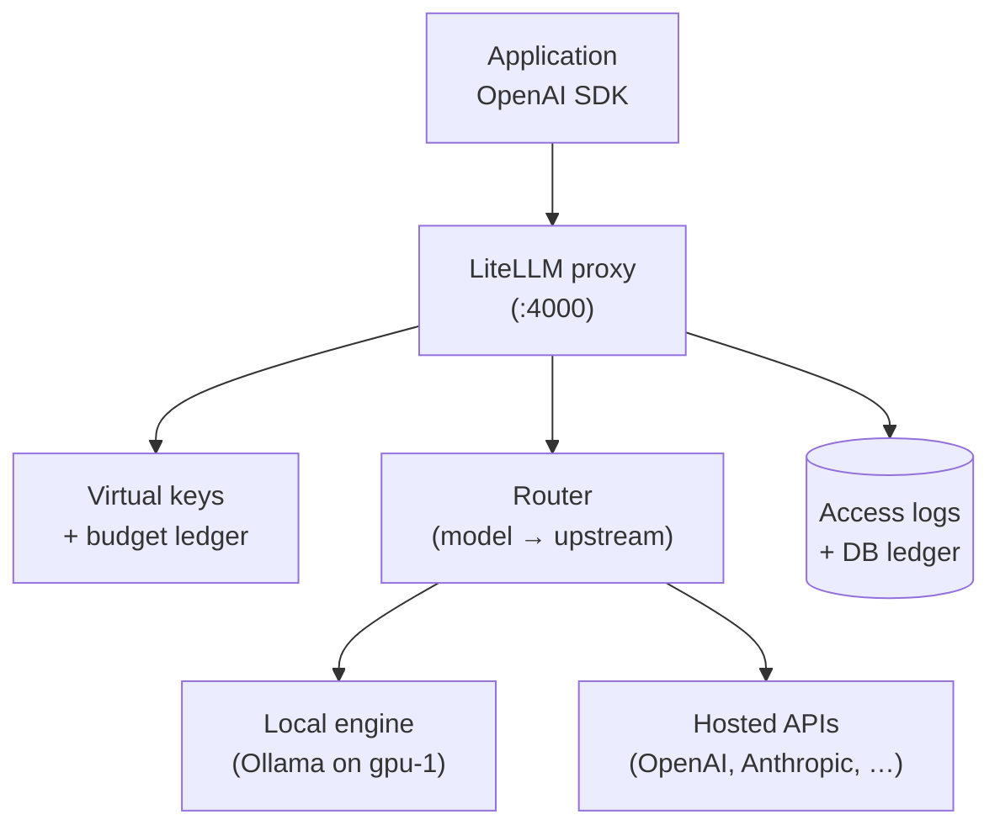
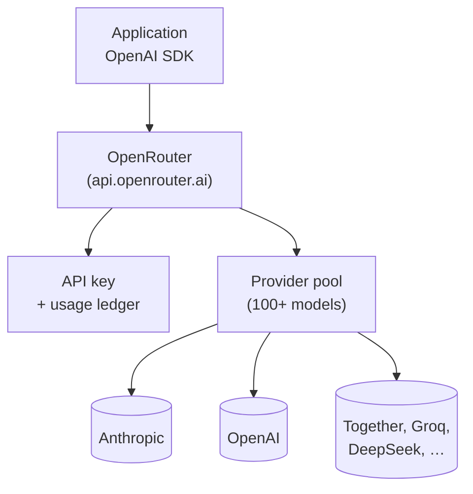
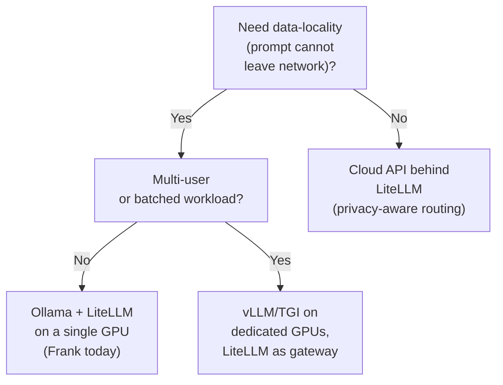

## TL;DR

Inference is a build-versus-buy question dressed up in GPU language. The
engine tier (Ollama, vLLM, llama.cpp, TGI) decides whether the model runs
on your metal; the gateway tier (LiteLLM, OpenRouter) decides whether
anything sits in front of the engine. The two decisions are independent.

Frank's stack is Ollama on a 16GB RTX 5070 Ti behind LiteLLM at
`192.168.55.206`. The honest costs: qwen-vl-7b dropped from `q8_0` to
`Q4_K_M` for the VRAM ceiling; LiteLLM's OSS image emits no `litellm_*`
Prometheus metrics (Enterprise-only); `OLLAMA_KEEP_ALIVE` pinned the
container cgroup RAM and looked like a VRAM bug for hours.

This stack wins on data-locality, latency floor, and learning depth.
On every other axis a hosted API behind LiteLLM is the right answer
for most teams — see §6.

## §1 — The capability

The question I had to answer on Layer 10 was the same question every team
who has ever wanted to run an LLM has had to answer: *where does inference
live?* In the cluster I am, in someone else's datacenter, or in some
combination of both? It is a build-versus-buy question dressed up in GPU
language, and the answer determines everything downstream — latency floor,
data-locality posture, monthly bill, who gets paged at 3 AM when the
endpoint returns 503.

Look at the diagram and notice the two seams. The first seam is between
the application and the gateway: somebody, somewhere, has to translate
"give me a chat completion" into an HTTP call. The second seam is between
the gateway and the engine: that HTTP call resolves either to a process I
control on the metal next to me, or to a packet leaving my switch.

Every stack owner makes two decisions here:

1. **Which engine runs the model?** Self-hosted (Ollama, vLLM, llama.cpp,
   TGI) or hosted (OpenAI, Anthropic, the rest of the API zoo).
2. **Does anything sit *in front of* the engine — a gateway?** And if so,
   which one, and what does it do that the engine doesn't?

The two decisions are independent. You can self-host the engine and skip
the gateway. You can use a hosted API and still put a gateway in front of
it for cost tracking. You can run both engines simultaneously and have the
gateway route. The rest of this paper is about why those four cells exist
and which one I ended up in.

## §2 — The landscape

The OSS / self-hostable inference space has two tiers — engine and gateway
— and the same vendor table tells both stories.


    title Self-hosted inference landscape — 2026
    x-axis "Engine layer" --> "Gateway layer"
    y-axis "Single machine" --> "Cluster-scale / multi-tenant"
    quadrant-1 "Cluster-scale gateways"
    quadrant-2 "Cluster-scale engines"
    quadrant-3 "Single-machine engines"
    quadrant-4 "Single-machine gateways"
    "Ollama": [0.15, 0.20]
    "llama.cpp": [0.05, 0.15]
    "vLLM": [0.20, 0.85]
    "TGI": [0.25, 0.80]
    "LiteLLM": [0.75, 0.78]
    "OpenRouter": [0.95, 0.90]


The four engines fan out across the cost-vs-throughput trade. **Ollama**
is the single-binary entry point — a Modelfile abstraction over llama.cpp
plus GGUF, optimised for "I want a chat endpoint on my laptop, now." Its
sibling **llama.cpp** lives even further to the leftmost floor: pure-C,
CPU-only-possible, runs on a Raspberry Pi as gracefully as on a workstation.
At the cluster-scale end, **vLLM** is what most of the commercial inference
SaaS providers actually run under the hood — its block-allocated KV cache
(PagedAttention) is the load-bearing reason it handles concurrent users
gracefully. **TGI** is HuggingFace's production-grade serving stack —
continuous batching, tensor parallelism, more knobs than Ollama, more
operational complexity than vLLM.


We propose PagedAttention, an attention algorithm inspired by the classical
virtual memory and paging techniques in operating systems. On top of it,
we build vLLM, an LLM serving system that achieves near-zero waste in KV
cache memory and flexible sharing of KV cache within and across requests
to further reduce memory usage. Evaluations show that vLLM improves the
throughput of popular LLMs by 2–4× compared with the state-of-the-art
systems, such as FasterTransformer and Orca, with the same level of
latency.


Two-to-four-times throughput at equal latency is what makes vLLM
*structurally* different from Ollama — it isn't just a faster implementation,
it is a different algorithm for managing GPU memory under contention.

At the gateway tier the split is sharper. **LiteLLM** is the OSS gateway:
virtual keys, OpenAI-compatible routing, cost ledger, ~100 upstream
provider integrations. **OpenRouter** is the same shape sold as a managed
service — pay-per-token, no infra to run, frontier-model coverage by
default. If you only ever talk to hosted APIs, OpenRouter eats LiteLLM's
lunch on operational simplicity. If you self-host engines, LiteLLM is the
only gateway that speaks both worlds.



*Legend: ✅ supports the feature in OSS form, 🟡 partial, ❌ not in OSS,
n/a where the feature doesn't apply (gateways don't run weights). The
LiteLLM row's `prometheus_metrics: ❌` is the load-bearing cell — see §5.*

The gateway-tier vendors converge on the OpenAI HTTP shape, because every
upstream provider does. The engine-tier vendors converge on GGUF + the
OpenAI HTTP shape — except for vLLM and TGI, where GGUF support is partial
because their throughput story is built on different memory layouts.

## §3 — How each option handles the hard part

The hard part for an inference engine is keeping the GPU busy without
losing the KV cache between requests. The hard part for a gateway is being
honest about what it does and doesn't observe. Both problems have textbook
answers; both have problems that show up only when you wire them into a
real cluster.

### Ollama — single-user-first, hide the llama.cpp

Ollama hides every interesting decision behind a Modelfile and an HTTP
endpoint that mimics OpenAI's. Underneath, it is llama.cpp wearing a
friendlier name — same GGUF quantization, same CPU-fallback story. The
scheduler is sequential by default; multi-user throughput depends on
session isolation rather than batching. For ≤2 concurrent users this is
indistinguishable from vLLM in subjective feel. Push it to 8 concurrent
chat sessions and the difference appears as latency tail.

The foot-gun is `OLLAMA_KEEP_ALIVE`. Setting it to `24h` keeps the model
weights resident in memory across requests — fantastic for first-token
latency on the next request, terrible if the container's `resources.limits.memory`
is tight, because the page-cache fills until the cgroup ceiling and Ollama
starts emitting "system memory" errors that read like VRAM exhaustion. The
incident below is mine.

### vLLM + PagedAttention — block-allocate the KV cache

vLLM treats the KV cache the way an operating system treats RAM —
fixed-size blocks, a page table, copy-on-write across prefix-sharing
requests. The continuous-batching scheduler can append a new request's
tokens to an in-flight batch without waiting for the current step to
finish, which is where the 2–4× throughput comes from at >1 concurrent
user. If your workload is "five chat sessions and a batch summarisation
job hitting the same model", vLLM is the right answer and Ollama is not.

The cost is operational: vLLM is not a single binary, GGUF support is
partial, and the supported-model surface lags the latest community
releases by a release cycle.

### llama.cpp / llama-server — the OSS floor

llama.cpp is the engine all the others borrow from. Pure C, no Python
runtime, builds on a Pi. `llama-server` exposes an OpenAI-compatible
endpoint with a slot-based scheduler. If you are running on hardware
where Ollama feels overweight — embedded boxes, Raspberry Pis, a laptop
without a GPU — this is the floor.

### TGI — production-grade transformer serving

TGI is what HuggingFace ships to companies that want to run their own
models at production scale without writing the serving layer. Continuous
batching, tensor parallelism, Prometheus metrics in OSS — the trade is the
operational complexity (container image is heavy, supported-model list is
opinionated). For a single-GPU homelab it is overkill; for a four-GPU
node serving a real product it is appropriate.

### LiteLLM — the OSS gateway

LiteLLM is the gateway shape Frank lives behind: virtual keys per consumer,
a cost ledger that survives upstream price changes, model aliases mapped
to upstream engines, OpenAI-compatible HTTP at every consumer endpoint.
The clever part is that the upstream pool is a flat namespace — `gpt-4o`,
`ollama/llama3:8b`, `claude-3-5-sonnet`, all addressable by alias from the
same key — so application code never learns where the model actually
runs. The dishonest-by-omission part is the metrics tier (see §5).

### OpenRouter — the gateway sold as a service

Same gateway shape, opposite operational model. OpenRouter aggregates
hosted providers behind a single OpenAI-compatible endpoint; you pay for
tokens, not for the gateway. If your stack is *all hosted*, OpenRouter is
strictly easier than running LiteLLM. If your stack has even one
self-hosted engine, OpenRouter cannot route to it and LiteLLM is the only
gateway that closes the loop.

## §4 — What scale changes

At one user and one conversation, all four engines look identical. Token
latency is dominated by the model size and the GPU's memory bandwidth;
the scheduler barely matters. Scale changes everything.

**Continuous batching dominates at >2 concurrent users.** The vLLM team's
own measurements pin this clearly:


vLLM v0.6.0 delivers up to 2.7× higher throughput and 5× faster TPOT
compared to v0.5.3, on Llama 8B model — measured on ShareGPT dataset using
a single H100 GPU. Across H100, A100, A10 GPUs, vLLM consistently
outperforms TGI and TensorRT-LLM.


The numbers come from datacenter GPUs (H100, A100) under ShareGPT — a
benchmark designed to stress concurrent multi-turn workloads. They do not
translate cleanly to a 16GB consumer GPU at 2 concurrent users. The
*direction* generalises (vLLM > Ollama under concurrency); the *magnitude*
does not. This is the unfilled gap in the literature — nobody has published
a head-to-head latency-and-cost benchmark for Ollama vs vLLM vs llama.cpp
at homelab scale on a single consumer card. I have not run one myself.
I should.

**VRAM is the binding constraint, and quantisation is the model-quality
knob.** A 16GB GDDR7 budget on the RTX 5070 Ti will not fit qwen-vl-7b at
`q8_0` plus a reasonable context window plus the KV cache plus the page
cache. So qwen-vl-7b drops to `Q4_K_M`. That is a model-quality decision
disguised as a performance one — measured perplexity climbs, downstream
accuracy degrades on long-context tasks, and the workaround belongs in
§6's "doesn't generalise" list rather than the §5 story. Datacenter
H100s do not have this problem.

**Gateway features become non-negotiable at ≥2 applications sharing an
engine.** When the only consumer is your laptop, the gateway is friction.
When two applications, one cron job, and an autonomous agent all want the
same `llama3:8b`, virtual keys and a cost ledger are the only thing
between you and a per-consumer attribution mess. The gateway tax pays
itself back fastest in a multi-tenant cluster — which is exactly the
direction Frank is heading.

## §5 — Frank's choice, and what happened

Frank's stack is Ollama on `gpu-1` (RTX 5070 Ti, 16GB GDDR7) behind LiteLLM
at `192.168.55.206`. The combination wasn't an optimum — it was a sequence.
Ollama came first because it ran on the laptop already; LiteLLM came second
because the second consumer (an agent, not a chat UI) needed a virtual key.
By the time the third consumer arrived, the gateway was load-bearing and
swapping the engine became expensive.

I will defend the choice on three axes only — data-locality, latency
floor, learning depth — and I will be honest that on every other axis a
hosted API behind LiteLLM is the more sensible answer for most teams.
The scars below are the receipts.


We assumed the LiteLLM OSS image emits Prometheus metrics out of the box.
It does not — `litellm_*` series are Enterprise-only, and the docs say so
in a sidebar on the virtual-keys page that I had not read closely enough.
The Grafana panels for token usage, gateway latency, and rate-limit
errors sat empty for two weeks before someone asked why the dashboard
looked broken. The fix is "synthesise the signals from the access logs"
— which is doable, but is a project, not a config-line. This is exactly
the kind of gap a managed gateway service does not have.



Ollama emitted "system memory" errors under load. The first three hours
of debugging chased VRAM — `nvidia-smi`, model unloading, smaller context
windows. None of it helped. The actual cause: `OLLAMA_KEEP_ALIVE=24h`
pinned the model weights in the page cache, which then grew until the
container cgroup hit `resources.limits.memory` and the kernel started
refusing further allocations. "System memory" was literal, and entirely
about the container's RAM ceiling, not the GPU. The fix was raising the
cgroup limit; the lesson was that "GPU error" and "VRAM error" are not
synonyms and the gateway tier inherits the cgroup tier's footguns.



We put an Argo Rollouts canary in front of LiteLLM. The Prometheus
analysis template panicked on an empty result vector during the first
two-minute warm-up window — there was no traffic yet, the metric existed
but the result was empty, and the provider treats empty vectors as an
error. Errors retry at 10 s cadence, so a 4-error budget hit the abort
threshold in ~50 s, well before the first real measurement window. The
fix was a `successCondition` that tolerates empty results during warm-up
plus a higher `inconclusiveLimit`. The deeper lesson was that the
gateway tier inherits the observability tier's bugs — a canary is only
as good as the signal it watches, and the signal here was lying.


Three real incidents, three real dates, all reachable from the gotchas
registry. None of them are mistakes a hosted API behind OpenRouter would
have produced. All of them taught more than the equivalent green checks
on a managed dashboard would have.

## §6 — When Frank's answer doesn't generalize

I am Frank, a single-operator learning platform with one consumer GPU. My
stack is not the right answer for any team that has even two of those
attributes inverted.

The four-leaf decision tree captures the honest answer set. Frank is at
L2: data-locality matters because the agents handle private repo
contents, multi-user demand is below the threshold that justifies vLLM's
operational tax, and the budget is "one GPU." Most teams should be at L1
— privacy-aware routing through LiteLLM in front of OpenAI and Anthropic,
no engines to operate. Production teams running OSS models at scale should
be at L3, where vLLM's PagedAttention earns the operational complexity.

The one cell missing from the tree is "use OpenRouter alone." It is a
real answer; it didn't survive the data-locality branch because OpenRouter
cannot route to a self-hosted engine. If your stack is all hosted,
OpenRouter is strictly simpler than LiteLLM, and the absence above is
about the data-locality question, not OpenRouter's quality.

## §7 — Roadmap & where this space is going

Three trends will reshape this landscape by the end of 2026.

**Engine convergence on the OpenAI HTTP shape.** Every engine in the
matrix already speaks OpenAI-compatible HTTP. By next year the small
remaining gaps (function-calling extensions, structured-output schemas)
will close, and gateway routing becomes mostly free. The benefit accrues
to LiteLLM and OpenRouter equally; the engines stop being differentiated
on protocol and start being differentiated only on throughput-per-watt.

**Cost ledgering becomes table-stakes for gateways.** LiteLLM, Helicone,
Pezzo, and a handful of internal-built gateways are converging on the
same feature set: per-key budgets, per-model unit cost, audit trails. The
managed-vs-OSS gap is mostly about Prometheus metrics today — that gap
will narrow because the OSS community will route around it (Frank's plan
is to synthesise gateway metrics from LiteLLM access logs, which the
gotchas registry calls out as the obvious workaround).

**The Enterprise/OSS split stays live.** LiteLLM's metrics-tier gap is
not a bug — it is a business model. Expect more "the docs mention this
quietly but the marketing doesn't" footnotes as OSS gateways monetise
around observability rather than the proxy itself. Read the
virtual-keys page closely.

Frank's roadmap: add vLLM alongside Ollama on `gpu-1` for the
batched-workload case (Layer 23-ish), explore Prometheus signal
synthesis from the gateway's own access logs to close the OSS-tier
observability gap, and — eventually — re-run the head-to-head
small-scale benchmark that the literature has not yet published. The
dossier names that gap; it is mine to either fill or admit I never
filled.

