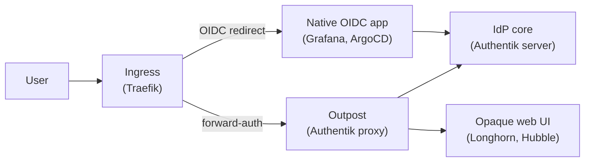
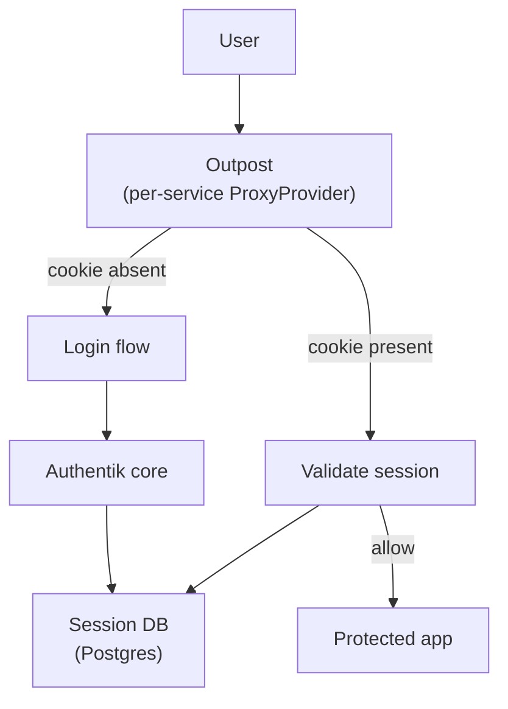
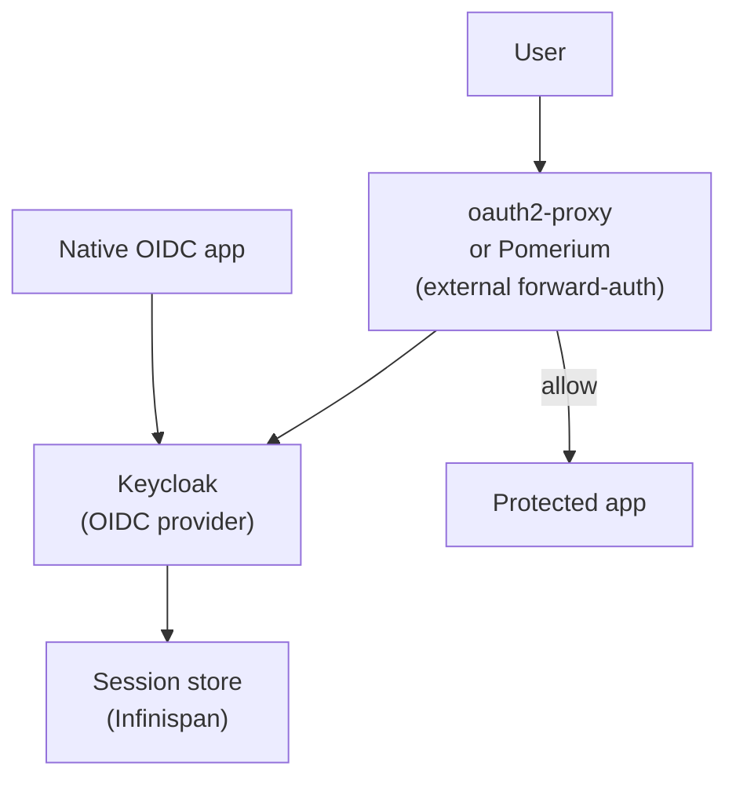
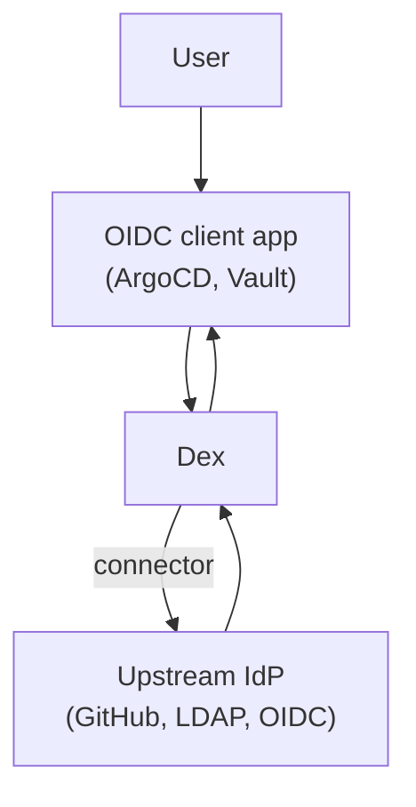
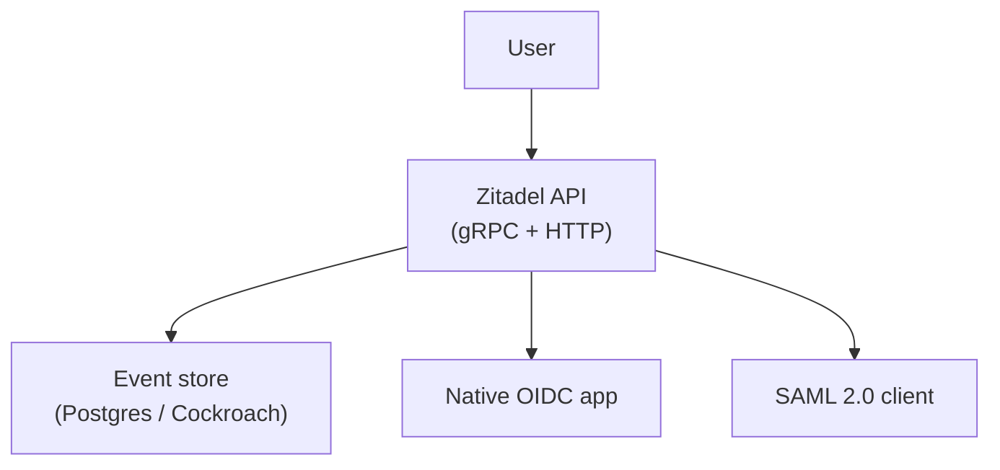
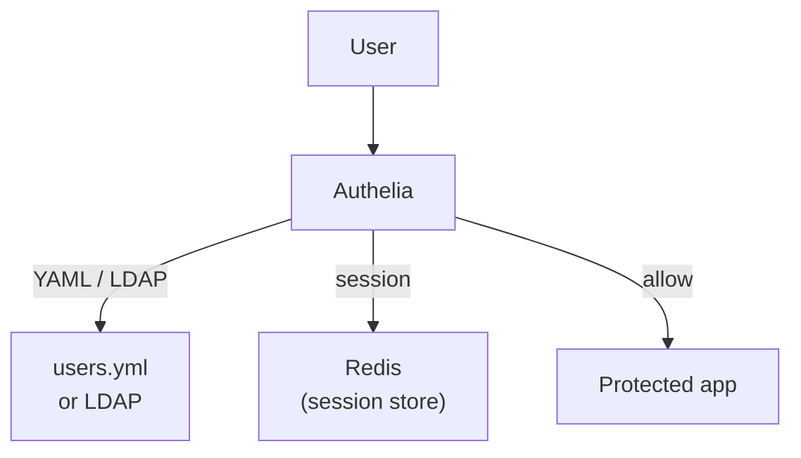
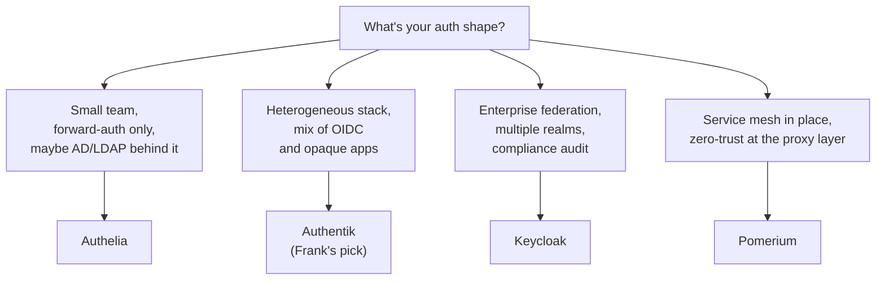

## TL;DR

Ten web UIs, three CLIs, and a gRPC service all want to ask the same
question: who's on the other side of this URL? The identity-provider
slot has seven serious vendors — Authentik, Keycloak, Authelia, Dex,
Zitadel, Pomerium, Ory — split between forward-auth (cookie-validating
proxies) and OIDC-native flows, and between homelab weight and
enterprise multi-tenancy.

Frank picked Authentik because it does both forward-auth (Longhorn,
Hubble, Zot, Homepage) and native OIDC (Grafana, ArgoCD, Gitea) in one
Helm release. The scars: blueprints can't assign providers to the
embedded outpost (manual Django ORM forever); `AUTHENTIK_HOST` unset
returns `0.0.0.0` redirects; the 2026.x schema break required
`invalidation_flow` and Bearer tokens.

Authentik isn't universal. A small AD-backed team should run Authelia;
an enterprise with multi-realm federation should run Keycloak; a
service mesh shop should let Pomerium swallow forward-auth entirely.
See §6.

## §1 — The capability

Before I can show a human anything beyond `kubectl port-forward`, I have
to answer a question that has nothing to do with workloads: *who is on
the other end of this URL?* Ten web UIs (Grafana, ArgoCD, Longhorn,
Hubble, Gitea, Zot, Homepage, Paperclip, n8n, Tekton Dashboard), three
CLIs that want OIDC, and a gRPC service that wants client certs — all
of it asking the same question.

The capability is "identity provider" — IdP — and it occupies a
specific slot in the stack. Not inside the application. Not inside the
ingress controller. *Alongside* the ingress, intercepting the request
before it ever reaches the upstream:



Two interaction patterns, one IdP. **OIDC** for applications that speak
the protocol natively — Grafana, ArgoCD, Gitea — where the app handles
the redirect dance itself and the IdP just signs tokens. **Forward-auth**
for everything else — every Helm chart whose authors never wired up
OpenID, every dashboard that ships with "admin / admin" or no auth at
all. The ingress controller asks the outpost on every request: *does
this cookie belong to a logged-in human?* The outpost answers yes or
no; Traefik either forwards the request or redirects to login.

That is the whole capability. Everything else in this paper is about
which vendor implements it, and what each one breaks when you push on
it.

## §2 — The landscape

The IdP space has three centres of gravity and a few outliers. The
heavy-enterprise end runs Keycloak — Red Hat's CNCF-incubating product,
shipped into more Fortune-500 stacks than any other open-source IdP.
The homelab end runs Authelia — small, file-configured, forward-auth-
only, glued to Traefik or nginx. The middle is where Authentik lives:
an opinionated IdP that does both forward-auth (via an embedded outpost)
*and* OIDC, with a real admin UI and a blueprint system for declarative
config. Dex and Zitadel sit slightly off the main axis. Pomerium sits
in a different stack position entirely.


    title Self-hosted IdP landscape — 2026
    x-axis "Forward-auth only" --> "Full IdP"
    y-axis "Single-tenant homelab" --> "Multi-tenant SaaS-grade"
    quadrant-1 "Enterprise IdPs"
    quadrant-2 "Multi-tenant brokers"
    quadrant-3 "Lightweight portals"
    quadrant-4 "Identity-aware proxies"
    "Authelia": [0.10, 0.15]
    "Pomerium": [0.20, 0.55]
    "Authentik": [0.55, 0.45]
    "Dex": [0.65, 0.25]
    "Ory": [0.75, 0.65]
    "Keycloak": [0.85, 0.80]
    "Zitadel": [0.80, 0.90]


The X-axis is the protocol surface — does the vendor implement the
forward-auth pattern (Traefik / nginx / Caddy asks "is this cookie
valid?" on every request), or is it OIDC-only and assumes every
upstream app speaks OpenID natively? Authelia and Pomerium are
forward-auth-first; Keycloak, Dex, Zitadel, and Ory are OIDC-only and
expect you to front opaque applications with a separate proxy
(oauth2-proxy, Pomerium, or — in Authentik's case — its own bundled
outpost).

The Y-axis is the operational shape. Lightweight means "one file, one
binary, one Postgres" — Authelia ships this. Multi-tenant means "tenant
isolation is a primitive, not a deployment pattern" — Zitadel and
Keycloak both. Authentik straddles the middle: a real database, real
HA, but the multi-tenancy story is "deploy another instance" rather
than "create another realm."



The capability matrix is the dossier-row view of the same plot. The
takeaway is in the *partials*: no single vendor is "✅ everywhere."
Authentik gets forward-auth and full IdP but pays for it with manual
outpost-provider assignment (§5). Keycloak gets enterprise federation
but doesn't do forward-auth natively. Dex is the cleanest declarative
config and the smallest binary — but only because it deliberately
refuses to do most of the things an IdP normally does. There is no
free lunch.


Virtually every company today uses firewalls to enforce perimeter
security. However, this security model is problematic because, when
that perimeter is breached, an attacker has relatively easy access to
a company's privileged intranet… The BeyondCorp initiative is moving
to a new model that dispenses with a privileged corporate network.
Instead, access depends solely on device and user credentials,
regardless of a user's network location.


Every IdP-with-outpost in this paper is an implementation of that
2014 paper. Authentik's embedded outpost, Pomerium-as-product,
Cloudflare Access — they all implement the same primitive: an
identity-aware reverse proxy that authorises *every* request, not
just the first one. Eleven years later, the pattern has won. The
question is no longer *whether* to put an IdP between user and app —
it is *which* one, and how much operational surface it leaves you to
maintain.

## §3 — How each option handles the hard part

The hard part is the seam between IdP, ingress, and upstream
application. Forward-auth and OIDC are protocols on paper; on a
running cluster, they're a series of moving parts that need to agree
on cookies, redirects, session storage, and what to do when one of
them restarts mid-flow. This section walks the architecture of each
serious contender.

### Authentik — IdP + embedded outpost



Authentik's distinguishing feature is the **embedded outpost** — a
small Go binary that runs inside the same Helm release as the IdP and
acts as the forward-auth target. Traefik's `ForwardAuth` middleware
points at the outpost's `/outpost.goauthentik.io/auth/traefik`
endpoint; the outpost reads the cookie, validates it against the
Authentik server, and returns 200 (allow) or 302 (redirect to login).


Forward auth uses your reverse proxy (like NGINX, Traefik, or Caddy)
to forward authentication requests to authentik before serving the
application. Single application mode allows you to protect a single
application with a single proxy provider. Domain level mode allows you
to protect multiple applications under the same domain with a single
proxy provider.


Onboarding a new protected service is a four-step move: create a
ProxyProvider blueprint, create an Application that references it,
add an IngressRoute with the `authentik-forwardauth` middleware,
and — the part nobody warns you about — manually assign the new
provider to the embedded outpost via Django ORM (see §5). Sessions
live in Postgres, so multi-replica HA is trivial; the outpost is
horizontally scalable; OIDC sessions for native apps share the same
Postgres rows.

### Keycloak — heavy IdP, no native forward-auth



Keycloak does not do forward-auth. It does *everything else* — OIDC,
SAML, SCIM, identity brokering, multi-realm federation, fine-grained
authorisation policies. To protect an opaque web UI, you front
Keycloak with **oauth2-proxy** (or Pomerium) and configure that proxy
as the Traefik ForwardAuth target. The proxy speaks OIDC to Keycloak;
Traefik speaks forward-auth to the proxy.


Keycloak is an open source software product to allow single sign-on
with identity and access management aimed at modern applications and
services… An Identity Broker is an intermediary service that connects
multiple service providers with different identity providers. As an
intermediary service, the identity broker is responsible for creating
a trust relationship with an external identity provider in order to
use its identities to access internal services exposed by service
providers.


Keycloak's centre of gravity is **brokering** — connecting one set of
applications to one or more upstream IdPs (corporate AD, social
login, another Keycloak realm). The cost is operational weight: a JVM,
an Infinispan cache, a much larger admin UI, and an upgrade story
that historically requires migration scripts between major versions.
For a single-tenant homelab, this is wildly more IdP than you need.
For a multi-tenant business with regulatory federation requirements,
it is exactly the right amount.

### Dex — federation broker, no users of its own



Dex deliberately refuses to store users. Its job is to translate
between protocols: speak OIDC to your application, speak LDAP or
SAML or GitHub-OAuth to the *real* IdP behind it.


Dex is an identity service that uses OpenID Connect to drive
authentication for other apps. Dex acts as a portal to other identity
providers through 'connectors.' This lets dex defer authentication
to LDAP servers, SAML providers, or established identity providers
like GitHub, Google, and Active Directory.


This is why every ArgoCD installation ships Dex bundled — ArgoCD
needs OIDC to delegate to *something*, but it doesn't want to own
user management. Dex is the thinnest possible adapter. The trade-off
is severe: no password reset flow, no MFA enrolment UI, no admin
console. Projects that adopt Dex inevitably grow a "real" IdP behind
it the moment they want password policies or per-user MFA — at which
point Dex becomes vestigial protocol-translation glue, and you've
deployed two IdPs to do what Authentik or Keycloak do as one.

### Zitadel — cloud-native, multi-tenant from day zero



Zitadel is the youngest of the open-source IdPs and the only one
designed around a gRPC-first API and event sourcing. Every resource —
user, organisation, project, role — is stored as an immutable event
stream, with the queryable state materialised on top. Multi-tenancy
isn't a deployment shape; it's a primitive (`Organization`) that
nests inside the data model.

Forward-auth is not a first-class pattern — you front Zitadel with
oauth2-proxy, same as Keycloak. But where Keycloak's multi-tenancy is
"deploy multiple realms," Zitadel's is "one instance, many
organisations, isolated by API token scope." For a SaaS vendor
building a multi-tenant product, that is a material architectural
advantage. For a single-operator homelab, it's an irrelevant
abstraction tax.

### Authelia — forward-auth only, file-configured



Authelia is the antithesis of Keycloak. One Go binary, one YAML
config, optional LDAP backend, Redis for distributed sessions, and
exactly the forward-auth pattern — nothing else.


Authelia is an open-source authentication and authorization server
providing two-factor authentication and single sign-on (SSO) for your
applications via a web portal. It acts as a companion of reverse
proxies like nginx, Traefik or HAProxy to let them know whether
requests should either be allowed or redirected to Authelia's portal
for authentication.


It is the canonical "homelab IdP" — search YouTube for
"Traefik SSO" and Authelia is most of the top results. The OIDC
provider mode landed recently but is still labelled experimental; for
native-OIDC apps you'll find yourself wishing for Authentik. If the
entire job is "put login pages in front of half a dozen opaque web
UIs," Authelia is the right answer and the others are over-engineered.

### Pomerium and Ory (briefly)

**Pomerium** is the closest thing in this list to a Cloudflare Access
clone. It is not an IdP — it federates *upstream* IdPs (Authentik,
Keycloak, Google) — but it merges the forward-auth proxy and the
authorisation-policy engine into a single binary, with first-class
mTLS and service-to-service auth. If you're already running a service
mesh, Pomerium replaces "outpost in front of every service" with
"one identity-aware proxy in front of everything."

**Ory** (Hydra + Kratos + Keto) is the library-shaped option:
composable identity primitives that you assemble yourself. Hydra is
the OIDC server; Kratos is user management; Keto is authorisation;
Oathkeeper is the policy proxy. The result is the most flexible IdP
in this list and the slowest to stand up — every cluster running Ory
has built its own integration layer. Self-hosted SaaS vendors run
Ory; homelabs almost never do.

## §4 — What scale changes

The architectures in §3 all work at homelab scale. The seams they
have in common — forward-auth fan-out, session storage, token
rotation — change shape under load.

**Forward-auth fan-out cost.** Every request to a protected
application produces a forward-auth call. At Frank's scale that's
under-10 req/s aggregate across twelve protected web UIs; the outpost
load is a rounding error. At enterprise scale — say, 100 req/s per
service across 50 services — that's 5000 forward-auth calls per
second, every one of which terminates against the IdP's session
store. The BeyondCorp paper's original deployment notes describe
this fan-out as the dominant cost at Google scale; the standard
mitigations (per-edge session caches, longer-lived cookies, JWT-as-
session) all trade security properties for latency. There is no
forward-auth deployment at scale that doesn't have an opinion about
this trade.

**Session store as a single point of failure.** Authentik and
Keycloak put sessions in Postgres. Authelia puts them in Redis.
Zitadel puts them in its event store. When that store hiccups, the
IdP hiccups; when the IdP hiccups, every protected service starts
returning 502 on forward-auth. Frank's Authentik runs against a
single-replica Postgres on Longhorn (RWO PVC). It is not HA. A
managed cluster would use a managed Postgres with read replicas; a
production homelab would replicate Authentik's Postgres separately.
Frank's design *accepts* the single point of failure as part of the
cost; that decision is reviewable, but it should be a decision.

**Token rotation cost.** OIDC access tokens are short-lived by
convention — 5–15 minutes is typical. Every long-lived browser
session refreshes that token on schedule, which means every restart
of the IdP triggers a refresh storm seconds after pods come ready.
Authentik tolerates this fine at homelab scale; at enterprise scale,
the published guidance is to stagger restarts, warm the session
cache before traffic switch, and pre-allocate Postgres connections.
The Authentik release notes capture this in the recurring "expect a
brief auth blip during upgrade" advisory.

These three forces are *the* reason scaled-out IdPs converge on
patterns the homelab versions don't need: regional session caches,
JWT-as-session with short lifetimes, IdP fronting by a CDN that
caches the OIDC discovery document. Frank has none of those. Frank
also has 12 protected services, not 5000. Scale changes the shape;
the small-scale shape is the right one to start from.

## §5 — Frank's choice, and what happened

I picked Authentik. The reason was unsexy: I wanted *one* IdP that
did both forward-auth (for Longhorn, Hubble, Homepage, Zot — every
chart that ships without OIDC) and native OIDC (for Grafana, ArgoCD,
Gitea, Paperclip — every chart that speaks the protocol). Keycloak
plus oauth2-proxy would have worked, but it's two moving parts where
Authentik is one. Authelia would have worked for the forward-auth
half but not the OIDC half. Dex would have done OIDC but nothing for
the opaque apps.

The cost has been scar tissue. Three pieces of it are worth naming
in detail, because each is the kind of operational tax that doesn't
appear in any "compare the IdPs" blog post but shows up the second
you actually try to run one.


Authentik blueprints can declare a `ProxyProvider`, but they cannot
assign that provider to the embedded outpost. Every new forward-auth-
protected service requires a `kubectl exec` running Django ORM
against the Authentik server:

```python
outpost = Outpost.objects.get(name='authentik Embedded Outpost')
provider = ProxyProvider.objects.get(name='<provider>')
outpost.providers.add(provider)
```

This is a permanent operational tax on a cluster whose stated
principle is "declarative everything." The blueprint system can
create the resource but cannot manage the *relationship* between
existing outposts and the new provider without replacing the entire
provider list — and replacing the list would unassign every other
service. Authentik's own docs acknowledge this is a limitation. The
fix in `agents/rules/frank-argocd.md` is a documented `# manual-
operation` block. Declarative-everything has an escape hatch shaped
exactly like this.



A new IngressRoute pointed at the embedded outpost and returned 502
on every redirect. The outpost was advertising `0.0.0.0:9000` as
its own URL, because `AUTHENTIK_HOST` was unset. The Authentik
release notes had introduced this requirement quietly:
*"Outposts will use the URL set in the authentik configuration to
access authentik."* The fix is one line in
`apps/authentik/values.yaml`:

```yaml
global:
  env:
    - name: AUTHENTIK_HOST
      value: "https://authentik.cluster.derio.net"
```

`global.env` applies to both server and worker pods — the Helm
chart's structure documents the requirement, but nothing flags it
as a contract. The first new forward-auth service after a chart
upgrade is the canary; if you haven't set `AUTHENTIK_HOST`, you
find out the hard way.



The 2026.x release ran every existing ProxyProvider blueprint
through a stricter validator and failed all of them. The new schema
required `invalidation_flow` (the post-logout redirect flow),
`signing_key` as a UUID reference rather than a name, and
`redirect_uris` as an object shape rather than the scalar that used
to be allowed. The API simultaneously moved from basic auth to
Bearer tokens, breaking every automation script we'd written
against the previous major.

Schema-breaking releases are the dossier-tracked failure mode for
*every* self-hosted IdP — Keycloak's 18→19 migration broke
realm-export format, Zitadel rolls major schemas every six months,
Authelia changed its YAML format in 4.x. You cannot pin to a major
version forever because security patches stop; you cannot upgrade
without a controlled migration. The IdP is the layer where "set it
and forget it" is most attractive and most wrong.


This is the trade. Authentik is the right answer for Frank's shape —
heterogeneous apps, mix of OIDC and forward-auth, single operator,
declarative-first — *and* it costs me a documented manual escape
hatch, a chart-structure-as-contract requirement, and a
known-recurring schema-migration burden every few months. The other
seven vendors in §2 would cost different things; none of them would
cost nothing.

## §6 — When Frank's answer doesn't generalise

Authentik is the wrong answer for at least four shapes. The decision
tree is short on purpose.



**Authelia** wins when the whole job is "put a login page in front of
half a dozen opaque web UIs." It is one binary, one YAML file, and
the easiest possible thing to operate at homelab scale. Its OIDC
provider mode is still maturing — if every app you protect already
speaks OIDC, Authelia is leaving capability on the table.

**Authentik** wins when the apps are mixed — some speak OIDC, some
don't — and you want one system that handles both without bolting
oauth2-proxy in front of half of them. The price is the §5 scars.

**Keycloak** wins at enterprise scale: multi-realm federation, SAML
parity with OIDC, fine-grained authorisation policies, SCIM
provisioning, and a battle-tested upgrade history. If you have
multiple business units federating different upstream IdPs against
overlapping audit boundaries, Keycloak's complexity stops being
overkill and starts being the feature set you actually need.

**Pomerium** wins when you've already invested in a service mesh and
want the IdP to live inside the proxy layer. It is not an IdP — you
still need Authentik or Keycloak or Google behind it — but it
collapses "forward-auth outpost + authorisation policy engine + mTLS"
into one binary. For a multi-service homelab without a mesh, that's
extra surface; for an org running Istio or Linkerd, it's the natural
slot.

## §7 — Roadmap & where this space is going

Three trends are reshaping the IdP landscape in 2026, and all three
make the §3 architectures look slightly out of date already.

**Passkeys and WebAuthn-first identity.** Password forms are dying.
Apple, Google, and Microsoft have all shipped passkey support in
their consumer authenticators; FIDO2 hardware keys are a $25
commodity. The next generation of IdPs assumes hardware-backed
credentials by default — Authentik 2026.x added passkey enrolment to
its default user flow; Zitadel's documentation now leads with
passkeys rather than passwords. The blog posts about "how to set up
TOTP MFA" already feel dated. By the time Paper 11 gets a v2, the
expected flow will be "log in with your fingerprint, never type a
password" — and IdPs that don't make that flow first-class will be
the ones with friction.

**The slow death of SAML.** OIDC has won the protocol war. SAML
survives in enterprise integrations because regulatory frameworks
were written when SAML was the only option; net-new applications
ship OIDC and bolt on SAML only when a customer asks for it. The
capability matrix in §2 lists SAML as "yes" for most vendors, but
the centre of gravity has shifted — Authentik's SAML support is fine
and slightly second-class; Zitadel's is documented but not
showcased. The next decade's IdP comparisons will list SAML the way
this paper lists LDAP: a compatibility checkbox, not a primary
protocol.

**Identity-aware proxies eating the forward-auth pattern.** Pomerium,
Cloudflare Access, Google IAP, and Tailscale ACL-as-identity are
all converging on the same shape: an identity-aware proxy that
combines SSO, mTLS, and authorisation policy in front of every
service, with the IdP as a pluggable upstream. The "outpost in front
of every service" pattern Authentik uses today is a *specific
implementation* of this idea; the broader trend is to make that
proxy the universal layer and shrink the IdP to "the thing that
mints tokens." Frank's auth layer will get re-evaluated against this
shape at some point — probably when the manual outpost-provider
assignment from §5 becomes too expensive to keep doing by hand.

The IdP is the layer where the security story, the operations
story, and the protocol story all converge — and where every choice
is a hostage to a release-notes file you didn't write. Paper 11 will
be re-checked against the landscape in two years. The vendors will
have shifted; the capability matrix will look different; the scars
will be new ones. The pattern will not have changed.
