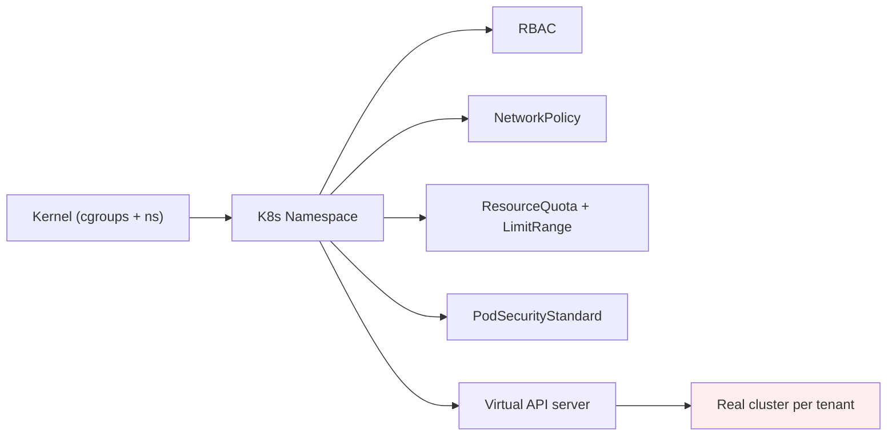
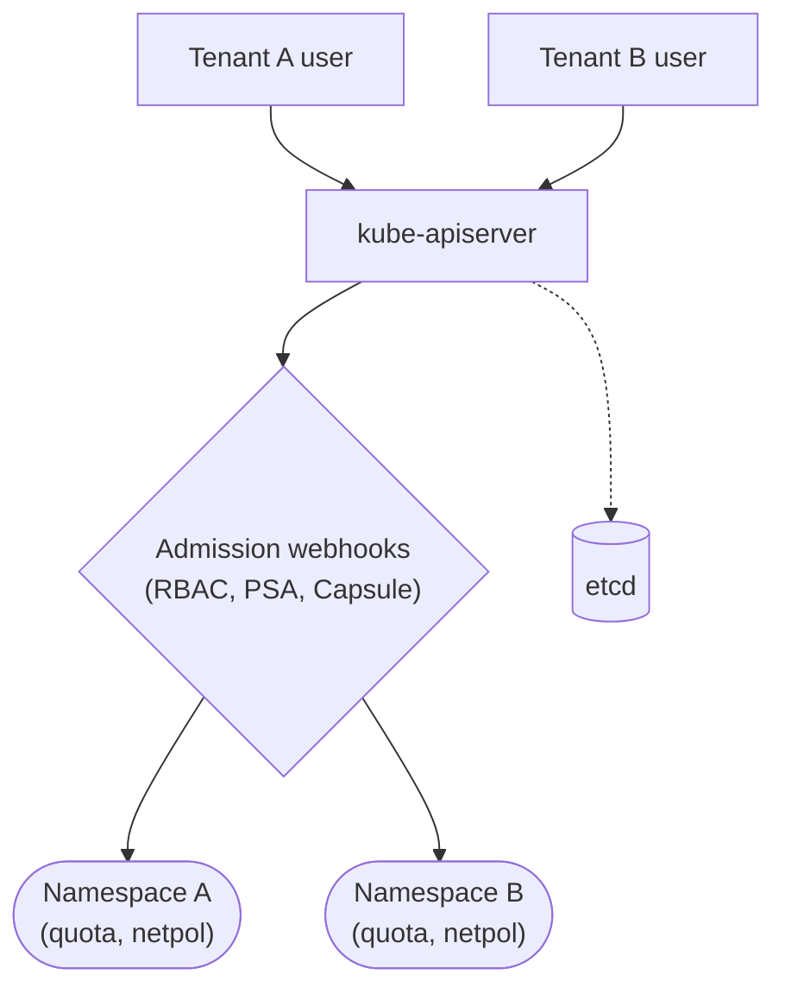
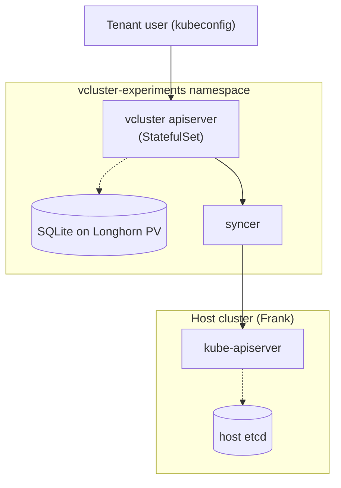
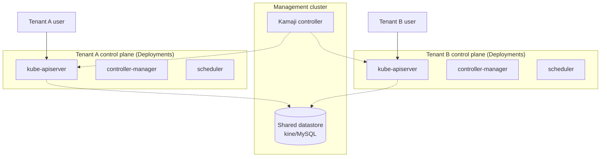
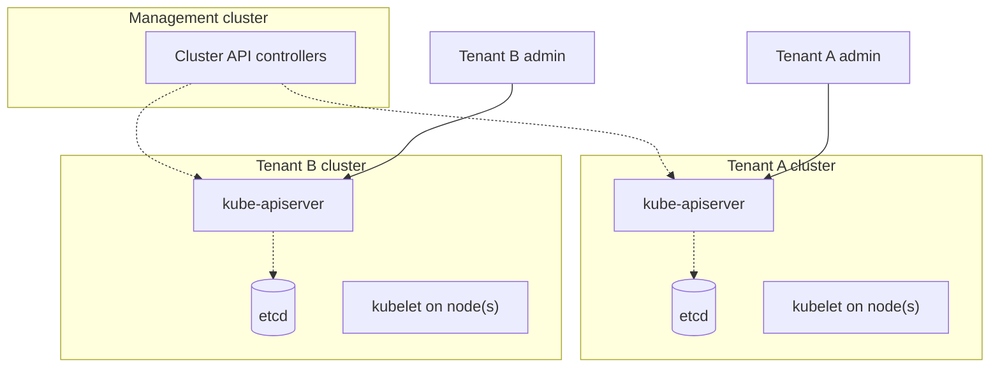
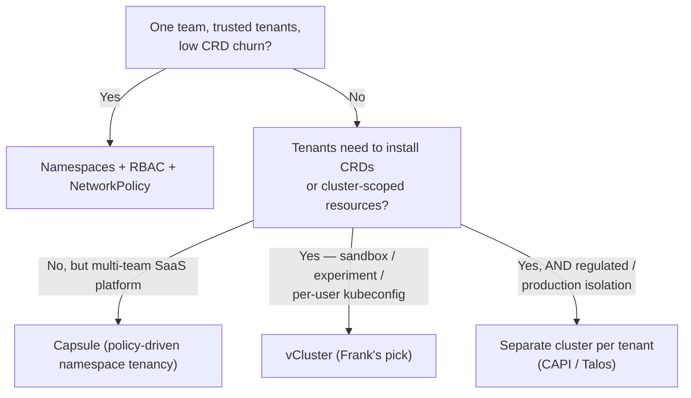

## §1 — The capability

"Multi-tenancy" is a word that means five different things at the
same time. A tenant can be a namespace owned by another team, an
agent pod running unknown code, a sandbox install of a Helm chart
nobody trusts yet, an external user holding a kubeconfig, or an
entire production workload that has to live on its own etcd because
the audit requires it. Each of those tenants needs a different
boundary, and the boundaries live at different layers of the stack.



Read the diagram left-to-right and the cost goes up at every arrow.
At the kernel, cgroups and Linux namespaces are free — every pod
gets them, every container runtime depends on them. At the K8s
Namespace, the cost is one cluster-scoped object per tenant and a
handful of policy objects (RoleBindings, NetworkPolicies, a
ResourceQuota). At the virtual API server, the cost is an entire
control plane — a StatefulSet, a PVC, a syncer, and a backing store
— per tenant. At the real cluster, the cost is everything: own
nodes, own etcd, own kubelet, own attack surface.

The capability question for this Paper is the one the Kubernetes
documentation [poses
explicitly](https://kubernetes.io/docs/concepts/security/multi-tenancy/):
*when do you need K8s tenant boundaries stronger than namespaces but
weaker than separate clusters, and what does each rung on that ladder
actually cost in steady-state RAM, CPU, control-plane upgrade toil,
and blast-radius math?* The answers are not different brands of the
same thing. They are categorically different shapes of isolation, and
each shape pays in a different currency.

This Paper maps the shapes, prices them at homelab scale, and ends at
Frank's pick — which is not one answer. It is two.

## §2 — The landscape

Six options span the spectrum. They are not interchangeable; pairs of
them look similar on a slide and behave categorically differently in
production.


    quadrantChart
        title Multi-tenancy — 2026
        x-axis Shared CP --> Per-tenant CP
        y-axis Low ops floor --> High ops floor
        quadrant-1 "Per-tenant CP · High ops"
        quadrant-2 "Shared CP · High ops"
        quadrant-3 "Shared CP · Low ops"
        quadrant-4 "Per-tenant CP · Low ops"
        Namespaces + RBAC: [0.05, 0.10]
        Capsule: [0.15, 0.20]
        vCluster: [0.65, 0.40]
        Kamaji: [0.70, 0.55]
        HyperShift: [0.80, 0.85]
        Cluster API per tenant: [0.95, 0.95]


The quadrant chart tells the structural story. The bottom-left
quadrant is the namespace-tenancy world: one shared control plane,
policy enforced by admission, no per-tenant runtime cost. The
top-right is the dedicated-cluster world: one full control plane per
tenant, hard isolation by kernel and network, an operational floor
measured in clusters-per-engineer. The interesting middle is
vCluster and Kamaji — per-tenant API server, but the API server
runs as a workload on a shared host cluster.

**Plain namespaces + RBAC + Cilium NetworkPolicies** is the null
hypothesis and the answer most clusters actually run. Tenants are
namespaces; isolation is policy objects layered on top of the
shared control plane. Zero per-tenant runtime cost. Two things
break it: a tenant who wants to install a CRD (cluster-scoped, the
namespace boundary doesn't apply), and a tenant who needs a
kubeconfig that doesn't see the host's cluster-scoped resources.

**Capsule** is the policy-driven evolution of that null hypothesis.
The Capsule docs put it directly: *"Capsule introduces the Tenant: a
lightweight, cluster-scoped resource that groups one or more
Kubernetes namespaces under a shared set of boundaries."* A `Tenant`
CR aggregates namespaces under an owner, inherits RBAC, quota,
NetworkPolicy, and PodSecurityStandard automatically, and gives the
SaaS-platform team a policy-as-code workflow without a second API
server. Same shared control plane as namespace tenancy; richer
policy surface; same CRD limitation.

**vCluster (Loft Labs)** crosses the line into per-tenant control
planes. From the vCluster architecture
[documentation](https://www.vcluster.com/docs/vcluster):
*"vCluster provisions isolated Kubernetes tenant clusters... Each
tenant gets a full Kubernetes API experience while the virtualized
control plane stays completely invisible to them."* A StatefulSet
per tenant runs a kube-apiserver, a controller manager, and a
backing store (SQLite for OSS; etcd for Pro). A syncer translates
tenant pods into host pods. The tenant sees an entire K8s API and
can install CRDs; the host sees pods in a namespace.

**Kamaji (Clastix)** is the same shape, different topology. The
Kamaji docs say it plainly: *"The central cluster where Kamaji is
installed hosts the control planes for all Tenant Clusters as
regular Kubernetes pods."* Per-tenant control plane runs as
Deployments instead of StatefulSets, backed by a SHARED external
datastore (kine over MySQL, or a per-tenant etcd). Trade: one
shared datastore to operate vs. per-tenant SQLite-on-PV. Same per-
tenant API isolation, different operational shape.

**HyperShift (Red Hat OpenShift)** is the enterprise reference
architecture for the same idea — control planes as pods in a
management cluster, data plane on any infrastructure. OSS bits
exist, but the production story is OpenShift contract.

**Cluster API + per-tenant real cluster** is the heavyweight answer.
The Cluster API project describes itself as *"providing declarative
APIs and tooling to simplify provisioning, upgrading, and operating
multiple Kubernetes clusters."* Each tenant gets a real cluster —
own etcd, own kubelets, own nodes, own kernel. Hard isolation; the
operational floor is one cluster per tenant.



The matrix gives away the cost: every option except the namespace
shapes pays in `api_isolation`-yes and `shared_cp`-no, and that
pair is the line where the per-tenant runtime floor stops being
zero.

## §3 — How each option handles the hard part

The hard part of multi-tenancy is not the policy schema. It is the
question of what enforces the tenant boundary at runtime, and what
happens when a tenant tries to break it. Each shape has a different
answer.

Shared visual language across the four diagrams below: squares are
controllers or servers, rounded rectangles are K8s resources,
diamonds are admission gates, cylinders are backing stores, dashed
edges are control-plane or sync paths, solid edges are runtime
tenant requests.

### Shape 1 — Shared control plane (namespaces + RBAC, Capsule)



One API server, one etcd, all tenants. The tenant boundary is an
admission decision: the API server takes the request, runs it
through RBAC and any extra webhooks (Capsule's `Tenant` controller,
PodSecurityStandard, NetworkPolicy validators), and either persists
the object to etcd in the tenant's namespace or rejects it.

Per-tenant runtime cost: a handful of cluster-scoped objects
(RoleBindings, NetworkPolicies, a ResourceQuota, a LimitRange,
maybe a Capsule `Tenant`). Call it ~50 MiB of etcd state per tenant
at most. CPU floor is essentially zero — the API server processes
the same number of requests it would process for one tenant, the
admission webhooks just say "no" more often.

Failure mode when a tenant misbehaves: a runaway tenant pod hits
the cgroup limits set by the LimitRange and the host's kubelet
eviction kicks in. A tenant CRD installation request gets rejected
by RBAC (cluster-scoped resources need cluster-scoped permission).
A tenant webhook that crashes — wait, tenants can't install
webhooks, because admission configuration is cluster-scoped. That
limit is the feature *and* the limit.

Upgrade story when host K8s bumps 1.34 → 1.35: every tenant gets
the new minor at the same instant. There is no per-tenant control
plane to upgrade. That's a feature (one upgrade) and a tax (every
tenant sees the same breaking change at once).

### Shape 2 — Virtual control plane as StatefulSet (vCluster)



The tenant gets their own API server, running as a StatefulSet in a
host namespace. They install CRDs against it. They create
Deployments against it. The syncer reads the tenant's pods,
translates each one into a host pod (with a name-mangled label and
the tenant's namespace baked in), and submits it to the host
apiserver. The host scheduler places it on a host node.

Per-tenant runtime cost: a 200–500 MiB StatefulSet pod (kube-
apiserver + controller manager + syncer + SQLite), plus a 5-GiB
Longhorn PV for the SQLite backing store, plus the actual tenant
pods at whatever density they run. Frank's template values cap each
vCluster control plane at 500m CPU and 512 MiB memory and the
tenant workload at 4 CPU requests / 8 GiB requests via
ResourceQuota.

Failure mode when a tenant misbehaves: a runaway tenant pod still
hits cgroup limits via the host kubelet — that's a kernel boundary,
not a K8s one. A tenant CRD that installs a misbehaving webhook
*only freezes the tenant's API server*. The host control plane is
unaffected. That property is the entire reason to run a virtual
control plane.

Upgrade story: each vCluster is on its own clock. Frank's
`apps/vclusters/template/values.yaml` pins the chart version
(`loft-sh/vcluster v0.32.1`), and each tenant ships with whatever
K8s minor that chart bundles. Bumping a tenant from K8s 1.34 to
1.35 is a chart upgrade against that tenant's Application CR, not a
cluster-wide event. That's a feature (tenants test upgrades first)
and a tax (one extra control plane per tenant to upgrade).

The seam that bites: the syncer's translation of host objects back
into tenant-visible state. Real failure mode, from
[vcluster #3810](https://github.com/loft-sh/vcluster/issues/3810):
*"the PVC syncer mangling the volumeName to vcluster--x--. The
storageClassName is also mangled similarly. No PV or SC with the
mangled names exist on the host, so the PVC stays Pending
permanently."* A virtual control plane is not a free abstraction;
the seam between tenant intent and host execution is where the
bugs live.

### Shape 3 — Virtual control plane as Deployments (Kamaji)



Same per-tenant API server, different topology. Kamaji's controller
materialises an API server / controller-manager / scheduler trio
*as Deployments*, not as a StatefulSet bundled with its own
storage. The state lives in a SHARED datastore (kine adapting MySQL
or a per-tenant etcd cluster), which means the per-tenant runtime
floor on the control plane is just three Deployment pods — no PVC,
no SQLite file.

The trade is operational. vCluster gives you one self-contained
StatefulSet per tenant; if you lose the Longhorn PV, you lose that
one tenant. Kamaji gives you fewer per-tenant moving parts but a
shared datastore whose failure takes down every tenant at once.
Both are real choices.

### Shape 4 — Real cluster per tenant (Cluster API)



The CAPI controllers lifecycle a real cluster per tenant. The
tenant gets their own etcd, their own kubelets, their own node
pool. Hard isolation by kernel and network. No syncer, no
admission tricks — the only boundary the tenant can violate is the
network between clusters.

Per-tenant cost: an entire cluster. At minimum, one control-plane
node (etcd + kube-apiserver + scheduler + controller-manager) and
one worker. On bare metal at homelab scale, that is a whole
machine. On Hetzner, it is a CX23 at €4/month for a single
control-plane-plus-worker — which is exactly the shape of Hop.

This is the shape where namespace tenancy and virtual control
planes both run out of room. Public-internet-facing workload?
Separate kernel? Separate geography? Real cluster per tenant.

## §4 — What scale changes

Three scale axes flip the vendor ranking in different directions.

**Tenant count vs. node RAM.** A 64-GiB Frank mini hosts roughly
30 idle vClusters at the SQLite-on-Longhorn floor — assuming each
control plane idles at ~300 MiB and the tenant workloads stay
inside the template's 8-GiB ResourceQuota. The same node hosts a
practically unbounded number of Capsule tenants, because the
per-tenant runtime cost on a shared control plane is essentially
zero. At 5 tenants, either answer fits. At 30 tenants, the
namespace answer wins on cost. At 30 tenants who all want to
install CRDs, the namespace answer doesn't exist as an option —
no amount of policy makes CRD installation a namespaced operation.

The honest disclaimer here: the
[Kubernetes Multi-Tenancy WG repository](https://github.com/kubernetes-sigs/multi-tenancy)
publishes a categorization framework — *"run multiple virtualized
cluster on a single underlying cluster, allowing for hard(er)
multitenancy"* — but does not publish the per-shape RAM/CPU curve.
The vCluster docs cite 200–300 MiB for an idle SQLite-backed
control plane. The dossier for this Paper names that gap
explicitly: nobody has published the apples-to-apples benchmark.

**Control-plane upgrade story.** When the host bumps from K8s 1.34
to 1.35:
- Namespace tenancy: every tenant gets the new minor at the same
  instant. The deprecation that breaks one tenant breaks all of
  them. One upgrade, one window, one rollback if it goes wrong.
- vCluster / Kamaji: each tenant control plane is on its own clock.
  Frank pins each vCluster chart version per instance, which means
  upgrading the host to K8s 1.35 leaves every tenant on whatever
  minor their chart shipped. That's a feature (canary one tenant
  first) and a tax (N upgrades to do).
- Cluster API per tenant: same property in a different colour. Each
  tenant cluster has its own upgrade window; the management cluster
  controllers do the heavy lifting.

**Blast radius.** This is the most important axis and the one
people get wrong most often. Three failure types, three different
answers:
- *A runaway tenant pod* (chews CPU, allocates memory until OOM,
  loops on disk I/O). Stopped by the kernel cgroup the kubelet
  set up. Same boundary at every layer. Pick any tenancy shape;
  this one is solved.
- *A misbehaving tenant CRD that installs a webhook* (the webhook
  crashes, every API call to the host stalls behind a timed-out
  admission attempt). Namespace tenancy can't even attempt this
  attack — tenants don't get to install cluster-scoped resources.
  vCluster, Kamaji, HyperShift, CAPI all isolate the webhook to
  the tenant's own control plane. The host is unaffected.
- *A tenant who finds a kernel CVE.* Container escape. Only the
  separate-cluster shape gives a real second kernel. Every other
  shape shares the host kernel; the only mitigation is to keep
  the kernel patched.

The shape that costs the most operationally (CAPI / separate
cluster) is the only one that defends against the failure mode that
costs the most when it lands (kernel escape). That asymmetry is
why "just use namespaces" is the right answer for so many teams,
and why "just use vCluster" stops being the right answer for
workloads with a regulator behind them.

## §5 — Frank's choice, and what happened

Frank chose vCluster — OSS edition, embedded SQLite backing store,
Longhorn-backed PV for control-plane state — under the App-of-Apps
pattern. The values live in two files. `apps/vclusters/template/values.yaml`
carries the policy defaults: ResourceQuota (4 CPU / 8 GiB
requests, 50 pods per tenant), LimitRange (500m / 512 MiB default),
NetworkPolicy enabled, SQLite-on-Longhorn PV (5 GiB,
`retentionPolicy: Delete`), and the syncer toggles for pods,
services, configMaps, secrets, endpoints, PVCs, and ingresses.
Each per-tenant file (currently just `apps/vclusters/experiments/values.yaml`)
is twenty lines of commented examples — the template carries the
policy, the instance file exists to hold overrides the tenant
hasn't asked for yet.

Access is via `vcluster connect experiments -n vcluster-experiments`,
which writes a tenant kubeconfig pointing at the per-vCluster
apiserver. The tenant runs `kubectl get namespaces` and sees four
default namespaces — `default`, `kube-system`, `kube-public`,
`kube-node-lease` — and nothing of the host cluster's 30-odd
namespaces, none of the host's CRDs, none of the host's Secrets.
That isolation is the point.


The vCluster Helm chart injects a `vClusterConfigHash` annotation
on the StatefulSet template and omits several fields Kubernetes
defaults at admission time (`persistentVolumeClaimRetentionPolicy/whenScaled`,
`revisionHistoryLimit`, `updateStrategy`). ArgoCD reconciles the
omitted fields back to the chart's empty value; the apiserver
re-defaults them; ArgoCD flags OOS and the StatefulSet flaps
OutOfSync forever. The fix is a four-jsonPointer `ignoreDifferences`
block on the Application CR. Five-minute debug if you've seen it
before; an hour if you haven't.



The original design doc called the policy block `isolation:` — the
chart calls it `policies:`. It used `configmaps:` and
`persistentvolumeclaims:` — the chart takes `configMaps` and
`persistentVolumeClaims`. It set `networking.service.type` — that
field doesn't exist. Three schema violations, three failed templates,
three short cycles of `helm show values` against the real chart.
The lesson is general: even with a stable upstream chart, the
schema is the source of truth, not the design doc.


The Application CR that ties it all together is short enough to
read end-to-end:

```yaml
apiVersion: argoproj.io/v1alpha1
kind: Application
metadata:
  name: vcluster-experiments
spec:
  sources:
    - repoURL: https://charts.loft.sh
      chart: vcluster
      targetRevision: "0.32.1"
      helm:
        releaseName: experiments
        valueFiles:
          - $values/apps/vclusters/template/values.yaml
          - $values/apps/vclusters/experiments/values.yaml
  ignoreDifferences:
    - group: apps
      kind: StatefulSet
      name: experiments
      namespace: vcluster-experiments
      jsonPointers:
        - /spec/template/metadata/annotations/vClusterConfigHash
        - /spec/persistentVolumeClaimRetentionPolicy/whenScaled
        - /spec/revisionHistoryLimit
        - /spec/updateStrategy
```

Multi-source: upstream Helm chart pulled from `charts.loft.sh`,
values composed from two files in this repo (template first, then
instance overrides). The `ignoreDifferences` block is the scar made
permanent.

The most surprising finding of the Paper is the one that didn't
happen. A grep across `agents/rules/frank-gotchas.md` and every
file in `docs/runbooks/frank-gotchas/` returns zero vCluster
entries. Frank's gotcha registry has dedicated sections for ArgoCD,
Cilium, Longhorn, Authentik, Grafana, gpu-1, Paperclip, Tekton —
multiple paragraphs each of dated scars. The vCluster section is
the empty set. The OSS-embedded-SQLite + Longhorn-PV path has run
on Frank since March without producing a single registry-worthy
incident.


Two weeks after vCluster shipped, the public-edge workload needed
a home. The instinct was "spin up another vCluster for it." The
instinct was wrong. The public edge needed its own etcd, its own
kubelet, its own geography (Hetzner, not the home LAN), its own
attack surface, its own kernel patch cadence. Hop — a real Talos
cluster on a Hetzner CX23 — got built instead, and the monorepo
restructured to host two clusters under one repo. vCluster is one
rung on the multi-tenancy ladder; the public-edge workload was a
different ladder entirely. The Paper has to say so.


That structural decision is the honest version of Frank's pick.
Frank chose vCluster for sandboxes and a real second cluster for
edge. Same repo, different answer per question.

## §6 — When Frank's answer doesn't generalize



Four leaves, three questions. The decision turns on whether the
tenants are trusted and homogeneous (yes: namespaces win), whether
they need to install CRDs or cluster-scoped resources (yes: virtual
control plane), and whether the workload is regulated or whose
blast-radius math demands kernel-level isolation (yes: separate
cluster).

The Capsule leaf is for the SaaS-style platform team with strong
policy-as-code culture and many trusted-but-untrusting-each-other
tenants — the canonical example is the internal-developer-platform
team running a "namespace per team" cluster for fifty engineers.
Capsule beats raw namespaces by aggregating policy under a single
`Tenant` CR; it loses to vCluster the moment a tenant needs a
cluster-scoped resource.

The separate-cluster leaf is what Frank actually ran for Hop. The
public-edge workload didn't need *more isolation than vCluster
could provide* — it needed a categorically different thing (own
geography, own attack surface, own kernel). The cost was one extra
Talos cluster and one monorepo restructure; the win was that
"public internet" and "homelab LAN" stopped sharing a kernel.

The honest version of the counter-argument considered in the
dossier: for a 3-person team running 5 services, plain namespaces
+ RBAC + Cilium NetworkPolicies + a couple of ResourceQuotas is
fine. Plain namespaces WIN for that team. Frank's pick is vCluster
because Frank's tenants are *deliberately ill-behaved* — agents
running arbitrary code, sandbox installs of unknown Helm charts,
kubeconfig handoffs to external users who should see zero of the
host cluster. None of those use cases survive on namespace-only
isolation. For everyone else, the leaf that wins is the leaf where
the tenants are.

## §7 — Roadmap & where this space is going

Three trends worth naming.

**The virtual-control-plane shape is consolidating.** vCluster,
Kamaji, and HyperShift all converged on the same architectural
pattern — control plane as pods in a management cluster, data
plane somewhere else. Loft Labs (vCluster) and Red Hat (HyperShift)
are both betting that this becomes the default multi-tenancy shape
for platform teams in the next 18–24 months. The OSS / commercial
split lives in the data-plane integration story (Karpenter, node
auto-provisioning, fleet upgrade) and the policy surface, not in
the control-plane topology. Expect the topology to stabilize and
the integration features to differentiate.

**Cluster API is eating the per-tenant real-cluster story.**
Hand-rolled "cluster per tenant" used to mean Terraform plus bash.
CAPI now spans AWS, Azure, vSphere, OpenStack, Talos (CABPT, the
Talos bootstrap provider), and a long tail of bare-metal providers;
the provisioning friction is dropping fast enough that the
"separate cluster" leaf of the decision tree is getting cheaper.
In 18 months, the right answer for many regulated workloads will
be CAPI + a tiny management cluster, not vCluster. Frank's
hand-rolled Talos-on-Hetzner Hop is the manual version of that
story — when CAPI's Talos provider stabilises further, the
declarative version becomes the right shape for Hop too.

**Namespace tenancy is getting better, slowly.** The K8s Multi-
Tenancy WG's HierarchicalNamespaces (HNC) project, the steady
improvements to PodSecurityStandard, the upcoming NetworkPolicy v2
shape, and Cilium's tenant-aware policy extensions are raising the
ceiling of what shared-control-plane tenancy can do safely. The
gap between "Capsule on shared control plane" and "vCluster with
per-tenant API server" narrows for every tenancy use case that
doesn't require a tenant-owned CRD. The CRD limit is the line that
will hold longest, because making CRDs namespaced changes the
shape of every Kubernetes API on Earth.

Frank's pick won't shift in the next 18 months — vCluster OSS plus
Hop covers both the sandbox and the public-edge shape, and the
gotcha registry says the choice has been calm. The next move
worth watching is whether CAPI-Talos matures enough to make Hop
declarative, at which point the multi-cluster story this Paper
ends on becomes a chart upgrade instead of a manual one.
