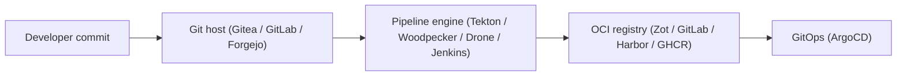
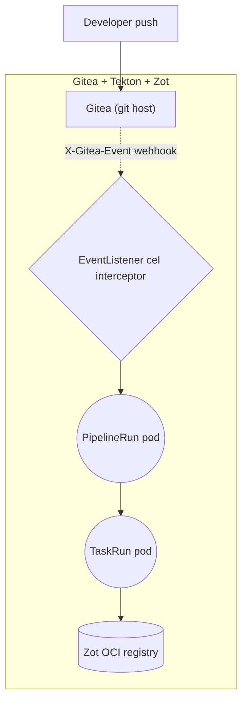
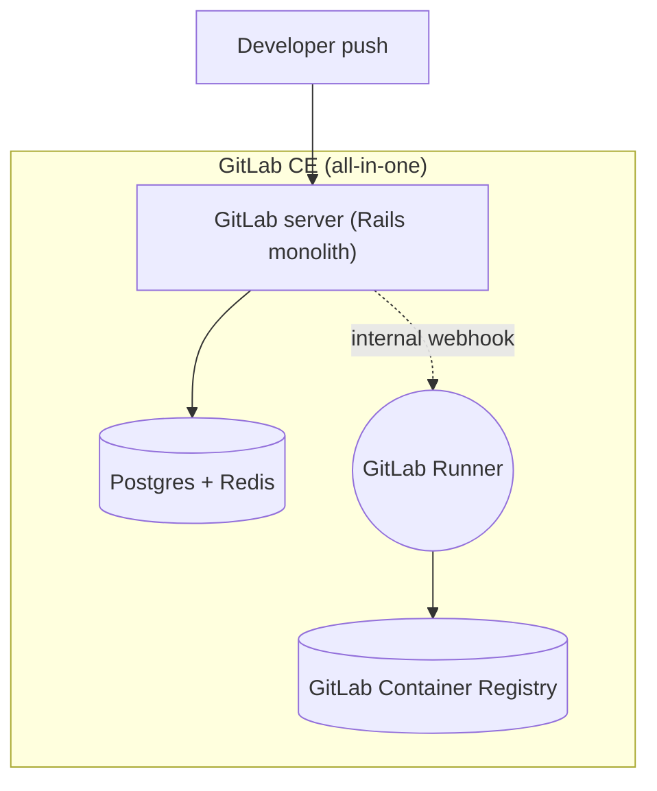
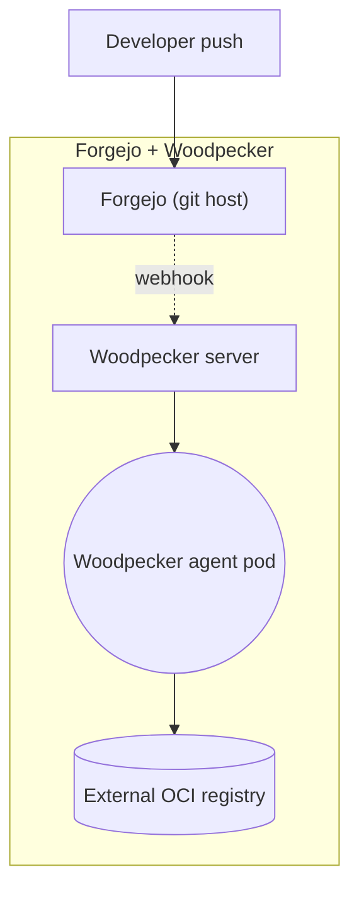
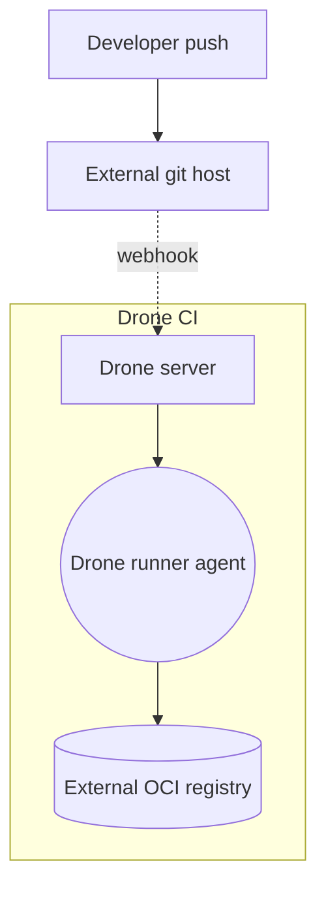
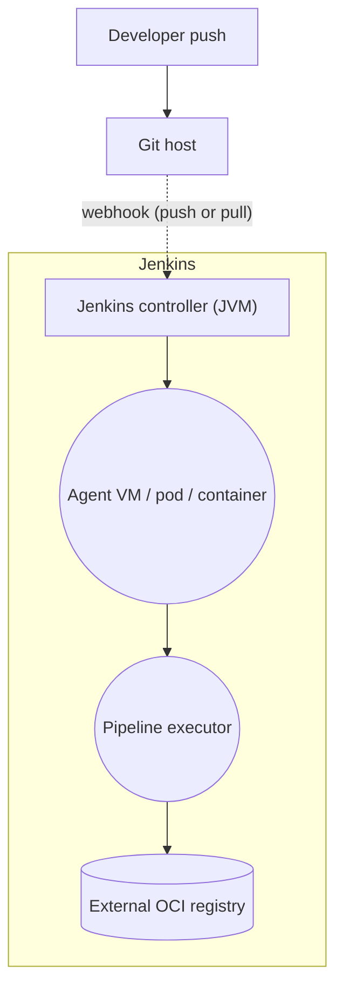
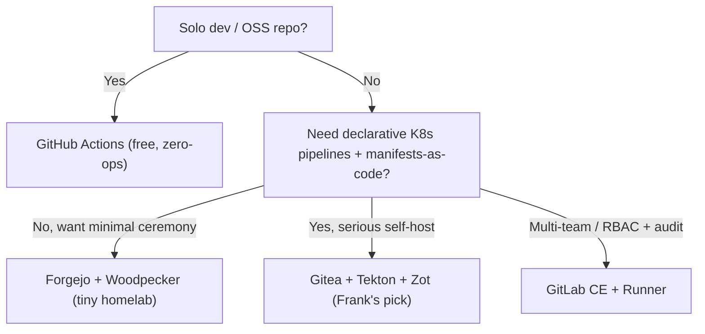

## TL;DR

Self-hosted CI/CD on a homelab is a choice between *one tool or three*.
The six contenders in 2026 (Gitea+Tekton+Zot, GitLab CE,
Forgejo+Woodpecker, Drone CI, Jenkins, and the SaaS baseline GitHub
Actions) split on integration shape (all-in-one vs three composable
services) and Kubernetes-nativity (pods-as-build-steps vs
agents-as-VMs); the cost curve is so lopsided that GitHub Actions is
the rational answer until it isn't.

Frank runs Gitea + Tekton + Zot. Three tools, three LB IPs (.209, .223,
.210), pipelines as CRDs, registry on a Longhorn PVC. The scars came in
the seams: a Tekton v1 Task whose `spec.resources` was silently eaten
because the field is `computeResources`, an EventListener that dropped
every Gitea webhook because the `github` interceptor filters
`X-GitHub-Event` and Gitea sends `X-Gitea-Event`, a Zot chart pinned
at v0.1.0 that turned out to lack TLS, auth, and persistence until
v0.1.60+.

Frank's answer does not generalize. Solo OSS dev → GitHub Actions.
Tiny homelab wanting minimal ceremony → Forgejo + Woodpecker. Multi-
team enterprise → GitLab CE.

## §1 — The capability

A commit lands in the default branch. The unit tests pass on the
contributor's laptop. Somewhere between *the new code being merged*
and *an immutable image being available to the deployer*, something
has to run the build, run the tests, run the linter, build the
container, sign it, and push it to a registry where ArgoCD (or
whatever else watches images) can find it. That something is the
CI/CD platform.

That is the capability under examination. Not "deployment in the
abstract" — Paper 14 already covered progressive delivery, and the
GitOps loop is its own paper. The capability is *what happens between
the git push and the registry push*: who runs the builds, who stores
the images, and what tax do they charge for running them yourself
rather than handing the job to a SaaS vendor?

Three things move between commit and registry: a webhook (the git
host tells the pipeline engine), a build (the pipeline engine spawns
runners), and an image push (the runners write to the registry). Each
of the three movements is a seam, and seams are where self-hosted
CI/CD stacks fail. The vendor landscape *splits* on whether those
three movements live inside one tool, two tools, or three.

I run Gitea + Tekton + Zot. That choice was not made because three
tools are intrinsically better than one; it was made because every
layer of the three-tool stack is a Kubernetes manifest in Git, which
makes the pipeline itself a thing the GitOps loop reconciles, not a
thing the GitOps loop deploys onto. The point of this paper is to
make the trade legible, and then return to Frank's choice and the
operational scars that proved it correct only on Frank's terms.

## §2 — The landscape

Six options dominate self-hosted CI/CD in 2026, and they split on
two axes. The horizontal axis is *integration shape* — three
composable tools on the left (git host, pipeline engine, registry,
each chosen independently) or one all-in-one platform on the right
(GitLab CE bundles all three; GitHub Actions bundles all three plus
the SaaS hosting). The vertical axis is *Kubernetes-nativity* —
agent-based runners on the bottom (Jenkins agents, Drone agents,
Woodpecker agents) or pods-as-build-steps on the top (Tekton's whole
identity is making every Step a container that runs in its own pod).


        title Self-hosted CI/CD — 2026
        x-axis "Three composable tools" --> "All-in-one platform"
        y-axis "Agent-based runners" --> "Kubernetes-native pods-as-steps"
        quadrant-1 "All-in-one · K8s-native"
        quadrant-2 "Three-tool · K8s-native"
        quadrant-3 "Three-tool · Agent-based"
        quadrant-4 "All-in-one · Agent-based"
        "Gitea + Tekton + Zot": [0.15, 0.90]
        "GitLab CE": [0.90, 0.40]
        "Forgejo + Woodpecker": [0.25, 0.55]
        "Drone CI": [0.30, 0.55]
        "Jenkins": [0.20, 0.20]
        "GitHub Actions": [0.85, 0.30]




The matrix grades the options on integration, K8s-nativity,
declarative YAML pipelines, native webhook triggers, bundled OCI
registry, OSS licensing, operational overhead, and zero-cost SaaS.
The mesh-required-equivalent column for CI/CD is *operational
overhead* — the row that does the most work and that vendor docs
mention only after you have installed the binary.

**Gitea + Tekton + Zot** optimises for manifests-as-code at every
layer. Gitea is a Go binary that runs in a Pod; Tekton Pipelines and
Tasks are CRDs; Zot is an OCI-native registry that runs in a Pod
behind a LoadBalancer. The trade is operational complexity: three
tools, three sets of webhooks, three release cadences, three failure
modes. For most homelab and small-team contexts where the value is
GitOps-managed pipelines, that is the right shape. For a developer
who just wants a build to run, it is overkill.


Tekton Pipelines are a Kubernetes-native, lightweight, and easy-to-use
framework that allow you to build CI/CD systems. A Task defines a
series of ordered Steps that you want to execute. Each Step runs in
its own container image.


**GitLab CE** is the inverse trade. One Rails monolith plus runners
provides git host, CI/CD, container registry, package registry, and
issue tracker. Webhooks are internal; the seams disappear because
there are no seams. The benefit is real ergonomic integration. The
cost is that GitLab is one of the heaviest self-hosted services in
common use — multi-GB RAM baseline, Postgres + Redis + Sidekiq +
GitLab Runner, and an upgrade story that is rightly feared. For a
team that values RBAC, audit, and a single pane of glass, GitLab CE
is the answer.

**Forgejo + Woodpecker** is the homelab pattern — two community-
governed forks (Gitea → Forgejo, Drone → Woodpecker) chosen for
minimal ceremony. Forgejo is a single Go binary; Woodpecker is a
server + agent pair with a small footprint. No bundled registry; pair
with whatever (often Docker Hub or GHCR). The one-tool-each shape
is the most popular small-scale self-host combo on r/selfhosted, and
deservedly so — at homelab scale it just works.

**Drone CI** is now under CNCF stewardship; the architecture is
unchanged. Every pipeline step is a container, the YAML format is
minimal, the server + agent model scales linearly. Drone's design is
the architectural predecessor of Tekton's pods-as-steps approach.
Picking Drone over Tekton is choosing a smaller engine with fewer
moving parts and giving up the Kubernetes-CRD integration.

**Jenkins** is the heritage incumbent. JVM controller, Groovy DSL
(plus declarative Pipeline syntax), thousands of plugins, two decades
of accumulated patterns. The plugin ecosystem is genuinely
unmatched; the operational tax is genuinely substantial. Jenkins is
the right answer for a team that already has Jenkins, and increasingly
the wrong answer for a team that does not.

**GitHub Actions** is the SaaS baseline. It is here in the landscape
not because Frank uses it but because every self-hosted decision is
implicitly a comparison against it. Free for public repositories, a
generous free tier for private, a marketplace of pre-built actions,
zero operational overhead. Its purpose in this paper is to mark the
upper bound: if you can use GitHub Actions, the rest of the
landscape is solving a problem you do not have yet.

## §3 — How each option handles the hard part

The hard part of self-hosted CI/CD is *triggering a deterministic,
isolated build from a webhook and getting an immutable image to a
registry without operating the build runner like a snowflake*. Every
vendor on this list has an answer; the answers diverge enough that
they need separate diagrams. The diagrams below use a shared visual
language — squares for controllers and servers, rounded rectangles
for runners (pods, agents, VMs), diamonds for decision points
(interceptors, gates), cylinders for storage (registries, artefact
stores), dashed edges for webhook and event paths, solid edges for
build-step and data paths.

### Gitea + Tekton + Zot

Gitea sends a webhook on each push to a Tekton EventListener service
fronted by a Cilium LoadBalancer. The EventListener applies a `cel`
interceptor matching on the `X-Gitea-Event` header (the github
interceptor doesn't work — see §5). On match, it creates a
PipelineRun CR. The PipelineRun spawns one TaskRun per Task; each
TaskRun runs the Task's Steps in a single pod, one container per
Step, sharing a workspace PVC. The final TaskRun pushes the built
image to Zot at the cluster LB IP for the registry.

Promotion is implicit — once the image is in Zot, ArgoCD's image
updater (or the operator running `argocd app sync`) sees it.
Time-to-image is dominated by Tekton's pod startup overhead (a few
seconds per Step container) plus the actual build.

The failure mode is the seam. Three tools, three failure modes;
Frank stepped on three of them in three months.

### GitLab CE

GitLab Server holds the git data, the CI/CD orchestration, the
container registry, and the user identity in one Rails monolith
backed by Postgres + Redis. The push triggers an internal
orchestration call (no external webhook) to allocate a CI job; a
registered GitLab Runner picks up the job and runs it. The Runner can
be Kubernetes-native (the `kubernetes` executor schedules Pods), or
Docker, or shell — operator's choice. The image push lands in the
bundled container registry, addressable as
`registry.example.com/group/project`.

Promotion is internal too — GitLab's own deploy stages or external
GitOps both work, but the registry lives next door.

The failure mode is the monolith. When GitLab is up, it works
beautifully. When it's down, all three tools are down.

### Forgejo + Woodpecker

Forgejo is a single Go binary serving as git host. Woodpecker is a
server + agent pair; the server consumes Forgejo's webhook (Woodpecker
speaks Forgejo's webhook flavour natively), allocates a build, and
hands it to an agent. The agent is typically a long-lived pod (or VM,
or bare-metal host) that runs the pipeline steps as containers. There
is no bundled registry — pair with Docker Hub, GHCR, or a
self-hosted Zot.

The failure mode is registry independence. Two tools is one fewer
seam than three, but no bundled registry means choosing one
externally; that choice can rebound to "three tools after all".

### Drone CI

Drone follows the same shape as Woodpecker — server + agent —
because Woodpecker forked from Drone. The Drone server brokers
webhooks from whatever git host you wired up (GitHub, GitLab, Gitea,
Bitbucket); agents are containers that execute pipeline steps.
Lightweight, opinionated, easy to operate; Drone's footprint at idle
is single-digit MB RAM. The trade-off is plugin ecosystem maturity
relative to Tekton's growing CNCF community.

### Jenkins

Jenkins is the heritage architecture. The controller is a JVM
process; agents connect over JNLP or SSH and execute Pipeline steps.
The Pipeline DSL is Groovy under the declarative-syntax wrapper. No
bundled registry; the integration surface is the plugin catalogue, and
the failure mode is plugin-pinning drift over the long run. Jenkins
remains the right answer for the team that has Jenkins, and an
increasingly hard sell for the team that does not.

## §4 — What scale changes

Three scale axes flip vendor rankings. The first is quantitative; the
second is storage; the third is operational.

**Concurrent build count.** A homelab with one or two concurrent
builds runs Tekton, Woodpecker, Drone, or Jenkins on a single worker
node without breaking a sweat. At ten concurrent builds, Tekton's
pod-per-step model starts costing in scheduler churn and image pulls
(each Step container is a separate `image pull`). At a hundred,
Spinnaker-style heavy controllers and GitLab's runner-as-service
architecture pay back; the lighter agent-based engines (Drone,
Woodpecker) need horizontal agent scaling to keep up. The crossover
is not a number — it's "how many concurrent builds before a single
human's mental model of where builds live falls apart?"

**Registry storage growth.** Every CI build pushes an image. At five
commits per day with 200 MB images, that is one gigabyte per day,
thirty gigabytes per month — garbage collection becomes a weekly
operational concern by month two. Zot's retention policies, GitLab's
container-registry cleanup, and Harbor's GC schedules are all
asymmetric in ergonomics. The naive "tag-and-keep" pattern that works
fine on month one becomes an unbounded-disk-growth problem on month
six. Pick the registry that has a *built-in* GC story; Zot does, and
the chart's docs cover the policy syntax.

**Webhook latency and the seam between three tools.** Three-tool
stacks have multiple webhook hops (git host → pipeline engine →
optional registry notification). All-in-one platforms (GitLab CE,
GitHub Actions) have one internal call. At small scale the latency is
indistinguishable. At high concurrency, the three-hop path picks up
retries, ordering bugs, and the kind of silent-drop failure that
Frank's `X-Gitea-Event` scar belongs to. The CD Foundation's State
of CD writeups have flagged the seam-cost-versus-vendor-lock-in trade
as the load-bearing decision in the space for years; the practitioner
folklore on r/selfhosted converges on the same shape.


GitHub Actions is free for public repositories, providing CI/CD with
up to 20 concurrent jobs and a marketplace of pre-built actions.


The SaaS comparison is honest about its terms — at the homelab end of
the curve, GitHub Actions is *free*, and the self-hosted tax is paid
in operator hours rather than dollars. The right question is not "is
self-hosting cheaper" but "which currency are you spending?"

## §5 — Frank's choice, and what happened

I run Gitea + Tekton + Zot. Three tools, three IPs (.209 Gitea HTTP +
2222 SSH, .210 Zot HTTPS, .223 the Tekton GitHub-style listener for
external webhooks). Pipelines as CRDs in `apps/tekton/manifests/`.
Gitea webhooks fed through a `cel` interceptor matching on the
`X-Gitea-Event` header. Zot pinned at v0.1.60+ with TLS, htpasswd
auth from SOPS, and a Longhorn-backed PVC for image storage.

I did not pick this stack because three tools are intrinsically
better than one. I picked it because every layer is a manifest in
Git — the EventListener, the Pipeline, the Task, the Zot config, the
Gitea webhook spec — which means the CI/CD platform itself is a
GitOps-reconciled thing rather than a hand-installed one. That trade
is exactly what a learning platform is for.

The honesty of that choice is what makes the resulting scars worth
writing down. The three tools were never the problem. The seams
between the three tools were the problem.


We wrote a Tekton v1 Task with `spec.resources`. The CRD validation
accepted it — silently, because `resources` is the v1beta1 field, and
v1 wants `computeResources`. The whole ArgoCD Application went green;
the build pod ran without the resource limits we believed we'd set;
we discovered the typo only when a build OOM-killed the cluster
scheduler. The schema migration from v1beta1 to v1 isn't graceful —
it eats fields whose name differs by one letter, with no error and
no warning. *A field-rename across a CRD major version is a category
of bug that schema validation does not catch.*



An EventListener with a `github` interceptor refused to fire on
Gitea pushes. Gitea sends `X-Gitea-Event`, not `X-GitHub-Event`. The
github interceptor *silently drops* events that don't match — no log,
no metric, no visible failure. The cost was an afternoon of staring
at the EventListener pod's log looking for an error message that
wasn't there. The fix is a `cel` interceptor matching the actual
header. *Filters that silently drop are worse than filters that
reject loudly; the cost of an invisible failure is paid in operator
time, every time, forever, until somebody documents it.*



We pinned Zot at chart v0.1.0 because it was the first GA release.
v0.1.0 has no first-class TLS, no auth, no persistence story — the
schema for those came in v0.1.60+. The fix was the chart bump. The
lesson was a category, not a fact: *pinning to .0 because it's the
GA isn't the same as pinning to .0 because it's stable*. A new
chart's first GA release can still be feature-incomplete relative to
the project's documented capabilities, and the only signal is reading
the chart values schema before the install.


The three scars share a shape. None of them are bugs in Tekton,
Gitea, or Zot. All of them are emergent properties of running three
declarative tools at the seams between them — exactly where the
marketing material does not look. A managed CI/CD product would have
hidden every one of these failure modes behind its abstraction, which
is the right trade for a production team and the *wrong* trade for a
learning platform.

Visible evidence:

Frank exists to encounter the v1-`resources`-vs-`computeResources`
trap, the `X-Gitea-Event` silent drop, and the Zot v0.1.0 schema gap
so that the next operator on this stack does not have to.

## §6 — When Frank's answer doesn't generalize

Frank's answer — Gitea + Tekton + Zot, three tools, manifests-as-
code — is one leaf of a four-leaf tree. The other three are real.

The first branch is whether you can use GitHub Actions at all. A
solo developer with an open-source repo and no air-gap requirement
has no rational reason to self-host — the SaaS is free, zero-ops,
and faster than anything in the self-hosted landscape. The
counter-argument from §1 wins on these terms, and the right answer
is one click away.

For everyone else, the second branch is *how much architectural
investment do you want in the pipeline?* If the answer is "minimal —
I want one config file and a runner that just works", Forgejo +
Woodpecker is the right pick. Two binaries, one webhook hop,
ergonomics tuned for the homelab. If the answer is "the pipeline
itself should be GitOps-managed YAML in Git", Tekton's CRD model is
the only place that fits — and the price of admission is the other
two tools (Gitea for the git host, Zot for the registry, because
Tekton is the engine and brings neither). If the answer is "I need
RBAC, audit, multi-team isolation, and one binary to upgrade", GitLab
CE is the right pick — heavier than anything else on this list, and
appropriately so.

This is the section where the paper has to be honest about its
audience. Frank's answer is correct *for Frank*, a single-operator
learning platform that values manifest-as-code at every layer and is
willing to pay tuition on three seams to get it. If you are reading
this from a team of three and a shared production cluster, the right
answer for you is likely one of the other three leaves. The point of
documenting Frank's leaf is that anyone considering the same trade
understands the rest of the leaves before picking it.

## §7 — Roadmap & where this space is going

Three trends are worth naming. None are settled; all affect the next
few years of self-hosted CI/CD on Kubernetes.

**Tekton Chains is making supply-chain attestation default.** SLSA
provenance, in-toto attestations, and sigstore signatures are moving
from add-on tooling into the pipeline engine itself. Tekton Chains
is the reference implementation; expect Drone, Woodpecker, and
GitLab Runner to converge on similar built-in attestation in the
next two years. The "supply chain story" row of the capability
matrix is the one most likely to flip first.

**OCI registries are absorbing arbitrary artefact storage.** Helm
charts, Tekton Bundles, Cosign signatures, SBOMs, OPA policy bundles
— all OCI-conformant now. Zot, Harbor, and GHCR all store "anything
OCI" rather than just container images. The registry stops being a
build output and becomes the artefact store for the whole supply
chain. The implication for the §3 architectures is that the
registry's role in the diagram grows, and the seam between
pipeline engine and registry becomes the load-bearing seam.

**Gitea Actions is closing the GitHub-Actions-YAML compatibility
gap.** Gitea Actions implements the GitHub Actions YAML syntax
server-side; Forgejo Actions tracks it closely. In two years the
"what runs my Actions YAML" question may collapse to "do you want
GitHub Actions semantics or Tekton semantics" — independent of where
the syntax came from. That collapse benefits the all-in-one platforms
(GitLab CE, GitHub Actions, Gitea Actions) and squeezes the
three-tool stacks; the response from the three-tool side is likely
to be improved Tekton-to-Actions translation layers, of which
several already exist in alpha.

The space is not done evolving. Frank will revisit this paper when
the answers change.

