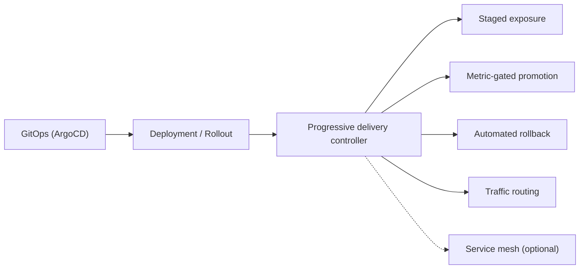
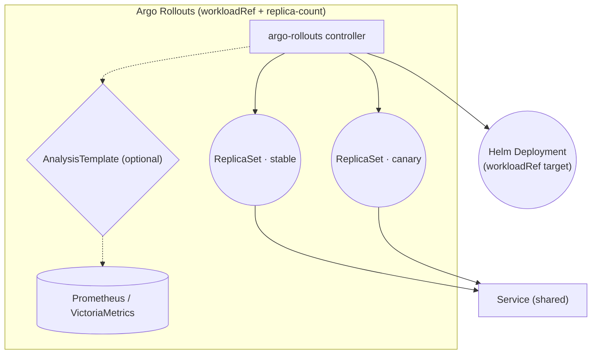
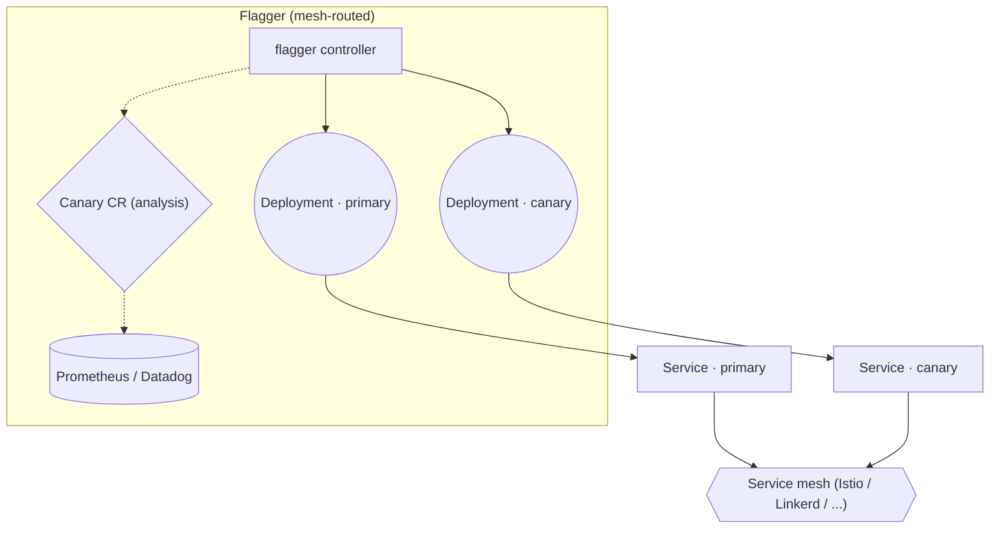
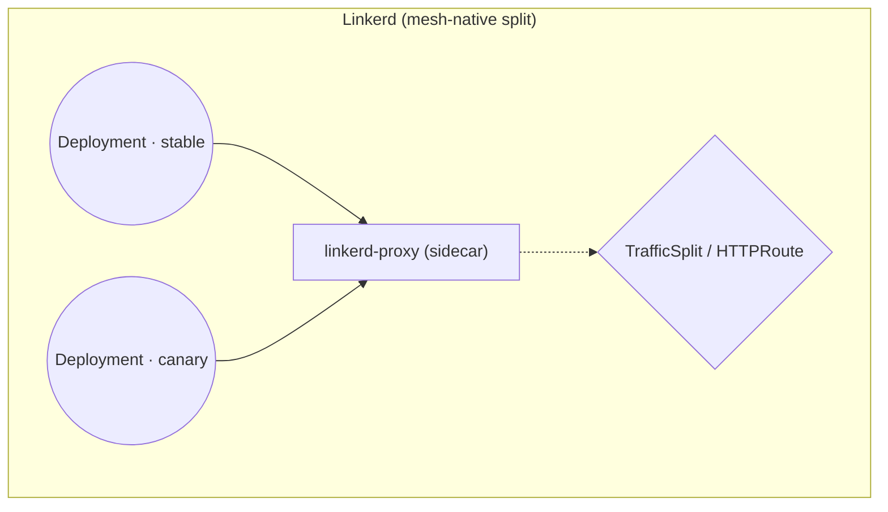
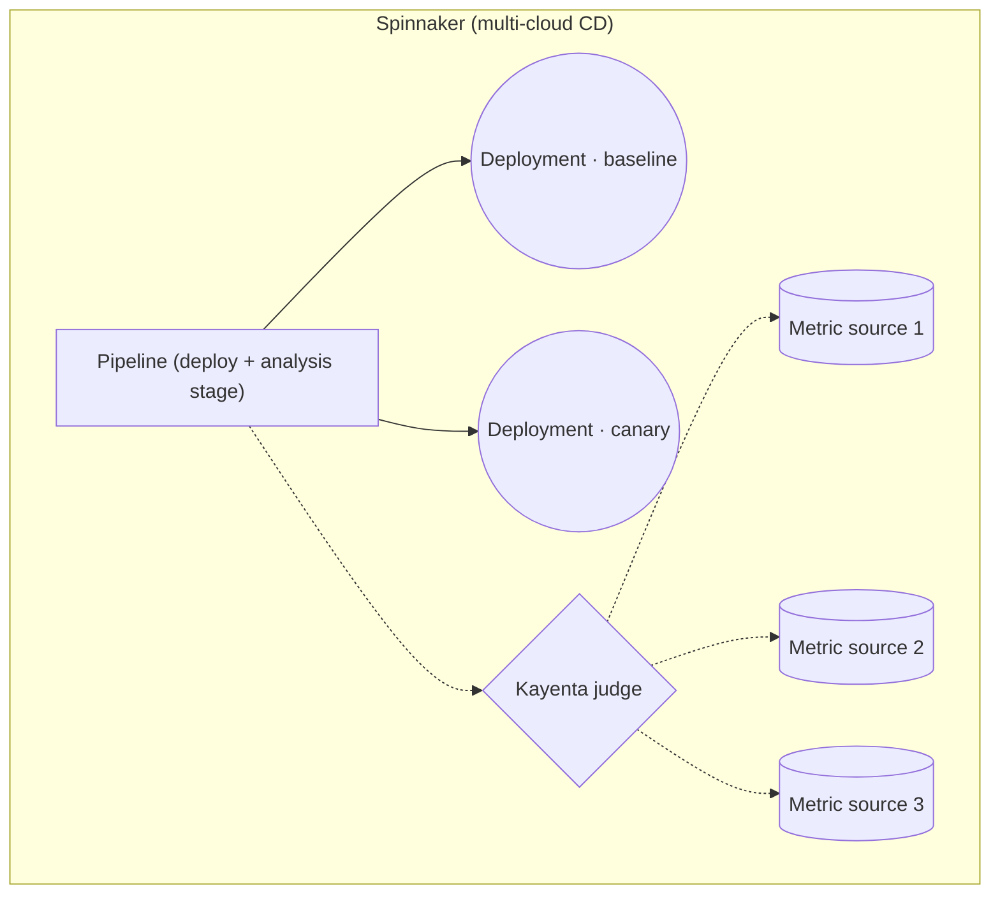
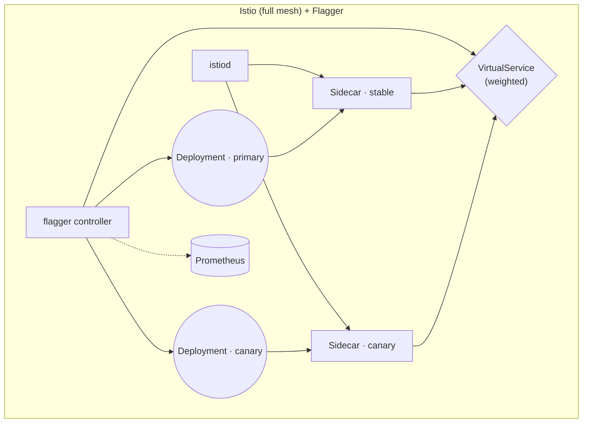
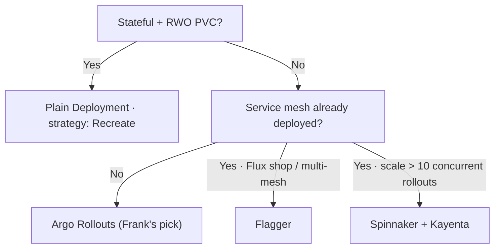

## TL;DR

Progressive delivery is a four-job problem — staged exposure, metric-gated
promotion, automated rollback, traffic routing — and the six contenders in
2026 (Argo Rollouts, Flagger, Linkerd's built-in traffic split,
Spinnaker+Kayenta, Istio+Flagger, and the null-hypothesis vanilla Deployment)
each treat one or two of those jobs as primary and demand a tax from the
operator for the rest.

Frank runs Argo Rollouts. Replica-count canary on the LiteLLM gateway, five
replicas, 20→50→100 `setWeight` with manual pauses at each step. The scars
came in the seams: a traffic-router plugin URL that 404'd for 21 days, a
`workloadRef.scaleDown: never` default that doubled traffic to the canary
without anyone noticing, an AnalysisTemplate pointed at a Prometheus metric
that doesn't exist on the OSS image.

Frank's answer does not generalize. Stateful + RWO PVC workloads → plain
`Recreate` Deployment. Already on a service mesh → Flagger. Scale beyond
a human pause-button → Spinnaker + Kayenta.

## §1 — The capability

A change is ready to ship. The new image builds, the unit tests pass, the
ArgoCD Application is Synced. The question now is not *whether* the change
goes out — it does — but *how*. Flip every pod over at once and hope the
canary you ran in staging covered the real production traffic shape? Roll
the change out in stages and watch dashboards by hand for half an hour?
Wire a controller that does the staging *and* watches the dashboards *and*
rolls back automatically when the error rate climbs?

That is the capability under examination. Not "deployment" in the abstract
— Kubernetes already has the Deployment abstraction, and `kubectl rollout
restart` already exists. The capability is *what happens between the new
image being pulled and a hundred percent of traffic being on it*: who
orchestrates the staged exposure, who decides whether to proceed at each
stage, and what tax do they charge for that orchestration?

The four jobs progressive delivery does — staged exposure, metric gating,
automated rollback, traffic routing — are not all the same job. Some
vendors treat one as primary and let the others fall out of the design;
others assume a service mesh is in place and build everything on top of
its routing primitives. The vendor space *splits* on which job is primary
and which dependency is mandatory.

I run Argo Rollouts. That choice was not made on the merits in the
abstract; it was made on the merits of not having a service mesh deployed
and not wanting to add one solely to enable a canary. Other clusters have
other geometries — a Flux shop on Istio looks at the same landscape and
picks Flagger without hesitation. The point of this paper is to make the
trade legible, and then return to Frank's choice and the operational
scars that proved it was correct only on Frank's terms.

## §2 — The landscape

Six options dominate progressive delivery on Kubernetes in 2026, and they
split on two axes. The horizontal axis is *service-mesh dependency* —
does the option require a mesh (or an ingress controller with weighted
routing) on the left, or does it work with a plain Service on the right?
The vertical axis is *gating discipline* — manual pauses and dashboard
inspection on the bottom, automated multi-metric canary analysis on top.


        title Progressive delivery — 2026
        x-axis "Mesh required" --> "Mesh optional"
        y-axis "Manual gating" --> "Automated canary analysis"
        quadrant-1 "Mesh-optional · Automated"
        quadrant-2 "Mesh-required · Automated"
        quadrant-3 "Mesh-required · Manual"
        quadrant-4 "Mesh-optional · Manual"
        "Argo Rollouts": [0.75, 0.55]
        "Flagger": [0.20, 0.70]
        "Linkerd traffic split": [0.15, 0.20]
        "Spinnaker (Kayenta)": [0.65, 0.90]
        "Istio + Flagger": [0.10, 0.75]
        "Vanilla Deployment + manual": [0.95, 0.10]




The matrix grades the options on canary, blueGreen, per-request traffic
split, metric-gated promotion, mesh dependency, multi-mesh support,
replica-count fallback, and licensing. The mesh-required column is the
one that does the most work; it is also the one most vendor docs mention
only after you have read the install guide.

**Argo Rollouts** optimises for working without a mesh. The Rollout CR
replaces the Deployment (or wraps it via `workloadRef`); staged exposure
runs on replica count by default, with optional traffic-router plugins
for SMI, NGINX, ALB, Istio, and — in theory — Cilium. The trade is that
per-request traffic split is a second-class feature without a router
plugin: at five replicas, `setWeight: 20` means *one canary pod, four
stable*, not *20% of every individual request*. For most homelab and
small-team contexts that is fine. For a workload that needs precise
sticky-session routing or pixel-perfect percentage splits, it is not.

**Flagger** is the inverse trade. It assumes a traffic router (mesh or
ingress) is already running and builds canary, blueGreen, and A/B
testing on top of *its* routing primitives. The vendor docs are explicit
about the requirement:


Flagger requires a service mesh or an ingress controller for traffic
routing.


The benefit is *real* per-request traffic split and the ability to drive
multiple meshes from one controller. The cost is the mesh tax: you do
not get Flagger without first having Istio or Linkerd or App Mesh or
Contour or Gloo or NGINX in your cluster.

**Linkerd's built-in traffic split** is the mesh-native answer. Linkerd
ships SMI/HTTPRoute traffic-split primitives that any controller can
drive; "canary" becomes a CRD that points at two Services and a weight,
and the mesh does the rest. There is no controller, no metric gating —
those are bring-your-own. The architecture is the cleanest in the
landscape and the integration surface is the largest. If you already
run Linkerd, the question is whether you want to keep the controller
out-of-mesh too or compose with Flagger.

**Spinnaker with Kayenta** is the heritage answer. Predates the
Kubernetes controllers by years; Netflix and Google built it for
deployments at a scale where the human pause-button stopped scaling.
Kayenta is the automated-canary-analysis engine — multi-metric,
multi-interval, statistical-confidence-scored.


Kayenta is a platform for Automated Canary Analysis (ACA). It reads in
user-configured metric data and runs statistical tests to determine
whether a canary deployment differs significantly from its baseline.


The trade is Spinnaker itself — a much heavier control plane than
anything else on this list. You install Spinnaker before you install
Kayenta. For a homelab, that is the wrong shape. For Netflix, it is
the right shape.

**Istio + Flagger** is a category by itself: the *service-mesh-tax case
study*. It is the same Flagger from earlier, sitting on the heaviest
mesh in common use. The benefits are real — full per-request routing,
fault injection, retry budgets — and the cost is exactly proportional
to those benefits. The mesh control plane runs. The sidecars run on
every pod. Every request adds the sidecar's P50 and P99 latency budget.
The diagram below for §3 will show the layering; the §4 scale section
will quantify it.

**Vanilla Deployment + manual promotion** is the null hypothesis. It
provisions a Deployment, you run `kubectl rollout restart`, you watch
Grafana, you decide whether to keep going. There is no controller, no
metric gate, no traffic split. Its purpose in this paper is to mark the
lower bound: if your cluster is stateful-workload-heavy or your team
fits in one room, *this is the right answer*, and the rest of the
matrix is solving a problem you do not have yet.

## §3 — How each option handles the hard part

The hard part of progressive delivery is *deciding during the rollout
whether to proceed or roll back*, without a human in the loop, and
without confusing replica-count progress for traffic-routing progress.
Every vendor on this list has an answer; the answers diverge enough
that they need separate diagrams. The diagrams below use a shared visual
language — squares for controller components, rounded rectangles for
ReplicaSets and Deployments, diamonds for decision points and analysis,
cylinders for metric sources, dashed edges for analysis and metric
paths, solid edges for pod lifecycle and traffic.

### Argo Rollouts

The Rollout CR either replaces a Deployment outright or references one
via `workloadRef`. With `workloadRef`, the chart's existing Deployment
remains the source of pod template; the controller manages two
ReplicaSets (stable and canary) that share the chart's Service.
`setWeight: 20` at five replicas means one canary pod and four stable
pods; kube-proxy and Cilium distribute requests across the union
proportional to pod count.

Promotion is gated on either manual pauses or an `AnalysisTemplate` —
typically a Prometheus query expressed as a `successCondition` and a
`failureCondition`. When the analysis fails, the controller scales the
canary ReplicaSet to zero and the stable ReplicaSet absorbs traffic.
Time-to-rollback is dominated by the analysis interval (typically one
to five minutes) plus pod-eviction time.

The failure mode is replica-count granularity. A workload that needs
per-request sticky-session routing has to add a traffic-router plugin;
the plugin URL had better be correct.

### Flagger

The Canary CR wraps the user's existing Deployment; Flagger creates a
duplicate Deployment for the canary and two Services (primary and
canary). Traffic split happens *at the mesh layer* — Istio
`VirtualService`, Linkerd `HTTPRoute`, App Mesh `VirtualRouter`, and
so on. The controller drives the weight via the mesh's traffic-routing
CRDs; the mesh enforces the split at the request level.

Promotion is metric-gated by default; Flagger expects to be running
analyses at each step and aborts if the success rate drops below
threshold. Time-to-rollback is dominated by the mesh's traffic-shift
propagation, typically sub-second.

The failure mode is the mesh dependency. No mesh, no Flagger.

### Linkerd built-in traffic split

Linkerd ships SMI `TrafficSplit` and (more recently) Gateway API
`HTTPRoute` resources that any controller can manipulate. The mesh's
sidecar proxies enforce the weight at the request level. There is no
canary controller in this picture — the operator writes the
TrafficSplit manifest by hand, or drives it from Flagger.

The interesting property is that the analysis and the controller are
*decoupled* from the routing. You can replace either side independently.
The failure mode is that without an external controller, gating becomes
"a human edits the TrafficSplit weight" — back to the §2 manual-gating
quadrant.

### Spinnaker + Kayenta

Spinnaker pipelines wrap deploy + analysis stages; Kayenta ingests
metrics from multiple sources (Prometheus, Stackdriver, Datadog, Atlas)
and emits a single statistical-confidence score. The pipeline's next
stage runs only if the score crosses the configured threshold. This is
the most sophisticated answer in the landscape and the heaviest control
plane.

Failure recovery is pipeline-driven — the pipeline aborts and the
canary is scaled down. Time-to-rollback is dominated by the pipeline's
polling cadence (configurable, typically tens of seconds).

The architecture is genuinely better than Argo Rollouts' single-metric
gating, *per managed deployment*, and the price is admission: a
Spinnaker installation, a Halyard config, a multi-page YAML pipeline,
and enough fluency in Kayenta's statistical model to set the
confidence thresholds without flying blind.

### Istio + Flagger

The diagram is unflattering on purpose. Istio's control plane runs; a
sidecar runs on every pod; Flagger sits on top driving Istio's
`VirtualService` weight. Per-request routing is exact; observability is
deep; the operational tax is everything Istio's docs warn about plus
Flagger's docs. The mesh tax shows up most clearly in the §4 numbers.

## §4 — What scale changes

Three scale axes flip vendor rankings. The first two are quantitative;
the third is operational.

**Service count.** A five-service cluster can run Argo Rollouts with
manual pauses and stay sane — one human can watch two or three rollouts
concurrently if the dashboards are good. A fifty-service cluster cannot.
The crossover is not a number; it is "how many concurrent rollouts can
one human watch?" Once the answer is *not enough*, Kayenta-style
automated multi-metric analysis stops being optional. The CNCF
practitioner comparison frames the migration crisply:


Argo Rollouts requires migrating Deployment resources to Rollout CRDs,
which is a larger migration effort but provides more explicit control
via the step-based strategy definition.


The step-based-with-pauses model is exactly right for a small number of
critical services. For dozens of services rolling continuously, the
"explicit control" property becomes "explicit human bottleneck", and
the calculus inverts.

**Mesh overhead per request.** Istio sidecars add roughly 1–2 ms P50
and 5–10 ms P99 to every request, depending on the mesh version,
sidecar configuration, and whether mTLS is enforced. At 10 RPS that is
free. At 10,000 RPS it is a SLO budget you spent on canary gating.
Linkerd's proxies are lighter and typically add sub-millisecond P50,
but the same shape of trade applies: per-request routing is not free,
and the tax is paid on every request whether you are in the middle of a
canary or not.

**Metric provider lag and the empty-vector trap.** AnalysisTemplate
intervals fight with Prometheus scrape intervals. At a 1-minute scrape
+ 1-minute analysis interval, the first analysis sees roughly thirty
seconds of canary traffic; below that scale, the analysis is noise. And
when the metric you queried *does not exist at all*, Argo Rollouts'
Prometheus provider returns an empty result vector — which causes the
metric to enter `phase: Error`, which retries at a 10-second cadence,
which hits the consecutive-error limit (default four) and aborts the
rollout in roughly fifty seconds. Frank discovered this the hard way;
see §5.

## §5 — Frank's choice, and what happened

I run Argo Rollouts. The case study is the LiteLLM gateway — five
replicas, 20→50→100 `setWeight` with manual pauses at each step. The
chart's Deployment is kept as the `workloadRef` target with
`scaleDown: onsuccess`; no traffic-router plugin; ArgoCD
`ignoreDifferences` on `apps/Deployment/spec.replicas` so it does not
fight the controller's scale-down.

I did not pick Argo Rollouts over Flagger on the merits in the abstract.
I picked it because there is no service mesh on Frank — Cilium provides
the L2 LB and L7 stats, but no mesh sidecar — and adding a mesh solely
to enable Flagger would have meant paying the §4 mesh tax forever in
exchange for canary on one workload. That trade was not worth it.

The honesty of that choice is what makes the resulting scars worth
writing down. A different vendor would have produced different scars;
a managed CD platform would have hidden them all.


The Argo Rollouts extras ConfigMap referenced a Cilium traffic-router
plugin loaded from a release URL. The release artefact had never been
published — the URL had always returned 404. The controller could not
load the plugin and crash-looped on startup. The Rollout sat stuck at
Step 0/6 for twenty-one days; the Helm-managed Deployment quietly
served all traffic on its own; `kubectl get rollout` reported a steady
workloadRef state. The only signal was the controller pod's log. We
discovered it when we tried to use the canary for the first time and
nothing happened. *A controller that cannot load its plugins fails
silently from the perspective of the canary workload.* Recovery was
to remove the plugin reference entirely; replica-count canary still
works without it, which is what Frank does now.



`workloadRef.scaleDown` defaults to `never`. We did not set it. The
Rollout's canary ReplicaSet ran *and the chart's underlying Deployment
also ran*, with both selecting through the same Service. Traffic was
double what the canary's setWeight should have produced; the load
graphs were wrong but the application's error rate was fine, so
nothing alerted. The discovery was a manual review of pod counts —
"why are there nine pods for a five-replica rollout?" The fix was to
add `workloadRef.scaleDown: onsuccess` so the controller scales the
underlying Deployment to zero on promotion. The lesson:
*controller defaults can be polite-but-wrong, and polite-but-wrong is
the worst class of bug because nothing breaks loudly.*



We pointed an `AnalysisTemplate` at `litellm_request_total`. That
metric is part of LiteLLM's Enterprise (paid) Prometheus integration;
the OSS image we run emits nothing. The query returned an empty result
vector. Argo Rollouts' Prometheus provider treated that as
`phase: Error`, retried at the default ten-second cadence, hit the
four-error consecutive limit, and aborted the canary — every single
time, in roughly fifty seconds. The "flaky deploy" was a working alarm
pointed at silence. *AnalysisTemplate failure modes are not symmetric:
"metric exists and tells us nothing went wrong" and "metric does not
exist" should be the same outcome, and they are not.* Fix: bring up a
real signal source — Cilium Hubble L7 stats, a JSON-log-to-Prometheus
sidecar, or the AnalysisTemplate `web` provider hitting
`/health/readiness` — and treat the metric's *existence* as part of
the pre-flight check, not the runtime check.


The three scars share a shape. None of them are bugs in Argo Rollouts.
All of them are emergent properties of running a progressive-delivery
controller that the cluster's other declarative machinery does not
entirely understand. The interfaces between the controller, the chart's
Deployment, the Prometheus scrape, and the upstream metric vendor are
where the failures live — exactly where the marketing material does
not look.

Visible evidence:

A managed progressive-delivery product would have hidden every one of
these failure modes behind its abstraction, which is the right trade
for a production team and the *wrong* trade for a learning platform.
Frank exists to encounter the workloadRef.scaleDown trap so that the
next operator on this stack does not have to.

## §6 — When Frank's answer doesn't generalize

Frank's answer — Argo Rollouts on LiteLLM with replica-count canary —
is one leaf of a four-leaf tree. The other three are real.

The first branch is whether the workload survives a canary at all.
Stateful workloads with `ReadWriteOnce` PVCs cannot have two
ReplicaSets running simultaneously without volume contention — the new
ReplicaSet cannot mount the volume while the old one still holds it
(see Paper 04 for the full RWO + RollingUpdate deadlock). For these,
progressive delivery is a non-goal; the right answer is a plain
Deployment with `strategy: Recreate` and a maintenance window.

For workloads that do survive concurrent ReplicaSets, the second branch
is service-mesh dependency. Already on Istio or Linkerd? Flagger
becomes the obvious choice — you have already paid the mesh tax, the
incremental cost of canary is approximately zero, and per-request
routing is yours for the asking. Not on a mesh, and not eager to
deploy one? Argo Rollouts gives you replica-count canary today without
forcing the mesh decision.

The fourth leaf is the scale override. Once concurrent rollouts exceed
what a human can pause-button through, Kayenta-shaped automated canary
analysis stops being optional. Spinnaker is the heaviest control plane
in the list, and at the scale where Kayenta is necessary, that weight
is amortised.

This is the section where the paper has to be honest about its audience.
If you are reading this from a fifty-service production cluster, the
right answer for you is almost never Frank's answer. The right answer
is one of the other three leaves. Frank's answer is correct *for Frank*
and is documented here so that anyone considering the same trade
understands the rest of the leaves before picking it.

## §7 — Roadmap & where this space is going

Three trends are worth naming. None are settled; all affect the next
few years of progressive delivery on Kubernetes.

**Gateway API and HTTPRoute are eating SMI.** Per-route traffic split
is moving from mesh-specific CRDs into the upstream Gateway API. Argo
Rollouts and Flagger both track this; Linkerd already supports
HTTPRoute-based splits natively. In eighteen months the "which mesh
do you speak" question may be substantially answered by "which
Gateway API implementation do you have", which collapses one of the
landscape's axes. Vendors that have invested heavily in mesh-specific
CRDs (Istio's `VirtualService`, App Mesh's `VirtualRouter`) are
likely to feel the squeeze.

**AnalysisTemplate is becoming Kayenta-shaped.** The community has
converged on the multi-metric, multi-interval, statistical-confidence
model Kayenta pioneered. Argo Rollouts' `inconclusiveLimit` field and
its growing list of metric providers (Prometheus, Datadog, NewRelic,
Wavefront, CloudWatch, Graphite, InfluxDB, Kayenta itself) are
incremental steps toward what Spinnaker has offered for years. The
gap between "single-metric `result[0] < 0.05`" and "multi-metric
weighted statistical judgment" is the most active design space in
the controllers.

**Service-mesh tax is being unbundled.** Cilium's L7 stats and
Hubble are absorbing the observability slice of "why you needed Istio
in the first place" without the sidecar overhead. eBPF-native
traffic-routing primitives are appearing on the Cilium roadmap. The
mesh-required vendors in the landscape are the ones most likely to
feel pressure from this unbundling — if Cilium can drive a canary
without sidecars, the §4 mesh-tax row becomes a Cilium-tax row, and
the Cilium tax is much smaller.

The space is not done evolving. Frank will revisit this paper when
the answers change.

