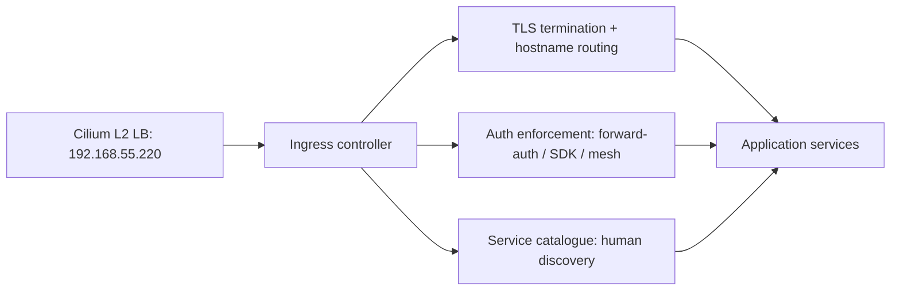
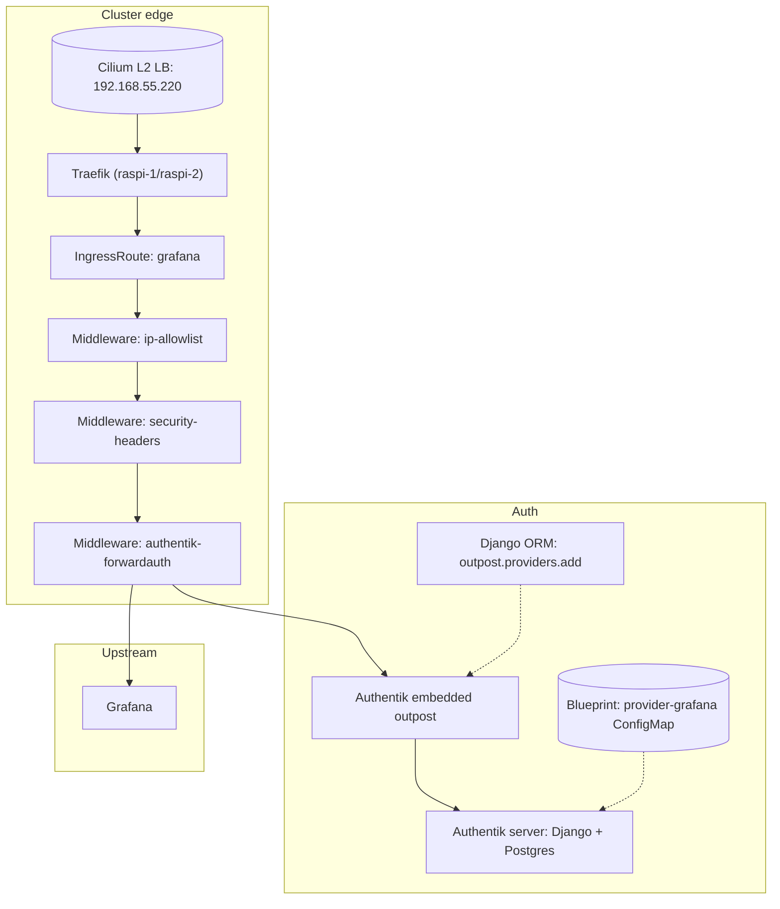
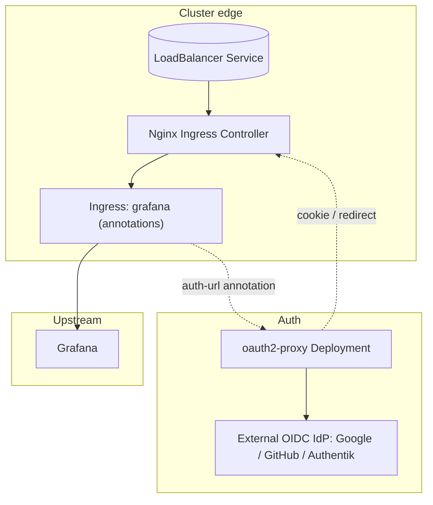
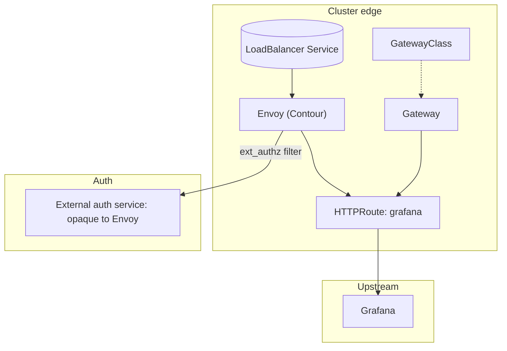
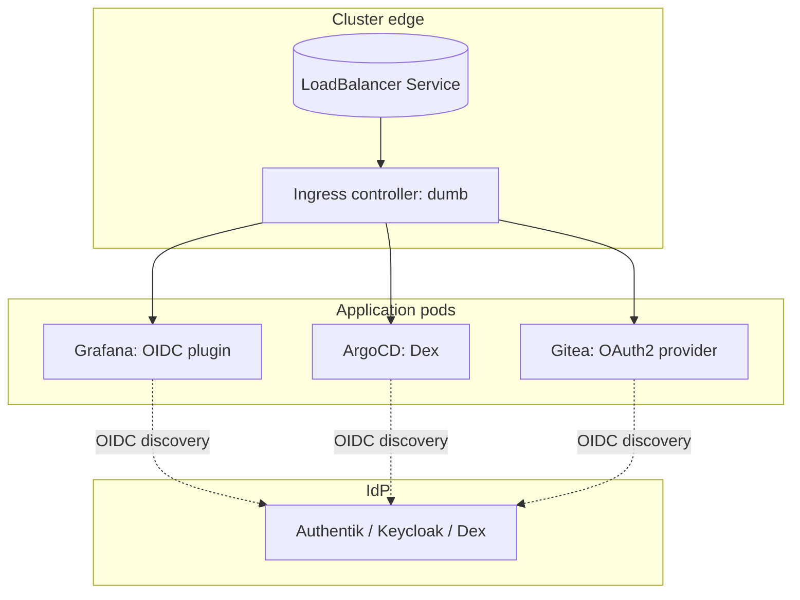
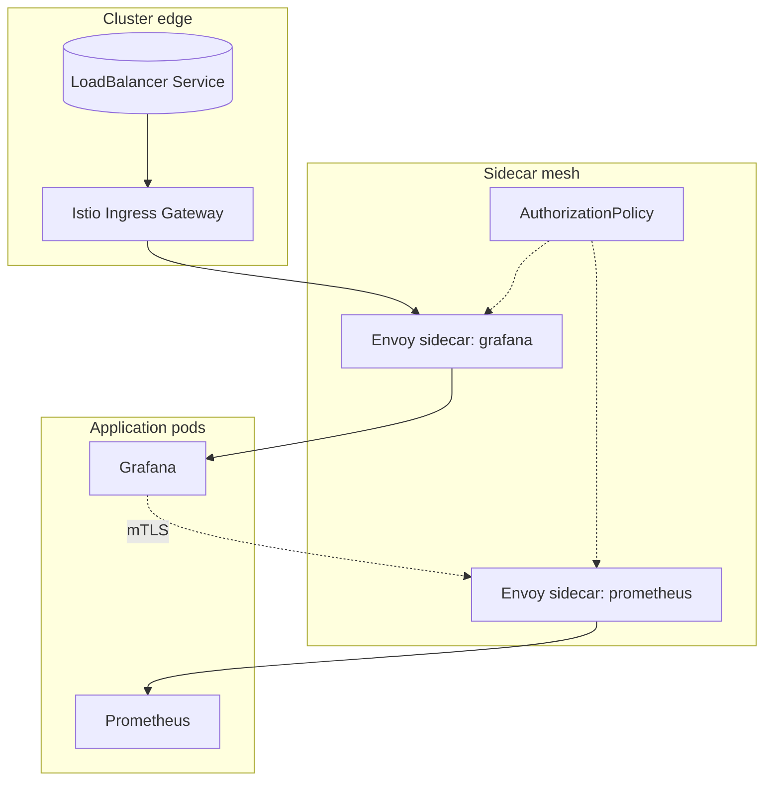
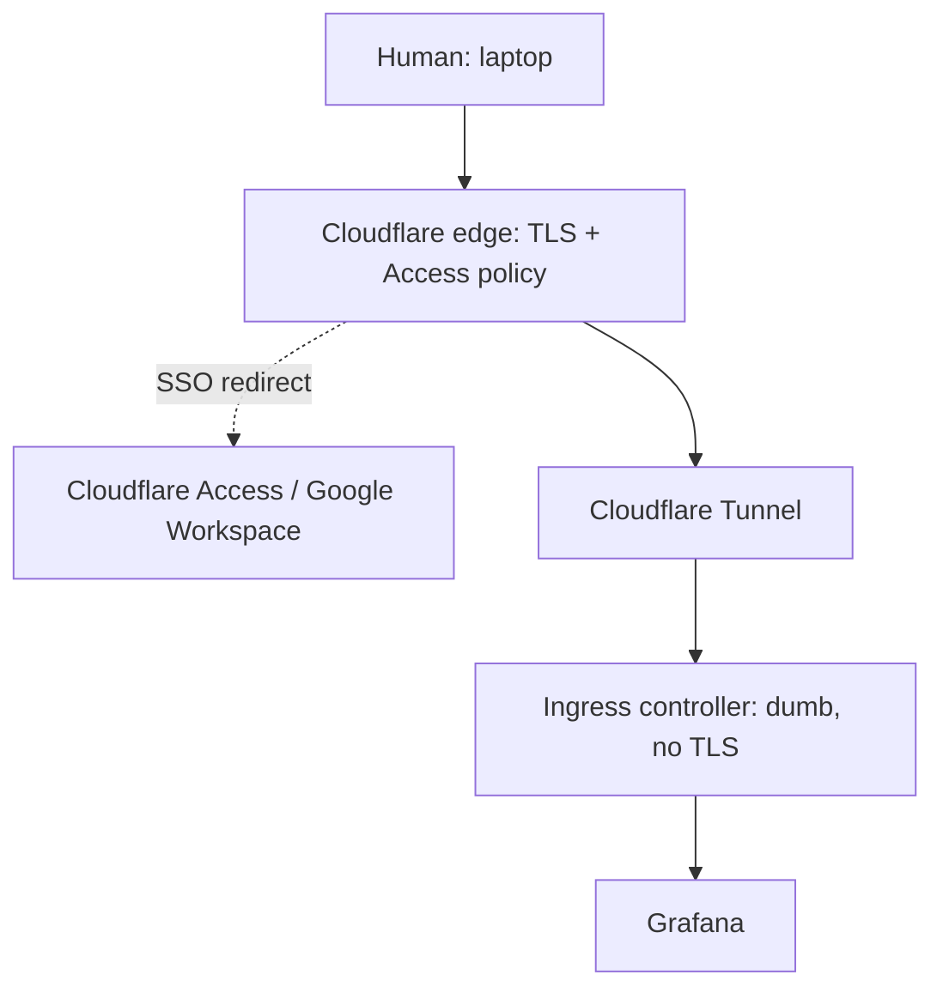
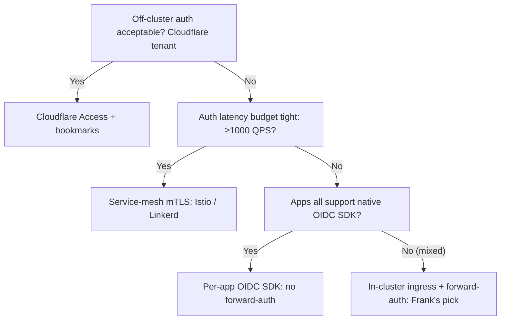

## TL;DR

*Write last.*

## §1 — The capability

Services are running inside the cluster. Traefik picks up an IngressRoute,
the pods are healthy, the LoadBalancer has an IP. None of that answers the
actual question a human at a laptop is asking: *can I open `grafana.cluster.derio.net`,
sign in with my SSO, and look at a dashboard — without the operator wiring
OIDC into every workload by hand?*

That is the capability under examination, and "ingress" is doing three
jobs at once to deliver it. Hostname routing and TLS termination — every
request to `*.cluster.derio.net` lands at one IP and the controller picks
the right upstream. Authentication enforcement — before the request reaches
Grafana, *something* has to decide whether the cookie is valid, redirect to
the IdP if not, and propagate the resolved identity to the upstream.
Service discovery for humans — somebody at a laptop with twenty bookmarks
in their head needs a single doorway that says "here is what runs on this
cluster and whether it is up". Three jobs, three slots in the stack, and
the vendor space splits on which of those jobs each option treats as
primary.



Three axes are not a feature, they are the work. Choosing Traefik commits
you to a specific forward-auth wiring; choosing per-app OIDC frees you
from forward-auth and multiplies callback-URL maintenance by the number
of apps; choosing a service mesh moves auth into sidecars and gives up
edge visibility for east-west enforcement. The Paper is structured around
this fan-out: §2 names the contenders, §3 lays out their architectures
side-by-side, §5 is the cluster's own answer and the seams that surfaced
in production.

## §2 — The landscape

Six options live in the vendor space, plotted on two axes that matter:
where does authentication happen (per-app OIDC SDK at one end, edge
forward-auth at the other), and whether a service catalogue is included
or bolted on as a separate layer.


    quadrantChart
        title Ingress + auth + catalogue — 2026
        x-axis "Per-app OIDC" --> "Edge forward-auth"
        y-axis "Catalogue included" --> "Catalogue separate"
        quadrant-1 "Edge auth · separate catalogue"
        quadrant-2 "Edge auth · included catalogue"
        quadrant-3 "Per-app auth · included catalogue"
        quadrant-4 "Per-app auth · separate catalogue"
        Traefik + Authentik + Homepage: [0.85, 0.85]
        Nginx Ingress + oauth2-proxy: [0.75, 0.90]
        Envoy / Contour (Gateway API): [0.65, 0.95]
        Per-app OIDC SDK only: [0.15, 0.95]
        Service mesh mTLS (Istio): [0.50, 0.95]
        Cloudflare Access: [0.95, 0.20]




**Traefik + Authentik forward-auth.** K8s-native CRDs (`IngressRoute`,
`Middleware`, `TraefikService`) and a `forwardAuth` middleware that turns
SSO into a one-line chain on every route that wants it. Built-in ACME
solves Let's Encrypt over Cloudflare DNS-01. The cost is the second
component: every SSO-gated request takes a round-trip to the Authentik
embedded outpost before reaching the upstream.

**Nginx Ingress + oauth2-proxy.** The reference ingress for Kubernetes —
annotation-driven on a stock `Ingress` resource, no CRD weight. Forward-auth
arrives via two `nginx.ingress.kubernetes.io/auth-url` and `auth-signin`
annotations pointing at an oauth2-proxy sidecar (or central deployment).
[The oauth2-proxy docs describe it as](https://oauth2-proxy.github.io/oauth2-proxy/)
*"a reverse proxy and static file server that provides authentication
using Providers (Google, GitHub, and others) to validate accounts by
email, domain or group"* — bring-your-own IdP, the most common
forward-auth stack outside Authentik shops.

**Envoy / Contour (Gateway API path).** Contour is *"an Ingress
controller for Kubernetes that works by deploying the Envoy proxy as a
reverse proxy and load balancer"* — Gateway-API-first, splits the
`GatewayClass` / `Gateway` / `HTTPRoute` role boundaries that the Ingress
resource collapsed into one. Auth is delegated to Envoy's `ext_authz`
filter rather than a middleware chain, which means the auth backend looks
to Envoy like another upstream service rather than a per-route
configuration.

**Per-app OIDC SDK only.** No ingress-layer auth at all — every
application speaks OIDC natively (Grafana, Gitea, ArgoCD, Authentik
itself). The ingress controller is dumb again, just hostname routing
and TLS. The tax is per-app: a callback URL, a client-secret rotation,
an OIDC provider config block, all duplicated across every workload that
wants SSO.

**Service mesh mTLS (Istio / Linkerd).** Auth moves into sidecars.
Every pod-to-pod request is mTLS + `AuthorizationPolicy`. East-west
enforcement is the win; the cost is that every workload now ships with
a sidecar, the mesh control plane is a new operational dependency, and
the ingress becomes a thin shim that hands off into the mesh.

**Cloudflare Access (off-cluster).** Everything moves outside the
cluster: Cloudflare terminates TLS, Cloudflare Access enforces SSO,
Cloudflare Tunnel provides the upstream connectivity. The cluster never
sees an HTTPS listener. The catalogue collapses into team bookmarks
because Cloudflare's Access app list is the catalogue. The cost is being
a Cloudflare tenant — pricing, rate limits, and one vendor's view of
identity.

The catalogue axis flattens out at the right side: anyone running
in-cluster ingress reaches for a static-config catalogue (Homepage,
Dashy, Heimdall) because the alternative is twenty bookmarks per laptop.
Cloudflare Access is the only option that legitimately collapses the
catalogue back into the IdP, because its app list is already a
hostname-to-policy map.

## §3 — How each option handles the hard part

The hard part is the auth handoff between the ingress and the upstream
service. Every option has a different answer; the diagrams below use
shared visual language so they can be compared side-by-side. Squares are
controllers, proxies, and servers. Rounded shapes are Kubernetes
resources (`IngressRoute`, `Middleware`, `ConfigMap`). Diamonds are
decision points. Cylinders are persistent state. Dashed edges are
control-plane or manual paths; solid edges are data-plane, per-request
paths.

### Traefik + Authentik forward-auth + Homepage (Frank's pick)



Every request to `grafana.cluster.derio.net` lands at the Cilium L2 IP,
hits Traefik on raspi-1 or raspi-2, matches the `grafana` IngressRoute,
traverses the middleware chain in order, and — at the
`authentik-forwardauth` step — is held while Traefik makes a sub-request
to the embedded outpost. The outpost validates the cookie (or redirects
to the Authentik login flow if missing/expired), returns 200 with a
batch of `X-authentik-*` headers, and Traefik forwards the original
request plus those headers to Grafana. Failure mode: if the outpost
returns 500, every SSO-gated service in the cluster goes dark
simultaneously — which is exactly the blast radius the Cilium LB
sharing-key gotcha (§5) used to surface, because the outpost Service
was sharing an IP with another component that took it pending.

### Nginx Ingress + oauth2-proxy



Same data-plane shape — the auth backend is one sub-request away from the
ingress — but the configuration surface is annotations on the standard
`Ingress` resource rather than a CRD middleware chain. The blast-radius
profile is the same: oauth2-proxy down means every annotated Ingress goes
401. The operator cost is the duplication: every `Ingress` needs the same
two annotations, and there is no equivalent of "define one
Middleware CR, reference it from twenty IngressRoutes".

### Envoy / Contour (Gateway API) with ext_authz



The Gateway API split is what changes. `GatewayClass` is owned by the
cluster infra team (one per controller), `Gateway` by the cluster
operator (one per listener), `HTTPRoute` by application teams (many per
service). That makes the blast radius of an `HTTPRoute` typo small — it
breaks one route — while a `Gateway` misconfig still breaks everything
on a listener. `ext_authz` looks identical to forward-auth from the
caller's perspective; the difference is the configuration lives in the
Envoy bootstrap rather than a per-route annotation, so adding a new
SSO-gated route is "add an HTTPRoute" rather than "add an HTTPRoute and
remember the auth annotations".

### Per-app OIDC SDK (no forward-auth)



Auth is in the upstream. The ingress hands the request through unchanged,
the upstream redirects to the IdP if needed, the IdP redirects back with
a code. No forward-auth round-trip — every authenticated request is a
single hop through the ingress. The cost moves into operations: a
callback URL per app, a client secret per app, an OIDC provider config
block per app, and every secret rotation is N rotations rather than one.
Failure mode: a malformed callback URL on one app breaks only that app —
small blast radius, but N times the configuration weight.

### Service mesh mTLS + AuthorizationPolicy



Auth lives in every sidecar. North-south arrives at the ingress gateway,
which is now a thin Envoy that hands off to per-pod sidecars; east-west
between pods is mTLS by default with `AuthorizationPolicy` enforced at
each sidecar. The win is east-west: a compromised pod cannot speak to
Prometheus without a valid mesh identity. The cost is everywhere: a
sidecar per pod, a mesh control plane (istiod / linkerd2-control), and
the auth decision happens inside the sidecar's request path on every
hop. Forward-auth as a category gets absorbed — there is no ingress-layer
middleware to chain, because the chain happens in Envoy.

### Cloudflare Access (off-cluster)



The cluster is never reachable from the public internet. Cloudflare
terminates TLS, enforces SSO at the edge, and a tunnel daemon inside the
cluster surfaces upstream services. The ingress controller becomes
optional — many setups skip it entirely and let `cloudflared` map
hostnames to Service objects directly. The catalogue is the Access app
list. The cost is total dependence on Cloudflare's pricing, identity
model, and uptime.

## §4 — What scale changes

Three scale axes flip vendor rankings. None of them matter at homelab
scale; all of them matter past a few thousand users.

**Route count.** A cluster with ten IngressRoutes can run any option
without strain. At two hundred routes, the controller's CRD watcher
becomes a real cost — Traefik's `IngressRoute` reconcile loop has to
walk every change, and the operator surface starts to dominate. Nginx's
annotation-on-`Ingress` model spreads the configuration across N
Ingress objects (one per route), which means small blast radius per
typo but high cognitive load. Traefik's middleware chain centralizes
the auth config (one `Middleware` CR, twenty references) but trades it
for CRD churn. The Gateway API split (`GatewayClass` / `Gateway` /
`HTTPRoute`) is the only model designed for this — separate role
boundaries mean an application team can deploy an `HTTPRoute` without
touching the infrastructure-team `Gateway`.

**Auth QPS.** Forward-auth adds one round-trip per request to the auth
outpost. At 0.1–10 QPS per service (homelab), the overhead is invisible
— the outpost responds in milliseconds, the user notices nothing. At
1000+ QPS the round-trip becomes the bottleneck, and per-app SDK (cache
the OIDC session in the upstream) or mesh mTLS (cache the auth decision
in the sidecar) flip the ranking. No public benchmark measures
forward-auth latency at homelab QPS — vendor numbers all assume the
10k-QPS regime where steady-state throughput dominates over cold-cache
latency. The cost model that matters for a learning cluster is
"first-page-load latency after a 12-hour idle", and that lives in the
named-gap (see the dossier).

**Catalogue refresh cadence.** A ten-service catalogue can be hand-edited
in a ConfigMap. The [Homepage docs note](https://gethomepage.dev/configs/services/)
that *"Services are configured inside the `services.yaml` file. You can
have any number of groups, and any number of services per group"* — the
file is the source of truth. At fifty services the operator either
generates the ConfigMap from a script (Homepage's `siteMonitor` entries
are tedious to keep in sync) or moves to a label-driven discovery model
(Heimdall plugins, Hajimari). Past a hundred services, static catalogues
break operationally and the choice is between auto-discovery (every
Service with a label becomes a tile) or hosting the catalogue inside
the IdP (Authentik application launcher, Cloudflare Access app list).

## §5 — Frank's choice, and what happened

Frank picked Traefik in-cluster, Authentik embedded outpost as the
forward-auth backend, and Homepage as the human-visible catalogue. The
full chain: Cilium L2 announces `192.168.55.220` for Traefik, Traefik
terminates TLS via built-in ACME (Let's Encrypt over Cloudflare DNS-01)
for `*.cluster.derio.net`, every IngressRoute chains `ip-allowlist +
security-headers + (optional) authentik-forwardauth`, the forwardAuth
middleware hits the embedded outpost at
`http://authentik-server.authentik.svc.cluster.local:80/outpost.goauthentik.io/auth/traefik`,
and Homepage at `master.cluster.derio.net` is the human-visible doorway
to every service. The middleware itself is one CR shared across the
whole cluster:

```yaml
apiVersion: traefik.io/v1alpha1
kind: Middleware
metadata:
  name: authentik-forwardauth
  namespace: traefik-system
spec:
  forwardAuth:
    address: "http://authentik-server.authentik.svc.cluster.local:80/outpost.goauthentik.io/auth/traefik"
    trustForwardHeader: true
    authResponseHeaders:
      - X-authentik-username
      - X-authentik-groups
      - X-authentik-email
      - X-authentik-jwt
      # ... more X-authentik-* headers ...
```

Adding a new SSO-gated service is a one-line middleware reference on the
IngressRoute. The first scar arrived a week later.


We deployed the secure-agent-pod with TCP 22 (SSH) and UDP 60000-60015
(Mosh) on the same `192.168.55.215` LoadBalancer IP — both Services
carried the `lbipam.cilium.io/ips: 192.168.55.215` annotation. The UDP
Service ended up `<pending>` forever. Cilium's `lbipam.cilium.io/ips`
is NOT a sharing directive — it is a request. Two Services on one IP
need a matching `lbipam.cilium.io/sharing-key` on both. The only signal
was `kubectl get svc -A | grep pending`. The lesson: the L2 announcement
layer has its own multi-tenant model independent of what the ingress
controller wants, and when you split a single logical service across
multiple K8s Service objects, every annotation has to match.



We added a new forward-auth provider via an Authentik blueprint. The
blueprint applied cleanly. The provider appeared in the Authentik UI.
Then nothing — forward-auth for the new route returned 404 from the
embedded outpost. Authentik blueprints declaratively create proxy
providers and applications, but adding a provider to the embedded
outpost is NOT in the blueprint API. The required step is a Django-ORM
command: `outpost.providers.add(provider)`, run via `kubectl exec`
against the authentik-server pod, after every fresh deploy (or whenever
a new forward-auth service is added). It is the only out-of-band step
in an otherwise fully-declarative auth chain. We documented it in
`agents/rules/frank-argocd.md` and the runbook, but the seam itself is
the lesson: "declaratively create" and "actually serve" are different
verbs.



Forward-auth login flow appeared to work — Authentik login form
rendered, credentials accepted — then redirected to `0.0.0.0:9000`.
The embedded outpost self-discovers its callback URL from the request
context, and inside a K8s Service it gets it wrong by default. Fix:
set `AUTHENTIK_HOST` env var on both server and worker pods to the
external URL. Then, upgrading to Authentik 2026.x, every blueprint
failed validation silently because the API now requires
`invalidation_flow`, `redirect_uris` as a list of objects (not strings),
and a `signing_key` UUID — none documented in upgrade notes. Two scars,
one lesson: the outpost's view of "what URL am I" and the API's view
of "what shape is a proxy provider" both drift, silently, between
versions.


Three scars, three different layers of the stack. The L2 announcement
layer (Cilium) doesn't know what the ingress controller wants. The auth
controller (Authentik blueprints) doesn't know what the auth dataplane
(the embedded outpost) actually consumes. The auth dataplane doesn't
know what URL it lives at unless the operator tells it. All three are
fixable; all three were silent failure modes by default. None of them
would have surfaced behind Cloudflare Access — which is the §6 hinge.

## §6 — When Frank's answer doesn't generalize

The decision turns on three questions stacked: can you live as a
Cloudflare tenant, do you have enough auth QPS for forward-auth's
round-trip to matter, and do all your apps support native OIDC.



> Threshold "≥1000 QPS" is illustrative; see the dossier's Named Gap on
> the absence of apples-to-apples forward-auth latency benchmarks at
> homelab QPS.

Frank lands on L4 because the apps are mixed (Grafana, ArgoCD, Gitea
speak OIDC natively; Longhorn, Hubble, Zot, Homepage don't), the QPS
is low (one human per service, two-digit requests per minute), and the
operator wants in-cluster everything so the failure modes surface in
the homelab. A team with all-OIDC-native apps should land on L3 — skip
the forward-auth tax entirely. A team with east-west enforcement
requirements and 1000+ QPS should land on L2 — pay the sidecar cost
to get cached auth decisions. A team running a single product behind
Cloudflare's free tier should land on L1 and not look back.

The counter-argument in the dossier — "for a single-team SaaS behind
Cloudflare Access, you don't need any of this" — is correct *for that
team*. Frank exists to encounter the seams; a production cluster
optimizing for uptime should rationally fall back to Cloudflare Access
and keep a thin in-cluster ingress for east-west. The four leaves are
all real answers; the right one depends on what the cluster is *for*.

## §7 — Roadmap & where this space is going

Three trends worth naming.

**Gateway API is replacing Ingress.** The
[Kubernetes Ingress Controllers page](https://kubernetes.io/docs/concepts/services-networking/ingress-controllers/)
now reads, verbatim: *"The Kubernetes project recommends using Gateway
instead of Ingress. The Ingress API has been frozen."* Traefik supports
Gateway API as of v3.0; Contour and Envoy Gateway are Gateway-API-first.
Expect the next three years to see the split-CRD model (separate
`GatewayClass` + `HTTPRoute`) replace per-controller CRDs like Traefik's
`IngressRoute`. Migration is gradual — Traefik's `IngressRoute` and
Gateway API `HTTPRoute` coexist in the same controller — but new
deployments after 2027 will increasingly default to Gateway API.

**Forward-auth is being absorbed into service meshes.** Istio's
`ext_authz` filter and Linkerd's policy CRDs are converging on "auth
in the sidecar, not at the ingress". This pushes the cost from the
edge into every pod (mTLS handshake per request) but removes the
cold-cache latency penalty of forward-auth. Expect forward-auth to
live on as the "ingress-only deployment" choice — the homelab default,
the small-team default — with mesh-based auth becoming the default for
anything multi-tenant or east-west-heavy. The vendor that bridges
both well (Pomerium, Authentik's mesh-aware modes) wins the mid-size
operator.

**Service catalogues are getting label-driven.** Static ConfigMap
dashboards (Homepage, Dashy) are great for under fifty services;
beyond that, label-driven discovery (Heimdall plugins, Hajimari,
Kubernetes-Discovery-driven Homepage extensions) wins on operator
overhead. Expect Homepage to add a first-class
`kubernetes.io/discovery` source mode, or to be displaced by a
label-driven competitor. The endgame is "any Service object with a
label gets a tile" — and at that point the catalogue collapses back
into the cluster's own resource model, where it arguably should have
lived from the start.

## References

*Auto-rendered from frontmatter by Hugo taxonomy.*
