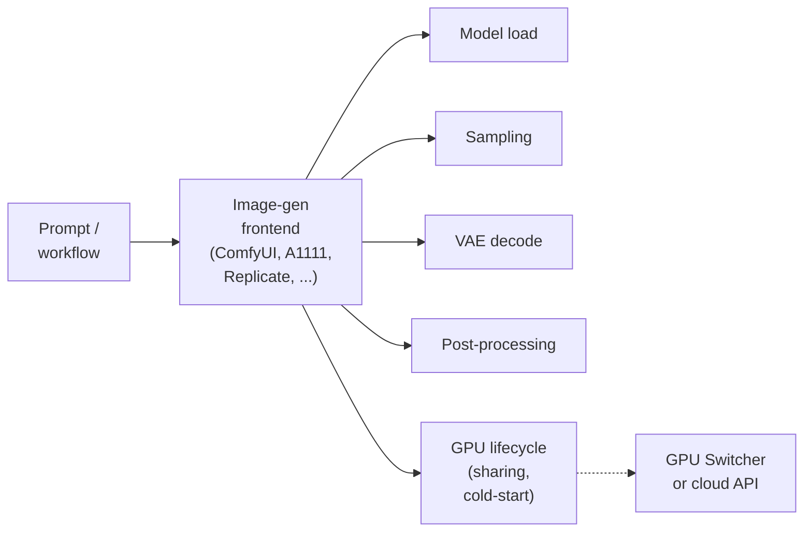
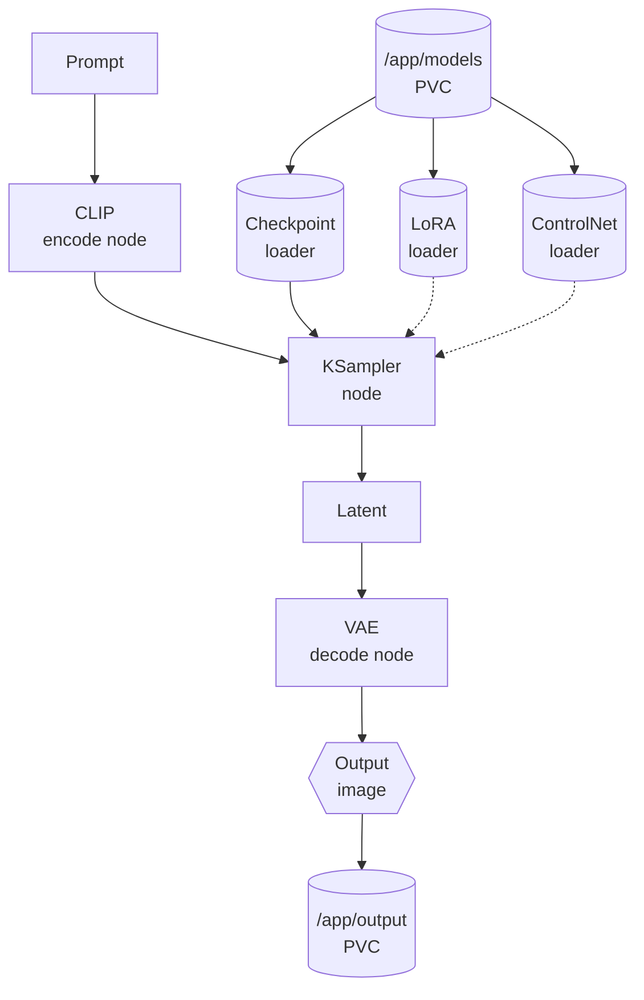
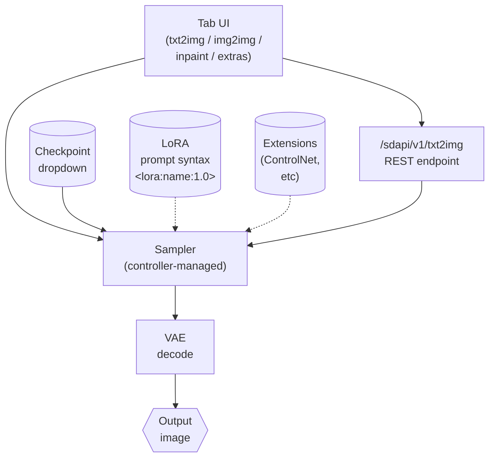
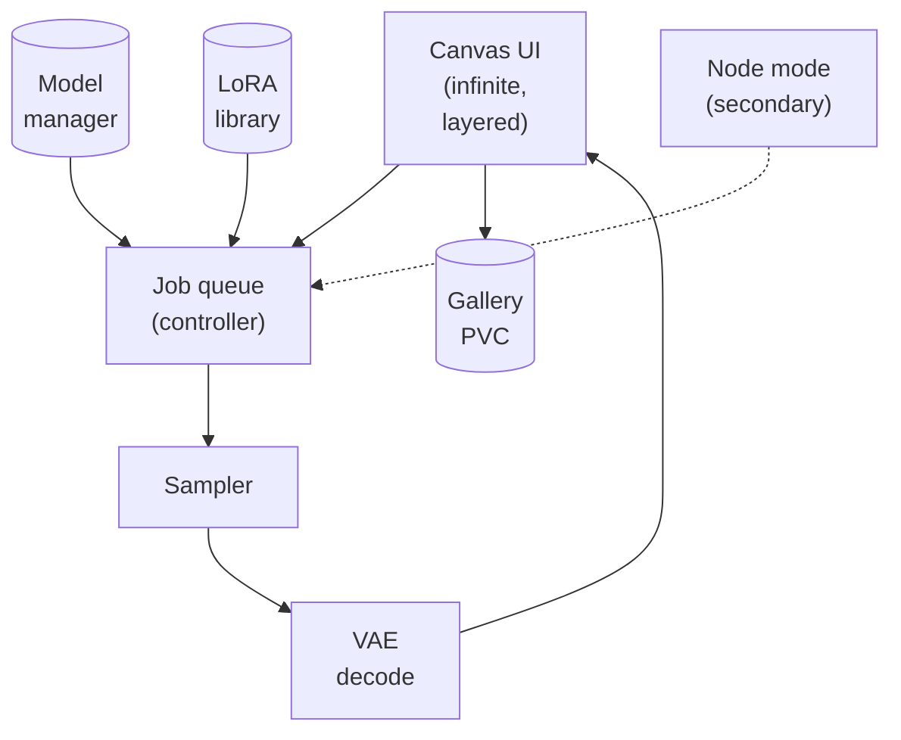
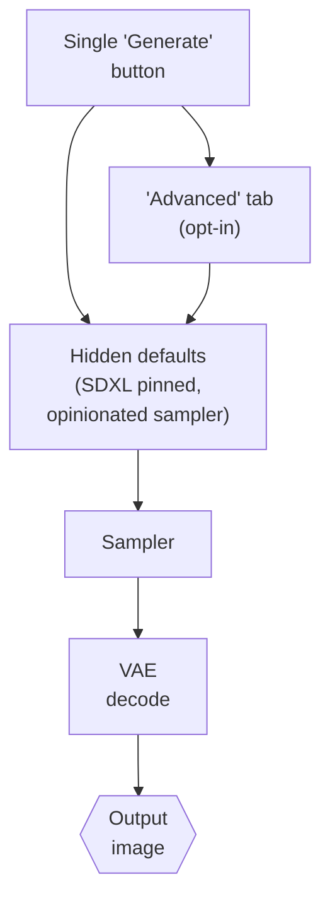
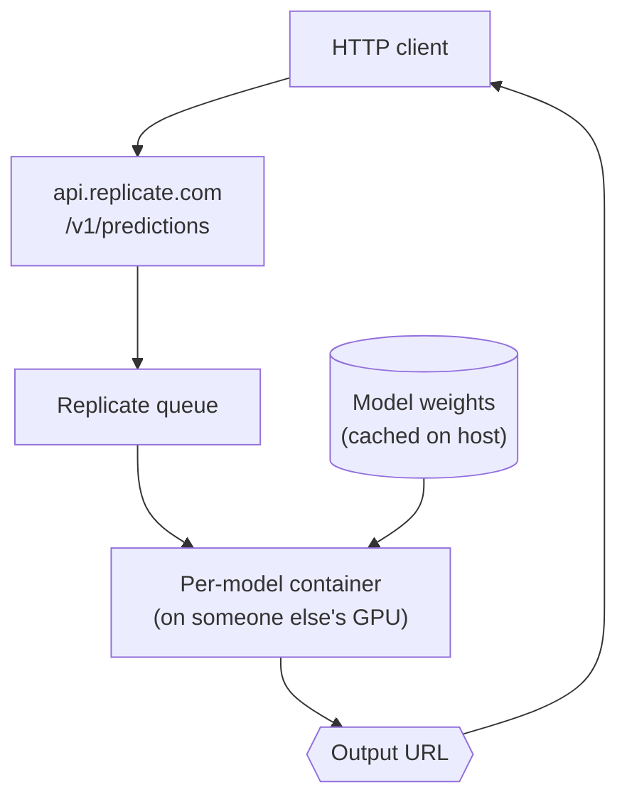
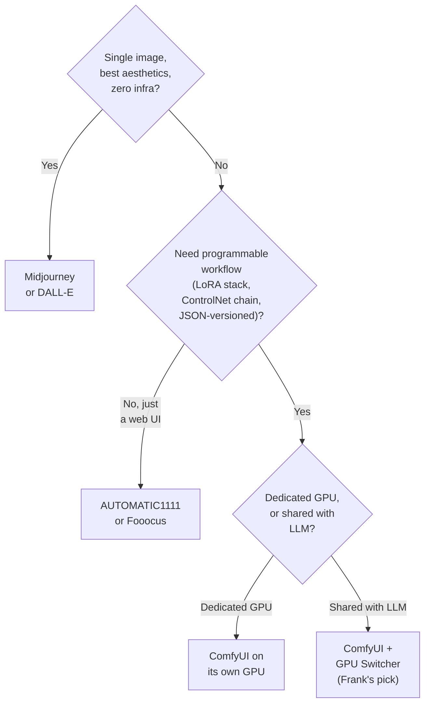

## TL;DR

Image generation on your own metal is two problems pretending to be one:
picking a frontend (ComfyUI, AUTOMATIC1111, InvokeAI, Fooocus, Replicate,
Midjourney/DALL-E) and surviving GPU contention when one consumer card
hosts both an LLM and a diffusion model. The frontend question splits on
whether you want a node graph, a tabbed web UI, an opinionated single-
button pipeline, or a cloud API. The contention question splits on
whether your GPU is dedicated.

Frank chose ComfyUI on a custom CUDA 12.8 image, deployed as
`replicas: 0` on `gpu-1` (RTX 5070 Ti, 16 GB GDDR7) and woken by a
150-line Go service called the GPU Switcher at `192.168.55.214`. The
scars: seven concrete problems with the stock `ai-dock/comfyui` image
(none patchable) and an Ollama "system memory" error that turned out to
be cgroup RAM, not VRAM. None of this is the right answer for most
teams. For the team that wants the workflow itself as a versioned
artefact, it is the only answer.

## §1 — The capability

The question I had to answer on Layer 16 was the same question every
team that has ever wanted to generate images on their own infrastructure
has had to answer: *given a single consumer-grade GPU that I also use
for LLM inference, what wins, and what does sharing actually cost?*

It is a build-versus-buy question wearing a media-generation costume,
and the costume hides the second question underneath: even if I've
picked an option, can I actually run it next to another GPU consumer
without one of them ending up in the OOM logs?

Look at the diagram and notice that "image-gen frontend" is doing
five jobs at once. Model load (which checkpoint, which LoRAs, where
do the weights live). Sampling (which scheduler, how many steps, at
what classifier-free-guidance scale). VAE decode (turning the noisy
latent into pixels). Post-processing (upscaling, face restoration,
metadata stamping). And GPU lifecycle — the job nobody talks about
until the day it bites you.

The vendor space splits on which of those jobs each option treats as
primary. ComfyUI makes every step a node you wire by hand. A1111
hides them behind tabs. Fooocus collapses the whole pipeline into a
single button. Replicate skips the question entirely and rents you
the result. Midjourney doesn't even let you see the steps.

The honest answer to the original question changes depending on which
of those five jobs you actually care about, and on whether your GPU
is yours alone. The rest of this paper walks the matrix.

## §2 — The landscape

The self-hostable image-generation space and the cloud-API alternative
sit in the same comparison table, because the comparison is the same:
*who owns the GPU, and how much of the workflow are you allowed to
see?*


    title Image generation — 2026
    x-axis "Cloud managed" --> "Self-hosted"
    y-axis "Opinionated UX" --> "Node-graph power"
    quadrant-1 "Self-hosted · Node-graph"
    quadrant-2 "Cloud · Node-graph"
    quadrant-3 "Cloud · Opinionated"
    quadrant-4 "Self-hosted · Opinionated"
    "ComfyUI": [0.90, 0.95]
    "AUTOMATIC1111": [0.85, 0.55]
    "InvokeAI": [0.75, 0.45]
    "Fooocus": [0.85, 0.10]
    "Replicate": [0.20, 0.40]
    "Midjourney / DALL-E": [0.05, 0.05]




Six options, three clusters.

**ComfyUI.** Node-graph frontend. Every step of the diffusion pipeline
— load checkpoint, encode prompt, sample, decode VAE, save — is a
node you wire by hand. The workflow is a directed graph of typed
links, serialisable as JSON, versionable in git, replayable on any
instance with the same weights. This is the option Frank picked,
and the option whose scars fill §5.


By introducing cross-attention layers into the model architecture, we
turn diffusion models into powerful and flexible generators for
general conditioning inputs such as text or bounding boxes.


**AUTOMATIC1111.** The original community web UI. txt2img, img2img,
inpaint, extras tabs. Deepest extension ecosystem of anything in the
landscape — anything that's ever been done with Stable Diffusion has
an A1111 extension for it. No node graph; the workflow is whatever
state the tabs happen to be in.

**InvokeAI.** Commercial-leaning OSS — opinionated UX, canvas-first
workflow, paid hosted tier, an OSS core that the company is happy to
have you run. Node mode exists but is secondary to the canvas. Sits
between A1111 (no graph) and ComfyUI (graph-first).

**Fooocus.** The Midjourney ergonomics of self-hosted. Single
"Generate" button, hidden complexity, no node graph, no plugin
ecosystem by design. SDXL-pinned, opinionated about samplers and
schedulers. The frontend for people who want pretty pictures, not a
programmable workflow.

**Replicate.** The OSS-models-on-someone-else's-GPU option.
Community models (image, audio, video) behind a pay-per-second
REST API. You skip the GPU entirely, and you skip the workflow
artefact. The bill scales with usage; you can stop the bill by not
generating, which is the cloud's killer feature.

**Midjourney / DALL-E.** Managed, closed-weight APIs. Best-in-class
aesthetics for most prompts straight out of the box, zero
infrastructure, no weights you can pull, no graph you can edit.
The "just use the API" null hypothesis that every self-hosted choice
has to answer.

The two-axis quadrant makes the architectural split visible. The
matrix makes the capability split visible. The next section makes
the workflow-expression split visible.

## §3 — How each option handles the hard part

The hard part of self-hosted image generation is *expressing a non-
trivial workflow — model + sampler + LoRA + ControlNet + post-
processing — without losing reproducibility or having to write Python.*
Every frontend in the landscape has a different answer, and the answers
look very different at the architecture level.

I'll use a shared visual vocabulary for the diagrams: squares are
controllers / processes, rounded rectangles are artefacts (image,
prompt, JSON), diamonds are decision points, cylinders are persistent
storage (weights, output dir). Dashed edges are optional config
paths; solid edges are sample-time inference paths.

### ComfyUI — the node graph as the workflow

The ComfyUI controller is a single Python process that holds a
queue. The user (or an API client) submits a workflow — a JSON
document describing nodes and links. The queue picks up the
workflow, walks the graph in topological order, materialises each
node's output as a tensor or a file, and emits the final image to
disk. The workflow is the artefact: copy the JSON to another
instance with the same weights and you get the same image, byte-
for-byte if you pin the seed.

Failure modes are local to the node. Missing LoRA: the LoRA loader
node throws; the workflow stops at that node; the error tells you
which file ComfyUI was looking for. VRAM exhausted at sample time:
the KSampler node OOMs; the controller catches it and reports the
node ID; the rest of the workflow doesn't get touched. Sampler
divergence: the latent tensor goes to NaN; you can see exactly
which node produced it.

### AUTOMATIC1111 — the tab as the workflow

A1111 is a Gradio-based web UI in front of a controller that owns
the diffusion pipeline. The user picks a checkpoint from a dropdown,
types a prompt (with LoRAs in inline `<lora:name:strength>` syntax),
adjusts a half-dozen sliders, hits Generate. The "workflow" is
whatever the form state happens to be — there is no exported graph.

There is a REST API (`/sdapi/v1/txt2img`) for headless use, which is
useful for batch jobs but recreates the form-state problem at the
API level: every parameter has to be sent on every call, and the
extensions ecosystem complicates the schema. Workflow reproducibility
comes from saving prompts and parameter snapshots, not from a graph
artefact.

Failure modes are global. If an extension is broken, the whole UI
breaks. If a LoRA is missing, A1111 typically falls back to
generation without it and warns in a sidebar — which is friendly,
but also means a "successful" generation might have silently
dropped one of your inputs.

### InvokeAI — the canvas as the workflow

InvokeAI's primary surface is an infinite canvas — you generate in
context, you inpaint on top of previous generations, you regenerate
specific regions. The controller behind the canvas is a queue, same
as ComfyUI, but the user-facing artefact is the canvas state, not
the graph. Node mode exists and is real, but it's a second-class
view; the team's bet is that most workflows are canvas-shaped.

The OSS / commercial line runs through here: the core engine is OSS,
the polished UX is the value-add of the hosted product. Failure modes
are queue-shaped (jobs error, you see the error in the canvas history)
which is friendlier than A1111's global failure but less precise than
ComfyUI's per-node errors.

### Fooocus — the single button as the workflow

Fooocus' design statement is "the user should not have to learn
diffusion." The single Generate button is the workflow; the advanced
tab is a concession to power users who insist. The controller hides
everything — checkpoint, sampler, scheduler, CFG, steps — behind
opinionated defaults that the maintainers tune. Workflow
reproducibility is good *if you don't change settings*, because the
defaults are stable; it's poor the moment you do, because the
defaults aren't well documented.

### Replicate — the JSON POST as the workflow

Replicate's "workflow" is a JSON request body. You pick a community
model (Stable Diffusion, FLUX, Whisper, etc.), POST a prediction with
your parameters, poll for a result URL. The host owns the GPU, the
model load, the sampler, everything. Your workflow artefact is the
request JSON and the model version pin.

Failure modes are HTTP-shaped: rate limits, 5xx, model deprecation
when the host removes a version. The cost model (per-second of GPU
time) is the killer feature — you stop generating, you stop paying.

The four self-hosted options give you a graph, a tab state, a
canvas, or a button. The cloud option gives you a JSON request and
no GPU lifecycle to worry about. §6 turns that into a decision tree.

## §4 — What scale changes

Three axes flip the vendor rankings as the workload scales up.

**Image complexity / model size.** Stable Diffusion 1.5 fit in
6 GB of VRAM and ran on anything with a CUDA driver. SDXL pushed
that to 10–12 GB. FLUX-dev needs 12–24 GB depending on
quantisation. Stable Diffusion 3.5 large needs 24 GB+ unquantised.
The consumer GPU ceiling — the RTX 4090 and RTX 5090 — is 24 GB,
and the next-step-up generation does not look like it will move
that ceiling much. Once a model crosses the GPU's VRAM, you have
two options: swap to system RAM (orders of magnitude slower per
sample step) or move to a cloud API. The latent-diffusion paper
made this whole problem set tractable —


We apply them in the latent space of powerful pretrained autoencoders
... significantly reducing computational requirements compared to
pixel-based DMs.


— but latent space only buys you so much when the underlying model
itself has grown an order of magnitude.

**GPU contention.** On a dedicated GPU every option in §3 works.
On a GPU shared with LLM inference, only options with explicit
start/stop hooks survive, because Kubernetes does not give you a
"schedule this OR that" primitive. `nvidia.com/gpu: 1` is binary.
Time-Slicing is enterprise-only with the NVIDIA GPU Operator. MIG
doesn't exist on consumer GPUs — the RTX 5070 Ti has no MIG
partitions, full stop. So either you build your own scheduler
(Frank's GPU Switcher is 150 lines of Go) or you pick a cloud API
whose host handles the sharing for you transparently.

**Workflow programmability.** For a single image per session,
Midjourney's aesthetics win — most users will get a better-looking
image faster from a $10/month subscription than from any
self-hosted option. For repeatable workflows — the same LoRA
stack, the same ControlNet conditioning, the same prompt grid
across 200 images, replayable in a month — only ComfyUI's node
graph survives the test. Workflows export as JSON, version in git,
replay on any instance with the same weights. The graph is the
artefact, and it's not something an API can hand you because
collapsing the workflow into a JSON request is exactly what the
API exists to do.

## §5 — Frank's choice, and what happened

I picked ComfyUI on a custom CUDA 12.8 image, deployed as
`replicas: 0` on `gpu-1` (RTX 5070 Ti, 16 GB GDDR7), and woken by a
small Go service called the GPU Switcher at `192.168.55.214`.

The full chain. A custom Dockerfile (`apps/comfyui/docker/Dockerfile`)
on `nvidia/cuda:12.8.0-devel-ubuntu22.04` with PyTorch 2.10.0+cu128
and ComfyUI v0.9.2; ComfyUI-Manager 4.x installed as a pip package
(not dropped into `custom_nodes/`); uid 1000:1000 non-root. Two PVCs
— `comfyui-models` for checkpoints/LoRAs/VAEs, `comfyui-custom-nodes`
for Manager-installed nodes. A Deployment that pins to `gpu-1` via
`nodeSelector: kubernetes.io/hostname: gpu-1`, requests
`nvidia.com/gpu: 1`, sets `strategy: Recreate` (RWO PVC), carries a
defensive `nvidia.com/gpu:NoSchedule` toleration, and ships with
`replicas: 0`. The Switcher service at `apps/gpu-switcher/` exposes
`POST /api/activate/{ollama|comfyui}`, `POST /api/deactivate`, and a
`GET /api/status` dashboard. The scars came in the seams.


We started on `ghcr.io/ai-dock/comfyui:latest-cuda` because it shipped.
Then we found the Caddy template substitution silently failed — port
8188 was never proxied to internal 18188 — and the env var was
`COMFYUI_ARGS` (not `COMFYUI_FLAGS` as documented), and supervisord
was running cloudflared + SSH + Jupyter + Syncthing + Caddy + a
service portal inside the container, and ComfyUI was pinned to v0.2.2
(September 2024) which can't load Flux, and PyTorch was 2.4.1+cu121
which has no `sm_120` support for the RTX 5070 Ti. Seven independent
issues, none patchable from `values.yaml`. We wrote a 60-line
Dockerfile on `nvidia/cuda:12.8.0-devel-ubuntu22.04`, one process,
two PVCs, and stopped fighting an image whose assumptions we did not
share.



`nvidia.com/gpu: 1` is a binary resource in Kubernetes. There is no
"schedule this OR that, never both" primitive. Time-Slicing is
enterprise-only with the NVIDIA GPU Operator. MIG doesn't exist on
consumer GPUs — RTX 5070 Ti has no MIG partitions. So the cluster
will happily schedule Ollama AND ComfyUI on the same GPU until one
of them OOMs out of VRAM. The fix: both Deployments ship at
`replicas: 0`, and a 150-line Go service called the GPU Switcher
exposes `POST /api/activate/{ollama|comfyui}` — scale one to 1,
scale the other to 0, never both. A dropdown on `192.168.55.214`
is the entire user interface. The Switcher is the smallest
workaround for a primitive K8s does not provide.



Ollama returned `model requires more system memory (15 GiB) than is
available (837 MiB)` and `nvidia-smi` showed ~15 GB of VRAM free.
We assumed VRAM exhaustion. It wasn't. `OLLAMA_KEEP_ALIVE=24h` page
cache from a previously-loaded model had pinned the *container
cgroup* RAM near `resources.limits.memory: 32Gi`. The Ollama
container was at 31/32 GiB system RAM; "system memory" in the
error meant cgroup-allocated RAM, not GPU VRAM. Reducing `num_ctx`
did not help — the bottleneck is at-load working buffers, not
steady-state KV cache. Fix: bump `resources.limits.memory` to 64 GiB.
The lesson for image generation: GPU contention isn't only about
VRAM. Cgroup RAM, container limits, and PVC mount order all surface
as "GPU" errors when a workload shares a node with another
heavyweight GPU consumer.


The Switcher is the durable artefact. The custom Dockerfile is the
durable artefact. Both are in the repo (`apps/gpu-switcher/app/main.go`,
`apps/comfyui/docker/Dockerfile`), both are 100% declarative, and
both exist because the off-the-shelf option assumed a world Frank
does not live in.

## §6 — When Frank's answer doesn't generalize

Frank's answer is one leaf on a four-leaf tree. The other three are
real, and most teams should pick one of them.

The tree turns on three questions, in order.

*Do you want a single image, or a repeatable workflow?* If single,
the cloud APIs win — Midjourney and DALL-E produce better-looking
images out of the box than any self-hosted option, with zero infra,
for a price most teams can absorb without thinking. The
counter-argument is real: most users do not need a node graph and
do not benefit from one.

*Do you need the node graph?* If you need a web UI but not a graph,
A1111 or Fooocus are the right answers. A1111 if you want the
extension ecosystem; Fooocus if you want the single-button
ergonomics. Both run fine on a dedicated GPU; both share the same
contention problem if you're trying to also host an LLM.

*Is the GPU dedicated, or shared?* If dedicated — the common "ML
team has a workstation" case — ComfyUI on its own GPU is the
unambiguous answer for programmable workflows. No Switcher needed.
If shared with LLM inference, you build or borrow a scheduler.
Frank's GPU Switcher is one such scheduler; there will be others;
the K8s primitive that would make it unnecessary does not yet exist.

The shared-with-LLM leaf is the one Frank lives on, and it's the
leaf with the most scars. The other three are easier in every way.

## §7 — Roadmap & where this space is going

Three trends worth naming.

**Diffusion models are growing faster than consumer VRAM.** SD 1.5
was 6 GB. SDXL is 10–12 GB. FLUX-dev is 12–24 GB. SD 3.5 large is
24 GB+. The consumer GPU ceiling sits at 24 GB (RTX 4090, RTX 5090),
and the next consumer generation does not look like it will move the
ceiling materially. In 18 months the OSS-on-consumer-hardware story
may require quantisation that costs visible quality, at which point
the cloud-API value proposition strengthens for everyone except the
self-hosting-as-principle cohort. Frank watches this closely; the
moment the quality cost of quantisation exceeds the privacy benefit
of local inference, the calculation flips.

**Node-graph workflows are eating the frontend tier.** ComfyUI's
design pattern is winning adoption across the ecosystem — InvokeAI
added node mode, Fooocus has an "advanced" tab now, even the
Stable Diffusion API community is converging on JSON-serialisable
workflow representations. The programmable-workflow-as-artefact
pattern is too useful to remain niche. The next Replicate-like
service to emerge will probably accept a ComfyUI workflow JSON
as the request body, and the self-hosted-vs-cloud line will run
through the GPU lifecycle, not through the workflow expression.

**GPU sharing across heterogeneous workloads remains unsolved at
the K8s primitive level.** NVIDIA Time-Slicing works for
homogeneous inference; it does not help when one workload wants
16 GB of VRAM for 30 seconds and the other wants 14 GB
continuously. Expect a wave of community Switcher-like tools
(queue-based, declarative, capacity-aware) over the next 12 months.
Frank's 150-line Go service is the simplest possible version; the
sophisticated version — one that handles N GPUs, queue priorities,
fair-share scheduling, eviction policies — is still being written
by someone, somewhere, and Frank will adopt it the moment it ships.

Until then, the dropdown at `192.168.55.214` is the user interface,
the JSON workflow is the artefact, and the scars in §5 are the
documentation.

## References

*Auto-rendered from frontmatter by Hugo taxonomy.*
