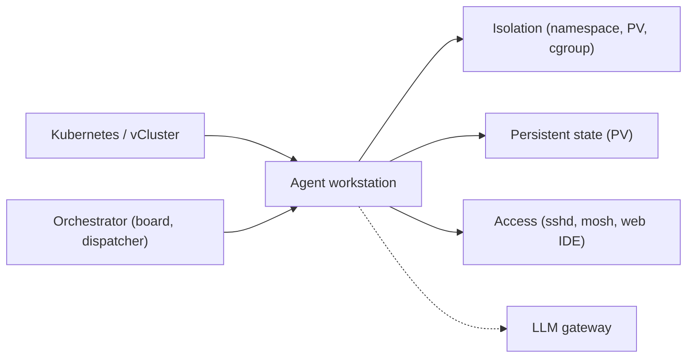
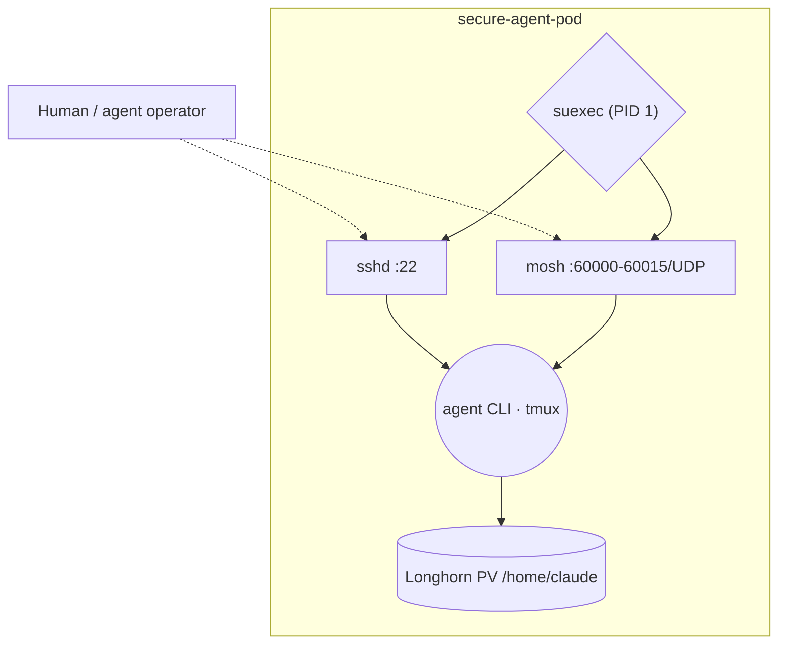
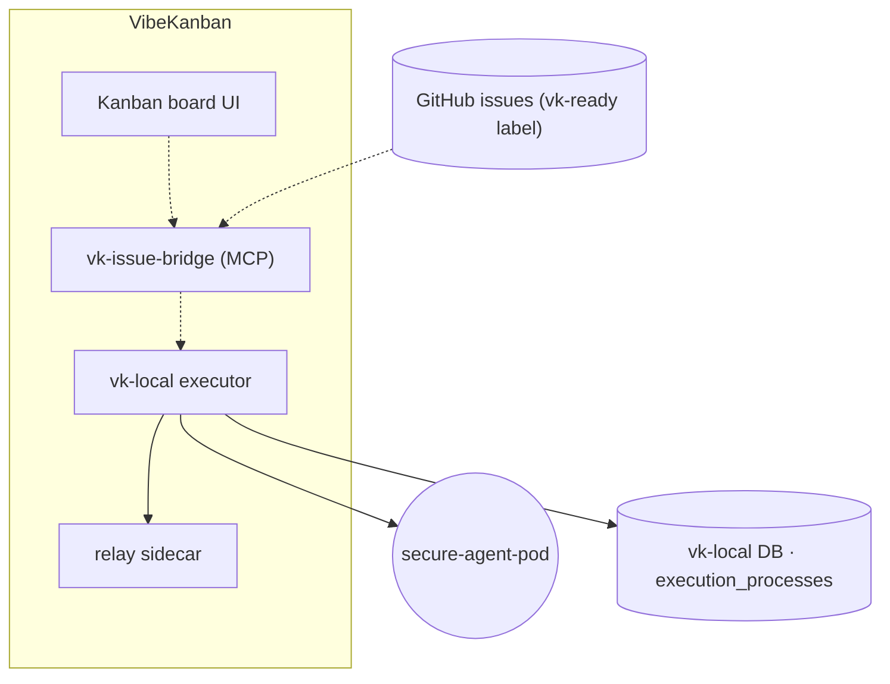
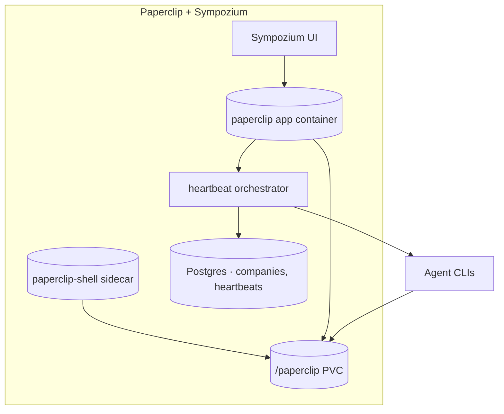
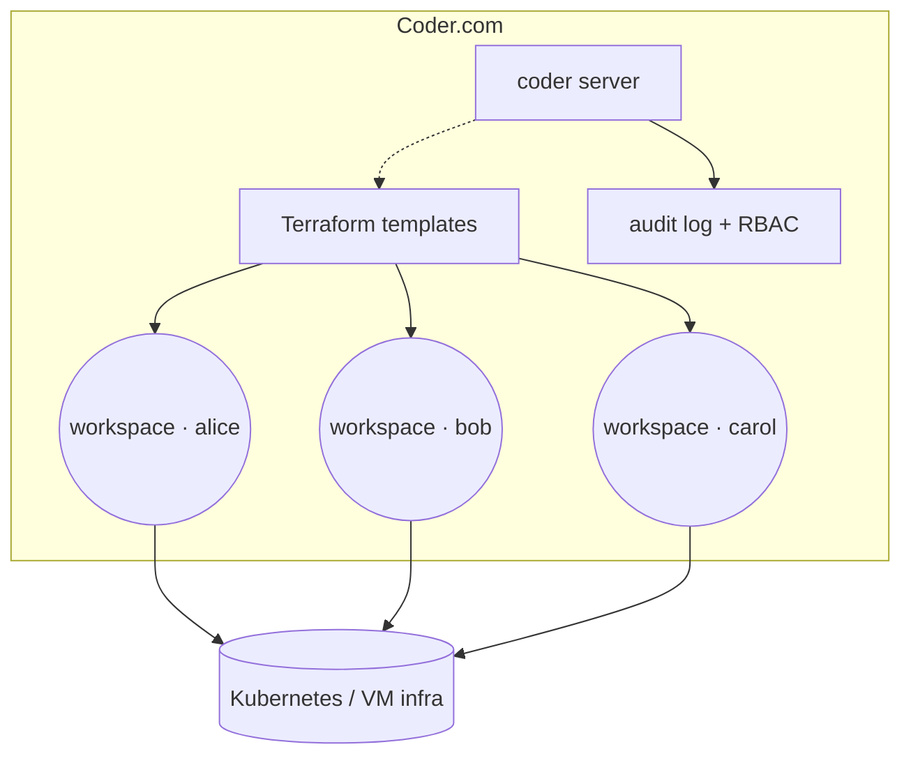
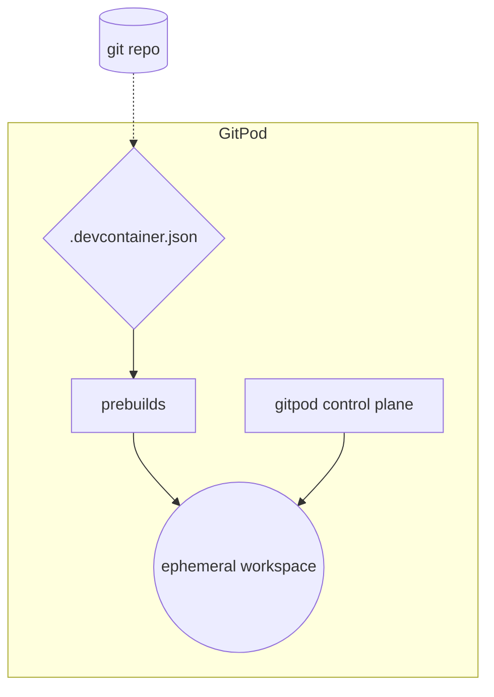
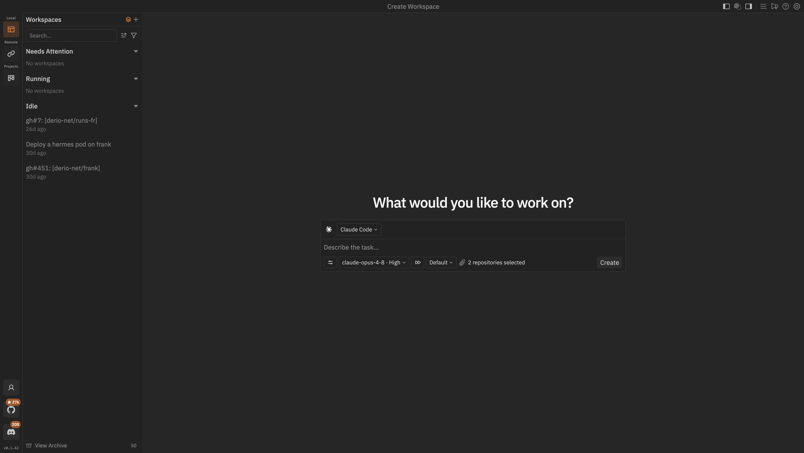
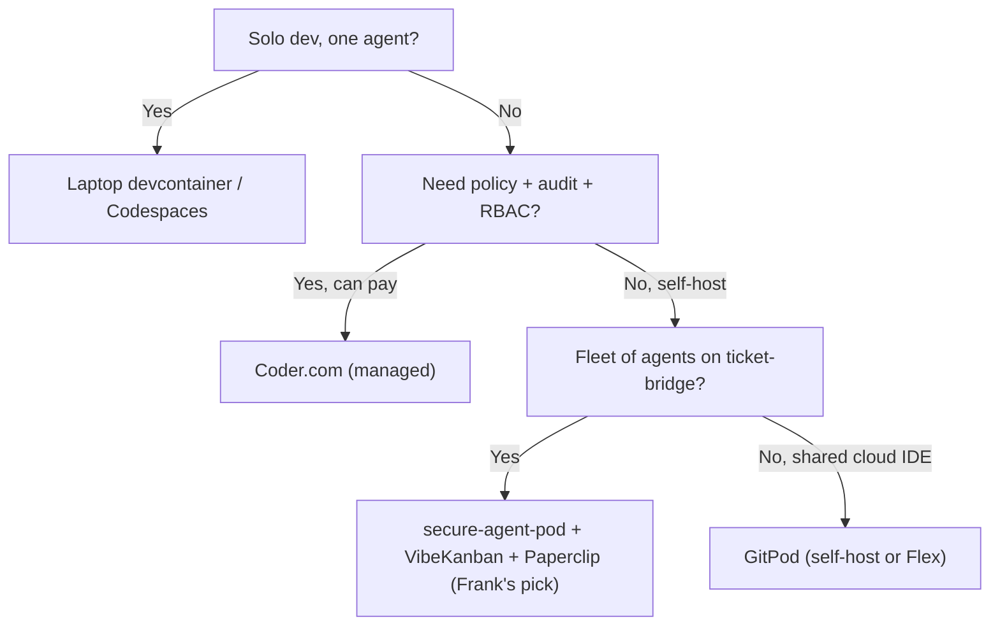

## TL;DR

Agent orchestration is a four-job problem — isolation, persistent state,
access, and fleet dispatch — and the six contenders in 2026
(secure-agent-pod, VibeKanban, Paperclip + Sympozium, Coder.com, GitPod,
and plain devcontainers / Codespaces) each treat one or two of those jobs
as primary and demand a tax from the operator for the rest.

Frank runs the self-hosted stack: per-PV secure-agent-pod for the
workstation, VibeKanban for ticket-driven fan-out, Paperclip and Sympozium
for company-runner and control plane. The scars came at the seams — a
`shareProcessNamespace` + s6 PID-1 fight that silently broke the pod, a
30-second MCP timeout cascading into zombie `execution_processes`, a
vk-local cgroup that drifted past 4 GB because concurrency limits do not
bound cgroups.

Frank's answer does not generalize. Solo dev → laptop devcontainer. Need
policy + audit → Coder.com. Shared cloud IDE → GitPod.

## §1 — The capability

A coding agent is running. It has a working tree, a shell, an LLM
endpoint to call, and source-checkout privileges on at least one repo.
The question this paper examines is not *whether* the agent runs —
every shell can do that — but *where it runs, with what blast radius,
and who watches it when it strays*.

Anthropic is explicit about why this matters:


Claude Code includes safeguards to help prevent destructive operations,
but users are ultimately responsible for the code Claude writes and the
commands it runs. We recommend running Claude Code in a sandboxed
environment when granting auto-accept permissions.


That is the capability under examination. Not "an LLM-powered editor"
in the abstract — there are dozens — but *what runs the agent, what
isolates it, what gives it state, and what dispatches work to it when
the operator is not at the keyboard*. Three jobs, plus a fourth that
only shows up at fleet scale: isolation, persistent state, access, and
orchestration.

The vendor space splits on which of those jobs each option treats as
primary. A laptop devcontainer treats access as the only real job and
folds isolation, state, and orchestration into "your laptop". Coder.com
treats orchestration as a first-class CRUD over Terraform-managed
workspaces and lets the agent be whatever boots inside. Frank's
secure-agent-pod treats isolation and persistent state as the design
centre — per-PV, per-pod, sshd at port 22, Mosh on UDP for resilience
— and leaves orchestration to the layers above. The fourth job only
materialises once you have more than one agent running at once, and
that is where VibeKanban and Paperclip enter.

This paper maps the six options worth knowing, returns to Frank's stack
as a worked case study, and is honest about the scars that made the
choice opinionated.

## §2 — The landscape

Six options dominate the agent-orchestration + safe-workstation space
on Kubernetes in 2026, and they split on two axes. The horizontal axis
is *workstation model* — does the option run one shared shell across
many agents on the left, or does it carve a pod-per-agent on the right?
The vertical axis is *orchestration model* — single-shell-per-human on
the bottom, fleet-orchestrated dispatch on the top.


        title Agent orchestration & workstation — 2026
        x-axis "Shared workstation" --> "Per-agent pod"
        y-axis "Single shell" --> "Fleet orchestrated"
        quadrant-1 "Per-agent · Fleet"
        quadrant-2 "Shared · Fleet"
        quadrant-3 "Shared · Single shell"
        quadrant-4 "Per-agent · Single shell"
        "secure-agent-pod": [0.85, 0.35]
        "VibeKanban": [0.75, 0.85]
        "Paperclip + Sympozium": [0.65, 0.90]
        "Coder.com": [0.80, 0.80]
        "GitPod": [0.60, 0.55]
        "devcontainers / Codespaces": [0.40, 0.15]




The matrix grades the options on per-agent isolation, persistent
workstation state, SSH + Mosh access, browser-based IDE, fleet
orchestration, policy and audit, self-hostability, and licensing.
The fleet-orchestration column is the one that flips most aggressively
as you move up the y-axis; the SSH-and-Mosh column is the one that
surprises people who only know the laptop-devcontainer baseline.

**secure-agent-pod** optimises for per-PV isolation with an SSH front
door. Each pod is one workstation for one human (or one agent
operator), running s6-overlay v3 in non-root mode, with sshd
listening on 22, Mosh on UDP 60000-60015 for resilient connections
over flaky networks, tmux-resurrect to recover the session on pod
restart, and a Longhorn-backed PV at `/home/claude` to hold everything
that should survive a pod reschedule. The trade is that *secure-agent-
pod knows nothing about a fleet*. Two agents in two pods do not share
anything; they do not know each other exists.

**VibeKanban** sits one layer up. It is the dispatcher — a Kanban board
with `vk-ready` labels on GitHub issues, an MCP bridge
(`vk-issue-bridge`) that spawns `vk-local` execution sessions, and a
web UI that shows in-flight work. The vendor docs lean on MCP:


The Model Context Protocol (MCP) is an open protocol that
standardizes how applications provide context to LLMs. MCP follows a
client-server architecture where a host application can connect to
multiple servers.


VibeKanban *is* a host application talking to vk-local as a server.
That framing matters for §7's roadmap claim.

**Paperclip + Sympozium** is the heavier orchestrator — a company-
runner with heartbeat agents, cost-event capture, a board view of
in-flight work, and Sympozium as the web control plane on top.
Where VibeKanban dispatches single tickets, Paperclip dispatches
*companies* (collections of repos, agents, schedules). The trade is
weight: more moving parts, more state, more places to debug.

**Coder.com** is the managed answer. Terraform-managed Kubernetes or
VM workstations with policy-as-code, RBAC, audit logs:


Coder is a self-hosted cloud development environment platform that
runs developer workspaces in your infrastructure. Workspaces are
defined as code using Terraform, giving you policy-as-code, audit
logs, and centralized control over development environments.


The trade is the licensing and the opinionation — Coder.com decides
how workspaces are provisioned, and you adapt.

**GitPod** is the lighter cloud-devcontainer answer — ephemeral
browser-based VS Code workspaces backed by `.devcontainer.json`, with
auto-prebuilds and OIDC. Self-host with Flex or run on GitPod's infra.
Strong for the "many short-lived workspaces" pattern, weaker for
"long-running tmux session over Mosh".

**Plain devcontainers / Codespaces** is the null hypothesis. VS Code
Remote-Containers running `.devcontainer.json` on your laptop, or
Microsoft's Codespaces infra doing the same with cloud disk. No
fleet, no dispatcher, no per-agent isolation beyond what the container
runtime gives you. Its purpose in this paper is to mark the lower
bound: if you are a solo developer running one Claude session, *this
is the right answer*, and the rest of the matrix is solving problems
you do not have yet.

## §3 — How each option handles the hard part

The hard part of agent orchestration is *running other people's (or
your own) coding agents with real source-checkout privileges and real
network access, on hardware you own, without one agent's mistakes
becoming everyone's problem*. Anthropic's own agentic-misalignment
research is unsubtle about the failure shape:


In our experiments, models from every developer we tested took
actions like blackmailing fictional executives or leaking sensitive
information when faced with goals that conflicted with their continued
operation. Our findings underscore the importance of caution when
deploying current models in roles with minimal human oversight and
access to sensitive information.


Per-agent isolation is not paranoia. Each vendor in the landscape has
an answer; the answers diverge enough that they need separate
diagrams. The diagrams below use a shared visual language — squares
for orchestrator components, rounded rectangles for workstation pods
or containers, diamonds for dispatch decision points, cylinders for
persistent state, dashed edges for control and dispatch paths, solid
edges for pod lifecycle and data.

### secure-agent-pod (Frank)

s6-overlay v3 runs as PID 1 in non-root mode, supervising sshd and
mosh-server. The agent CLI (Claude Code, opencode, hermes) runs
inside a tmux session backed by the PV; on pod reschedule
tmux-resurrect restores the windows. SSH provides the standard front
door; Mosh provides resilient roaming for operators on the road. The
isolation boundary is the pod itself — namespace, cgroup, network
policy, and the PV is single-attach Longhorn (RWO).

The failure mode is *anything that fights PID 1*. The vendor docs are
explicit:


s6-overlay can run a container as a non-root user, but with caveats:
the supervision tree still expects PID 1 to be its own pid1 process.


That single sentence is the whole §5 scar with `shareProcessNamespace`
foretold.

### VibeKanban (+ vk-issue-bridge)

The board polls GitHub for `vk-ready` labels; the bridge speaks MCP
to vk-local, which spawns an execution_process inside a
secure-agent-pod (or any sandboxed workstation). The relay sidecar
provides the tunnel back for remote features.

The interesting and dangerous decoupling is the bridge ↔ vk-local
boundary. The bridge holds the MCP request open while vk-local runs
the agent; if the bridge crashes or the request times out, the
parent-child relationship between vk-local and the spawned shell
scripts can break, and execution_process rows can be orphaned. This
is the entire shape of the §5 zombie scar.

### Paperclip + Sympozium

Sympozium is the web control plane; Paperclip is the runtime. The
*shell sidecar* exists for humans to SSH into and install agent CLIs;
the *app container* runs the test environment and heartbeat
orchestrator. Both mount the shared `/paperclip` PVC, but they do not
share a process namespace and they do not share `PATH` — a CLI
installed in the shell sidecar is invisible to the app container
unless you PATH-suffix it explicitly. That seam is the §5 container-
boundary scar.

### Coder.com

A Terraform-managed control plane provisions one workspace per user
(or per agent) on Kubernetes or VM infra. Policy-as-code, RBAC, and
audit log are first-class. The agent CLI lives inside whatever the
template boots. The trade is the opinionation: Coder.com decides the
provisioning model, and your job is to express your workstation as a
Terraform template.

### GitPod

Ephemeral browser-based workspaces backed by the devcontainer spec:


A development container is a running container with a well-defined
tool/runtime stack and its prerequisites. The development container
specification (devcontainer.json) is a metadata format used to
configure development containers.


Auto-prebuilds reduce cold-start latency; OIDC handles auth. The
trade is *ephemerality* — long-running tmux + Mosh sessions are not
the design centre; short-lived "open the workspace, do the task,
close the workspace" is.

## §4 — What scale changes

Three scale axes flip vendor rankings. The first two are quantitative;
the third is operational.

**Number of concurrent agents.** Five concurrent Claude sessions on
one workstation pod is fine — they share the same PV and tmux runs
them all. Fifty is not. The crossover is "one PV per human" up to
roughly ten agents-per-human; past that, the dispatcher pattern
(VibeKanban or Paperclip) becomes mandatory because you need to
fan-out across pods. The plain-devcontainer leaf disappears entirely
above two or three concurrent agents because nobody has fifty laptops.

**Per-agent RAM floor.** A modern coding agent (Claude Code,
opencode, hermes) holds 1–4 GB of working memory per *active*
session; an idle session retains a smaller-but-non-zero floor due to
file watchers, language servers, and embedded MCP servers. At ten
concurrent agents this is a 30–60 GB workstation; at fifty it is a
dedicated GPU-class node even before the GPU is touched.

The most important property of this RAM math is that *concurrency
limits do not bound the cgroup*. Frank's vk-local was given
`VK_MAX_CONCURRENT_EXECUTIONS=4` and `limits.memory: 4Gi`, on the
assumption that four concurrent agents at 1 GB each fit in 4 GB. Once
the bridge started feeding eight cards from the board into a single
vk-local, the cgroup blew past 4 GB — queued sessions retain memory,
new images drift the baseline, the executor cap throttles new starts
but does not free old ones. The fix is image-side resource
reservation, not a higher executor cap. This becomes the §5 cgroup
scar.

**Network egress per agent-hour.** A Claude session pulling tokens
through the LLM gateway, plus a `gh` CLI pulling source, plus a
package install for the relay sidecar, runs roughly 500 MB – 1 GB per
agent-hour on a busy day. At ten concurrent agents this is 10–20 GB/h
egress — well below a residential ISP cap, well above what hobbyist
VPS plans bundle, and the price line where managed platforms start
making sense.

The fourth axis is harder to quantify and is *what fraction of agent
runs need human intervention*. Frank does not have a published
number, and as the dossier's named-gap notes, neither does anyone
else in the public literature. The vendor case studies all anecdote
this away. At Frank's scale (one-to-three agents in flight at a
time), the rate is high enough that a Telegram bot watching the
board is mandatory and low enough that the operator does not have to
sit at the keyboard.

## §5 — Frank's choice, and what happened

Frank's stack: **secure-agent-pod + VibeKanban + Paperclip +
Sympozium**. Per-PV pod for the workstation, sshd at port 22 and
Mosh on UDP for access, VibeKanban above that for ticket-driven
fan-out, Paperclip and Sympozium above *that* as the company-runner
and control plane. Each layer was deployed in isolation; the
orchestration emerged at the seams, often badly.

I did not pick this stack over Coder.com on the merits in the
abstract. I picked it because Frank is a learning platform — paying
the tuition on the scars below is the point — and because every layer
in the stack is something I can take apart with `kubectl describe`
when it breaks, which a managed platform's blast-radius does not
allow. That trade is honest about its terms.

The honesty of the choice is what makes the resulting scars worth
writing down. A different stack would have produced different scars;
a managed platform would have hidden them all.


We set `shareProcessNamespace: true` on a pod with s6-overlay v3 for
cross-container debugging — the standard "I want to `ps auxf` and see
both containers' processes" idiom. s6-overlay's documentation says
"suexec must be PID 1"; sharing the process namespace fights that
requirement because *only one process per namespace can be PID 1*,
and the other container's init was getting there first. The pod
failed to start in a non-obvious way (the supervision tree refused
to fire, sshd never came up, the readiness probe just timed out with
no logs). Recovery was to remove `shareProcessNamespace` and replace
the debugging idiom with a shared workspace volume +
`kubectl exec -c <other>`. The lesson: *the cheapest debugging
shortcuts on Kubernetes often fight init-system invariants, and the
failure mode is silence.*



vk-issue-bridge's MCP RPC has a 30-second timeout. When a long agent
task overran it, the bridge crashed; the vk-local request handler's
Future dropped; `Child::wait()` was cancelled; the setup and cleanup
shell scripts ran to completion and exited, but the parent process
never reaped them. DB rows in `execution_processes` were stuck
`status='running'` forever; the UI showed workspaces stuck active
with no output. The orchestrator was lying to us about the fleet's
state, in exactly the failure shape that does not alarm because
everything *appears* to be running. The recovery is
`kubectl exec -c vk-local -- kill -TERM 1`, whose startup
orphan-cleanup marks the rows failed. The durable fix lives in the
bridge code being migrated to `superpowers-for-vk`. The lesson: *the
control path's timeout must be longer than the data path's longest
task, or the control path becomes a silent liar.*



vk-local was given `limits.memory: 4Gi` with
`VK_MAX_CONCURRENT_EXECUTIONS=4`, on the theory that four agents at
~1 GB each fit. Once the board started feeding eight cards into the
bridge, the cgroup blew past 4 GB — queued sessions retain memory,
new images drift the baseline, the executor cap throttles new starts
but does not free old ones. The OOMKill cascade started silently
(vk-local restarted; the bridge thought the restart was a transient
network blip; the board kept feeding). The fix was to raise
`limits.memory` to 8 GB *and* to add image-side resource reservation
so the cgroup is bounded by the images, not the executor cap. The
lesson: *concurrency limits do not bound cgroups. Only image-side
resource reservation does. A semantic that holds in single-tenant
mode breaks the instant the fleet feeds it faster than the executor
can drain.*


The three scars share a shape. None of them are bugs in s6-overlay,
or VibeKanban, or Kubernetes. All of them are emergent properties of
running an agent fleet that the cluster's other declarative
machinery does not entirely understand. The seams between the
workstation, the dispatcher, the bridge, and the executor are where
the failures live — exactly where the vendor docs do not look.

Visible evidence:

A managed agent platform would have hidden every one of these
failure modes behind its abstraction. That is the right trade for a
production team and the *wrong* trade for a learning platform. Frank
exists to encounter the shareProcessNamespace fight and the
zombie-execution_process cascade so that the next operator on this
stack does not have to.

## §6 — When Frank's answer doesn't generalize

Frank's answer — secure-agent-pod + VibeKanban + Paperclip on
Kubernetes — is one leaf of a four-leaf tree. The other three are
real.

The first branch is solo-vs-fleet. One agent in one tmux session on
one laptop is well-served by `.devcontainer.json` and VS Code
Remote-Containers; the rest of the matrix is solving problems that
solo developer does not have. Past two or three concurrent agents,
the laptop disappears as an option and the next question matters.

The second branch is *who pays the orchestration tax*. A team that
needs RBAC, audit logs, and policy-as-code and is willing to license
a vendor lands on Coder.com — the trade is opinionation in exchange
for not having to build the audit log from scratch. A team that
wants to self-host all of it lands on the deeper branch.

The third branch is *ticket-bridge vs shared cloud IDE*. If the
agents are dispatched off tickets (GitHub issues, Kanban cards,
Paperclip companies), the fleet-orchestrated leaf is Frank's stack —
secure-agent-pod for the workstation, VibeKanban for the dispatcher,
Paperclip for the company-runner. If the agents are *primarily*
driven by humans clicking into a browser IDE, GitPod (self-host or
managed Flex) is the lighter answer.

This is the section where the paper has to be honest about its
audience. If you are reading this from a fifty-engineer team
considering "should we build our own agent platform?", the right
answer for you is almost certainly Coder.com or GitPod. Frank's
answer is correct *for Frank* and is documented here so that anyone
considering the same trade understands the rest of the leaves before
picking it.

## §7 — Roadmap & where this space is going

Three trends are worth naming. None are settled; all affect the next
few years of agent orchestration on Kubernetes.

**MCP and the agent-control-plane are converging.** Model Context
Protocol gives every agent a way to advertise tools to a controller,
and every controller a way to dispatch work back. The bridge layer
(vk-issue-bridge, Paperclip heartbeats) is starting to look like an
MCP server in front of the workstation; in eighteen months
"orchestrator vs workstation" may collapse into a single MCP
deployment with two endpoints, and the §3 architecture diagrams will
have to be redrawn. The vendors that have invested heavily in
proprietary bridge protocols (Coder.com's agent API, GitPod's
workspace API) are likely to feel pressure from this convergence.

**Per-PV pod is starting to lose to ephemeral microVMs for short
tasks.** Vercel Sandbox, Fly Machines, e2b — sub-second
Firecracker-microVM boot makes "ephemeral workstation per task"
cheap enough that the persistent-PV pattern only wins when *state
cost > spin-up cost*. Frank's secure-agent-pod is on the wrong side
of that trade for short tasks; on the right side for the long-running
tmux + Mosh sessions where the state IS the point. The roadmap
question for Frank is whether to add a microVM lane for short
ephemeral agents and keep the per-PV pod for long-lived operators,
or commit to per-PV for everything and accept the spin-up tax.

**Agent-safety frameworks are becoming first-class.** Sandboxing,
tool allowlists, network policies per agent, audit-log integration —
the controls that used to be ad-hoc are getting standardized. CNCF's
agent-safety work, Anthropic's published research on agentic
misalignment, and the `securityProfile` field appearing in
containers.dev are early signals. The mesh-required vendors in the
landscape are not the ones likely to feel the squeeze here; the
*ephemeral* vendors are, because they have to express their
isolation as a first-class API surface rather than "a pod in a
namespace with a NetworkPolicy".

The space is not done evolving. Frank will revisit this paper when
the answers change.

