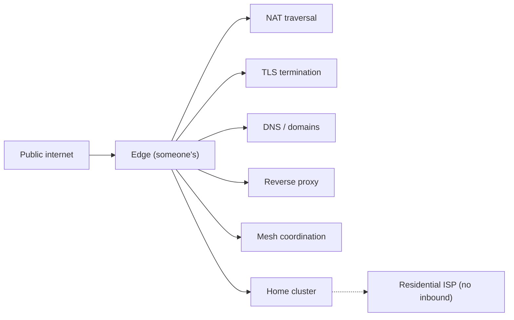
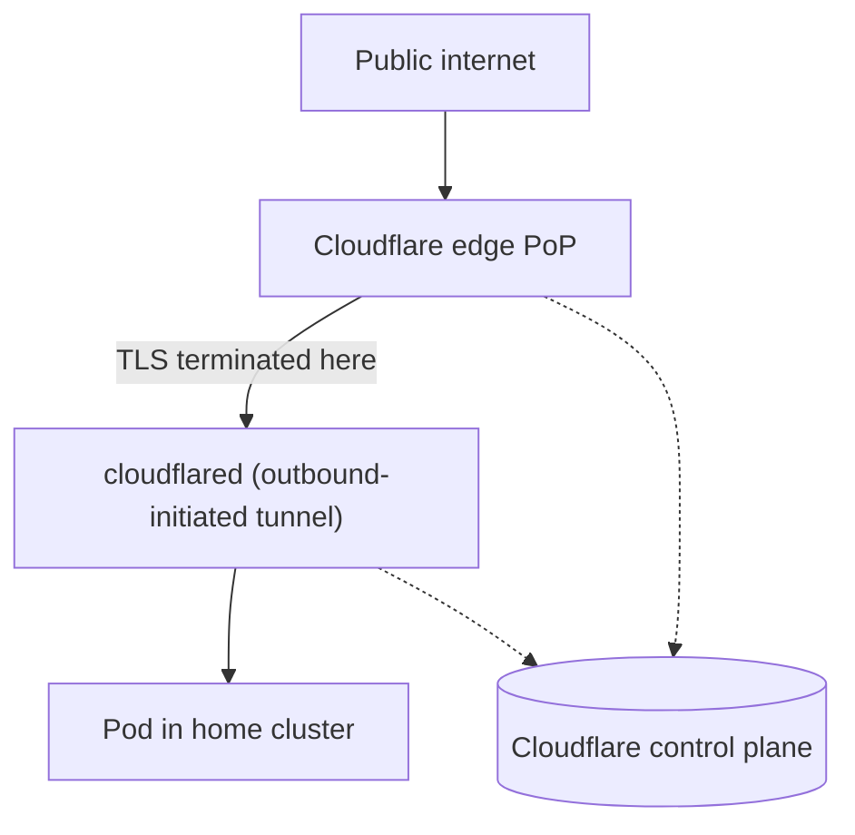
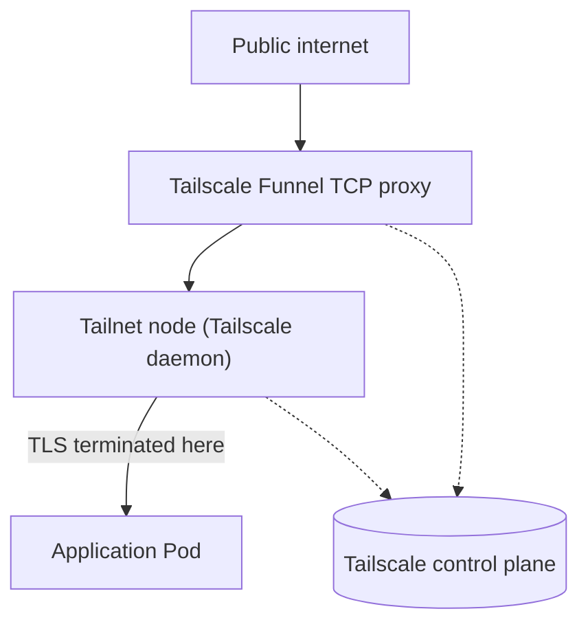
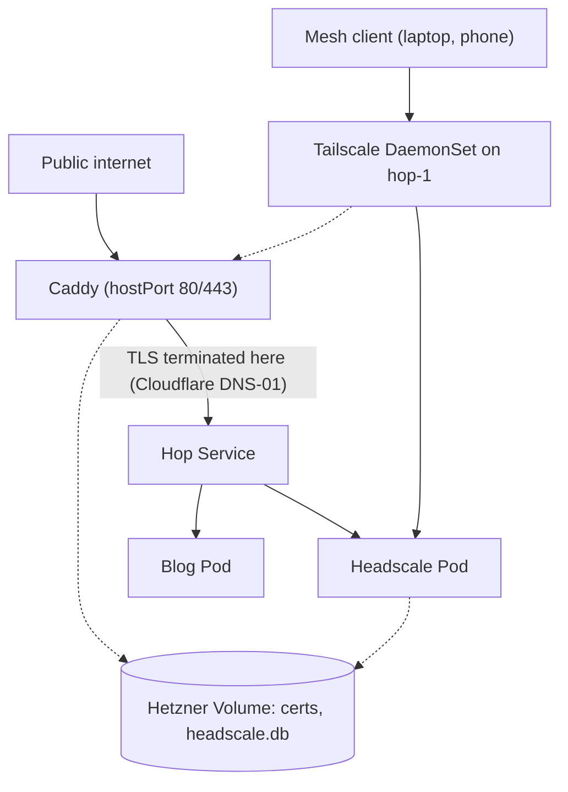
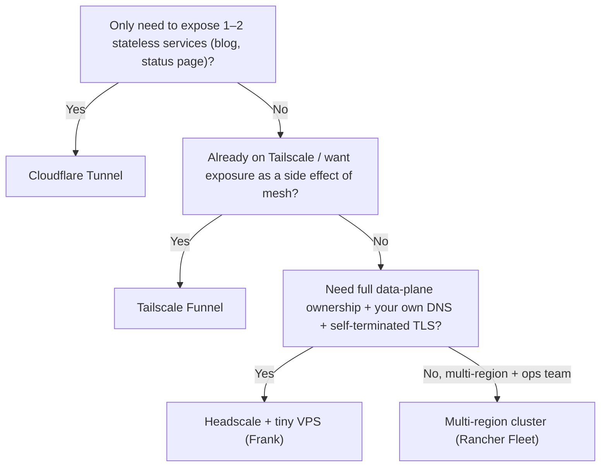

## TL;DR

Public exposure from a home cluster is a five-job problem: NAT traversal,
TLS termination, DNS, reverse proxy, mesh coordination. The 2026 vendor
space splits on one question — cede the edge to someone else (Cloudflare
Tunnel, Tailscale Funnel, ngrok) or run your own (tiny VPS with Headscale
+ Caddy, or a multi-region cluster with Rancher Fleet).

Frank runs the middle path: a single-node Talos cluster called Hop on a
Hetzner CX23 (~€5/month), Caddy on hostPort 80/443 terminating TLS via
Cloudflare DNS-01, Headscale as mesh control plane. The scars: hostPort
+ RollingUpdate deadlocks, a Headplane v0.5 rewrite that silently dropped
env-var config, Tailscale needing kernel mode for source-IP visibility.

Frank's answer doesn't generalize. One blog → Cloudflare Tunnel.
Three-plus clusters → Rancher Fleet. Frank picked Hop because the
Headscale control plane lives there — putting it behind someone else's
tunnel re-creates the chicken-and-egg.

## §1 — The capability

Frank lives behind a residential ISP. There is no static IPv4 address,
there may be CG-NAT, and inbound 80/443 is at the discretion of a router
nobody is paying for. A subset of Frank's services need to be reachable
from the open internet anyway: the Hugo blog at `blog.derio.net/frank`,
the Headscale coordination server at `headscale.hop.derio.net`, the
private landing page that's only reachable over the mesh, and — as the
agentic side of the story matures — webhook endpoints for GitHub events
routed back into in-cluster Tekton listeners.

That is the capability under examination. Not "exposing a service" in the
abstract — any tunnel does that — but *what sits at the edge between the
residential ISP and the cluster, who terminates TLS, and where does the
auth boundary live?* The edge is doing five jobs simultaneously: NAT
traversal (because residential inbound is dying as IPv4 exhausts), TLS
termination (because everything is HTTPS), DNS and domains (because
people don't type IP addresses), reverse proxy (because one IP serves
many services), and — when the mesh model is in play — mesh coordination
(the control plane that tells nodes how to find each other).

The vendor space splits on a single structural question: do you cede
those five jobs to someone else's edge (Cloudflare Tunnel, Tailscale
Funnel, ngrok), or do you run your own edge node — a tiny VPS, a real
Kubernetes cluster, or a managed multi-region fleet? Both answers are
defensible. The §6 decision tree exists because pretending Frank's
separate-VPS-cluster path is the One True Path would be dishonest. For a
homelab whose only public surface is a static blog, "just put it behind
Cloudflare Tunnel" is the correct answer, and the rest of this paper is
about when that answer stops being correct.

## §2 — The landscape

Two axes carve up the 2026 edge-exposure space. The horizontal axis is
*who owns the edge node*: on the left, you cede the edge to a vendor's
network (Cloudflare's 337-city PoP mesh, Tailscale's coordination plane,
ngrok's regional gateways); on the right, you run the edge yourself, on
infrastructure you pay for and patch. The vertical axis is *data-plane
shape*: at the bottom, classic hub-and-spoke tunnels where the edge is
the single ingestion point; at the top, mesh overlays where every node
is a peer and the "edge" is just another tailnet member that happens to
also be reachable from the public internet.


        title Edge & public exposure — 2026
        x-axis "Vendor-owned edge" --> "Dedicated edge node"
        y-axis "Hub-and-spoke" --> "Mesh overlay"
        quadrant-1 "Dedicated · Mesh"
        quadrant-2 "Vendor-edge · Mesh"
        quadrant-3 "Vendor-edge · Hub-and-spoke"
        quadrant-4 "Dedicated · Hub-and-spoke"
        "Cloudflare Tunnel": [0.10, 0.20]
        "Tailscale Funnel": [0.20, 0.85]
        "ngrok": [0.10, 0.15]
        "Headscale + tiny VPS": [0.80, 0.75]
        "Multi-region cluster": [0.95, 0.30]




The matrix grades the five options on whether you need to run an edge
node at all, whether a free tier is viable for real use, who terminates
TLS, whether the option survives CG-NAT, whether you can bring your own
domain, whether the data plane is mesh-shaped, whether the option is OSS
without a contract, and whether you own the data plane end-to-end. The
"you own the data plane" column does most of the work — every other
column is either always-yes or differs by one row.

**Cloudflare Tunnel** optimises for zero edge infrastructure. The
`cloudflared` daemon dials out from inside the cluster, Cloudflare's
edge serves the public hostname, the free tier covers most homelab
volumes, and you get a TLS cert without touching ACME. The trade —
which Cloudflare names in its own documentation — is that TLS is
terminated at Cloudflare's edge:


cloudflared initiates an outbound connection through your firewall from
the origin to the Cloudflare global network.


That outbound-only posture is the headline feature; the corollary is
that Cloudflare is positioned to decrypt every byte that flows through
your tunnel. For a public blog, fine. For Headscale coordination
traffic or agent SSH sessions, a different conversation.

**Tailscale Funnel** is the same five-job bundle delivered through the
mesh. Your node is on the tailnet anyway; Funnel says "also accept
public traffic on a Tailscale-issued subdomain, terminate TLS on the
device itself, and forward to a local service." Custom domains are
landing in pieces — at time of writing, the Tailscale-issued
`*.ts.net` subdomain is the canonical path, and BYO-domain Funnel
support varies by plan and feature flag.

**ngrok** is the original dev-tunnel grown into a "universal gateway"
brand. Outbound-initiated, ephemeral or reserved domain, OAuth and IP
allowlisting on paid plans. The free tier is real but tight enough
that production use means a paid plan.

**Headscale + tiny VPS** is the most-work, most-ownership answer.
Headscale is the self-hosted Tailscale control server; pair it with
Caddy as the reverse proxy and TLS terminator and you have a complete
edge that uses standard primitives end-to-end. Your DNS, your TLS
keys, your data plane. The cost is the VPS itself — Frank pays ~€5
a month for a Hetzner CX23 — and the operational scars of running a
single-node cluster as load-bearing infrastructure.

**Multi-region cluster (Rancher Fleet)** is the enterprise heavyweight.
Same shape as Headscale + tiny VPS but with multiple edge regions, a
unified GitOps surface, and an operations team. Below three managed
clusters it's overhead; above three it starts paying for itself.

## §3 — How each option handles the hard part

The hard part is *getting a packet from the public internet to a Service
inside a home cluster, with TLS terminated by someone authorised to
terminate TLS for your domain, and an audit trail of who did what when.*
Five vendors collapse into three architectural shapes. Paper 20 lays out
one `flowchart TD` per shape, in a shared visual language: rectangles
are servers and Pods, dashed edges are control-plane paths, solid edges
are data-plane paths, cylinders are persistent storage.

**Shape A — tunnel-back-to-origin (Cloudflare Tunnel; ngrok takes the
same shape, with ngrok's regional gateways playing the role of
Cloudflare's edge PoPs).** A daemon inside the cluster dials out to the
vendor's network and holds the connection open. The vendor's edge takes
the public TLS connection, decrypts it, and forwards the cleartext
request back through the tunnel to the origin.

At runtime, the cloudflared process holds an outbound TCP connection to
the nearest Cloudflare PoP. The PoP terminates TLS with a cert issued by
Cloudflare's CA for the hostname you registered. Failure mode: if the
tunnel daemon dies, your domain stays up but is unreachable until
cloudflared reconnects — typically seconds. If Cloudflare's edge dies,
the same. Blast radius is bounded to "whatever traffic was in flight";
the cluster itself is unaffected. ngrok is architecturally identical
with a different vendor name on the PoP box and different SLAs.

**Shape B — mesh-overlay-as-edge (Tailscale Funnel).** TLS terminates
on the node itself, not on the vendor's edge. Tailscale runs a TCP
proxy at its edge that proxies inbound TCP to a tailnet IP; the
Tailscale daemon on your device terminates the TLS connection and
forwards to a local service.


The Tailscale server running on your device receives the encrypted
request from the TCP proxy. It then terminates the TLS connection and
passes the decrypted request to the local service you exposed through
Funnel.


That is the architectural twin of Frank's choice — TLS terminates on
infrastructure *you* control — but the coordination plane is still
Tailscale's. Failure modes: the Funnel TCP proxy dies, all Funnel-
exposed services go dark; the Tailscale control plane is unreachable,
new connections may fail but existing tunnels usually keep working.

**Shape C — dedicated-edge-cluster (Frank: Headscale + Caddy on Hop;
the multi-region cluster pattern with Rancher Fleet is the same shape
scaled up, with one Caddy-equivalent per region and Fleet doing the
GitOps sync across them).** The edge IS a cluster you run. Caddy binds
hostPort 80/443 on the node, terminates TLS with certs issued via
Cloudflare DNS-01 (because there's no HTTP-01 path through a Hetzner
public IP without a domain on it first), and reverse-proxies to
Services in the same cluster. Headscale runs as a Pod in the same
cluster and is itself one of the services Caddy fronts.

At runtime, Caddy holds the only listeners on 80/443. The Tailscale
DaemonSet on hop-1 runs in kernel mode with hostNetwork — without that,
Caddy would see every mesh request as coming from `127.0.0.1` and the
"mesh-only services" boundary would collapse. Headscale persists its
SQLite DB and ACL config to a Hetzner Volume mounted at a fixed path.
Failure mode: hop-1 itself goes down and everything Hop serves —
public blog, Headscale control plane, mesh-only landing page — goes
down with it. This is the single-node-cluster blast radius made
concrete, and it is the price of admission for owning the data plane.

The inlets.dev project occupies an interesting middle position between
Shapes A and C: you still run a VPS, but only the tunnel daemon on it,
not a coordination server or a cluster. For a team that wants
self-hosted tunneling without taking on a Kubernetes control plane at
the edge, it is a defensible choice; Frank chose the heavier path
specifically because the Headscale control plane needed somewhere to
live anyway.

## §4 — What scale changes

Three scale axes flip the ranking. The first is *tunnel concurrency*.
Free-tier tunnels (Cloudflare, ngrok) cap connection count and request
rate at numbers that comfortably serve a static blog and start to bind
around the hundred-concurrent-connections mark. Cloudflare's free
Tunnel limits are generous-but-real; ngrok's free tier is openly
tighter and the paid plans exist for exactly this reason. Above
roughly a hundred concurrent connections — say, an agent control plane
that opens long-lived SSE streams to every dashboard tab — the
calculus changes and either you pay or you move off the SaaS edge.

The second axis is *mesh peer fan-out*. Tailscale's mesh is free up to
the current TOS threshold (in the low-three-digit node count, subject
to change), then priced per seat. Headscale is uncapped because you
run it; the cost is operating it. The node-count knob also costs CPU
on the coordination server — every node that joins generates key
exchanges, ACL evaluations, and DERP heartbeats. Frank's Hop runs on a
2-vCPU Hetzner CX23, which is comfortable for the current tailnet of
under thirty nodes and would start tightening somewhere north of a
hundred.

The third axis is *single-node blast radius*. When the edge IS the
cluster (Frank's Hop), a single-node failure takes down everything
simultaneously: the public blog, the Headscale coordination plane, the
private landing page, the mesh-only DNS entries that depend on Hop's
MagicDNS. The Shape A vendors fail differently — your origin keeps
running, the tunnel daemon will reconnect, and the failure surface is
"the tunnel itself," for which Cloudflare's "tunnel healthy" dashboard
is the only signal. Cloudflare's network claim sets the baseline:


Sub-50ms to 95% of users — 95% of the world's Internet-connected
population is within 50 milliseconds of a Cloudflare data center —
most are within 20ms.


A single Hetzner Falkenstein PoP cannot match that. Hop trades
geography for ownership. A reader in Sydney is dramatically closer to
Cloudflare's Sydney PoP than to Frank's Falkenstein VPS, and that
latency tax is real. Frank pays it because the Hop cluster is also
the Headscale coordination plane, and ceding the mesh control plane to
a vendor edge would re-create a chicken-and-egg the cluster works hard
to avoid: the mesh data plane depending on the mesh control plane
being reachable through the mesh.

## §5 — Frank's choice, and what happened

Frank chose Headscale + Caddy + Hugo blog + private landing page, all
running on a single-node Talos cluster called Hop, provisioned on a
Hetzner CX23 at €5/month including the Hetzner Volume. The full chain:
Packer builds a Hetzner Cloud snapshot from the upstream Talos
`hcloud-amd64.raw.xz`; `hcloud server create` provisions the VPS and
attaches the Volume; `talosctl apply-config` + `talosctl bootstrap`
brings up the single-node cluster (the control-plane taint removed
because the same node has to also schedule workloads); ArgoCD on Hop
syncs the app-of-apps from `clusters/hop/apps/`; Caddy on hostPort
80/443 terminates TLS via Cloudflare DNS-01; Headscale coordinates
the mesh; Tailscale DaemonSet on hop-1 gives the node a tailnet IP so
Caddy sees mesh source IPs. The Hugo blog is baked into a
Caddy-compatible container and served at `blog.derio.net/frank`.

That sentence took three weeks. The scars came in the seams.


We deployed Caddy with the default `strategy: RollingUpdate`. The
first config change rolled, the new pod entered `ContainerCreating`,
and stayed there forever — the old pod still held hostPort 80/443
and the new pod couldn't bind. On a single-node cluster, RollingUpdate
is a structural deadlock for any hostPort-using Deployment. The fix
is `strategy: Recreate` on every Deployment that binds a hostPort
(Caddy on 80/443, Headscale's STUN on 3478/UDP, the Tailscale
DaemonSet's privileged hostNetwork). It is a property of the edge
model — one node, one port-binding pod at a time — not a Caddy bug.



Headplane was running on env-var configuration alone. The v0.5
upstream rewrite quietly stopped accepting that — env vars still
parse, but several fields are read only from a mounted `config.yaml`.
Without it, the admin UI shows `headscale unreachable` even though
it is the same Pod that was working ten minutes ago. The fix is a
ConfigMap-mounted `config.yaml` with `config_path` pointing at the
Headscale config file and `config_strict: true`. Non-strict mode
works but logs scary warnings and forfeits upstream support. The
lesson: when an upstream upgrade silently changes its config
surface, the failure mode is "looks healthy, lies about state" —
which is the worst failure mode there is.



We ran the Tailscale DaemonSet in userspace mode because it felt
safer. Caddy then saw every mesh request as coming from `127.0.0.1`
— userspace Tailscale does not expose tailnet source IPs to
host-network neighbours. The fix is kernel mode: `TS_USERSPACE=false`,
`privileged: true`, `hostNetwork: true`. That is a real privilege
grant and we made it grudgingly — but without it the entire
reverse-proxy story falls apart, because Caddy cannot distinguish
"request from a mesh client" from "request from the public internet,"
which destroys the auth boundary separating Headplane (mesh-only)
from Headscale (public).


There are quieter scars too — the `talosctl apply-config --config-patch`
flag that patches the on-disk base file rather than the running cluster
config, so a missed patch silently loses the change at the next reboot;
the Talos control-plane taint that has to be removed for any workload
to schedule on a single-node cluster; the PodSecurity namespace labels
(`pod-security.kubernetes.io/enforce: privileged`) required for the
hostPort/privileged combination Caddy and Tailscale demand. None are
bugs in any one component. All are properties of the edge model, and
all are documented in `agents/rules/hop-gotchas.md` because the next
person to set this up (or the next Hop rebuild) will hit them again.

## §6 — When Frank's answer doesn't generalize

The decision turns on three questions: *how many services and how
stateful are they*, *are you already on a mesh*, and *do you need to
own the data plane end-to-end?* Four leaves cover most of the
homelab-to-small-enterprise space:

The Cloudflare Tunnel leaf is the correct answer for a lot of
homelabs. If your only public surface is a Hugo blog and a Grafana
dashboard you share with three friends, the math on running a separate
VPS cluster is bad: you trade a five-minute setup for three weeks of
hostPort + RollingUpdate scars. The Tailscale Funnel leaf is the
correct answer for teams already deep in the tailnet — Funnel is one
toggle and inherits the mesh's auth model for free. The Rancher Fleet
leaf is correct above the three-cluster threshold, where one logical
GitOps surface spanning hub + edge + cloud actually saves more
operational time than it costs to set up. Frank's Hop leaf is correct
specifically because the Headscale coordination plane lives there, and
the alternative — Cloudflare Tunnel in front of the Headscale Pod —
re-creates the chicken-and-egg that the mesh model exists to avoid.

What this tree does not say: it does not say one leaf is "more
sophisticated" than another. The right answer for a regulated
enterprise with three EU regions and a security team that has
opinions about TLS termination is a multi-region cluster with Fleet
*regardless of how cool a tiny self-hosted VPS sounds*, and a
homelab whose only public surface is a static blog should pick the
five-minute path and not feel apologetic about it.

## §7 — Roadmap & where this space is going

Three trends worth naming. First, CG-NAT keeps eating IPv4 inbound.
Residential ISPs continue rolling out carrier-grade NAT as the IPv4
exhaustion workaround, which means "port-forward 443" is dying as a
homelab option faster than IPv6 is replacing it for consumer-grade
inbound. Tunnels and mesh overlays are not optional features — they
are the default path forward. This raises the floor for "I want to
expose one service" and makes the "no edge node" tier of the vendor
space more important, not less.

Second, Tailscale Funnel with first-class custom-domain support is
closing the gap with dedicated edges. When Funnel can serve
`blog.your-domain.tld` with a self-supplied TLS cert and a real ACME
flow without a third-party intermediary, the architectural gap
between "managed-mesh-as-edge" and "dedicated edge cluster" narrows
to "do you trust Tailscale's TCP proxy with your TLS." Watch the
next twelve months of the Tailscale roadmap. If BYO-domain Funnel
lands GA at a price that undercuts a Hetzner CX23 plus the
operational overhead of running it, the Frank-style edge cluster has
to justify itself differently than it does today.

Third, edge clusters are becoming agentic landing pads. When a home
cluster grows agents that need a public callback URL — webhooks,
OAuth redirects, Tekton EventListeners receiving GitHub events — the
edge cluster stops being "the thing serving the blog" and becomes
"the thing the public internet talks to when an agent needs a
reply." Hop is already being asked to do that double duty: the
GitHub webhook receiver Frank uses for Tekton-triggered pipelines
lands at a Hop-fronted URL and is proxied back across the mesh to a
Frank Service. Expect the single-node CX23 answer to strain, and
expect the dedicated-edge-cluster pattern to either grow legs (more
CPU, more storage) or split into two — a public-facing edge cluster
and a separate mesh-coordination cluster — once the agentic workload
shape stops fitting on one VPS.

