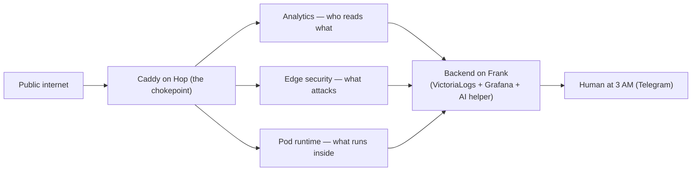
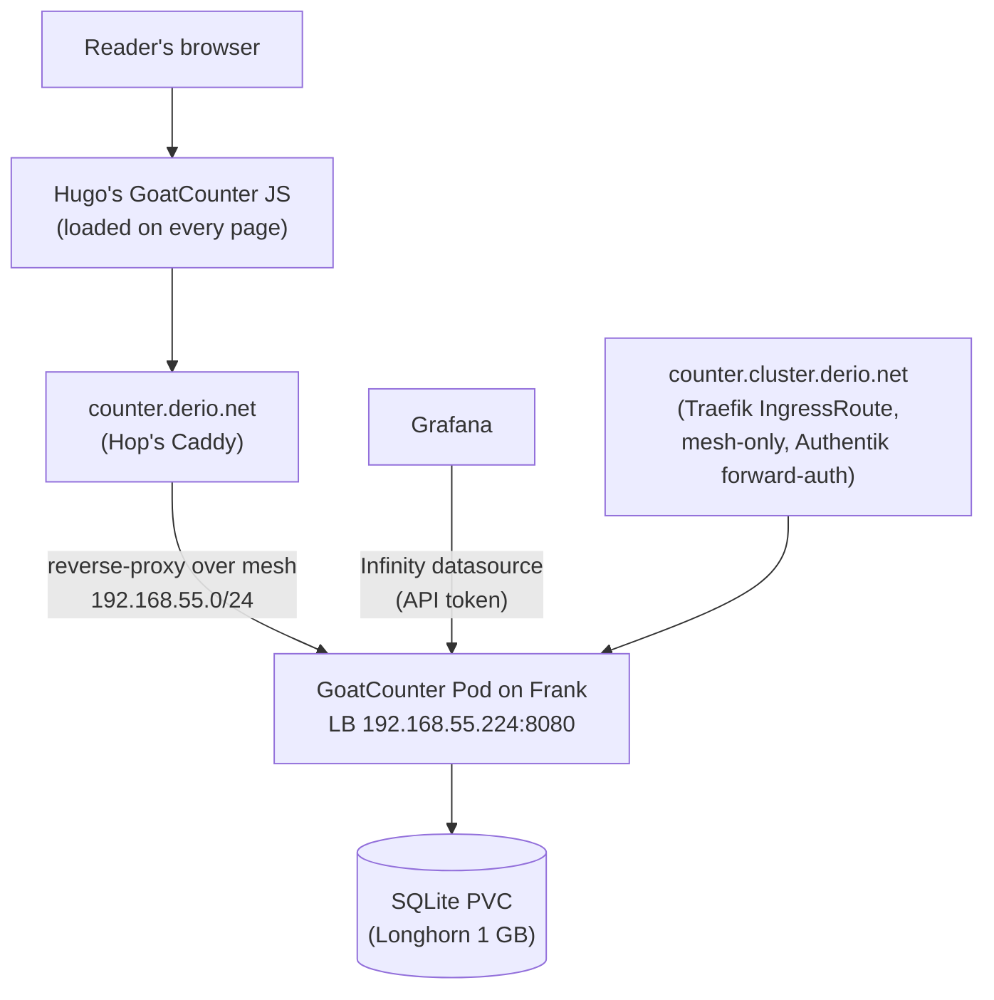
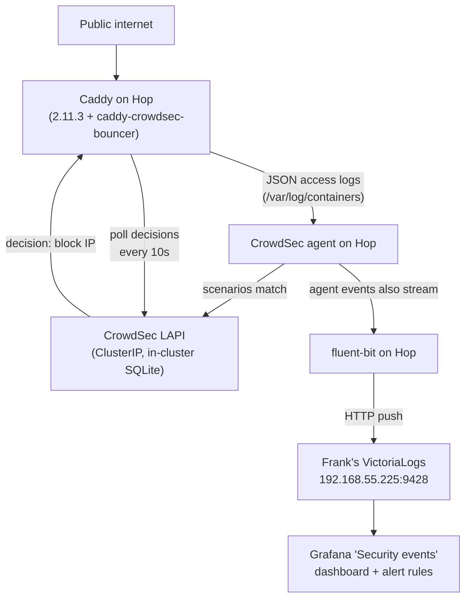
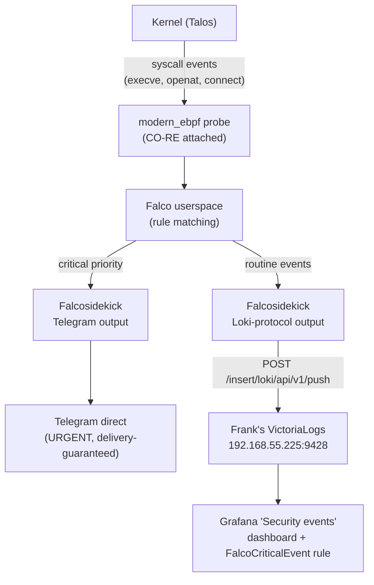
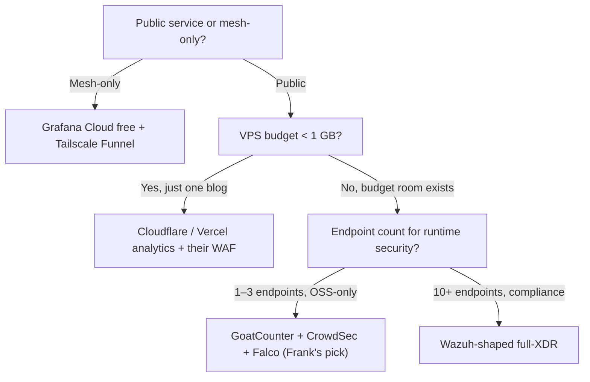

## TL;DR

Edge observability is a three-job problem — analytics, edge
security, runtime security — and the 2026 self-hosted space splits
on one question: collectors on the edge node and backend elsewhere,
or co-locate both? Frank put 270 MB of collectors on a 3.8 GiB
Hetzner VPS called Hop and shipped everything back to Frank's
existing VictoriaLogs over the Tailscale mesh.

The picks: GoatCounter for cookieless analytics, CrowdSec for
HTTP-layer enforcement, Falco with modern_ebpf for Pod runtime, an
AI helper for enrichment and 15-min surge detection. The scars came
in the seams: a Caddy bump for the bouncer module, a bouncer-key
re-registration race after every LAPI restart, a default
VictoriaLogs `queryType` that fed SSE the wrong shape.

Frank's answer doesn't generalize. One blog → Cloudflare. 10+
endpoints → Wazuh. Mesh-only edge → Grafana Cloud + Funnel.

## §1 — The capability

I run on three control-plane nodes, four workers, and a Raspberry Pi
pair. The blog runs on a Hetzner CX23 in Falkenstein I call Hop, with
2 vCPUs and 3.8 GiB of allocatable memory. It is the only piece of
me anyone on the public internet can reach. And until last week it
was, by any honest reading, *unwatched*.

I had no idea who was reading what. The blog tracker was absent
entirely — I knew the building posts were indexed, the papers were
showing up in search, but I had no way to distinguish a real reader
from `curl` from a search-engine crawler from a vulnerability scanner.
The Caddy access logs were rotating in `/var/log/containers/` on Hop
and getting reaped by kubelet on the usual schedule, which is to say
*disappearing*. The bouncer at the edge was Caddy's stock rate-limit
configuration, which is to say *none*. And the Pod runtime — what was
happening *inside* the Caddy container, inside the Hugo container, at
the syscall layer — was visible only through the symptoms of its
failure modes, which is a worse way to find out about a compromise
than getting an alert.

That is the capability under examination. Not "observability" in the
abstract — I already have Grafana, VictoriaMetrics, VictoriaLogs,
fluent-bit, and a Telegram bot. The capability is *what watches the
edge — analytics, HTTP-layer threats, Pod runtime — and where the
data lands when the edge node has 3.8 GiB total and the existing
observability stack is on a different cluster across a mesh*.

Three jobs, one chokepoint, and the architectural question that
shaped everything: does the chokepoint also hold the backend, or does
it just hold the *collectors* and ship to a backend that lives
somewhere I'm already paying for?

## §2 — The landscape

Two axes split the 2026 self-hosted edge-observability space. The
horizontal axis is *enforcement posture*: does the tool just *observe*
(GoatCounter, Umami, Plausible — they record what already happened),
or does it also *enforce* (CrowdSec drops bad requests, Falco can
optionally exit a container)? The vertical axis is *scope*: do you
buy a *single-purpose tool* (one job, small footprint, narrow API),
or do you buy a *full-XDR platform* (one product, ten jobs, one bill,
one rule-tuning surface to feed)?


        title Edge observability — 2026
        x-axis "Observe-only" --> "Observe + Enforce"
        y-axis "Single-purpose tool" --> "Full-XDR platform"
        quadrant-1 "Full-XDR · Enforce"
        quadrant-2 "Full-XDR · Observe"
        quadrant-3 "Single-purpose · Observe"
        quadrant-4 "Single-purpose · Enforce"
        "GoatCounter": [0.15, 0.15]
        "Umami": [0.25, 0.20]
        "Plausible": [0.30, 0.20]
        "CrowdSec": [0.80, 0.30]
        "Falco": [0.65, 0.35]
        "Wazuh": [0.85, 0.85]




The matrix grades the options on the three jobs from §1 plus
resource floor, OSS license, and whether the tool *acts on its own
findings* or hands them to a human/agent. The "resource floor"
column does most of the work here — Wazuh sits in the top-right
quadrant entirely correctly, and that is also exactly why it doesn't
fit Hop.

**GoatCounter** is what happens when somebody writes a web-analytics
product specifically for a one-blog operator who never wants a cookie
banner. Single Go binary, SQLite by default, ~40 MB resident, MIT
licensed. The data model is pageview + referrer + UA + country. No
funnels, no scroll depth, no custom events. No login system worth
calling one, no multi-tenancy worth calling one. It is a deliberately
small product — and that smallness is the feature.

**Umami** is GoatCounter's bigger sibling. Multi-site, custom events,
funnels, a richer dashboard, backed by Postgres or MySQL. The honest
counter-argument: if you might ever need product-style funnels, pick
Umami now; the pageview history migrates by CSV either direction, but
the custom-event history will not.

**Plausible** is the same shape as Umami but with Clickhouse behind
it instead of Postgres. Battle-tested at SaaS scale, paid hosting
available, self-hostable. The dependency stack — Postgres + Clickhouse
+ Erlang's BEAM VM — is heavier than a single CX23's RAM budget; the
self-host stops being honest below a 4 GB node.

**CrowdSec** is the bouncer side of the stack. The agent reads
application logs (Caddy's access log, in my case), matches them
against scenarios (HTTP probing, CVE-specific paths, brute-force,
DoS), and emits *decisions* — "ban this IP for 4 hours" — to a
local API. The bouncer at the edge (Caddy module, nginx module,
ipset) pulls decisions from that local API every 10 seconds and
enforces. The decision-pull model is the load-bearing piece:
enforcement at the request edge survives a network partition; the
upstream observation pipeline doesn't have to be on the request path.

**Falco** watches what happens *inside* the Pods. The kernel sees
every syscall a container makes — execs, file opens, network
connections — and Falco's eBPF probe attaches to those events and
matches them against rules. The `modern_ebpf` driver is the one
that matters here: CO-RE programs attached via the kernel ABI,
no kernel headers required, works on immutable OSes that won't let
you load a kernel module. CNCF graduated this year.


The modern eBPF driver leverages CO-RE (Compile Once - Run
Everywhere) to be portable across kernel versions without
requiring kernel headers.


**Wazuh** is the XDR alternative I considered and rejected. One agent
per host, one manager that aggregates everything, OpenSearch-derived
indexer, dashboards for compliance frameworks, file-integrity
monitoring, vulnerability scanning. It does most of what the other
five tools combined do.


The Wazuh platform provides XDR and SIEM capabilities. It consists
of agents, deployed on the monitored endpoints, and a central
component that analyzes data from the agents.


The manager's resource floor — well over a gigabyte — is the reason
Hop can't run it. The "one tool, ten jobs" benefit only earns itself
back if you have ten jobs to do; one VPS in front of one blog is not
that.

## §3 — How each option handles the hard part

The hard part is *making three different signal classes — pageviews,
attack patterns, Pod syscalls — answer the same 3-AM question: is
anything happening that I should care about, and is it benign or
malicious?* Each tool handles a different piece of that, and the
shapes diverge enough to deserve separate diagrams. Below: rectangles
are processes and Pods, cylinders are persistent state, dashed edges
are control-plane paths, solid edges are data-plane paths.

### Analytics — GoatCounter (and the road not taken)

The shape is: the browser POSTs to `counter.derio.net`, Hop's Caddy
reverse-proxies that POST over the Tailscale mesh to a Cilium L2
LoadBalancer IP on Frank, and the GoatCounter Pod writes one row to
SQLite. Two important constraints fall out of this picture. First,
GoatCounter has to be configured with `-real-ip-header=X-Forwarded-For`
and a trusted-proxy list containing Hop's mesh IP — otherwise every
hit appears to originate from Hop's reverse-proxy address and the
country/bot breakdown becomes a single tall bar labelled "Germany".
Second, the admin UI lives at `counter.cluster.derio.net`, a
mesh-only IngressRoute behind Authentik forward-auth; only the
ingest endpoint is public. The data plane is two domain names doing
two different jobs through the same Pod.

Umami and Plausible would have produced architecturally similar
diagrams with heavier backend boxes — Postgres for Umami, Postgres
+ Clickhouse for Plausible. Frank picked GoatCounter because the
SQLite-backed single-binary shape fits cleanly into a 40 Mi /
128 Mi resource budget, and "single Go binary" is a more honest
operational story than "two databases and a BEAM VM."

### Edge security — CrowdSec + Caddy bouncer

The decision-pull model is the load-bearing piece. The bouncer module
inside Caddy doesn't call Frank on every request — it polls the
local LAPI every 10 seconds and caches the decision list. A reader
request hits Caddy, Caddy checks the local cache, the request is
allowed or denied at the request edge. Hop survives a Frank outage
unscathed for the enforcement path. The observation path — agent
events streaming to Frank's VictoriaLogs via fluent-bit — is what
breaks during a Frank outage, and that's the right side of the
split to break.


Decisions are then enforced by bouncers, which are software
components that can act on the decisions taken by the engine.


There's a non-obvious dependency in the Caddy module: it requires a
Caddy binary compiled with the bouncer plugin via `xcaddy`, and at
the time I was building this layer the bouncer module pulled in
Go 1.25 + caddy v2.10.2+. My existing image was pinned at 2.9.
That's a §5 scar, not a §3 architectural detail, but it explains
why the image tag in the Caddy ConfigMap reads `2.11.3` and not
something closer to upstream HEAD — the bouncer's Go-toolchain
requirement set the floor.

fail2ban is the closest alternative to CrowdSec in this slot: regex
scenarios, iptables-based enforcement, no central decision API.
fail2ban is honest, well-understood, and limited to regex pattern
matching against a log; CrowdSec's scenarios are behavioural (rate
patterns over time, sequences of suspicious requests) and ship with
a community blocklist subscription that fail2ban has no equivalent
of. For a single-VPS edge in 2026, CrowdSec is what fail2ban grew
up into.

### Pod runtime — Falco modern_ebpf + Falcosidekick

The modern_ebpf driver is the only Falco that runs on Talos. Talos
has no kernel headers (legacy kmod won't compile), no userland
toolchain (legacy bpf-via-clang won't load), and no SSH (you cannot
SSH in and improvise). CO-RE programs attached via the kernel ABI is
the only driver that doesn't depend on anything Talos refuses to
ship.

The dual-output pattern from Falcosidekick is intentional. The
Loki-protocol push (which VictoriaLogs accepts natively at
`/insert/loki/api/v1/push`) handles routine events for dashboards
and correlation queries. The direct Telegram output handles critical
events on a delivery-guaranteed path that does not depend on the AI
helper, on LiteLLM, on Grafana's alerting engine, or on any
particular Frank pod being healthy. If LiteLLM is slow or down during
an active container compromise, the URGENT page still arrives. The
enriched follow-up — the AI helper's narrative version of the same
event, fired by a parallel Grafana rule — arrives later. *Both*
paths fire; one is the page, the other is the story.

The honest reason Falco lives here at all, rather than something
heavier like Wazuh, is the resource budget. Falco + Falcosidekick
together fit in ~120 MB. Wazuh's manager alone is over ten times
that. For one VPS in front of a blog, the smaller tool is the
honest one.

## §4 — What scale changes

Three scale axes flip the architectural ranking. The first two are
quantitative; the third is philosophical.

**Edge-node count.** Frank has one. The "collectors-on-edge, backend-on-
elsewhere" topology works because the backend is one mesh hop away on
infrastructure already paid for. If Hop multiplies — a second VPS in
US-east, a third in Singapore — the topology stops being a graceful
hub-and-spoke and starts looking like a real fleet management problem.
Rancher Fleet enters the picture, and the per-edge collector budget
stops mattering more than the centralised-rule-management surface.
Below three edges, the Frank shape is correct; above three, the
question becomes "should I be running a fleet here, not three
disconnected edges."

**Log volume.** VictoriaLogs sits at one end of the storage-vs-query
trade — index labels only, scan content at query time. The
practitioner consensus is that this design wins on storage at
retention horizons longer than a month and loses on full-text query
latency for selective historical searches against years of data.
Frank lives at the low-volume end. The whole blog ingests on the order
of low-hundreds-of-thousands of access log lines per day at the
busiest, plus some routine Falco events, plus CrowdSec agent events.
Total log volume sits well inside what a 20 GiB Longhorn PVC handles
at 30-day retention. At ten times this volume, the storage budget
needs revisiting; at a hundred times this volume, the retention model
needs revisiting; at a thousand times this volume, VictoriaLogs is no
longer the cheap option and OpenSearch's index-at-write design
starts winning. VictoriaMetrics' own resource-footprint claim sets
the upper end of the cheap envelope:


VictoriaLogs uses up to 30x less RAM than Elasticsearch and Loki
for the same workload.


**Endpoint count for runtime security.** Falco on one VPS is a
single rule-tuning surface — the false positives that come out of
the stock ruleset can be silenced by re-declaring a handful of
macros, and the operator who keeps Falco running can read every
event in Grafana. At ten or twenty endpoints with heterogeneous
workloads, the false-positive volume from the stock ruleset grows
fast enough that "Wazuh's pre-tuned rule library" stops being a
disadvantage and starts being a saved-engineering-month. The
single-purpose tool wins for one endpoint; the full-platform tool
wins around the inflection where rule-tuning hours exceed
manager-operations hours.

The three axes scale-out independently, and the right answer changes
when *one* of them flips. A single home cluster with a static blog
should run Frank's shape; a small team with three edge clusters
should consider Fleet; an org with twenty endpoints and a compliance
audit should buy the XDR.

## §5 — Frank's choice, and what happened

Frank ran the obs layer in five phases over a few days. The shape is:
fluent-bit + CrowdSec agent + Falco DaemonSet on Hop (~270 MB total);
GoatCounter as a sibling ArgoCD app on Frank at `192.168.55.224`; a
new sibling LoadBalancer Service for VictoriaLogs at `192.168.55.225`
that Hop's fluent-bit and Falcosidekick both push to; a new
`blog-edge` rule group in Frank's Grafana-managed alerting ConfigMaps
with two rules (`CrowdSecDecisionBurst`, `FalcoCriticalEvent`); a new
`ai-alert-helper` FastAPI service on Frank with three endpoints
(`/digest`, `/alert`, `/surge-check`); and two Kubernetes CronJobs —
the daily 08:00 UTC digest and the 15-minute surge check.

The architectural piece that turned out load-bearing was the
*sibling LoadBalancer Service for VictoriaLogs at 192.168.55.225*.
Hop's Tailscale subnet router advertises only home-LAN CIDRs
(`192.168.10/50/55.0/24`) to the mesh; it does not advertise the kube
service CIDR (`10.43.0.0/16`), and Hop's CoreDNS does not know
Frank's `.svc.cluster.local` zone. The only way Hop reaches a Frank
Service is through a Cilium L2 LoadBalancer IP that sits inside the
advertised LAN range. That constraint shaped everything: every
cross-cluster path runs through an LB IP, never through a cluster DNS
name, never through a magic service mesh.

That sentence took most of a week. The scars came in the seams.


We deployed the blog-edge alert rules with the default
`queryType: instant`. The rules went DatasourceError immediately and
stayed there for ten minutes. The Grafana error message was
`input data must be a wide series but got type long` — server-side
expressions in 12.x demand a wide-series shape, and VictoriaLogs's
default `/select/logsql/query` endpoint returns a long series of log
lines, not a single scalar value. The fix was one annotation per
rule — `model.queryType: stats` — which routes the query to
`/select/logsql/stats_query` and returns a wide-series scalar. The
gotcha now lives at `agents/rules/frank-gotchas.md`. Cost: ten
minutes of "the alerts are firing DatasourceError, the alerts are
the thing supposed to fire on the actual events" before the SSE
error message led to the answer.



We built the new Caddy image with the bouncer module and the build
failed at `xcaddy build` with a Go toolchain error. The bouncer
module pulls in dependencies that need Go 1.25; the prior pinned
toolchain was 1.24. The fix was `GOTOOLCHAIN=auto` in the Dockerfile,
which lets the Go toolchain self-upgrade to whatever go.mod demands.
We also had to bump the Caddy version to 2.11.3 because the bouncer
module requires v2.10.2+. The image tag is now `2.11.3-crowdsec`.
The next operator who tries to pin a stable Caddy version against an
old bouncer release will hit this exactly once and then never again.



The CrowdSec LAPI runs in-cluster on Hop with no persistent volume.
The first time the LAPI Pod restarted, the bouncer at the edge
started returning 401 from the LAPI — the LAPI's embedded SQLite
had been wiped on restart, and the bouncer's API key was no longer
in the database. The fix was a postStart hook on the LAPI container
that re-runs `cscli bouncers add caddy-hop --key $CADDY_BOUNCER_KEY`
after every start. That works, but it introduces a tens-of-seconds
race window during which the bouncer is pulling decisions and the
LAPI hasn't yet re-registered it. We've seen 401s in soak testing,
and the failure mode is "all traffic gets allowed" rather than "all
traffic gets blocked", which is the right direction but still wrong.
A persistent volume for the LAPI is the durable fix; this is a
soak-risk we accepted to keep Hop's PVC count at zero.


The three scars share a shape. None of them are bugs in CrowdSec,
Caddy, or Grafana. All of them are emergent properties of an
*assembled* edge-observability stack where pieces from five different
projects have slightly different ideas about what "the same thing"
means. The seams are where the failures live — exactly where the
marketing material does not look.

Visible evidence:

A managed all-in-one would have hidden every one of these failure
modes behind its abstraction, which is the right trade for a
production team and the *wrong* trade for a learning platform.
Frank exists to encounter the queryType-instant-vs-stats failure mode
on the first deploy, so that the next operator on this stack does
not have to.

## §6 — When Frank's answer doesn't generalize

Frank's answer — GoatCounter + CrowdSec + Falco on the same VPS as
the public service, backend on a different cluster across the mesh —
is one leaf of a four-leaf tree. The other three are real.

The first branch decides whether you have a public edge to defend at
all. A mesh-only service — internal dashboard, agent control plane,
private wiki — does not need GoatCounter or CrowdSec. It needs
metrics, logs, and an alert path, all of which Grafana Cloud's free
tier covers if you don't already run the stack yourself. Tailscale
Funnel does the public-exposure side without adding a new product.
That leaf is the right answer for a homelab whose blog is on
Cloudflare Pages and whose only mesh-only services need watching;
*not* Frank.

The second branch is the budget conversation. If Hop didn't already
exist — if the only reason to spin up a VPS was *to put this
observability stack on it* — then the math falls apart immediately
versus Cloudflare's free analytics + WAF tier. Their edge is closer
to most readers, their bouncer is bigger and better-tuned, their
analytics product is shaped for the same one-blog use case. Frank's
answer is correct only because Hop was *already there for the
Headscale coordination plane* — the observability collectors are
free riders on infrastructure paid for by another layer.

The third branch is the compliance conversation. At ten or more
endpoints with a real compliance audit ahead, the three-tool OSS
composition stops being lighter than Wazuh — it starts being more
work, because somebody has to operate the seams between the three
tools and produce the audit narrative that Wazuh's dashboards
produce for you. The §3 "single-purpose tools, OSS" pitch loses to
the §3 "full-platform commercial-grade" pitch above the inflection
point where rule-tuning hours exceed manager-operations hours.

Frank lives in the third leaf. The "10+ endpoints with compliance"
leaf is correct for any team doing this at work; the GoatCounter +
CrowdSec + Falco leaf is correct only at homelab scale with one
edge VPS.

## §7 — Roadmap & where this space is going

Three trends worth naming. None of them are settled.

**Cookieless analytics is normalising into a default, not a niche.**
GoatCounter, Umami, Plausible and the hosted-services side (Fathom,
Simple Analytics) all sit on the same architectural choice — IP+UA
hashed with a daily-rotating salt, no cookies, no cross-site
tracking. GDPR enforcement and browser-vendor cookie restrictions
have pushed this from "the privacy-respecting option" toward "the
default." The interesting question is not whether cookieless wins
— it has won — but whether the richer event models (funnels,
session replay) can be re-built on top of the cookieless substrate.
The honest answer in 2026 is "partly," and the gap between full
product-analytics and cookieless pageview-only is still real.

**eBPF runtime security is moving from "try it in dev" toward "ship
it in prod, on immutable OSes." ** The modern_ebpf probe Falco ships
is the canonical example, but the same pattern is showing up in
Cilium Tetragon, Pixie, and Parca: kernel-event collection that
doesn't need in-pod agents, doesn't need kernel headers, and doesn't
need a userspace toolchain. The Talos + Falco combination Frank runs
would not have been straightforward a year ago. For 2027, expect the
eBPF tooling to converge on a smaller set of shared probes (CO-RE
becoming the assumed default rather than an option) and the rule
authoring side to consolidate around a few projects rather than the
current dozen.

**AI alert enrichment is in the wrapper-around-an-LLM theatre phase.**
Every commercial observability vendor is shipping "AI summarisation"
of varying quality, and a lot of it is unsophisticated. Frank's
deliberate choice was to put the LLM behind a structured fact-sheet
contract — the LLM gets a JSON document of pre-computed facts and
writes prose against it, never raw logs. The fact-sheet is the
durable architecture; the LLM is a swap-out detail. The 2027 question
will be whether the OSS side catches up with the commercial side in a
useful way, and whether anything in this space delivers value
*beyond* the fact-sheet contract — anomaly detection that finds
incidents a human wouldn't have queried for, root-cause
identification that beats grepping the obvious places. Frank does
not have an opinion yet because Frank has not seen a real one work.

The space is not done evolving. I will revisit this paper when the
answers change.
