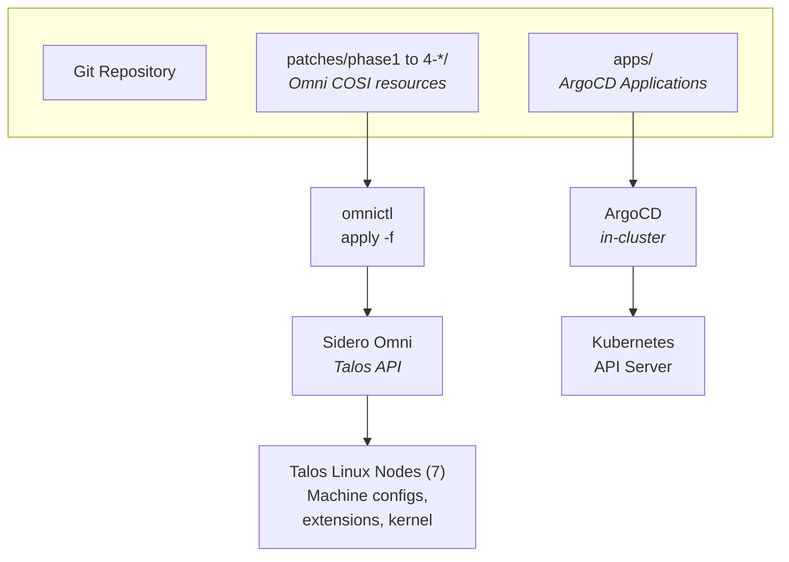

# ArgoCD-Managed Infrastructure — Design Document

**Date:** 2026-03-02
**Status:** Approved
**Supersedes:** `2026-03-02-pulumi-cluster-provisioning-design.md` (Pulumi approach abandoned — no Omni provider exists)

## Context & Decision

The frank cluster is managed by **Sidero Omni** for the Talos/machine layer. The original plan
specified Pulumi for IaC, but:

1. No Pulumi provider exists for Sidero Omni
2. Pulumi's `@pulumiverse/talos` provider conflicts with Omni (both try to own machine configs)
3. The Pulumi scaffolding (`infrastructure/pulumi/`) was created but never used
4. Flux CD was deployed but is broken (`kustomization path not found`)

**Decision:** Two-layer management with ArgoCD for the Kubernetes workload layer.

## Architecture: Two-Layer Management



### Layer 1: Talos/Omni — Machine Configuration (unchanged)

- **Tool:** `omnictl apply -f`
- **Resources:** `ConfigPatches.omni.sidero.dev`, `ExtensionsConfigurations.omni.sidero.dev`
- **Files:** `patches/phase{1..4}-*/`
- **Scope:** Node labels, scheduling, kernel modules, Talos extensions, disk mounts
- **No change** — this layer works well as "executable documentation"

### Layer 2: Kubernetes — Workload Management (new: ArgoCD)

- **Tool:** ArgoCD
- **Pattern:** App-of-Apps
- **Manages:** Cilium, Longhorn, GPU Operator, future applications
- **Files:** New `apps/` directory
- **Scope:** Helm releases, Kubernetes manifests, StorageClasses, namespaces

**Key principle:** Omni owns the machine. ArgoCD owns the workloads. They don't overlap.

## Cluster Snapshot (2026-03-02)

| Component | Version | Status | Current Management |
|-----------|---------|--------|--------------------|
| Talos Linux | v1.12.4 | Running | Omni |
| Kubernetes | v1.35.2 | Running | Omni |
| Cilium | v1.17.0 | Running | Manual Helm release |
| Longhorn | v1.11.0 | Running | Manual Helm release |
| GPU Operator | v25.10.1 | NOT INSTALLED | Blocked (GPU hardware) |
| Flux CD | — | Broken | To be removed |
| ArgoCD | — | NOT INSTALLED | To be installed |
| Pulumi | — | Scaffolded only | To be removed |

### Node Inventory

| Node | IP | Role | Zone | Extensions | Extra Disks |
|------|----|------|------|------------|-------------|
| mini-1 | 192.168.55.21 | control-plane | core | iscsi-tools | — |
| mini-2 | 192.168.55.22 | control-plane | core | iscsi-tools | — |
| mini-3 | 192.168.55.23 | control-plane | core | iscsi-tools | — |
| gpu-1 | 192.168.55.31 | worker | ai-compute | iscsi-tools, nvidia-toolkit, nvidia-gpu-modules | sda (4TB), sdb (4TB) |
| pc-1 | 192.168.55.71 | worker | edge | iscsi-tools | sda, sdb, sdd (HDDs) |
| raspi-1 | 192.168.55.41 | worker | edge | iscsi-tools | — |
| raspi-2 | 192.168.55.42 | worker | edge | iscsi-tools | — |

### Omni Config Patches (Layer 1 — all applied)

| ID | Scope | Purpose |
|----|-------|---------|
| 100-cluster-allow-cp-scheduling | cluster | Allow workloads on control planes |
| 100-cluster-cni-none | cluster | Disable default CNI (Cilium replaces it) |
| 200-labels-{node} | per-machine (x7) | Node labels (zone, tier, accelerator) |
| 300-gpu-nvidia-modules | gpu-1 | Nvidia kernel modules |
| 401-gpu1-extra-disks | gpu-1 | Mount 2x4TB SSDs |
| 400-cluster-iscsi-tools | cluster | iscsi-tools extension (all nodes) |
| 402-gpu1-nvidia-extensions | gpu-1 | Nvidia extensions (includes iscsi-tools to avoid override) |

## Repository Structure (Target)

```
frankocluster/
├── .env                          # KUBECONFIG + TALOSCONFIG (gitignored)
├── .env_devops                   # OMNI_ENDPOINT + OMNI_SERVICE_ACCOUNT_KEY (gitignored)
├── .talos/                       # Talos/Omni config files (gitignored)
├── patches/                      # Layer 1: Omni/Talos
│   ├── README.md                 # Phase index with machine reference
│   ├── phase1-node-config/       # Node labels, CP scheduling
│   ├── phase2-cilium/            # CNI=none patch (Helm values move to apps/)
│   ├── phase3-longhorn/          # iscsi-tools, disk mounts (Helm values move to apps/)
│   └── phase4-gpu/               # Nvidia extensions, kernel modules (Helm values move to apps/)
├── apps/                         # Layer 2: ArgoCD
│   ├── root/                     # App-of-Apps bootstrap chart
│   │   ├── Chart.yaml
│   │   ├── values.yaml           # Global config (repo URL, target revision)
│   │   └── templates/
│   │       ├── project.yaml      # ArgoCD AppProject: infrastructure
│   │       ├── ns-argocd.yaml    # Namespace with PSS labels
│   │       ├── ns-longhorn.yaml  # Namespace with PSS labels
│   │       ├── ns-gpu-operator.yaml
│   │       ├── cilium.yaml       # Application: Cilium
│   │       ├── longhorn.yaml     # Application: Longhorn
│   │       └── gpu-operator.yaml # Application: GPU Operator
│   ├── cilium/
│   │   └── values.yaml           # Cilium Helm values (moved from patches/phase2-cilium/)
│   ├── longhorn/
│   │   ├── values.yaml           # Longhorn Helm values (moved from patches/phase3-longhorn/)
│   │   └── manifests/
│   │       └── gpu-local-sc.yaml # longhorn-gpu-local StorageClass
│   └── gpu-operator/
│       └── values.yaml           # GPU Operator Helm values (moved from patches/phase4-gpu/)
├── docs/
│   └── plans/
│       ├── 2026-03-02-argocd-infrastructure-design.md  # This document
│       ├── 2026-03-02-argocd-infrastructure-plan.md    # Implementation plan
│       ├── 2026-03-02-pulumi-cluster-provisioning-design.md  # DEPRECATED
│       └── 2026-03-02-pulumi-cluster-provisioning-plan.md    # DEPRECATED
└── InitialPlan.md
```

## ArgoCD Application Architecture

### App-of-Apps Pattern

A single "root" Application bootstraps all infrastructure applications:

```
root-app (ArgoCD Application)
    │
    ├── infrastructure (AppProject)
    │
    ├── cilium (Application)
    │   └── helm.cilium.io / cilium v1.17.0
    │       └── values: apps/cilium/values.yaml
    │
    ├── longhorn (Application)
    │   └── charts.longhorn.io / longhorn v1.11.0
    │       └── values: apps/longhorn/values.yaml
    │       └── extra manifests: apps/longhorn/manifests/
    │
    └── gpu-operator (Application)
        └── helm.ngc.nvidia.com/nvidia / gpu-operator v25.10.1
            └── values: apps/gpu-operator/values.yaml
```

### Adoption Strategy

ArgoCD can **adopt** existing Helm releases without reinstalling:

1. Create an ArgoCD Application with the same chart, version, namespace, and release name
2. ArgoCD discovers existing Kubernetes resources that match
3. ArgoCD begins managing them — drift detection, auto-sync, etc.

**For Cilium (critical — provides networking):**
- Sync policy: `automated` with `selfHeal: true`
- Replace strategy: `ServerSideApply` (non-destructive)
- ArgoCD will detect existing Cilium pods and take ownership

**For Longhorn (provides storage):**
- Sync policy: `automated` with `selfHeal: true`
- Longhorn-managed disks and volumes are NOT part of the Helm release — they survive adoption
- The `longhorn-gpu-local` StorageClass is a separate manifest in `apps/longhorn/manifests/`

**For GPU Operator (not yet installed):**
- Fresh install via ArgoCD
- Sync policy: `automated` but with `selfHeal: false` initially (GPU hardware not detected)

## Migration Sequence

```
Phase A: Cleanup (parallelizable)
  ├── A1: Remove Flux CD (uninstall + delete ns + CRDs)
  └── A2: Remove Pulumi artifacts (delete infrastructure/pulumi/, mark docs deprecated)

Phase B: ArgoCD Bootstrap (sequential)
  ├── B1: Create apps/ directory structure
  ├── B2: Move Helm values from patches/ to apps/
  ├── B3: Create root app-of-apps chart
  ├── B4: Install ArgoCD via Helm (manual bootstrap — chicken-and-egg)
  └── B5: Apply root Application (ArgoCD takes over)

Phase C: Adoption (sequential, with verification)
  ├── C1: ArgoCD adopts Cilium
  ├── C2: ArgoCD adopts Longhorn
  └── C3: ArgoCD installs GPU Operator (when GPU hardware ready)
```

**Chicken-and-egg:** ArgoCD cannot manage its own initial installation. The bootstrap
is done once via `helm install`. After that, ArgoCD can self-manage its own upgrades.

## Verification Strategy

Every step has a verification command:

| Step | Command | Expected |
|------|---------|----------|
| Flux removed | `kubectl get ns flux-system` | `NotFound` |
| Pulumi removed | `ls infrastructure/pulumi/` | `No such file or directory` |
| ArgoCD installed | `kubectl get pods -n argocd` | All Running |
| Root app synced | `argocd app get root` | Synced, Healthy |
| Cilium adopted | `argocd app get cilium` | Synced, Healthy |
| Cilium working | `cilium status` | All OK |
| Longhorn adopted | `argocd app get longhorn` | Synced, Healthy |
| Longhorn working | `kubectl get sc` | 3 StorageClasses |
| PVC test | Create + bind PVC | Bound |
| GPU Operator | `argocd app get gpu-operator` | Synced (degraded until GPU hardware fixed) |

## GPU Hardware Status

The RTX 5070 is physically installed in gpu-1 but NOT detected on the PCIe bus:
- BIOS shows all PCIe slots as N/A
- Nvidia kernel modules fail: `NVRM: No NVIDIA GPU found`
- `ext-nvidia-persistenced` service waiting for `/sys/bus/pci/drivers/nvidia`

**Likely causes:** GPU not seated properly, PCIe power cables not connected, or dead slot/card.

**Design accommodation:** The GPU Operator ArgoCD Application is created with sync policy
that tolerates degraded state. When the hardware is fixed:
1. Nvidia kernel modules will load automatically (already configured via Omni)
2. GPU Operator pods will detect the GPU
3. `nvidia.com/gpu: 1` will appear in node allocatable resources
4. No config changes needed — just fix the hardware

## What Gets Deleted

| Artifact | Action | Reason |
|----------|--------|--------|
| `infrastructure/pulumi/` | Delete entire directory | Never used, no Omni provider |
| `flux-system` namespace | Uninstall + delete | Replaced by ArgoCD |
| Flux CRDs | Delete | No longer needed |

**Preserved (deprecated):**
| Artifact | Action | Reason |
|----------|--------|--------|
| `docs/plans/2026-03-02-pulumi-*` | Mark deprecated in header | Historical reference |

## Environment Setup

```bash
source .env          # kubectl, talosctl (KUBECONFIG + TALOSCONFIG)
source .env_devops   # omnictl (OMNI_ENDPOINT + OMNI_SERVICE_ACCOUNT_KEY)
```

ArgoCD CLI authentication:
```bash
argocd login localhost:8080 --port-forward --port-forward-namespace argocd
```

## Lessons Learned (from previous sessions)

1. **Per-machine ExtensionsConfiguration OVERRIDES cluster-wide** — must include all extensions
2. **Longhorn needs PSS `privileged`** namespace label — ArgoCD must create NS with labels before chart
3. **Longhorn needs `iscsi-tools`** on Talos — handled by Layer 1 (Omni patches)
4. **`machine.disks` won't wipe existing partitions** — must `talosctl wipe disk` first
5. **Longhorn `diskSelector`** uses Longhorn node tags, NOT Kubernetes node labels
6. **Talos Image Factory** needs time to rebuild images with new extensions

## Deferred Work

- AMD ROCm stack for NUC iGPUs (labels applied, stack deferred)
- ArgoCD SSO integration with Authentik (future)
- Monitoring stack (Prometheus/Grafana — future ArgoCD Application)
- S3-compatible backup for ArgoCD/etcd (future)
- Ansible automation for raspi-omni management host
